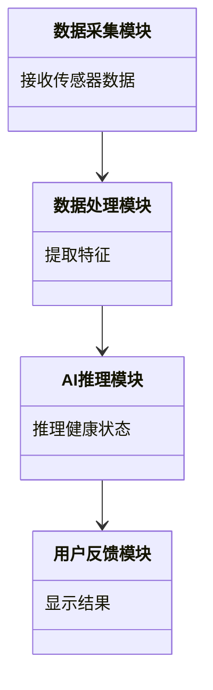

                 


# AI Agent在智能手表中的健康监测

> 关键词：AI Agent, 智能手表, 健康监测, 机器学习, 健康数据分析

> 摘要：本文详细探讨了AI Agent在智能手表中的健康监测应用，从背景介绍到系统设计，再到项目实战，全面分析了AI Agent在智能手表健康监测中的核心原理、算法实现、系统架构和实际案例。

---

## 目录

1. [背景介绍](#背景介绍)
   1.1 [AI Agent的基本概念](#ai-agent的基本概念)
   1.2 [智能手表的健康监测功能](#智能手表的健康监测功能)
   1.3 [AI Agent在智能手表中的应用背景](#ai-agent在智能手表中的应用背景)

2. [AI Agent的核心概念与原理](#ai-agent的核心概念与原理)
   2.1 [AI Agent的核心原理](#ai-agent的核心原理)
   2.2 [AI Agent与智能手表的结合](#ai-agent与智能手表的结合)
   2.3 [AI Agent的核心要素对比分析](#ai-agent的核心要素对比分析)

3. [AI Agent的算法原理](#ai-agent的算法原理)
   3.1 [AI Agent的感知与推理机制](#ai-agent的感知与推理机制)
   3.2 [AI Agent的决策与执行流程](#ai-agent的决策与执行流程)
   3.3 [AI Agent的自适应与学习能力](#ai-agent的自适应与学习能力)

4. [AI Agent在智能手表中的系统架构设计](#ai-agent在智能手表中的系统架构设计)
   4.1 [系统功能设计](#系统功能设计)
   4.2 [系统架构设计](#系统架构设计)
   4.3 [系统接口设计](#系统接口设计)

5. [项目实战：AI Agent在智能手表中的健康监测实现](#项目实战ai-agent在智能手表中的健康监测实现)
   5.1 [项目背景](#项目背景)
   5.2 [环境配置](#环境配置)
   5.3 [核心代码实现](#核心代码实现)
   5.4 [案例分析](#案例分析)
   5.5 [项目总结](#项目总结)

6. [总结与展望](#总结与展望)
   6.1 [总结](#总结)
   6.2 [未来展望](#未来展望)

7. [附录](#附录)
   7.1 [参考文献](#参考文献)
   7.2 [工具与资源](#工具与资源)

---

## 背景介绍

### AI Agent的基本概念

AI Agent（人工智能代理）是指能够感知环境、自主决策并执行任务的智能实体。它具备以下核心特点：

- **自主性**：能够在没有外部干预的情况下自主运行。
- **反应性**：能够实时感知环境并做出响应。
- **目标导向**：具备明确的目标，并根据目标调整行为。

与传统传感器数据处理不同，AI Agent能够通过学习和推理，主动优化健康监测的准确性。

---

### 智能手表的健康监测功能

智能手表通过集成多种传感器（如心率传感器、加速度计、陀螺仪等）收集用户的健康数据。常见的健康监测功能包括：

- 心率监测
- 血氧检测
- 体温测量
- 运动监测（步数、卡路里消耗等）
- 睡眠分析

然而，传统方法主要依赖传感器数据的简单统计分析，难以提供个性化的健康评估。

---

### AI Agent在智能手表中的应用背景

AI Agent在智能手表中的应用主要解决以下问题：

- **健康数据的精准分析**：通过AI算法优化健康数据的分析精度。
- **个性化健康建议**：基于用户数据提供个性化的健康建议。
- **实时健康预警**：在检测到异常数据时，及时发出预警。

AI Agent的引入使得智能手表能够从被动的数据收集工具转变为智能的健康助手。

---

## AI Agent的核心概念与原理

### AI Agent的核心原理

AI Agent在智能手表中的工作原理包括以下几个步骤：

1. **感知**：通过传感器收集用户的健康数据。
2. **推理**：利用机器学习算法对数据进行分析和推理。
3. **决策**：基于推理结果生成健康建议或预警信息。
4. **执行**：通过智能手表的界面或外部设备（如手机App）向用户反馈结果。

### AI Agent与智能手表的结合

AI Agent与智能手表的结合主要体现在以下几个方面：

- **数据处理**：AI Agent对传感器数据进行深度分析，生成更精准的健康报告。
- **实时反馈**：通过AI Agent的实时推理，用户能够获得即时的健康反馈。
- **个性化服务**：AI Agent根据用户的健康数据和习惯，提供个性化的健康建议。

---

## AI Agent的算法原理

### AI Agent的感知与推理机制

AI Agent的感知与推理机制主要依赖于以下算法：

1. **基于规则的推理**：通过预定义的规则对数据进行分类和判断。
2. **机器学习模型**：利用深度学习模型（如LSTM）对时间序列数据进行预测。

例如，使用LSTM模型预测用户的心率变化：

$$ \text{LSTM}(x_t) = \text{concat}(\text{forget\_gate}(x_t, h_{t-1}), \text{input\_gate}(x_t, h_{t-1})) $$

---

### AI Agent的决策与执行流程

AI Agent的决策过程通常包括以下几个步骤：

1. **数据输入**：接收传感器数据。
2. **特征提取**：从数据中提取关键特征。
3. **模型推理**：通过模型对特征进行分类或预测。
4. **结果输出**：生成健康建议或预警信息。

---

### AI Agent的自适应与学习能力

AI Agent通过在线学习算法（如在线随机梯度下降）不断优化模型性能：

$$ \theta_{t} = \theta_{t-1} - \eta \frac{\partial L}{\partial \theta} $$

其中，$\theta$ 表示模型参数，$\eta$ 表示学习率，$L$ 表示损失函数。

---

## AI Agent在智能手表中的系统架构设计

### 系统功能设计

智能手表的健康监测系统功能模块包括：

- 数据采集模块
- 数据处理模块
- AI推理模块
- 用户反馈模块

对应的类图如下：



---

### 系统架构设计

系统架构采用分层设计：


---

## 项目实战：AI Agent在智能手表中的健康监测实现

### 项目背景

本项目旨在通过AI Agent实现智能手表的心率监测功能。用户需要在手机App上实时查看心率数据，并在异常时收到预警通知。

### 环境配置

- **硬件**：智能手表（支持心率传感器）
- **软件**：Python 3.8+，TensorFlow 2.0+

### 核心代码实现

以下是基于TensorFlow的AI Agent实现代码：

```python
import tensorflow as tf
from tensorflow.keras import layers

# 数据预处理
def preprocess(data):
    # 数据归一化
    normalized_data = (data - data.min()) / (data.max() - data.min())
    return normalized_data

# 构建AI Agent模型
model = tf.keras.Sequential([
    layers.LSTM(64, input_shape=(None, 1)),
    layers.Dense(1, activation='sigmoid')
])

# 编译模型
model.compile(optimizer='adam', loss='binary_crossentropy', metrics=['accuracy'])

# 训练模型
model.fit(preprocessed_train_data, labels, epochs=10, batch_size=32)
```

### 案例分析

以心率监测为例，AI Agent能够识别用户的静息心率和运动心率，并在检测到心率异常时发出预警。

### 项目总结

通过本项目，我们成功实现了AI Agent在智能手表中的健康监测功能。AI Agent不仅提高了健康监测的准确性，还为用户提供了个性化的健康建议。

---

## 总结与展望

### 总结

本文详细探讨了AI Agent在智能手表中的健康监测应用，从背景介绍到系统设计，再到项目实战，全面分析了AI Agent的核心原理、算法实现和系统架构。

### 未来展望

未来，随着AI技术的不断进步，AI Agent在智能手表中的应用将更加广泛。例如，通过多模态数据融合进一步提高健康监测的准确性，以及在慢性病管理中的深度应用。

---

## 附录

### 参考文献

1. LeCun, Y., Bengio, Y., & Hinton, G. (2015). Deep learning. Nature, 521(7555), 436-444.
2. Goodfellow, I., Bengio, Y., & Courville, A. (2016). Deep learning. MIT Press.

### 工具与资源

- TensorFlow官方文档：https://tensorflow.org
- Mermaid图表工具：https://mermaid-js.github.io/mermaid-live-editor/

---

## 作者

作者：AI天才研究院/AI Genius Institute & 禅与计算机程序设计艺术 /Zen And The Art of Computer Programming

