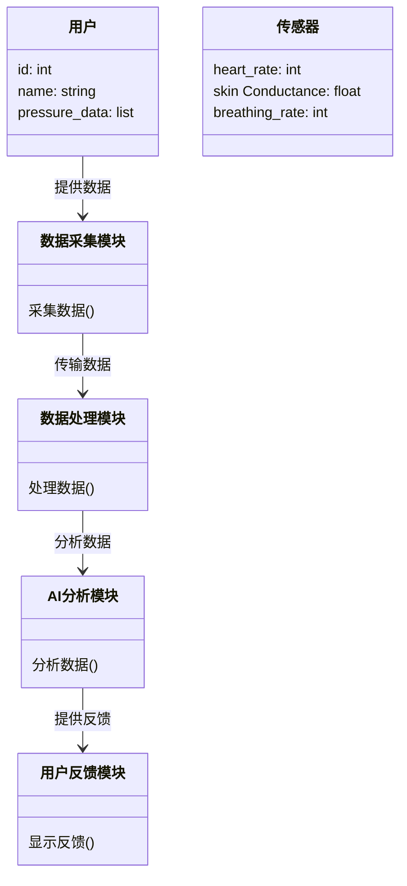
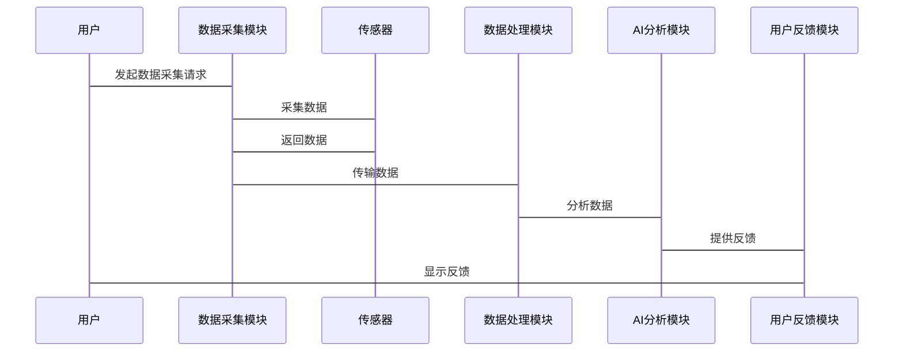

                 


# AI Agent在智能手表中的压力管理系统

> 关键词：AI Agent，智能手表，压力管理，健康监测，机器学习，实时监测

> 摘要：本文详细探讨了AI Agent在智能手表中的压力管理系统的应用，从理论到实践，系统地分析了压力管理的核心问题，提出了基于AI Agent的解决方案，并通过实际案例展示了系统的实现和优化过程。

---

## 第一部分: 背景介绍

### 第1章: 问题背景

#### 1.1 现代人压力问题的普遍性
现代人面临越来越大的压力，压力管理成为重要的健康问题。智能手表作为常用的可穿戴设备，具有实时监测和反馈的优势。

#### 1.2 智能手表在健康监测中的作用
智能手表可以监测心率、皮肤电活动、呼吸频率等生理指标，为压力管理提供数据支持。

#### 1.3 AI Agent在压力管理中的潜力
AI Agent能够实时分析数据，提供个性化的压力管理策略，帮助用户有效应对压力。

### 第2章: 问题描述

#### 2.1 压力管理的核心问题
压力管理需要实时监测、准确预测和有效干预。智能手表数据采集的准确性和AI Agent的智能性是关键。

#### 2.2 智能手表在压力监测中的优势
智能手表的便携性和实时性使其成为压力管理的理想工具。

#### 2.3 AI Agent在实时压力管理中的应用价值
AI Agent能够快速处理数据，提供实时反馈，帮助用户及时调整压力状态。

### 第3章: 问题解决

#### 3.1 AI Agent在压力监测中的解决方案
AI Agent通过机器学习算法分析多模态数据，提供精准的压力预测和干预建议。

#### 3.2 智能手表数据采集的关键技术
采用高精度传感器和先进的数据融合技术，确保压力监测的准确性。

#### 3.3 压力管理系统的整体架构
系统由数据采集模块、AI分析模块和用户反馈模块组成，实现数据采集、分析和反馈的闭环管理。

### 第4章: 边界与外延

#### 4.1 系统功能的边界
系统专注于压力管理，不涉及其他健康指标的监测。

#### 4.2 与其他健康管理系统的关系
系统可以与其他健康管理系统集成，提供更全面的健康管理服务。

#### 4.3 压力管理系统的扩展性
系统可以根据用户需求扩展功能，如增加情绪管理、睡眠监测等模块。

### 第5章: 概念结构与核心要素

#### 5.1 AI Agent的核心要素
包括数据采集、算法模型、决策机制和反馈模块。

#### 5.2 压力管理系统的组成模块
数据采集模块、数据处理模块、AI分析模块和用户反馈模块。

#### 5.3 智能手表的数据采集机制
通过多种传感器采集生理指标，结合环境数据进行综合分析。

---

## 第二部分: 核心概念与联系

### 第6章: AI Agent的原理

#### 6.1 AI Agent的基本概念
AI Agent是一种智能体，能够感知环境、处理信息并做出决策。

#### 6.2 AI Agent的核心算法
包括监督学习、无监督学习和强化学习等算法。

#### 6.3 AI Agent与智能手表的交互机制
通过API接口进行数据传输和命令控制，实现智能手表与AI Agent的协同工作。

### 第7章: 压力监测技术

#### 7.1 生理指标与压力的关系
心率变异性（HRV）、皮肤电活动（EDA）和呼吸频率是压力监测的重要指标。

#### 7.2 智能手表中压力监测的关键指标
实时监测HRV、EDA和呼吸频率，结合用户行为数据进行分析。

#### 7.3 多模态数据融合技术
通过融合多种生理数据，提高压力监测的准确性和可靠性。

### 第8章: 系统架构设计

#### 8.1 系统的基本架构
采用分层架构，包括数据采集层、数据处理层和应用层。

#### 8.2 AI Agent在系统中的角色
作为核心模块，负责数据处理、模型训练和决策制定。

#### 8.3 系统模块之间的关系
数据采集模块向AI Agent提供数据，AI Agent分析数据并生成反馈，用户反馈模块接收并显示反馈信息。

---

## 第三部分: 算法原理讲解

### 第9章: 压力预测算法

#### 9.1 基于机器学习的压力预测模型
采用LSTM网络进行时间序列预测，模型结构包括输入层、LSTM层和输出层。

#### 9.2 时间序列分析方法
通过滑动窗口技术提取特征，利用ARIMA模型进行预测。

#### 9.3 集成学习算法的应用
使用随机森林和梯度提升树进行特征选择和模型集成，提高预测准确率。

### 第10章: 压力异常检测

#### 10.1 基于统计的方法
采用Z-score和IQR方法检测异常值。

#### 10.2 基于深度学习的方法
使用变种自动编码器（AE）进行异常检测，通过重建误差判断异常。

#### 10.3 异常检测算法的比较
比较不同算法的优缺点，选择最适合当前场景的方法。

### 第11章: AI Agent的决策机制

#### 11.1 基于规则的决策方法
根据预设规则生成反馈建议，如“深呼吸”、“休息”等。

#### 11.2 基于概率的决策方法
利用贝叶斯网络进行概率推理，生成最优决策。

#### 11.3 多目标优化策略
通过多目标优化算法平衡多个决策目标，如准确性、实时性和用户舒适度。

---

## 第四部分: 系统分析与架构设计方案

### 第12章: 问题场景介绍

#### 12.1 用户压力监测的场景分析
用户在不同场景下（如工作、学习、运动）的压力状态不同，需要动态调整监测策略。

#### 12.2 智能手表数据采集的挑战
传感器精度、数据传输延迟和能耗管理是主要挑战。

#### 12.3 AI Agent在压力管理中的应用场景
实时监测、主动干预和长期跟踪是主要应用场景。

### 第13章: 项目介绍

#### 13.1 项目目标
实现基于AI Agent的智能手表压力管理系统，提供实时监测和个性化干预。

#### 13.2 项目范围
涵盖数据采集、算法开发、系统集成和用户界面设计。

#### 13.3 项目约束
设备能耗、数据隐私和用户接受度是主要约束。

### 第14章: 系统功能设计

#### 14.1 领域模型设计
使用Mermaid类图描述系统模块之间的关系。



### 第15章: 系统架构设计

#### 15.1 系统架构图
使用Mermaid架构图描述系统架构。


### 第16章: 系统接口设计

#### 16.1 系统接口
AI Agent与智能手表通过API接口进行数据交互，采用RESTful API设计。

#### 16.2 接口描述
数据采集模块提供API接口，AI分析模块调用接口获取数据。

### 第17章: 系统交互流程图

#### 17.1 系统交互流程图
使用Mermaid序列图描述系统交互流程。



---

## 第五部分: 项目实战

### 第18章: 环境安装

#### 18.1 环境要求
需要安装Python、TensorFlow、Keras和相关传感器库。

#### 18.2 安装步骤
1. 安装Python和pip。
2. 安装TensorFlow和Keras。
3. 安装传感器SDK和数据处理库。

### 第19章: 系统核心实现源代码

#### 19.1 数据采集模块
```python
import sensor_sdk

class DataCollector:
    def __init__(self):
        self.sensor = sensor_sdk.Sensor()

    def collect_data(self):
        return self.sensor.get_data()
```

#### 19.2 数据处理模块
```python
import numpy as np

class DataProcessor:
    def __init__(self):
        self.models = [self.model1, self.model2]

    def process_data(self, data):
        processed_data = []
        for model in self.models:
            processed_data.append(model.predict(data))
        return processed_data
```

#### 19.3 AI分析模块
```python
import tensorflow as tf
from tensorflow import keras

class AIAgent:
    def __init__(self):
        self.model = self.build_model()

    def build_model(self):
        model = keras.Sequential()
        model.add(keras.layers.LSTM(64, input_shape=(None, 3)))
        model.add(keras.layers.Dense(1))
        model.compile(optimizer='adam', loss='mse')
        return model

    def analyze_data(self, data):
        prediction = self.model.predict(data)
        return prediction
```

#### 19.4 用户反馈模块
```python
class UserFeedback:
    def __init__(self):
        self.display = Display()

    def show_feedback(self, feedback):
        self.display.show(feedback)
```

### 第20章: 代码应用解读与分析

#### 20.1 数据采集模块解读
通过传感器SDK采集用户生理数据，确保数据的实时性和准确性。

#### 20.2 数据处理模块解读
使用多种模型进行数据处理，提高数据的准确性和可靠性。

#### 20.3 AI分析模块解读
基于LSTM网络进行压力预测，确保预测的准确性和实时性。

#### 20.4 用户反馈模块解读
通过用户友好的界面显示反馈信息，帮助用户及时调整压力状态。

### 第21章: 实际案例分析

#### 21.1 案例背景
用户在工作期间压力急剧上升，系统启动压力管理策略。

#### 21.2 数据分析
通过机器学习模型预测压力状态，识别异常情况。

#### 21.3 系统反馈
系统建议用户进行深呼吸练习和短暂休息。

#### 21.4 效果评估
通过用户反馈和生理指标的变化，评估系统的有效性和实用性。

### 第22章: 项目小结

#### 22.1 项目总结
项目实现了基于AI Agent的智能手表压力管理系统，验证了系统的可行性和有效性。

#### 22.2 项目意义
通过AI技术提升压力管理的智能化水平，为用户健康保驾护航。

---

## 第六部分: 最佳实践、小结、注意事项、拓展阅读

### 第23章: 最佳实践 tips

#### 23.1 系统优化建议
持续优化算法模型，提高系统的准确性和实时性。

#### 23.2 用户体验优化
设计用户友好的界面，提升用户的使用体验。

#### 23.3 数据隐私保护
加强数据加密和用户隐私保护，确保数据安全。

### 第24章: 小结

AI Agent在智能手表中的压力管理系统通过实时监测、智能分析和个性化反馈，有效帮助用户管理压力，提升生活质量。

### 第25章: 注意事项

#### 25.1 数据采集的准确性
传感器精度和数据融合技术是影响系统性能的关键因素。

#### 25.2 系统的实时性
及时的数据处理和反馈是系统的核心要求。

#### 25.3 用户隐私保护
确保用户数据的安全性和隐私性，遵守相关法律法规。

### 第26章: 拓展阅读

#### 26.1 相关技术
推荐阅读《深度学习实战》、《可穿戴设备与健康管理》等书籍。

#### 26.2 最新研究
关注最新的AI算法和健康监测技术，保持系统的前沿性。

---

## 作者：AI天才研究院/AI Genius Institute & 禅与计算机程序设计艺术/Zen And The Art of Computer Programming

---

以上是《AI Agent在智能手表中的压力管理系统》的技术博客目录大纲，希望对您有所帮助！

