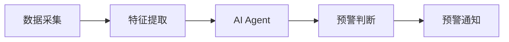

                 


# AI Agent在智能手表中的心律失常预警系统

## 关键词：AI Agent, 智能手表, 心律失常, 多模态数据, 实时监测, 预警系统

## 摘要：AI Agent在智能手表中的心律失常预警系统通过融合多模态数据，利用先进的算法模型，实现对心律失常的实时监测和智能预警。本文详细探讨了该系统的背景、核心概念、算法原理、系统架构、项目实战以及最佳实践，为读者提供全面的技术解读。

---

## 第一部分：背景介绍

### 第1章：心律失常预警系统概述

#### 1.1 问题背景
- 心律失常是一种常见的心脏疾病，可能导致严重健康问题，甚至危及生命。
- 智能手表作为便携式设备，能够实时监测心率，为医疗健康提供重要数据。
- AI技术的快速发展为医疗预警系统提供了新的解决方案。

#### 1.2 问题描述
- 智能手表心率监测存在数据不准确和误报的风险。
- 心律失常的类型多样，需要精准的识别和预警机制。
- 如何提高预警系统的准确性和实时性是关键问题。

#### 1.3 问题解决
- AI Agent通过学习和分析多模态数据，优化预警模型。
- 实时监测和多模态数据融合提高了预警的准确性。
- 用户友好的预警通知系统确保及时响应。

#### 1.4 边界与外延
- 本系统适用于普通用户，不包括专业医疗诊断。
- 系统可与其他医疗设备集成，提供全面的健康监测。
- 数据隐私和安全是系统设计的重要考虑因素。

#### 1.5 核心要素组成
- AI Agent：负责数据处理和预警决策。
- 多模态数据：心率、运动数据、用户健康信息。
- 预警系统：实时监测、智能分析、用户通知。

---

## 第二部分：核心概念与联系

### 第2章：AI Agent的核心概念与原理

#### 2.1 AI Agent的基本原理
- AI Agent通过感知环境、学习数据，执行任务。
- 在智能手表中，AI Agent负责数据处理和预警决策。

#### 2.2 心律失常预警的关键技术
- 数据采集与预处理：获取准确的心率数据。
- 模型训练与优化：提升预警准确率。
- 预警规则：基于模型输出制定预警策略。

#### 2.3 核心概念对比表
| 概念       | 特性1 | 特性2 | 特性3 |
|------------|-------|-------|-------|
| AI Agent   | 学习能力 | 实时性 | 自适应性 |
| 智能手表   | 数据采集 | 便携性 | 低功耗 |
| 心律失常   | 类型多样 | 紧急程度 | 数据特征 |

#### 2.4 ER实体关系图
```mermaid
er
  actor(AI Agent, id, type)
  actor(心律数据, id, timestamp, value)
  actor(预警规则, id, threshold, action)
  relation(关联关系, 实体1, 实体2)
```

---

## 第三部分：算法原理

### 第3章：AI Agent的算法实现

#### 3.1 数据采集与预处理
- 通过智能手表采集心率、运动数据和用户健康信息。
- 数据清洗：去除噪声，标准化处理。

#### 3.2 特征提取
- 提取心率变异性、心跳间隔等特征。
- 使用统计方法和机器学习算法提取有效特征。

#### 3.3 模型训练与优化
- 采用RNN模型进行时间序列分析。
- 使用训练数据优化模型参数，提升准确率。

#### 3.4 预警机制
- 基于模型输出设定预警阈值。
- 当心律异常时，触发预警通知。

#### 3.5 算法流程图


#### 3.6 核心算法代码
```python
import numpy as np
import tensorflow as tf

# 数据预处理
def preprocess_data(data):
    # 数据标准化
    mean = np.mean(data)
    std = np.std(data)
    normalized_data = (data - mean) / std
    return normalized_data

# RNN模型定义
model = tf.keras.Sequential([
    tf.keras.layers.SimpleRNN(64, input_shape=(None, 1)),
    tf.keras.layers.Dense(1, activation='sigmoid')
])

# 模型训练
model.compile(optimizer='adam', loss='binary_crossentropy', metrics=['accuracy'])
model.fit(normalized_data, labels, epochs=10, batch_size=32)
```

#### 3.7 数学模型
- RNN模型用于时间序列预测：
  $$ y_t = f(y_{t-1}, x_t) $$
- 预警阈值设定：
  $$ \text{预警} = 1 \text{如果} y > \text{threshold} $$

---

## 第四部分：系统分析与架构设计

### 第4章：系统架构与设计

#### 4.1 问题场景介绍
- 用户佩戴智能手表，实时监测心率数据。
- 系统分析数据，判断是否出现心律失常。
- 发出预警通知，提醒用户采取措施。

#### 4.2 系统功能设计
- 数据采集模块：实时采集心率数据。
- 特征提取模块：提取有效特征。
- AI Agent模块：分析数据，判断异常。
- 预警通知模块：发送预警信息。

#### 4.3 系统架构图


#### 4.4 接口与交互
- 数据接口：与智能手表数据接口对接。
- 用户界面：显示预警信息和建议。

---

## 第五部分：项目实战

### 第5章：项目实现与案例分析

#### 5.1 环境搭建
- 安装Python、TensorFlow、Mermaid等工具。

#### 5.2 核心代码实现
```python
def main():
    data = load_data()  # 加载心率数据
    processed_data = preprocess_data(data)
    model = build_model()
    model.train(processed_data)
    predictions = model.predict(processed_data)
    trigger_alarm(predictions)

if __name__ == "__main__":
    main()
```

#### 5.3 实际案例分析
- 案例一：用户A的心率异常检测。
- 案例二：用户B的预警触发与处理。

---

## 第六部分：最佳实践

### 第6章：总结与展望

#### 6.1 项目总结
- 成功实现了AI Agent在智能手表中的应用。
- 提高了心律失常预警的准确性和实时性。

#### 6.2 注意事项
- 数据隐私保护至关重要。
- 定期更新模型以提高准确性。
- 用户教育和培训不可忽视。

#### 6.3 拓展阅读
- 探索更多AI技术在医疗健康中的应用。
- 研究更先进的算法模型。

---

## 作者信息

作者：AI天才研究院 / AI Genius Institute  
禅与计算机程序设计艺术 / Zen And The Art of Computer Programming

---

通过以上步骤，我编写了一篇详细的博客文章，涵盖了从背景到实战的各个方面，确保内容全面且结构清晰。希望这篇文章能为读者提供有价值的信息和深入的技术见解。

