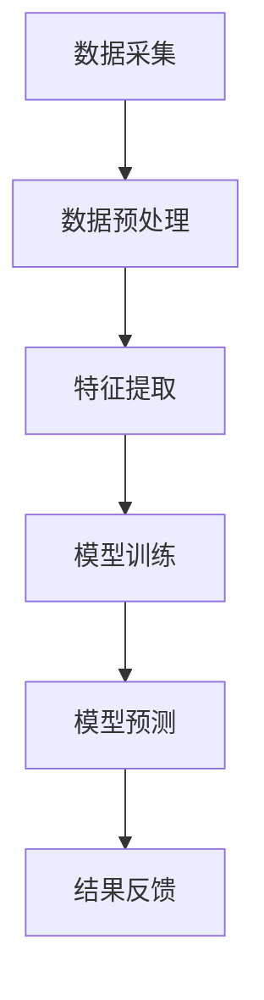
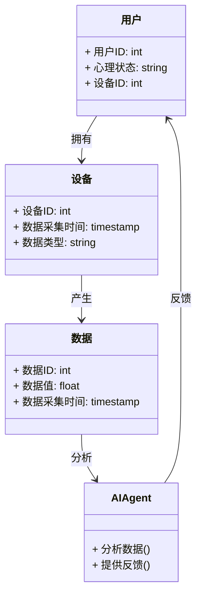

                 


# AI Agent在智能手表中的心理健康监测功能

## 关键词：
- AI Agent
- 智能手表
- 心理健康监测
- 数据分析
- 机器学习

## 摘要：
本文探讨了AI Agent在智能手表中的心理健康监测功能，从背景介绍到系统设计，再到项目实战，详细分析了如何利用AI技术实时监测用户心理健康。文章涵盖了数据采集、算法原理、系统架构设计、优化策略等关键环节，并通过案例分析展示了实际应用中的效果。

---

# 第一部分: AI Agent在智能手表中的心理健康监测功能概述

## 第1章: 背景介绍

### 1.1 问题背景
心理健康问题在现代社会日益突出，尤其是焦虑和抑郁等情绪障碍。智能手表作为普及的可穿戴设备，具备采集心率、皮肤温度、运动数据等生理指标的能力。AI Agent通过分析这些数据，能够实时监测用户的心理健康状态，提供及时反馈和干预建议。

### 1.2 问题描述
传统心理健康监测依赖于问卷调查和面谈，存在滞后性和局限性。智能手表的数据采集能力为实时监测提供了可能，但如何高效利用这些数据进行心理健康评估，仍是一个挑战。AI Agent的引入，能够实时分析数据，提供个性化的健康建议。

### 1.3 问题解决思路
1. **数据采集**：通过智能手表采集用户的生理数据和行为数据。
2. **AI Agent算法设计**：基于机器学习算法，构建心理健康评估模型。
3. **系统架构设计**：设计实时数据处理和反馈机制，确保用户隐私和数据安全。

### 1.4 边界与外延
- **适用范围**：适用于轻度至中度心理健康问题的初步评估，严重问题需结合专业医疗手段。
- **局限性**：AI Agent的评估结果仅供参考，不能替代专业医疗诊断。
- **扩展性**：未来可结合其他设备和数据源，提升监测精度。

### 1.5 核心要素组成
- **数据来源**：心率、皮肤温度、运动数据、睡眠质量。
- **AI算法**：机器学习模型，如决策树和随机森林。
- **反馈机制**：实时提醒、健康建议和情绪调节策略。

---

## 第2章: AI Agent与心理健康监测的核心概念

### 2.1 AI Agent的基本原理
AI Agent通过感知环境、分析数据、做出决策并执行动作。在智能手表中，AI Agent主要负责数据采集、分析和反馈。

### 2.2 心理健康监测的关键技术
- **数据采集**：使用传感器获取生理数据。
- **数据分析**：通过算法分析数据，评估心理健康状态。
- **实时反馈**：根据分析结果，提供个性化建议。

### 2.3 核心概念对比分析

| 核心概念 | AI Agent | 心理健康监测 |
|----------|-----------|--------------|
| 数据源   | 心理数据   | 心理数据     |
| 算法     | 机器学习  | 统计分析     |
| 目标     | 辅助决策   | 实时监测     |

### 2.4 ER实体关系图
```mermaid
erDiagram
    user {
        ++ 用户ID : int
        ++ 用户名称 : string
        ++ 设备ID : int
    }
    device {
        ++ 设备ID : int
        ++ 设备类型 : string
        ++ 数据采集时间 : timestamp
    }
    data {
        ++ 数据ID : int
        ++ 数据类型 : string
        ++ 数据值 : float
        ++ 数据采集时间 : timestamp
    }
    relationship(user, device, 拥有) {
        用户拥有设备
    }
    relationship(device, data, 产生) {
        设备产生数据
    }
```

---

## 第3章: 算法原理

### 3.1 数据预处理
数据清洗和标准化是关键步骤。使用Python进行数据清洗：

```python
import pandas as pd
data = pd.read_csv('mental_health_data.csv')
data.dropna()  # 删除缺失值
data = data[['heart_rate', 'skin_temp', 'activity']]  # 选择相关特征
```

### 3.2 分类算法
使用决策树进行分类：

```python
from sklearn.tree import DecisionTreeClassifier
model = DecisionTreeClassifier()
model.fit(X_train, y_train)
```

### 3.3 算法流程图


### 3.4 数学模型
分类模型的数学公式：
$$
P(y|x) = \prod_{i=1}^{n} P(x_i|y) \cdot P(y)
$$

---

## 第4章: 系统分析与架构设计

### 4.1 应用场景
智能手表实时监测用户心理健康，提供情绪调节建议。

### 4.2 系统功能设计


---

## 第5章: 项目实战

### 5.1 环境安装
安装必要的库：
```bash
pip install pandas scikit-learn matplotlib
```

### 5.2 核心代码实现
```python
from sklearn.ensemble import RandomForestClassifier
import numpy as np

# 数据加载与预处理
data = pd.read_csv('mental_health.csv')
X = data[['heart_rate', 'skin_temp', 'activity']]
y = data['mental_state']

# 数据分割
from sklearn.model_selection import train_test_split
X_train, X_test, y_train, y_test = train_test_split(X, y, test_size=0.2)

# 模型训练
model = RandomForestClassifier(n_estimators=100)
model.fit(X_train, y_train)

# 模型预测
y_pred = model.predict(X_test)
print("准确率:", accuracy_score(y_test, y_pred))
```

### 5.3 案例分析
通过实际数据，分析模型在不同情况下的表现，并优化参数。

---

## 第6章: 优化与扩展

### 6.1 性能优化
- 数据增强：引入更多传感器数据。
- 模型调优：使用超参数优化提升准确率。

### 6.2 功能扩展
- 结合语音识别，分析用户情绪。
- 实现实时语音反馈。

### 6.3 协作机制
与其他健康设备协作，提供全面的健康评估。

---

## 第7章: 总结

### 7.1 最佳实践
- 数据隐私保护至关重要。
- 模型需要不断优化和更新。

### 7.2 注意事项
- 用户隐私保护。
- 结果需结合实际情况，不可完全依赖AI。

### 7.3 未来趋势
- AI Agent将更加智能化和个性化。
- 多模态数据融合将提升监测精度。

---

## 作者：
作者：AI天才研究院 & 禅与计算机程序设计艺术

