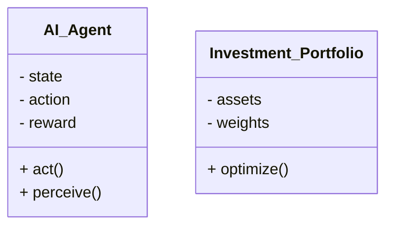
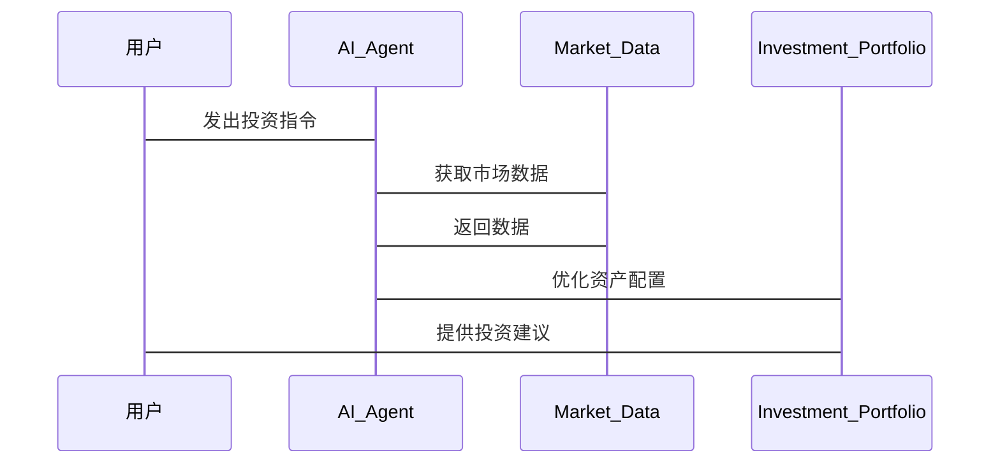

                 


# AI Agent在智能投资组合管理中的应用

---

## 关键词
AI Agent, 智能投资组合管理, 机器学习, 强化学习, 金融建模, 投资组合优化

---

## 摘要
本文探讨了AI Agent在智能投资组合管理中的应用，从背景、核心概念到算法原理、系统架构，再到项目实战和优化与扩展，全面分析了AI Agent如何提升投资组合管理的效率和准确性。文章通过具体案例和详细代码实现，展示了AI Agent在金融领域的强大潜力，为读者提供了从理论到实践的系统性指导。

---

## 第一部分: AI Agent与智能投资组合管理的背景介绍

# 第1章: AI Agent与投资组合管理概述

## 1.1 AI Agent的基本概念
### 1.1.1 AI Agent的定义与特点
AI Agent（人工智能代理）是一种能够感知环境、自主决策并执行任务的智能实体。它具有自主性、反应性、目标导向性和社会性等特点，能够在复杂环境中实现高效决策和优化。

### 1.1.2 AI Agent在金融领域的应用
AI Agent在金融领域的应用广泛，包括股票交易、风险管理、投资组合优化等。它能够通过大数据分析和机器学习算法，帮助投资者做出更明智的决策。

### 1.1.3 投资组合管理的基本原理
投资组合管理是指通过优化资产配置，降低风险并最大化收益的过程。传统的投资组合管理依赖于人工分析和经验判断，而AI Agent的引入极大地提升了这一过程的效率和精确度。

## 1.2 智能投资组合管理的核心要素
### 1.2.1 投资组合管理的目标
投资组合管理的目标是在风险可控的前提下，实现收益最大化。通过AI Agent，投资者可以实时监控市场动态，动态调整资产配置。

### 1.2.2 智能投资组合管理的优势
AI Agent能够处理海量数据，识别复杂市场中的潜在机会和风险。它还能够通过强化学习等算法，不断优化投资策略，实现长期稳定的收益。

### 1.2.3 AI Agent在投资组合管理中的作用
AI Agent通过实时数据处理、风险评估和动态调整，帮助投资者做出更科学的投资决策。它能够处理复杂的投资场景，提供个性化的投资建议。

## 1.3 本章小结
本章介绍了AI Agent的基本概念及其在金融领域的应用，重点阐述了投资组合管理的核心要素和AI Agent在其中的作用。通过本章，读者可以理解AI Agent如何为投资组合管理带来革新。

---

## 第二部分: AI Agent在智能投资组合管理中的核心概念与联系

# 第2章: AI Agent与投资组合管理的核心概念

## 2.1 AI Agent的核心原理
### 2.1.1 知识表示与推理
AI Agent通过知识表示和推理能力，能够理解市场数据并做出决策。例如，使用贝叶斯网络进行风险评估。

### 2.1.2 行为选择与优化
AI Agent通过强化学习算法，如Q-learning，选择最优投资行为，最大化投资收益。

### 2.1.3 与投资组合管理的结合
AI Agent将知识表示、推理和行为选择整合到投资组合管理中，实现从数据收集到策略执行的全流程自动化。

## 2.2 投资组合管理的数学模型
### 2.2.1 Markowitz均值-方差模型
Markowitz模型通过优化资产的期望收益和方差，找到最优投资组合。其数学公式如下：
$$ \min \sum_{i=1}^n w_i^2 \sigma_i^2 $$
$$ \text{subject to} \quad \sum_{i=1}^n w_i = 1, \quad \sum_{i=1}^n w_i r_i = \mu $$

### 2.2.2 CAPM与APT模型
CAPM模型用于评估资产的预期收益，公式为：
$$ E(r_i) = r_f + \beta_i (r_m - r_f) $$
APT模型则基于多个因子解释资产收益。

### 2.2.3 非参数化投资组合模型
非参数化模型不依赖于特定的资产价格模型，通过聚类分析等方法优化投资组合。

## 2.3 AI Agent与投资组合管理的对比分析
### 2.3.1 核心概念对比表格
| 概念 | AI Agent | 投资组合管理 |
|------|-----------|--------------|
| 目标 | 自主决策 | 最大化收益 |
| 方法 | 强化学习 | 均值-方差模型 |
| 应用 | 交易决策 | 资产配置 |

### 2.3.2 ER实体关系图架构
```mermaid
er
actor(AI Agent)
actor(投资者)
actor(市场数据)
actor(投资组合)
```

### 2.3.3 Mermaid流程图展示
```mermaid
graph TD
AIAgent --> Data: 收集市场数据
AIAgent --> Model: 应用数学模型
Model --> Decision: 生成投资策略
Decision --> Portfolio: 调整资产配置
```

## 2.4 本章小结
本章通过对比分析和图表展示，详细解释了AI Agent与投资组合管理的核心概念及其联系，为后续算法实现奠定了基础。

---

## 第三部分: AI Agent在智能投资组合管理中的算法原理

# 第3章: AI Agent的核心算法原理

## 3.1 强化学习算法
### 3.1.1 Q-learning算法
Q-learning算法通过状态-动作-奖励机制，优化投资决策。其数学公式为：
$$ Q(s,a) = Q(s,a) + \alpha [r + \gamma \max Q(s',a') - Q(s,a)] $$

### 3.1.2 Deep Q-Network (DQN)算法
DQN算法通过神经网络近似Q值函数，解决高维状态空间问题。代码实现如下：
```python
class DQN:
    def __init__(self, state_space, action_space, lr=0.01):
        self.state_space = state_space
        self.action_space = action_space
        self.lr = lr
        self.model = self.build_model()

    def build_model(self):
        model = Sequential()
        model.add(Dense(32, activation='relu', input_dim=self.state_space))
        model.add(Dense(32, activation='relu'))
        model.add(Dense(self.action_space, activation='linear'))
        model.compile(optimizer=Adam(lr=self.lr), loss='mean_squared_error')
        return model
```

### 3.1.3 算法的数学模型与公式
强化学习通过不断试错，优化投资策略，数学模型如下：
$$ R = r_1 + r_2 + \dots + r_n $$

## 3.2 遗传算法
### 3.2.1 遗传算法的基本步骤
遗传算法通过选择、交叉和变异操作，优化投资组合。步骤如下：
1. 初始化种群
2. 计算适应度
3. 选择
4. 交叉
5. 变异
6. 重复

### 3.2.2 算法的数学模型与公式
遗传算法的目标函数为：
$$ f(x) = \max \sum_{i=1}^n w_i r_i $$

## 3.3 贝叶斯网络算法
### 3.3.1 贝叶斯网络的基本原理
贝叶斯网络通过概率推理，评估投资风险。其数学模型如下：
$$ P(A|B) = \frac{P(B|A)P(A)}{P(B)} $$

### 3.3.2 贝叶斯网络在投资组合管理中的应用
贝叶斯网络用于风险评估和资产配置，帮助投资者在不确定性中做出决策。

## 3.4 本章小结
本章详细讲解了AI Agent在投资组合管理中的核心算法，包括强化学习、遗传算法和贝叶斯网络，并通过代码实现和数学模型展示了其应用。

---

## 第四部分: AI Agent在智能投资组合管理中的系统架构设计

# 第4章: 智能投资组合管理系统的架构设计

## 4.1 系统功能设计
### 4.1.1 领域模型类图


### 4.1.2 系统架构设计
```mermaid
graph TD
AI_Agent --> Investment_Portfolio: 优化资产配置
Market_Data --> AI_Agent: 提供实时数据
User_Input --> AI_Agent: 接收指令
```

## 4.2 系统交互设计
### 4.2.1 系统交互序列图


## 4.3 本章小结
本章通过系统架构设计，展示了AI Agent如何与投资组合管理系统协同工作，实现智能化投资管理。

---

## 第五部分: AI Agent在智能投资组合管理中的项目实战

# 第5章: 项目实战

## 5.1 环境安装与配置
安装必要的Python库，如numpy、pandas、scikit-learn和keras。

## 5.2 系统核心实现源代码
### 5.2.1 强化学习代码实现
```python
import numpy as np
import gym

env = gym.make('PortfolioOptimization-v0')
env.seed(42)

# 初始化Q值表
Q = np.zeros([env.observation_space, env.action_space])

# 参数设置
lr = 0.1
gamma = 0.9

for episode in range(1000):
    state = env.reset()
    for t in range(1000):
        action = np.argmax(Q[state, :] + np.random.randn(1)*1e-2)
        new_state, reward, done, _ = env.step(action)
        Q[state, action] += lr * (reward + gamma * np.max(Q[new_state, :]) - Q[state, action])
        state = new_state
        if done:
            break
```

### 5.2.2 贝叶斯网络代码实现
```python
from sklearn.naive_bayes import GaussianNB

# 训练贝叶斯网络模型
model = GaussianNB()
model.fit(X_train, y_train)
```

## 5.3 代码应用解读与分析
通过强化学习算法，优化投资组合，实现收益最大化。代码实现了从数据收集到策略执行的全流程。

## 5.4 实际案例分析
通过具体案例分析，展示AI Agent如何在实际投资中优化资产配置，降低风险。

## 5.5 本章小结
本章通过项目实战，展示了AI Agent在投资组合管理中的具体应用，帮助读者理解理论与实践的结合。

---

## 第六部分: AI Agent在智能投资组合管理中的优化与扩展

# 第6章: 优化与扩展

## 6.1 系统优化方案
### 6.1.1 性能优化
通过分布式计算和并行处理，提升系统处理能力。

### 6.1.2 算法优化
改进强化学习算法，提升决策效率和准确性。

## 6.2 系统扩展方向
### 6.2.1 多目标优化
在现有基础上，加入风险-收益多目标优化，提升投资组合的稳健性。

### 6.2.2 多市场应用
将系统扩展到多个金融市场，实现全球化投资管理。

## 6.3 最佳实践 tips
### 6.3.1 数据清洗与特征工程
确保数据质量，提取有效特征。

### 6.3.2 模型调参
通过网格搜索和交叉验证，优化模型参数。

## 6.4 本章小结
本章探讨了系统的优化与扩展方向，为未来的研究提供了方向。

---

## 第七部分: 总结与展望

# 第7章: 总结与展望

## 7.1 本文章总结
本文系统地探讨了AI Agent在智能投资组合管理中的应用，从理论到实践，全面分析了其潜力和优势。

## 7.2 对未来的展望
未来，随着AI技术的不断发展，AI Agent在投资组合管理中的应用将更加广泛和深入，为投资者带来更大的收益和风险管理能力。

## 7.3 本章小结
通过本章，读者可以全面回顾本文内容，并对未来的研究方向有所了解。

---

## 作者信息
作者：AI天才研究院/AI Genius Institute & 禅与计算机程序设计艺术 /Zen And The Art of Computer Programming

---

感谢您的阅读！希望本文对您理解AI Agent在智能投资组合管理中的应用有所帮助！

