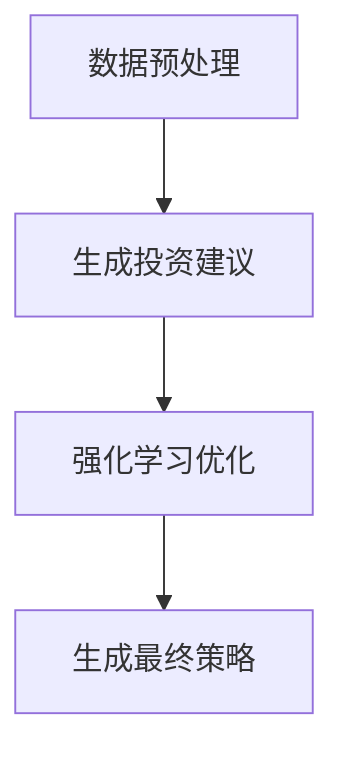
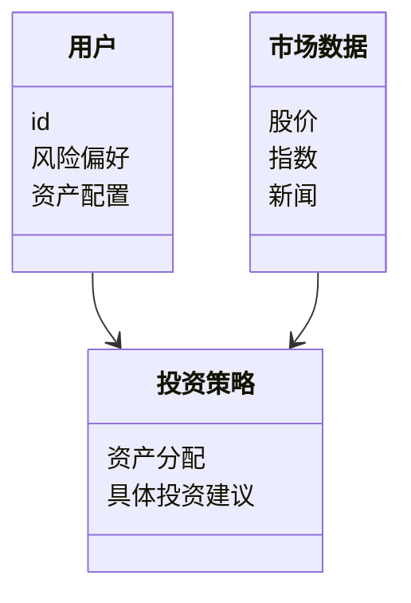

                 


# AI Agent在智能投资顾问中的应用

## 关键词：AI Agent, 智能投资顾问, 金融应用, 生成式模型, 强化学习, 系统架构

## 摘要：本文探讨了AI Agent在智能投资顾问中的应用，分析其核心概念、算法原理和系统架构，通过项目实战和最佳实践提供深度解析。

---

## 第一部分：背景介绍

### 第1章：AI Agent与智能投资顾问概述

#### 1.1 问题背景
- **传统投资顾问的局限性**：依赖人工分析，效率低，成本高，难以覆盖大规模客户。
- **AI技术的潜力**：利用大数据分析、自然语言处理和机器学习，实现自动化、智能化的投资建议。
- **当前挑战**：数据质量、模型准确性、用户信任度和合规性问题。

#### 1.2 问题描述
- AI Agent需具备数据处理、市场分析、客户交互和决策支持功能。
- 需解决实时数据处理、复杂决策和个性化需求。

#### 1.3 问题解决
- AI Agent通过自然语言处理和机器学习，提供个性化投资建议和实时市场分析。

#### 1.4 边界与外延
- AI Agent主要辅助投资决策，不直接操作账户。
- 相关领域：风险管理、客户画像、市场预测。

#### 1.5 核心要素组成
- 数据源：市场数据、用户数据。
- AI算法：生成式模型、强化学习。
- 交互界面：自然语言处理、可视化工具。
- 后台系统：数据存储、计算引擎。

---

## 第二部分：核心概念与联系

### 第2章：AI Agent与智能投资顾问的核心概念

#### 2.1 核心概念原理
- AI Agent：智能体，感知环境并执行目标。
- 智能投资顾问：利用AI优化投资决策。

#### 2.2 属性特征对比

| 属性       | AI Agent                 | 智能投资顾问         |
|------------|--------------------------|--------------------|
| 感知能力   | 多模态输入处理           | 市场数据与用户需求   |
| 决策能力   | 强化学习优化策略         | 基于模型的投资建议   |
| 学习能力   | 竞争性学习               | 增量学习            |
| 交互能力   | 自然语言处理             | 个性化交互          |

#### 2.3 ER实体关系图
```mermaid
er
  actor: 用户
  role: 投资顾问角色
  entity: 投资产品
  entity: 用户数据
  entity: 市场数据
  entity: 交互记录
  entity: 投资策略
  entity: 风险评估
  entity: 反馈机制
  relationship: 用户与投资顾问的交互
  relationship: 投资顾问与投资产品的关联
  relationship: 数据源与投资策略的关联
```

---

## 第三部分：算法原理讲解

### 第3章：AI Agent的算法原理

#### 3.1 生成式模型
- **模型结构**：基于Transformer的生成模型。
- **损失函数**：交叉熵损失。
$$
\text{Loss} = -\sum_{t=1}^{T} \log p_{\theta}(w_t|w_{<t})
$$

#### 3.2 强化学习
- **策略梯度**：使用策略梯度优化投资策略。
$$
\nabla \theta \log \pi_{\theta}(a|s) \cdot Q(s,a)
$$

#### 3.3 算法流程图


#### 3.4 代码实现
```python
import torch
import torch.nn as nn

class Transformer(nn.Module):
    def __init__(self):
        super().__init__()
        self.encoder = nn.TransformerEncoder(...)
        self.decoder = nn.TransformerDecoder(...)

    def forward(self, x):
        return self.decoder(self.encoder(x))
```

---

## 第四部分：系统分析与架构设计

### 第4章：系统分析与架构设计

#### 4.1 问题场景介绍
- 提供个性化投资建议，实时市场监控，风险评估。

#### 4.2 领域模型


#### 4.3 系统架构


#### 4.4 接口与交互
- REST API：提供市场数据查询、投资策略生成。
- WebSocket：实时市场更新。

---

## 第五部分：项目实战

### 第5章：项目实战

#### 5.1 环境安装
- 安装Python、TensorFlow、PyTorch、Pandas。

#### 5.2 核心代码实现
```python
def generate_investment_recommendation(data):
    model = load_model()
    prediction = model.predict(data)
    return format_recommendation(prediction)
```

#### 5.3 案例分析
- 数据清洗：处理缺失值和异常值。
- 模型训练：使用历史数据训练生成式模型。
- 交互界面：设计用户友好的界面，提供实时反馈。

#### 5.4 项目小结
- 验证了AI Agent的有效性，优化了投资策略，提升了用户体验。

---

## 第六部分：最佳实践

### 第6章：最佳实践

#### 6.1 经验总结
- 数据质量至关重要。
- 模型需持续优化。
- 用户教育和透明度提升信任。

#### 6.2 注意事项
- 数据隐私保护。
- 模型的可解释性。
- 系统的稳定性与安全性。

#### 6.3 拓展阅读
- 推荐书籍和论文，深入理解AI在金融中的应用。

---

## 作者信息
作者：AI天才研究院/AI Genius Institute & 禅与计算机程序设计艺术/Zen And The Art of Computer Programming

