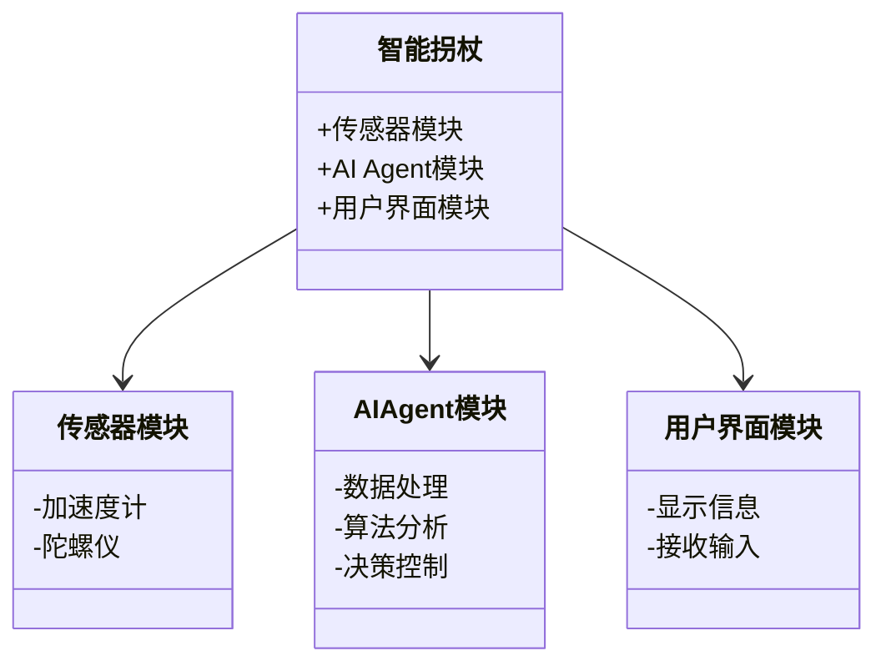
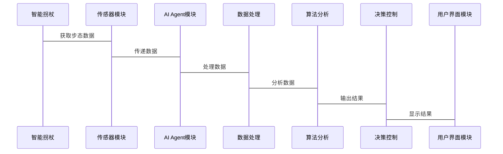

                 


# AI Agent在智能拐杖中的步态分析

> 关键词：AI Agent，步态分析，智能拐杖，算法原理，系统架构，项目实战

> 摘要：本文探讨了AI Agent在智能拐杖中的步态分析应用，详细介绍了步态分析的核心概念、算法原理、系统架构设计以及项目实战。通过理论与实践结合，展示了如何利用AI技术提升智能拐杖的功能，为用户提供更安全、更智能的行走辅助。

---

## 第1章: AI Agent与步态分析概述

### 1.1 AI Agent的基本概念

#### 1.1.1 AI Agent的定义
AI Agent（人工智能代理）是一种智能实体，能够感知环境并采取行动以实现目标。它可以是一个软件程序，也可以是一个物理设备，通过传感器和执行器与环境交互。

#### 1.1.2 AI Agent的核心特征
- **自主性**：能够在没有外部干预的情况下运行。
- **反应性**：能够实时感知环境并做出反应。
- **目标导向**：具有明确的目标，并采取行动以实现目标。
- **学习能力**：能够通过数据和经验不断优化自身性能。

#### 1.1.3 AI Agent的应用场景
- 智能家居：控制家庭设备，提供便利生活。
- 机器人技术：用于工业自动化和家庭服务。
- 医疗健康：辅助诊断、监测患者状态。
- 交通系统：自动驾驶和智能交通管理。

### 1.2 步态分析的基本概念

#### 1.2.1 步态分析的定义
步态分析是指对人类行走模式的测量和研究，包括步长、步频、步幅等参数，用于评估健康状况或运动表现。

#### 1.2.2 步态分析的主要指标
- **步长**：单脚迈出的距离。
- **步频**：单位时间内步数。
- **步幅**：双足之间的距离。
- **姿态**：行走时的身体姿势。

#### 1.2.3 步态分析的应用领域
- **医疗健康**：用于诊断步态异常，如关节炎、帕金森病。
- **运动科学**：分析运动员的步态，优化运动表现。
- **康复工程**：设计助行器，帮助行动不便的人。

### 1.3 AI Agent在智能拐杖中的应用背景

#### 1.3.1 智能拐杖的发展历程
传统拐杖 -> 带传感器的拐杖 -> 带AI功能的智能拐杖。

#### 1.3.2 AI Agent在智能拐杖中的作用
- **实时监测**：分析用户的步态数据，预测潜在危险。
- **辅助决策**：根据步态异常发出警报，提醒用户调整步态。

#### 1.3.3 步态分析在智能拐杖中的重要性
- **安全性**：及时发现行走问题，避免跌倒。
- **舒适性**：优化拐杖的使用体验。
- **个性化**：根据用户步态调整辅助参数。

---

## 第2章: 步态分析的核心概念与AI Agent的结合

### 2.1 步态分析的原理

#### 2.1.1 步态分析的主要步骤
1. 数据采集：通过传感器获取行走数据。
2. 数据处理：提取特征，如步长、步频。
3. 数据分析：利用算法识别步态模式。

#### 2.1.2 步态分析的关键技术
- **传感器技术**：如加速度计、陀螺仪。
- **数据融合**：结合多种传感器数据，提高准确性。
- **模式识别**：通过机器学习识别不同步态。

### 2.2 AI Agent在步态分析中的角色

#### 2.2.1 AI Agent如何处理步态数据
1. 数据接收：从传感器获取步态数据。
2. 数据分析：利用机器学习模型识别异常步态。
3. 信息反馈：将分析结果传递给用户或系统。

#### 2.2.2 AI Agent在步态分析中的优势
- **高准确性**：通过算法优化分析结果。
- **实时性**：快速处理数据，及时反馈。

### 2.3 步态分析与AI Agent的关系

#### 2.3.1 步态分析为AI Agent提供数据支持
- **数据来源**：传感器提供步态数据。
- **数据处理**：AI Agent对数据进行分析和处理。

#### 2.3.2 AI Agent优化步态分析的准确性
- **算法优化**：通过机器学习提升分析精度。
- **个性化调整**：根据用户习惯优化分析模型。

---

## 第3章: 步态分析的算法原理

### 3.1 步态分析的主要算法

#### 3.1.1 基于机器学习的步态分析

```mermaid
graph TD
    A[开始] -> B[数据预处理]
    B -> C[特征提取]
    C -> D[模型训练]
    D -> E[模型测试]
    E -> F[结果输出]
```

#### 3.1.2 算法实现步骤
1. 数据预处理：去除噪声，提取特征。
2. 特征提取：选择关键特征，如步长、步频。
3. 模型训练：使用机器学习算法训练模型。
4. 模型测试：验证模型的准确性。
5. 结果输出：输出分析结果。

#### 3.1.3 算法的数学模型

$$
y = w_1x_1 + w_2x_2 + \dots + w_nx_n + b
$$

其中：
- \( y \) 是输出结果。
- \( x_i \) 是输入特征。
- \( w_i \) 是权重。
- \( b \) 是截距。

---

## 第4章: 系统架构设计

### 4.1 系统功能设计

#### 4.1.1 系统架构



### 4.2 系统交互设计

#### 4.2.1 系统交互流程



---

## 第5章: 项目实战

### 5.1 环境安装

#### 5.1.1 安装Python和相关库
```bash
pip install numpy
pip install scikit-learn
pip install matplotlib
```

#### 5.1.2 安装传感器驱动
安装相应的传感器驱动程序，确保传感器能够正常工作。

### 5.2 核心代码实现

#### 5.2.1 数据采集代码
```python
import numpy as np

# 采集步态数据
def collect_data(samples=100):
    data = []
    for _ in range(samples):
        # 获取传感器数据
        acc = np.random.rand(3)
        gyro = np.random.rand(3)
        data.append({'acc': acc, 'gyro': gyro})
    return data
```

#### 5.2.2 数据处理代码
```python
from sklearn.decomposition import PCA

def process_data(data):
    # 提取特征
    features = []
    for d in data:
        acc = d['acc']
        gyro = d['gyro']
        features.append(np.concatenate((acc, gyro)))
    return np.array(features)
```

#### 5.2.3 步态分析代码
```python
from sklearn.svm import SVC

def analyze_gait(features, labels):
    # 训练模型
    model = SVC()
    model.fit(features, labels)
    return model
```

### 5.3 实际案例分析

#### 5.3.1 案例分析
假设我们有一个样本数据集，包含正常步态和异常步态。通过训练模型，我们可以准确识别异常步态。

#### 5.3.2 模型评估
- **准确率**：模型识别的准确率。
- **召回率**：模型识别的召回率。
- **F1分数**：综合准确率和召回率的指标。

### 5.4 项目小结
通过项目实战，我们掌握了AI Agent在步态分析中的具体实现方法，了解了系统设计的关键点。

---

## 第6章: 最佳实践

### 6.1 数据收集的注意事项
- **数据多样性**：收集不同用户的步态数据。
- **数据质量**：确保数据的准确性和完整性。

### 6.2 算法优化的技巧
- **特征选择**：选择关键特征，减少计算量。
- **模型调优**：优化模型参数，提高准确率。

### 6.3 未来的发展方向
- **多模态分析**：结合多种数据源进行分析。
- **实时性优化**：提升算法的实时处理能力。

---

## 第7章: 总结与展望

### 7.1 总结
本文详细探讨了AI Agent在智能拐杖中的步态分析应用，从理论到实践，全面分析了系统的实现方法。

### 7.2 展望
未来，随着AI技术的发展，智能拐杖的功能将更加智能化和个性化，为用户提供更好的使用体验。

---

## 作者

作者：AI天才研究院/AI Genius Institute & 禅与计算机程序设计艺术 /Zen And The Art of Computer Programming

---

通过以上目录和内容，您可以按照实际需求扩展每个部分的具体内容，确保文章的完整性和深度。

