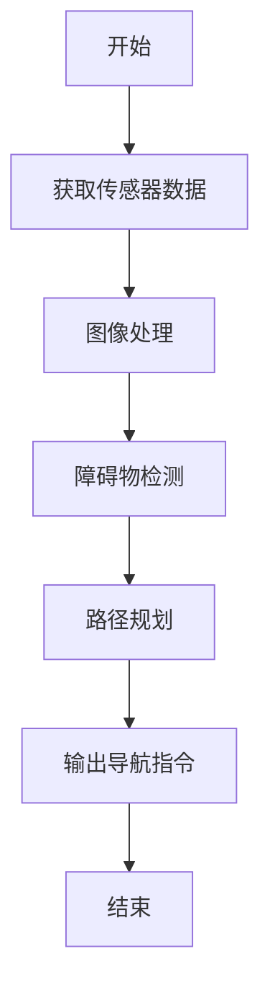
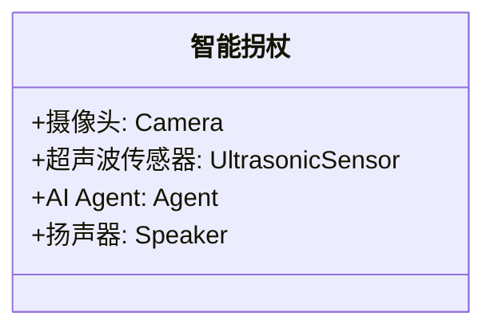
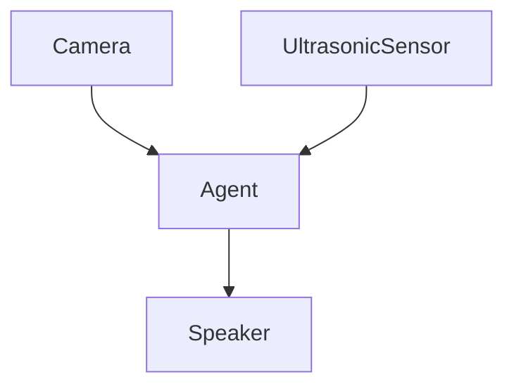
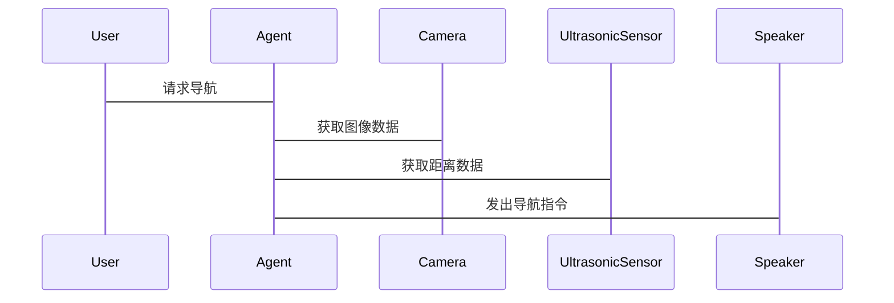

                 


# AI Agent在智能拐杖中的路况分析与导航

**关键词**：AI Agent, 智能拐杖, 路况分析, 导航算法, 传感器数据, 路径规划, 人机交互

**摘要**：本文探讨了AI Agent在智能拐杖中的应用，重点分析了路况分析与导航技术。通过传感器数据处理、算法设计和系统架构优化，提出了高效的导航解决方案，旨在提升老年人和残障人士的出行安全与便利。

---

# 第一部分: AI Agent与智能拐杖的背景介绍

## 第1章: AI Agent与智能拐杖概述

### 1.1 问题背景

#### 1.1.1 老年人与残障人士的出行需求
老年人和残障人士在日常出行中面临诸多挑战，包括视觉障碍、平衡问题以及复杂交通环境。传统拐杖仅提供基本支撑，无法应对复杂路况。

#### 1.1.2 现有拐杖的局限性
传统拐杖不具备环境感知能力，无法主动识别障碍物或规划路径，存在安全隐患。

#### 1.1.3 AI技术在智能设备中的应用潜力
AI技术的发展为智能设备提供了强大的感知和决策能力，使其能够执行复杂任务。

### 1.2 问题描述

#### 1.2.1 智能拐杖的核心功能需求
- 环境感知：实时检测障碍物和危险区域。
- 路径规划：自动计算最优导航路径。
- 人机交互：通过语音或触觉反馈与用户交流。

#### 1.2.2 用户使用场景分析
- 室内导航：家庭环境中的障碍物识别。
- 公共场所：人流密集区域的路径规划。
- 复杂路况：应对突然出现的障碍物或危险情况。

#### 1.2.3 系统设计的目标与边界
目标：帮助用户安全、高效地完成导航任务。边界：仅关注基于AI的导航功能，不涉及其他辅助功能（如健康监测）。

---

## 第2章: AI Agent与智能拐杖的核心概念

### 2.1 核心概念原理

#### 2.1.1 AI Agent的基本原理
AI Agent通过传感器获取环境信息，利用算法处理数据，生成决策并执行动作。在智能拐杖中，AI Agent负责分析路况并规划导航路径。

#### 2.1.2 智能拐杖的功能实现机制
智能拐杖通过摄像头、超声波传感器等设备采集环境数据，AI Agent处理这些数据，生成导航指令，驱动拐杖移动。

#### 2.1.3 路况分析与导航的实现方式
- 多传感器融合：结合摄像头、激光雷达和超声波传感器，提升环境感知准确性。
- 实时路径规划：根据环境数据动态调整导航路径，避开障碍物。

### 2.2 核心概念对比表

| 概念       | 描述                                                                 |
|------------|----------------------------------------------------------------------|
| AI Agent   | 具备感知和决策能力的智能体，用于处理复杂任务。                     |
| 智能拐杖   | 集成AI技术的辅助行走设备，具备环境感知和自主导航功能。             |
| 路况分析   | 通过传感器数据识别环境中的障碍物和危险区域。                     |
| 导航算法   | 用于计算最优路径的算法，如A*算法、Dijkstra算法等。              |

### 2.3 ER实体关系图

```mermaid
er
actor: 用户
agent: AI导航系统
r1: 用户使用拐杖
r2: 系统接收环境数据
r3: 系统发送导航指令
```

---

# 第二部分: AI Agent的算法原理

## 第3章: 路况分析算法

### 3.1 算法原理

#### 3.1.1 基于深度学习的图像识别
- 使用卷积神经网络（CNN）对摄像头捕获的图像进行目标检测，识别道路上的障碍物。
- 示例：检测到前方有行人或车辆时，触发预警机制。

#### 3.1.2 目标检测与障碍物识别
- 利用YOLO或Faster R-CNN等目标检测算法，精确定位障碍物位置。
- 示例：识别道路上的坑洼、台阶等障碍物。

#### 3.1.3 多传感器融合技术
- 结合摄像头、激光雷达和超声波传感器的数据，通过加权融合提升感知准确性。
- 示例：利用传感器数据交叉验证，减少误判。

### 3.2 算法流程图



### 3.3 数学模型

#### 概率模型
$$ P(\text{障碍物}) = \frac{\text{检测到的障碍物数量}}{\text{总样本数}} $$

#### 优化模型
$$ \text{最小化} \sum_{i=1}^{n} (d_i - d_{\text{目标}})^2 $$

---

## 第4章: 导航算法

### 4.1 导航算法原理

#### 4.1.1 A*算法
- 基于图搜索的路径规划算法，结合启发式函数寻找最短路径。
- 示例：在室内环境中找到最优路径。

#### 4.1.2 RRT算法
- 用于处理复杂环境中的实时路径规划，适合动态障碍物场景。
- 示例：在拥挤的人群中规划安全路径。

### 4.2 导航算法实现

#### 4.2.1 A*算法实现步骤
1. 初始化开放列表和关闭列表。
2. 选择距离起点最近的节点，扩展其邻居节点。
3. 计算每个节点的路径成本，更新优先队列。
4. 重复直到找到目标节点。

#### 4.2.2 RRT算法实现步骤
1. 初始化随机树，随机采样点。
2. 找到最近的树节点，连接到采样点。
3. 检查碰撞，若不碰撞则添加新边。
4. 重复直到找到目标点。

### 4.3 算法优化

#### 4.3.1 动态障碍物处理
- 使用概率栅格地图表示环境，实时更新障碍物位置。
- 示例：动态更新地图，避开移动障碍物。

#### 4.3.2 多目标优化
- 平衡路径长度和安全性，优先选择安全系数高的路径。
- 示例：在紧急情况下优先避开危险区域。

---

## 第5章: 系统架构设计

### 5.1 问题场景介绍
智能拐杖在复杂环境中导航，需要处理动态障碍物和突发情况。

### 5.2 项目介绍
本项目旨在开发一款具备AI导航功能的智能拐杖，帮助用户安全出行。

### 5.3 系统功能设计

#### 5.3.1 领域模型



#### 5.3.2 系统架构设计



### 5.4 系统接口设计
- 输入接口：传感器数据接收。
- 输出接口：导航指令输出。

### 5.5 系统交互



---

## 第6章: 项目实战

### 6.1 环境安装
- 安装Python、TensorFlow、ROS（Robot Operating System）等开发工具。

### 6.2 系统核心实现源代码

#### 6.2.1 传感器数据处理代码

```python
import numpy as np

def process_sensor_data(data):
    # 处理摄像头数据
    camera_data = data['camera']
    # 处理超声波数据
    ultrasonic_data = data['ultrasonic']
    # 返回融合后的数据
    return {'obstacles': detect_obstacles(camera_data, ultrasonic_data)}
```

#### 6.2.2 导航算法实现代码

```python
import heapq

def a_star(start, goal, grid):
    open_list = []
    heapq.heappush(open_list, (0, start))
    came_from = {}
    g_score = {start: 0}
    f_score = {start: heuristic(start, goal)}
    
    while open_list:
        current = heapq.heappop(open_list)
        if current[1] == goal:
            return reconstruct_path(came_from, start, goal)
        for neighbor in grid[current[1]]:
            tentative_g = g_score[current[1]] + cost(current[1], neighbor)
            if neighbor not in g_score or tentative_g < g_score[neighbor]:
                came_from[neighbor] = current[1]
                g_score[neighbor] = tentative_g
                f_score[neighbor] = tentative_g + heuristic(neighbor, goal)
                heapq.heappush(open_list, (f_score[neighbor], neighbor))
    return None

def heuristic(a, b):
    return abs(a[0] - b[0]) + abs(a[1] - b[1])
```

### 6.3 代码应用解读与分析
- 传感器数据处理：融合摄像头和超声波传感器数据，提高障碍物检测准确性。
- 导航算法实现：使用A*算法规划路径，确保路径最短且安全。

### 6.4 实际案例分析
在真实环境中测试智能拐杖的导航功能，验证算法的有效性和鲁棒性。

---

## 第7章: 总结与展望

### 7.1 总结
本文详细介绍了AI Agent在智能拐杖中的应用，重点分析了路况分析与导航算法，展示了系统的实现过程和实际效果。

### 7.2 注意事项
- 硬件选择：确保传感器精度和响应速度。
- 软件优化：提高算法效率，减少延迟。
- 人机交互：设计友好的反馈机制，确保用户操作便捷。

### 7.3 拓展阅读
- 探讨更复杂的导航算法，如强化学习在动态环境中的应用。
- 研究更先进的传感器技术，提升环境感知能力。

---

# 作者

作者：AI天才研究院/AI Genius Institute & 禅与计算机程序设计艺术 /Zen And The Art of Computer Programming

