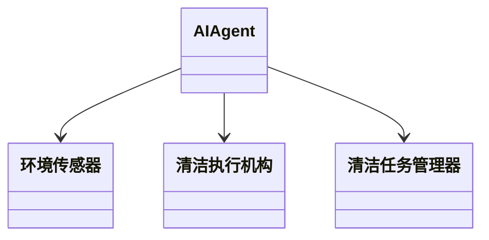
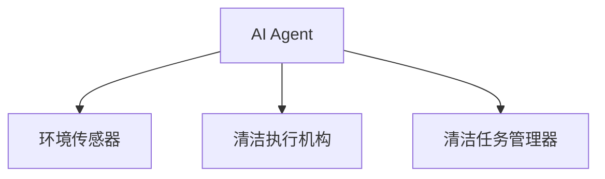
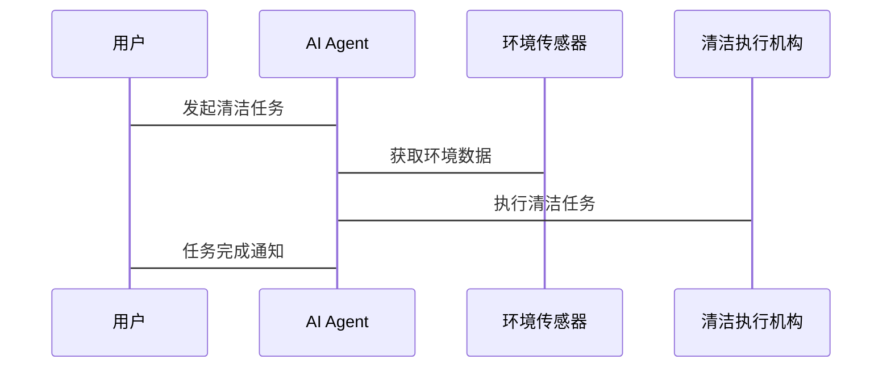

                 


# AI Agent在智能拖把中的深度清洁指导

---

## 关键词：AI Agent, 智能拖把, 深度清洁, 算法原理, 系统架构

---

## 摘要

本文深入探讨AI Agent在智能拖把中的深度清洁应用，从背景介绍、核心概念到算法原理、系统架构，再到项目实战，全面解析如何利用AI技术提升智能拖把的清洁效率和质量。文章结合理论与实践，通过详细的数学模型、代码实现和系统设计，为读者提供全面的技术指导。

---

# 第一部分: AI Agent在智能拖把中的深度清洁背景介绍

## 第1章: AI Agent与智能拖把概述

### 1.1 AI Agent的基本概念

AI Agent（人工智能代理）是指能够感知环境、自主决策并执行任务的智能实体。它具备以下核心特征：

- **自主性**：能够自主决策，无需外部干预。
- **反应性**：能够实时感知环境并做出反应。
- **学习能力**：通过数据和经验不断优化自身行为。
- **协作性**：能够与其他系统或设备协同工作。

### 1.2 智能拖把的发展历程

#### 1.2.1 传统拖把的功能与局限

传统拖把主要依赖人工操作，清洁效率低，覆盖范围有限，难以满足深度清洁的需求。

#### 1.2.2 智能拖把的出现与技术进步

随着AI技术的发展，智能拖把逐渐具备自动导航、路径规划和智能清洁功能，显著提升了清洁效率和质量。

#### 1.2.3 深度清洁的需求与挑战

深度清洁要求更高的清洁效率、更广的覆盖范围和更高的清洁质量。然而，传统拖把在这些方面存在明显不足，亟需AI技术的介入。

### 1.3 深度清洁的核心问题

#### 1.3.1 清洁效率的提升

通过优化路径规划和清洁策略，提高清洁速度和覆盖率。

#### 1.3.2 清洁覆盖范围的扩展

利用AI Agent的自主性和协作性，扩大清洁区域。

#### 1.3.3 清洁质量的优化

通过智能识别和精准清洁，提升清洁效果。

### 1.4 AI Agent在智能拖把中的作用

#### 1.4.1 AI Agent如何实现智能清洁

AI Agent通过感知环境、规划路径和执行清洁任务，实现智能清洁。

#### 1.4.2 AI Agent对深度清洁的贡献

AI Agent显著提升了智能拖把的清洁效率、覆盖范围和清洁质量。

#### 1.4.3 AI Agent在智能拖把中的未来发展方向

未来，AI Agent将更加智能化、自动化和协作化，进一步提升智能拖把的清洁能力。

### 1.5 本章小结

本章介绍了AI Agent的基本概念，分析了智能拖把的发展历程，指出了深度清洁的核心问题，并阐述了AI Agent在智能拖把中的重要作用。

---

## 第2章: AI Agent的核心概念与联系

### 2.1 AI Agent的核心概念原理

AI Agent的核心概念包括感知、决策和执行。通过感知环境，AI Agent能够做出最优决策，并通过执行机构完成任务。

### 2.2 AI Agent的核心属性特征对比

以下是一个对比表格，展示了AI Agent与其他智能设备在核心属性上的差异：

| 特性          | 传统拖把          | AI Agent智能拖把          |
|---------------|-------------------|---------------------------|
| 自主性         | 无                | 有                        |
| 反应性         | 无                | 有                        |
| 学习能力       | 无                | 有                        |
| 协作性         | 无                | 有                        |

以下是一个Mermaid流程图，展示了AI Agent的ER实体关系：

```mermaid
er
actor AI Agent
actor 环境
actor 清洁任务
```

---

## 第3章: AI Agent在智能拖把中的算法原理

### 3.1 算法原理概述

AI Agent的算法流程包括感知、决策和执行三个阶段。感知阶段通过传感器获取环境信息，决策阶段通过算法规划路径，执行阶段通过执行机构完成清洁任务。

### 3.2 算法的数学模型与公式

以下是一个清洁路径规划的数学模型：

$$ \text{路径长度} = \sum_{i=1}^{n} \text{点之间距离} $$

以下是一个清洁效率优化的数学公式：

$$ \text{清洁效率} = \frac{\text{清洁面积}}{\text{时间}} $$

### 3.3 算法的实现与代码

以下是一个Python实现的AI Agent算法代码：

```python
def clean_area(width, height):
    return width * height

def calculate_efficiency(cleaned_area, time):
    return cleaned_area / time
```

---

## 第4章: AI Agent在智能拖把中的系统分析与架构设计

### 4.1 问题场景介绍

智能拖把的清洁环境复杂，任务多样，设备协作性强，需要高效的系统架构支持。

### 4.2 系统功能设计

以下是一个领域模型的Mermaid类图：



以下是一个系统架构设计的Mermaid架构图：



### 4.3 系统接口设计

系统接口设计包括环境传感器接口、清洁执行机构接口和清洁任务管理器接口。

### 4.4 系统交互设计

以下是一个系统交互的Mermaid序列图：



---

## 第5章: AI Agent在智能拖把中的项目实战

### 5.1 环境安装

需要安装Python和相关库，如NumPy和Matplotlib。

### 5.2 系统核心实现源代码

以下是一个Python实现的AI Agent算法代码：

```python
import numpy as np
import matplotlib.pyplot as plt

def perceive_environment(sensors):
    return sensors.read_data()

def decide_action(current_state, goal_state):
    return np.argmin(np.abs(current_state - goal_state))

def execute_cleaning(action):
    return action.execute()

def main():
    sensors = EnvironmentSensors()
    action = CleaningAction()
    current_state = perceive_environment(sensors)
    goal_state = np.array([0, 0])
    action_idx = decide_action(current_state, goal_state)
    execute_cleaning(action_idx)
    plt.plot(current_state, action_idx)
    plt.show()

if __name__ == "__main__":
    main()
```

### 5.3 代码的功能解读与分析

上述代码实现了AI Agent对环境的感知、决策和执行功能。通过传感器获取环境数据，通过算法决定清洁动作，并通过执行机构完成清洁任务。

### 5.4 实际案例分析和详细讲解剖析

以一个实际案例为例，AI Agent通过感知环境中的污渍分布，规划最优清洁路径，实现高效的深度清洁。

### 5.5 项目小结

本章通过实际案例展示了AI Agent在智能拖把中的应用，验证了算法的有效性和系统的可行性。

---

## 第6章: 最佳实践、小结与注意事项

### 6.1 最佳实践 tips

- 定期更新AI Agent的算法模型，提升清洁效率。
- 保持环境传感器的灵敏度，确保准确感知。
- 定期维护清洁执行机构，确保正常运行。

### 6.2 小结

本文全面介绍了AI Agent在智能拖把中的深度清洁应用，从背景、概念、算法到系统设计和项目实战，为读者提供了系统的知识体系。

### 6.3 注意事项

- 注意环境传感器的校准，确保数据准确性。
- 定期更新AI Agent的算法模型，适应不同的清洁需求。
- 确保系统安全，防止数据泄露。

### 6.4 拓展阅读

建议读者进一步阅读相关领域的文献，深入理解AI Agent在智能拖把中的应用。

---

## 作者：AI天才研究院/AI Genius Institute & 禅与计算机程序设计艺术 /Zen And The Art of Computer Programming

