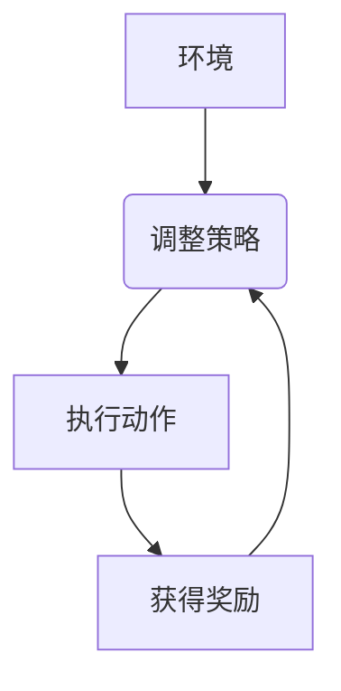
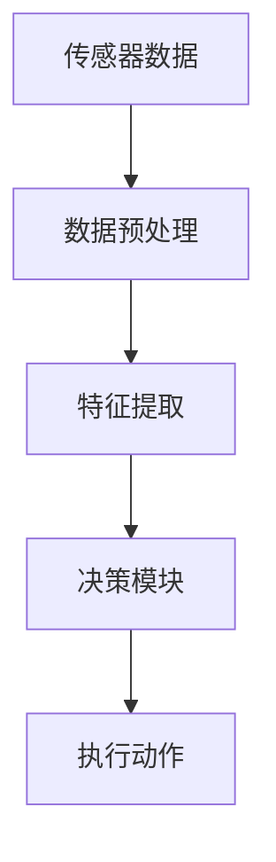
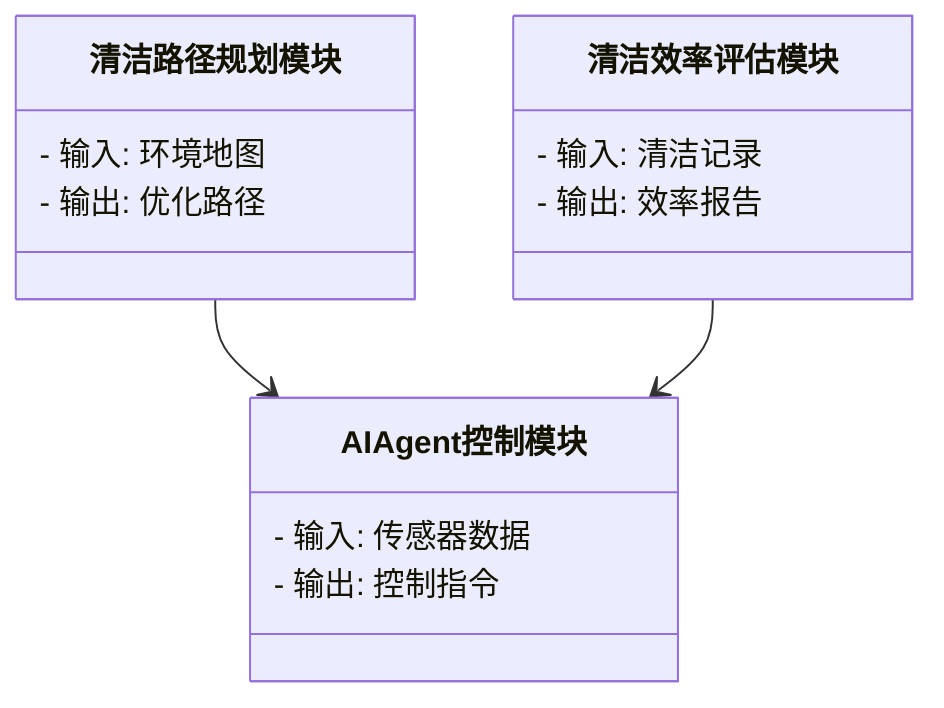
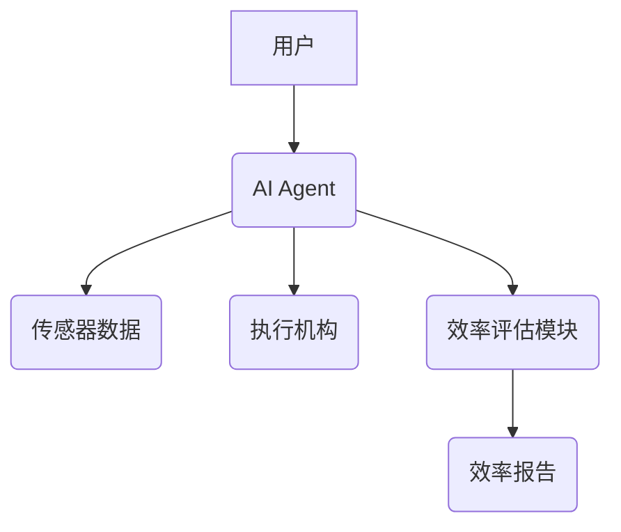
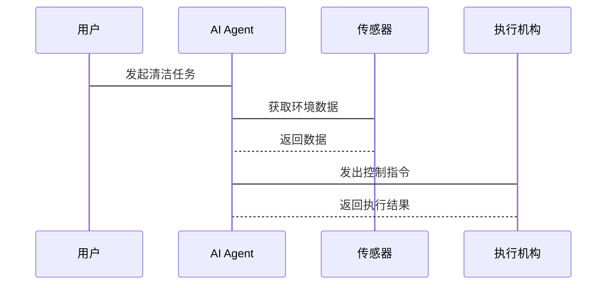
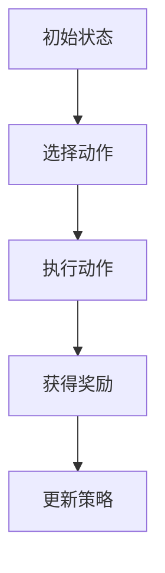

                 


# AI Agent在智能拖把中的清洁效率优化

> 关键词：AI Agent, 智能拖把, 清洁效率优化, 强化学习, 算法优化

> 摘要：本文探讨了AI Agent在智能拖把中的应用，重点分析了如何通过AI技术优化清洁效率。文章从AI Agent的基本概念出发，结合智能拖把的实际应用场景，详细介绍了AI Agent在清洁路径规划、传感器数据处理、动态环境适应等方面的核心原理和实现方法。通过对比传统算法与AI Agent的优劣，本文提出了基于强化学习的优化算法，并通过系统架构设计和项目实战验证了算法的有效性。最后，文章总结了AI Agent在智能拖把中的优势，并展望了未来的发展方向。

---

# 第一部分: AI Agent在智能拖把中的清洁效率优化背景与概念

## 第1章: AI Agent与智能拖把概述

### 1.1 AI Agent的基本概念
AI Agent（人工智能代理）是指能够感知环境、自主决策并执行任务的智能体。与传统算法相比，AI Agent具有以下特点：
- **自主性**：能够在没有人工干预的情况下独立完成任务。
- **反应性**：能够根据环境变化实时调整行为。
- **学习能力**：通过数据和经验不断优化自身算法。

### 1.2 智能拖把的清洁效率优化问题
智能拖把的清洁效率优化是指在有限时间内最大化清洁面积、减少重复清洁区域、延长电池寿命等问题。AI Agent在其中的作用主要体现在以下几个方面：
- **路径规划**：通过AI算法优化拖把的移动路径，减少无效移动。
- **传感器数据处理**：利用AI技术分析传感器数据，识别障碍物和需要重点清洁的区域。
- **动态环境适应**：在动态环境中实时调整清洁策略。

### 1.3 本章小结
本章通过介绍AI Agent的基本概念和智能拖把的清洁效率优化问题，为后续内容奠定了基础。

---

# 第二部分: AI Agent的核心原理与技术

## 第2章: AI Agent的核心原理

### 2.1 AI Agent的决策机制
AI Agent的决策机制是其核心之一。以下是比较传统的决策机制与基于强化学习的决策机制的对比：

| **传统决策机制** | **强化学习决策机制** |
|------------------|-----------------------|
| 基于预设规则，无法动态调整 | 基于实时反馈，动态优化策略 |
| 适用于简单场景 | 适用于复杂动态场景 |
| 需要人工干预优化 | 可自适应优化 |

### 2.2 AI Agent的学习与优化算法
强化学习是一种常用的学习算法，以下是其基本流程：



### 2.3 AI Agent的感知与交互
AI Agent需要通过传感器感知环境并进行交互。以下是传感器数据处理流程：



### 2.4 本章小结
本章详细介绍了AI Agent的核心原理，包括决策机制、学习算法和感知交互。

---

# 第三部分: 智能拖把清洁效率优化的系统设计

## 第3章: 智能拖把清洁效率优化的系统架构

### 3.1 系统功能模块划分
智能拖把的清洁效率优化系统可以划分为以下几个功能模块：



### 3.2 系统架构设计
系统的总体架构如下：



### 3.3 系统接口设计
以下是系统主要接口的交互流程：



### 3.4 本章小结
本章通过系统架构设计，展示了AI Agent在智能拖把中的具体实现方式。

---

# 第四部分: 项目实战与算法实现

## 第4章: 项目实战

### 4.1 环境安装
以下是Python环境的安装步骤：

```bash
pip install gym
pip install numpy
pip install matplotlib
```

### 4.2 系统核心实现源代码
以下是基于强化学习的路径规划算法实现：

```python
import gym
import numpy as np

class AI-Agent:
    def __init__(self, env):
        self.env = env
        self.observation_space = env.observation_space.shape[0]
        self.action_space = env.action_space.n
        self.Q = np.zeros((self.observation_space, self.action_space))

    def get_action(self, observation):
        if np.max(self.Q[observation]) == 0:
            return np.random.randint(0, self.action_space)
        else:
            return np.argmax(self.Q[observation])

    def update_Q(self, observation, action, reward, next_observation):
        alpha = 0.1
        gamma = 0.9
        self.Q[observation][action] += alpha * (reward + gamma * np.max(self.Q[next_observation])) - self.Q[observation][action]

# 创建环境
env = gym.make('CustomDragEnv-v0')
agent = AI-Agent(env)

# 训练过程
for episode in range(1000):
    observation = env.reset()
    total_reward = 0
    while True:
        action = agent.get_action(observation)
        next_observation, reward, done, _ = env.step(action)
        agent.update_Q(observation, action, reward, next_observation)
        total_reward += reward
        observation = next_observation
        if done:
            break
```

### 4.3 代码应用解读与分析
上述代码实现了一个基于Q-Learning的强化学习算法，用于优化智能拖把的路径规划。通过不断更新Q值表，AI Agent能够找到最优的清洁路径。

### 4.4 实际案例分析
以下是实际案例分析的流程：



### 4.5 项目小结
本章通过项目实战，展示了AI Agent在智能拖把中的具体实现过程。

---

# 第五部分: 总结与展望

## 第5章: 总结与展望

### 5.1 总结
本文详细探讨了AI Agent在智能拖把中的清洁效率优化问题，提出了基于强化学习的优化算法，并通过系统架构设计和项目实战验证了算法的有效性。

### 5.2 展望
未来的研究方向包括：
- 多智能体协作优化
- 自适应算法设计
- 更高效的传感器数据处理

---

# 作者信息

作者：AI天才研究院/AI Genius Institute & 禅与计算机程序设计艺术 /Zen And The Art of Computer Programming

