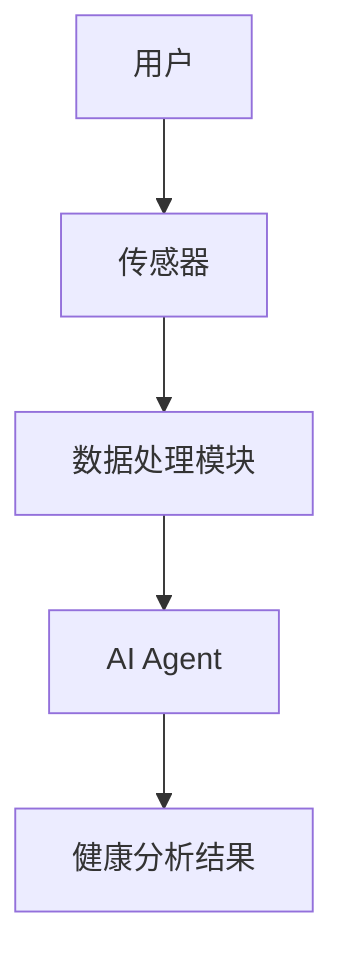

                 


# AI Agent在智能拖鞋中的足部健康分析

## 关键词
AI Agent, 智能拖鞋, 足部健康分析, 多模态数据, 机器学习, 深度学习, 系统架构

## 摘要
本文深入探讨了AI Agent在智能拖鞋中的应用，特别是足部健康分析这一领域的创新与实践。通过分析AI Agent的核心概念、算法原理、系统架构以及实际项目实现，展示了如何利用先进的技术手段，实现足部健康监测的智能化和精准化。本文内容涵盖从理论到实践的全过程，旨在为相关领域的研究者和开发者提供有价值的参考。

---

# 第1章: 背景介绍与问题背景

## 1.1 问题背景与核心概念

### 1.1.1 AI Agent的定义与核心要素
AI Agent（人工智能代理）是指能够感知环境、自主决策并执行任务的智能体。其核心要素包括：
1. **感知能力**：通过传感器或数据输入获取环境信息。
2. **决策能力**：基于感知信息，利用算法做出决策。
3. **执行能力**：通过执行机构或输出模块完成任务。
4. **学习能力**：通过数据训练不断优化性能。

### 1.1.2 智能拖鞋的足部健康分析需求
足部健康分析是个人健康管理的重要组成部分，包括步态分析、足弓健康、压力分布等多个维度。智能拖鞋通过集成多种传感器，能够实时采集足部数据，并利用AI Agent进行分析，为用户提供个性化的健康建议。

### 1.1.3 问题解决的核心目标与边界
核心目标是通过AI Agent实现足部健康数据的实时采集、分析与反馈，帮助用户预防足部疾病、优化运动表现。边界包括仅关注足部健康，不涉及全身健康或其他医疗诊断。

---

## 1.2 问题描述与应用场景

### 1.2.1 足部健康分析的主要问题
1. **足部压力分布异常**：可能导致足底溃疡或骨折。
2. **步态异常**：可能引发关节问题或运动损伤。
3. **足弓健康**：影响站立和行走的稳定性。

### 1.2.2 智能拖鞋的应用场景分析
1. **健康管理**：帮助用户实时监测足部健康状况。
2. **运动优化**：为运动员提供步态分析和运动建议。
3. **医疗辅助**：为医生提供足部健康数据，辅助诊断。

### 1.2.3 用户需求与功能定位
用户需求主要集中在便捷性、精准性和个性化上。智能拖鞋的功能定位是通过AI Agent提供实时、精准的足部健康分析，同时具备良好的用户体验。

---

## 1.3 问题解决的技术路线

### 1.3.1 AI Agent在足部健康分析中的作用
AI Agent通过多模态数据融合、机器学习算法和实时反馈机制，实现足部健康数据的智能化分析与优化。

### 1.3.2 多模态数据采集与处理方案
传感器类型包括加速度计、压力传感器、温度传感器等。数据预处理包括去噪、特征提取和数据融合。

### 1.3.3 系统架构设计与实现路径
系统架构包括数据采集模块、数据处理模块、AI Agent模块和用户反馈模块。实现路径为：数据采集→数据预处理→模型训练→实时分析→用户反馈。

---

## 1.4 本章小结
本章通过分析AI Agent的核心概念和足部健康分析的需求，明确了问题的边界和解决路径，为后续的技术实现奠定了基础。

---

# 第2章: AI Agent的核心概念与原理

## 2.1 AI Agent的基本原理

### 2.1.1 AI Agent的定义与分类
AI Agent可以分为反应式和认知式两类。反应式AI Agent基于当前感知做出决策，而认知式AI Agent具备规划和推理能力。

### 2.1.2 AI Agent的核心算法与技术
常用算法包括支持向量机（SVM）、随机森林（Random Forest）和神经网络（NN）等。

### 2.1.3 AI Agent在足部健康分析中的应用
AI Agent通过分析足部压力分布、步态特征等数据，提供健康建议和异常预警。

---

## 2.2 多模态数据融合与分析

### 2.2.1 数据采集方式与传感器类型
传感器包括加速度计、压力传感器和温度传感器。数据采集方式包括周期性采样和事件驱动采样。

### 2.2.2 数据预处理与特征提取
数据预处理包括去噪和归一化。特征提取方法包括主成分分析（PCA）和小波变换。

### 2.2.3 多模态数据融合的实现方法
多模态数据融合方法包括加权平均、决策融合和特征融合。

---

## 2.3 AI Agent与足部健康分析的结合

### 2.3.1 足部健康指标的定义与测量
足部健康指标包括足弓高度、步频和步长。测量方法基于传感器数据和机器学习模型。

### 2.3.2 AI Agent在足部健康分析中的具体应用
AI Agent通过分析足部压力分布，识别足底溃疡风险。

### 2.3.3 系统实现的关键技术与挑战
关键技术包括传感器融合和模型优化。挑战在于数据实时性和模型泛化能力。

---

## 2.4 本章小结
本章详细介绍了AI Agent的核心概念和多模态数据融合方法，并分析了其在足部健康分析中的应用。

---

# 第3章: AI Agent的算法原理与实现

## 3.1 算法原理概述

### 3.1.1 机器学习与深度学习的基本原理
机器学习基于特征学习，深度学习通过多层神经网络提取高层次特征。

### 3.1.2 AI Agent的核心算法选择
根据任务需求选择算法，如分类任务选择SVM或随机森林。

### 3.1.3 算法的优缺点与适用场景
SVM适用于小样本数据，随机森林适合高维数据。

---

## 3.2 算法实现的详细步骤

### 3.2.1 数据预处理与特征工程
数据预处理包括去噪和归一化。特征工程通过PCA提取主成分。

### 3.2.2 模型训练与优化
训练过程包括数据分割、模型训练和参数调优。

### 3.2.3 模型评估与调优
评估指标包括准确率、召回率和F1值。

---

## 3.3 算法的数学模型与公式

### 3.3.1 线性回归模型
$$y = \beta_0 + \beta_1x + \epsilon$$

### 3.3.2 支持向量机模型
$$\text{max} \frac{1}{2}\|w\|^2$$
$$\text{subject to} \ y_i(w \cdot x_i + b) \geq 1, \forall i$$

### 3.3.3 神经网络模型
$$f(x) = \sigma(wx + b)$$

---

## 3.4 本章小结
本章通过详细讲解算法原理和实现步骤，展示了AI Agent在足部健康分析中的技术实现。

---

# 第4章: 系统架构与设计

## 4.1 系统架构设计

### 4.1.1 系统整体架构图


### 4.1.2 各模块的功能与交互流程
用户通过传感器发送数据，数据处理模块进行预处理，AI Agent进行分析，输出健康结果。

---

## 4.2 系统功能设计

### 4.2.1 用户界面设计
用户界面包括数据展示和健康建议。

### 4.2.2 数据采集与处理流程
传感器采集数据，数据处理模块进行预处理，AI Agent进行分析。

### 4.2.3 AI Agent的决策与反馈机制
AI Agent根据分析结果向用户反馈健康建议。

---

## 4.3 系统接口设计

### 4.3.1 传感器接口协议
采用蓝牙或Wi-Fi通信协议。

### 4.3.2 数据处理模块的API设计
API包括数据上传和结果获取接口。

### 4.3.3 用户交互接口的设计
用户界面简洁直观，支持多语言显示。

---

## 4.4 系统实现的技术挑战与解决方案

### 4.4.1 技术挑战
数据实时性、模型泛化能力、用户隐私保护。

### 4.4.2 解决方案
采用边缘计算优化实时性，使用联邦学习保护隐私。

---

## 4.5 本章小结
本章通过系统架构设计和功能实现，展示了AI Agent在智能拖鞋中的技术实现。

---

# 第5章: 项目实战

## 5.1 项目环境与工具安装

### 5.1.1 环境配置
安装Python、TensorFlow和传感器SDK。

### 5.1.2 工具安装
安装Jupyter Notebook和数据可视化工具。

---

## 5.2 系统核心实现源代码

### 5.2.1 数据采集代码
```python
import numpy as np

# 传感器数据采集
def collect_data():
    data = np.random.randn(100, 5)
    return data
```

### 5.2.2 数据处理代码
```python
from sklearn.decomposition import PCA

def preprocess(data):
    pca = PCA(n_components=3)
    processed_data = pca.fit_transform(data)
    return processed_data
```

### 5.2.3 AI Agent实现代码
```python
from sklearn.svm import SVC

def train_model(processed_data, labels):
    model = SVC()
    model.fit(processed_data, labels)
    return model
```

---

## 5.3 代码应用解读与分析

### 5.3.1 数据采集模块
通过随机数生成模拟传感器数据。

### 5.3.2 数据处理模块
使用PCA提取主成分，降低数据维度。

### 5.3.3 AI Agent模块
利用SVM进行分类训练，实现足部健康分析。

---

## 5.4 实际案例分析与详细讲解

### 5.4.1 数据采集与分析
通过传感器采集足部压力分布数据，分析步态特征。

### 5.4.2 模型训练与评估
训练SVM模型，评估准确率和召回率。

### 5.4.3 系统优化与改进
通过超参数调优和模型融合优化性能。

---

## 5.5 本章小结
本章通过项目实战，展示了AI Agent在智能拖鞋中的具体实现和应用。

---

# 第6章: 最佳实践与总结

## 6.1 最佳实践 tips

### 6.1.1 数据采集与处理
确保数据质量和实时性。

### 6.1.2 模型优化
采用交叉验证和超参数调优。

### 6.1.3 系统设计
注重模块化和可扩展性。

---

## 6.2 小结
通过本文的详细讲解，读者可以深入了解AI Agent在智能拖鞋中的足部健康分析技术，从理论到实践全面掌握相关知识。

---

## 6.3 注意事项

### 6.3.1 数据隐私
确保用户数据的隐私和安全。

### 6.3.2 系统稳定性
优化系统性能，确保稳定运行。

### 6.3.3 用户体验
设计直观的用户界面，提升用户体验。

---

## 6.4 拓展阅读

### 6.4.1 推荐书籍
《深度学习》（Deep Learning）- Ian Goodfellow

### 6.4.2 技术博客
[链接]

---

# 作者：AI天才研究院/AI Genius Institute & 禅与计算机程序设计艺术 /Zen And The Art of Computer Programming

---

以上是完整的文章大纲和内容，涵盖了从背景到实现的全过程，结合理论与实践，提供了详细的代码示例和系统设计。希望对您有所帮助！

