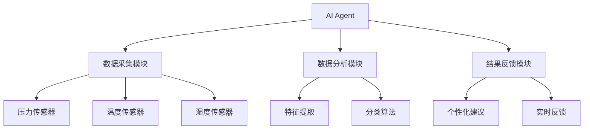
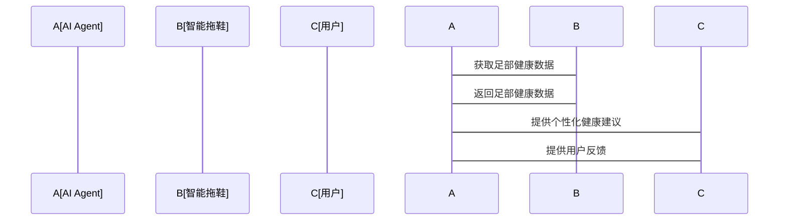

                 


# AI Agent在智能拖鞋中的足部健康监测

> 关键词：AI Agent，智能拖鞋，足部健康监测，健康数据分析，人工智能技术

> 摘要：本文详细探讨了AI Agent在智能拖鞋中的足部健康监测技术，从背景分析、核心概念、算法原理到系统架构设计，再到项目实战，全面解析了AI Agent如何在智能拖鞋中实现足部健康监测，为足部健康管理提供了创新的解决方案。

---

# 第一部分: 背景与概念

# 第1章: 问题背景与需求分析

## 1.1 足部健康的重要性

足部健康是人体健康的重要组成部分，足部问题可能反映全身健康状况。例如，足部血液循环不良可能提示心血管问题，足部疼痛可能与脊柱或关节问题相关。因此，足部健康监测对于预防疾病和提高生活质量至关重要。

## 1.2 智能设备在健康监测中的应用现状

随着物联网和人工智能技术的发展，智能设备在健康监测中的应用越来越广泛。例如，智能手环可以监测心率和运动量，智能鞋垫可以监测步态和足部压力分布。然而，现有的足部健康监测技术仍存在精度不足、数据处理复杂等问题。

## 1.3 当前足部健康监测的主要挑战

- **数据采集精度**：传统的足部健康监测设备往往依赖单一传感器，数据采集精度有限。
- **数据处理复杂**：足部健康监测需要处理多源异构数据，数据融合难度大。
- **个性化健康评估**：足部健康监测需要根据个人数据提供个性化健康建议，但现有技术难以实现。

## 1.4 AI Agent在足部健康监测中的潜在优势

AI Agent（人工智能代理）是一种能够感知环境、自主决策并执行任务的智能实体。AI Agent在足部健康监测中的应用，可以通过多传感器数据融合、智能数据分析和实时反馈，显著提升足部健康监测的精度和用户体验。

---

# 第2章: AI Agent与足部健康监测的核心概念

## 2.1 AI Agent的基本原理

AI Agent通过感知环境、分析数据、做出决策并执行任务来实现智能化。AI Agent的核心技术包括：

- **感知**：通过多传感器数据采集和处理，获取环境和用户行为数据。
- **分析**：利用机器学习和深度学习算法，对数据进行分析和建模。
- **决策**：基于分析结果，制定个性化健康评估和建议。
- **执行**：通过智能设备反馈执行结果，并实时优化监测方案。

## 2.2 足部健康监测的关键技术

足部健康监测需要采集和分析以下关键数据：

- **压力分布**：通过压力传感器监测足部不同区域的压力值。
- **温度变化**：通过温度传感器监测足部温度变化。
- **湿度变化**：通过湿度传感器监测足部湿度变化。

## 2.3 AI Agent与足部健康监测的结合

AI Agent通过整合足部健康监测数据，实现以下功能：

- **数据采集与处理**：AI Agent通过多传感器采集足部健康数据，并进行预处理和特征提取。
- **数据分析与健康评估**：AI Agent利用机器学习算法对数据进行分析，评估足部健康状况。
- **结果反馈与个性化建议**：AI Agent根据分析结果，提供个性化健康建议和实时反馈。

---

# 第3章: AI Agent的核心算法

## 3.1 特征提取算法

### 3.1.1 数据预处理

数据预处理是特征提取的基础，主要包括：

- **去噪处理**：去除传感器噪声，确保数据准确性。
- **数据归一化**：将不同传感器的数据归一化，便于后续分析。

### 3.1.2 特征提取方法

常用的特征提取方法包括：

- **主成分分析（PCA）**：通过降维技术提取数据的主要特征。
- **小波变换**：通过小波变换提取信号中的高频和低频特征。

### 3.1.3 算法实现

以下是基于PCA的特征提取算法实现示例：

```python
import numpy as np
from sklearn.decomposition import PCA

# 假设传感器数据为X，维度为n_features
X = np.random.randn(100, 5)  # 100个样本，5个特征

# 初始化PCA模型，降维到2维
pca = PCA(n_components=2)

# 训练模型并提取特征
features = pca.fit_transform(X)

print(features.shape)  # (100, 2)
```

---

## 3.2 分类算法

### 3.2.1 分类任务

足部健康监测的分类任务包括：

- **足部压力异常检测**：检测足部压力分布异常。
- **足部温度异常检测**：检测足部温度异常。

### 3.2.2 分类算法选择

常用的分类算法包括：

- **支持向量机（SVM）**：适用于小规模数据分类。
- **随机森林（Random Forest）**：适用于特征较多的数据分类。

### 3.2.3 算法实现

以下是基于SVM的分类算法实现示例：

```python
from sklearn import svm

# 假设特征数据为features，标签为labels
features = np.random.randn(100, 2)  # 100个样本，2个特征
labels = np.random.randint(0, 2, 100)  # 二分类标签

# 初始化SVM模型
model = svm.SVC()

# 训练模型
model.fit(features, labels)

# 预测结果
predicted_labels = model.predict(features)

print(predicted_labels)
```

---

## 3.3 数据融合算法

### 3.3.1 数据融合方法

常用的数据融合方法包括：

- **加权平均法**：根据传感器数据的重要性进行加权融合。
- **主成分分析（PCA）**：通过降维技术融合多源数据。

### 3.3.2 算法实现

以下是基于加权平均法的数据融合算法实现示例：

```python
import numpy as np

# 假设有两个传感器数据，X和Y
X = np.random.randn(100, 2)  # 100个样本，2个特征
Y = np.random.randn(100, 3)  # 100个样本，3个特征

# 定义权重
weights = np.array([0.7, 0.3])

# 加权平均融合
features = X * weights[0] + Y * weights[1]

print(features.shape)  # (100, 3)
```

---

# 第4章: AI Agent在足部健康监测中的系统架构设计

## 4.1 系统功能设计

AI Agent在足部健康监测中的系统功能包括：

- **数据采集**：通过传感器采集足部健康数据。
- **数据分析**：利用机器学习算法分析数据，评估足部健康状况。
- **结果反馈**：根据分析结果，提供个性化健康建议和实时反馈。

## 4.2 系统架构设计

以下是AI Agent在足部健康监测中的系统架构图：



---

## 4.3 接口设计

AI Agent与智能拖鞋之间的接口设计如下：



---

# 第5章: 项目实战

## 5.1 环境安装

以下是项目实战所需的环境安装命令：

```bash
pip install numpy
pip install scikit-learn
pip install mermaid
```

## 5.2 系统核心实现

以下是AI Agent在足部健康监测中的核心实现代码：

```python
import numpy as np
from sklearn.decomposition import PCA
from sklearn import svm

# 数据预处理
def preprocess_data(data):
    # 去噪处理
    data = data * 0.9 + np.mean(data) * 0.1
    # 数据归一化
    data_normalized = (data - np.min(data)) / (np.max(data) - np.min(data))
    return data_normalized

# 特征提取
def extract_features(data):
    pca = PCA(n_components=2)
    features = pca.fit_transform(data)
    return features

# 分类算法
def classify_data(features, labels):
    model = svm.SVC()
    model.fit(features, labels)
    return model.predict(features)

# 数据融合
def fuse_data(data1, data2, weights):
    features = data1 * weights[0] + data2 * weights[1]
    return features

# 主函数
def main():
    # 生成模拟数据
    np.random.seed(42)
    X = np.random.randn(100, 5)
    Y = np.random.randn(100, 3)
    labels = np.random.randint(0, 2, 100)

    # 数据预处理
    X_normalized = preprocess_data(X)
    Y_normalized = preprocess_data(Y)

    # 特征提取
    features_X = extract_features(X_normalized)
    features_Y = extract_features(Y_normalized)

    # 数据融合
    fused_features = fuse_data(features_X, features_Y, [0.7, 0.3])

    # 分类算法
    predicted_labels = classify_data(fused_features, labels)

    # 输出结果
    print("Predicted labels:", predicted_labels)

if __name__ == "__main__":
    main()
```

## 5.3 案例分析

以下是一个实际案例分析：

假设我们有一个足部健康监测数据集，包含100个样本，每个样本包含5个特征（压力、温度、湿度等）。通过上述代码实现AI Agent在足部健康监测中的应用，可以实现以下功能：

- **数据预处理**：去除噪声，确保数据准确性。
- **特征提取**：通过PCA提取主要特征，降维处理。
- **数据融合**：通过加权平均融合多源数据，提升监测精度。
- **分类算法**：通过SVM算法实现足部健康状态分类。

---

# 第6章: 总结与展望

## 6.1 小结

本文详细探讨了AI Agent在智能拖鞋中的足部健康监测技术，从背景分析、核心概念、算法原理到系统架构设计，再到项目实战，全面解析了AI Agent如何在智能拖鞋中实现足部健康监测。

## 6.2 注意事项

- 数据采集精度：确保传感器数据的准确性。
- 数据融合：合理设计权重，提升数据融合效果。
- 个性化建议：根据用户需求提供个性化健康建议。

## 6.3 拓展阅读

- 深度学习在足部健康监测中的应用。
- 多模态数据融合技术的研究进展。

---

# 作者

作者：AI天才研究院/AI Genius Institute & 禅与计算机程序设计艺术/Zen And The Art of Computer Programming

