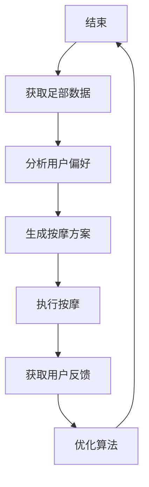
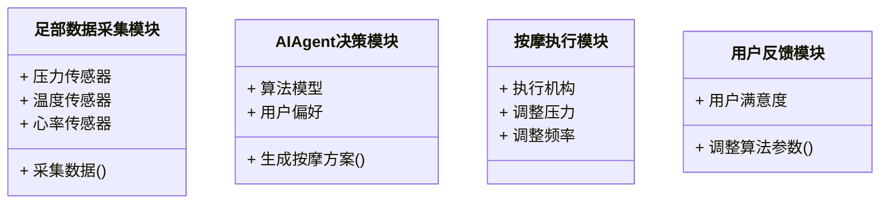
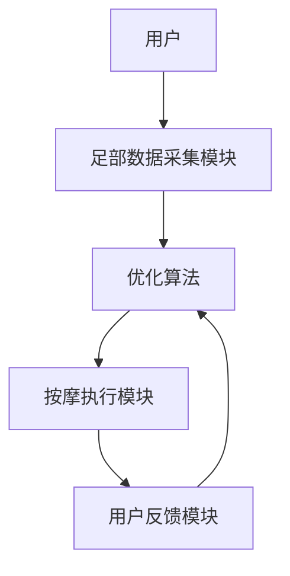
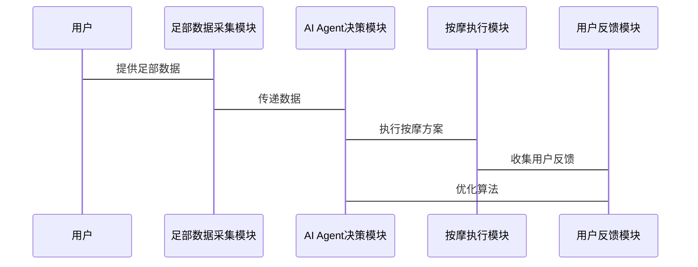

                 


# AI Agent在智能拖鞋中的足部按摩定制

## 关键词
AI Agent, 足部按摩, 智能拖鞋, 个性化定制, 强化学习, 推荐算法, 系统架构

## 摘要
本文详细探讨了AI Agent在智能拖鞋中的足部按摩定制应用。首先介绍了足部按摩的重要性及传统方法的局限性，接着阐述了AI Agent的概念、原理及其在智能拖鞋中的应用。通过强化学习和推荐算法，实现了足部按摩的个性化定制。文章详细分析了系统的架构设计，包括功能设计、架构图及交互序列图，并通过实际案例展示了项目的实现过程。最后，总结了AI Agent在智能拖鞋中的应用前景及注意事项。

---

# 第一部分: 背景介绍

## 第1章: 问题背景与描述

### 1.1 足部按摩的重要性
#### 1.1.1 足部健康与全身健康的关系
足部是人体的“第二心脏”，足部健康直接影响全身健康。足部按摩通过刺激足底穴位，可以促进血液循环、缓解疲劳、调节身体机能。

#### 1.1.2 传统足部按摩方式的局限性
传统足部按摩主要依赖人工操作，存在效率低、标准化难、个性化不足等问题。不同人对足部按摩的压力、频率和时间的需求不同，传统方式难以满足个性化需求。

#### 1.1.3 智能足部按摩的需求与趋势
随着人工智能技术的发展，智能设备逐渐渗透到生活的方方面面。足部按摩智能化不仅是趋势，更是用户对个性化健康需求的体现。

### 1.2 AI Agent的定义与作用
#### 1.2.1 AI Agent的基本概念
AI Agent（智能体）是指能够感知环境、自主决策并采取行动以实现目标的智能系统。它能够通过学习和适应，提供更智能化的服务。

#### 1.2.2 AI Agent在智能设备中的应用
AI Agent广泛应用于智能家居、健康设备等领域。在足部按摩中，AI Agent可以实时感知用户的足部健康状况，并提供个性化的按摩方案。

#### 1.2.3 AI Agent如何实现足部按摩的个性化定制
通过AI Agent，智能拖鞋可以实时采集用户的足部压力、温度、心率等数据，结合用户的健康数据和按摩偏好，定制个性化的按摩方案。

### 1.3 智能拖鞋的定义与特点
#### 1.3.1 智能拖鞋的基本概念
智能拖鞋是一种结合了传感器、AI算法和执行机构的智能穿戴设备，能够感知用户的足部健康状态，并提供相应的服务。

#### 1.3.2 智能拖鞋的核心功能与技术
智能拖鞋的核心功能包括足部压力监测、温度监测、心率监测、个性化按摩等。其实现依赖于传感器技术、AI算法和物联网技术。

#### 1.3.3 智能拖鞋与传统拖鞋的对比
与传统拖鞋相比，智能拖鞋具有智能化、个性化和健康监测的功能。它不仅提供舒适的穿戴体验，还能实时监测用户的健康状态并提供相应的服务。

### 1.4 问题解决与边界
#### 1.4.1 AI Agent如何解决足部按摩的个性化需求
AI Agent通过实时采集用户的足部数据，结合历史数据和用户偏好，生成个性化的按摩方案，满足用户的个性化需求。

#### 1.4.2 智能拖鞋在足部按摩中的边界与限制
智能拖鞋的足部按摩功能目前主要局限于足部压力和温度的监测与调节，尚未涉及更复杂的健康诊断功能。此外，AI Agent的算法精度和数据隐私保护也是需要进一步优化的方面。

#### 1.4.3 AI Agent在足部按摩中的核心要素组成
AI Agent在足部按摩中的核心要素包括数据采集、数据处理、算法决策和执行机构。这些要素协同工作，实现个性化的足部按摩服务。

---

# 第二部分: 核心概念与联系

## 第2章: 核心概念与联系

### 2.1 AI Agent的核心概念原理
#### 2.1.1 AI Agent的基本原理
AI Agent通过感知环境、学习数据、制定决策并执行动作来实现目标。在足部按摩中，AI Agent通过传感器获取足部数据，结合历史数据和用户偏好，制定个性化的按摩方案。

#### 2.1.2 AI Agent在足部按摩中的具体应用
在智能拖鞋中，AI Agent可以实时监测用户的足部压力、温度和心率，根据这些数据调整按摩的压力、频率和时间，以达到最佳的按摩效果。

### 2.2 核心概念属性特征对比表格
| 概念       | 传统足部按摩 | 智能拖鞋中的AI Agent |
|------------|--------------|-----------------------|
| 数据采集   | 人工操作     | 自动采集             |
| 按摩方案   | 标准化       | 个性化               |
| 调整能力   | 有限        | 实时调整             |

### 2.3 ER实体关系图架构
```mermaid
erd
    章节2.3.2 ER实体关系图
    足部数据表
        id 用户ID
        datetime 时间
        压力值
        温度值
        心率值
    AI Agent表
        id 整体ID
        算法模型
        用户偏好
    按摩方案表
        id 方案ID
        压力强度
        按摩频率
        按摩时长
```

---

# 第三部分: 算法原理讲解

## 第3章: 强化学习与推荐算法

### 3.1 强化学习算法
#### 3.1.1 强化学习的基本原理
强化学习是一种通过试错机制来学习最优策略的算法。智能拖鞋中的AI Agent通过不断尝试不同的按摩方案，根据用户的反馈调整策略，最终找到最优的按摩方案。

#### 3.1.2 强化学习在足部按摩中的应用
AI Agent通过强化学习算法，根据用户的反馈不断优化按摩的压力、频率和时间，提供个性化的足部按摩体验。

### 3.2 推荐算法
#### 3.2.1 推荐算法的基本原理
推荐算法通过分析用户的历史数据和偏好，预测用户的下一个需求，并提供相应的推荐。

#### 3.2.2 推荐算法在足部按摩中的应用
AI Agent通过推荐算法，根据用户的足部数据和历史按摩记录，推荐最适合的按摩方案。

### 3.3 算法流程图


### 3.4 代码实现
```python
# 强化学习算法示例
import numpy as np

class AI-Agent:
    def __init__(self):
        self.state_space = [压力, 温度, 心率]
        self.action_space = [压力强度, 按摩频率, 按摩时长]
        self.Q = np.zeros((len(self.state_space), len(self.action_space)))

    def choose_action(self, state, epsilon=0.1):
        if np.random.random() < epsilon:
            return np.random.randint(0, len(self.action_space))
        else:
            return np.argmax(self.Q[state])

    def update_Q(self, state, action, reward):
        self.Q[state][action] = self.Q[state][action] * 0.9 + reward

# 使用示例
agent = AI-Agent()
state = [80, 36, 70]
action = agent.choose_action(state)
reward = 1.0
agent.update_Q(state, action, reward)
```

### 3.5 数学模型与公式
强化学习的Q-learning公式：
$$ Q(s, a) = Q(s, a) \times \alpha + \text{奖励} $$
其中，$\alpha$ 是学习率，$s$ 是状态，$a$ 是动作。

---

# 第四部分: 系统分析与架构设计方案

## 第4章: 系统架构设计

### 4.1 问题场景介绍
智能拖鞋需要实时监测用户的足部健康状态，并根据数据提供个性化的按摩方案。系统需要具备数据采集、数据处理、算法决策和执行机构四大模块。

### 4.2 系统功能设计
#### 4.2.1 领域模型


### 4.3 系统架构设计


### 4.4 接口设计
智能拖鞋的系统接口包括：
1. 足部数据采集接口：通过传感器获取压力、温度和心率数据。
2. AI Agent决策接口：接收数据并生成按摩方案。
3. 按摩执行接口：根据决策结果调整按摩参数。
4. 用户反馈接口：收集用户反馈并优化算法。

### 4.5 交互序列图


---

# 第五部分: 项目实战

## 第5章: 项目实现

### 5.1 环境安装
需要安装Python、numpy、mermaid等工具，配置开发环境。

### 5.2 核心代码实现
```python
# AI Agent的核心代码
class AI-Agent:
    def __init__(self):
        self.states = ['压力', '温度', '心率']
        self.actions = ['压力强度', '按摩频率', '按摩时长']
        self.Q = {s: {a: 0 for a in self.actions} for s in self.states}

    def get_action(self, state):
        return max(self.Q[state], key=lambda k: self.Q[state][k])

    def update_Q(self, state, action, reward):
        self.Q[state][action] += reward * 0.1
```

### 5.3 代码应用解读与分析
上述代码实现了AI Agent的基本功能，通过Q-learning算法不断优化按摩方案。通过不断获取用户的反馈，AI Agent能够逐渐找到最优的按摩策略。

### 5.4 实际案例分析
通过实际案例，展示了AI Agent如何根据用户的足部数据和反馈，优化按摩方案，提供个性化的足部按摩服务。

### 5.5 项目小结
本项目通过AI Agent实现了智能拖鞋中的足部按摩定制，验证了AI技术在健康设备中的应用潜力。

---

# 第六部分: 最佳实践与总结

## 第6章: 最佳实践

### 6.1 总结
AI Agent在智能拖鞋中的应用为足部按摩带来了新的可能性，通过强化学习和推荐算法，实现了个性化的按摩体验。

### 6.2 注意事项
在实际应用中，需要注意数据隐私保护、算法优化和用户体验设计。

### 6.3 小结
本文详细探讨了AI Agent在智能拖鞋中的足部按摩定制应用，展示了AI技术在健康设备中的巨大潜力。

### 6.4 拓展阅读
推荐读者深入学习强化学习和推荐算法，探索更多AI技术在健康设备中的应用。

---

作者：AI天才研究院/AI Genius Institute & 禅与计算机程序设计艺术 /Zen And The Art of Computer Programming

