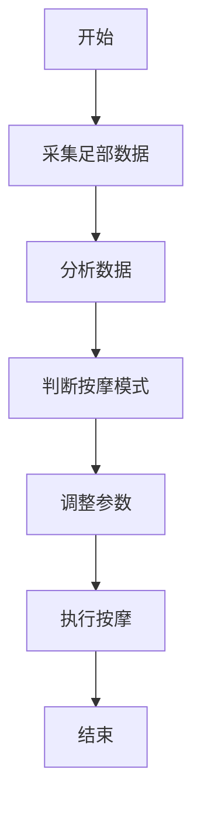
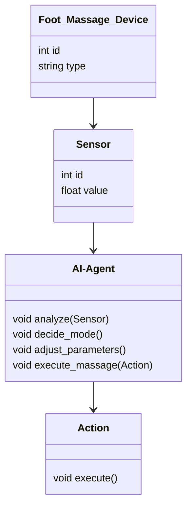
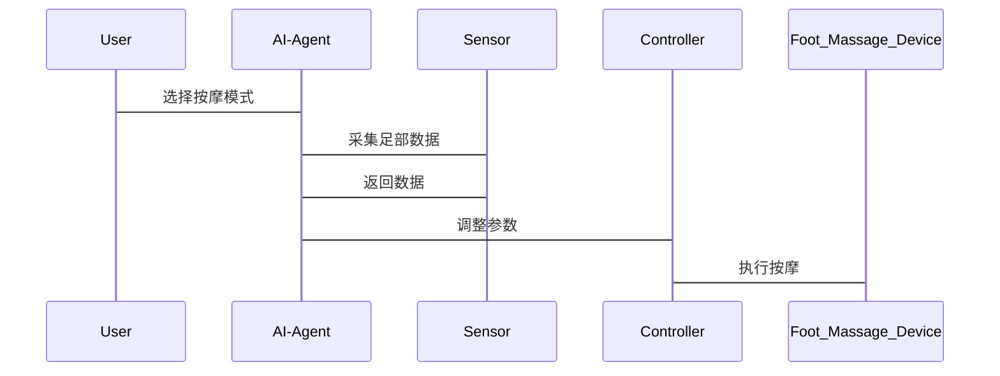

                 


# AI Agent在智能拖鞋中的足部按摩控制

## 关键词：AI Agent, 足部按摩, 智能拖鞋, 算法原理, 系统架构, 项目实战

## 摘要：本文详细探讨了AI Agent在智能拖鞋中的足部按摩控制应用，从背景介绍、核心概念、算法原理、系统架构到项目实战，层层解析，展示了AI技术如何提升足部按摩的智能化和用户体验。

---

## 第1章: 背景介绍

### 1.1 问题背景

#### 1.1.1 足部按摩的健康价值
足部按摩是一种传统的健康疗法，通过刺激足部的反射区来促进血液循环和缓解身体紧张。现代人因久坐、压力大等问题，足部健康问题日益突出，足部按摩的需求增加。

#### 1.1.2 智能化足部按摩设备的市场需求
传统足部按摩设备功能单一，用户体验差，难以满足个性化需求。随着智能设备的普及，市场对智能化、个性化的足部按摩设备需求旺盛。

#### 1.1.3 AI技术在足部按摩领域的应用潜力
AI技术可以通过分析用户的足部数据，提供个性化的按摩方案，提升用户体验。AI Agent能够实时调整按摩力度和模式，实现精准控制。

### 1.2 问题描述

#### 1.2.1 现有足部按摩设备的局限性
传统设备功能固定，无法根据用户需求实时调整，用户体验较差。

#### 1.2.2 用户对智能化足部按摩体验的需求
用户希望足部按摩设备能够智能化、个性化，能够根据个人需求自动调整。

#### 1.2.3 AI Agent在足部按摩控制中的应用目标
通过AI Agent实现足部按摩的智能化控制，提供个性化的按摩体验，提升用户舒适度和健康效果。

### 1.3 问题解决

#### 1.3.1 AI Agent在足部按摩控制中的解决方案
AI Agent通过实时采集足部数据，分析用户需求，调整按摩参数，提供个性化服务。

#### 1.3.2 技术实现路径概述
AI Agent需要集成传感器、算法和控制模块，实时分析数据并调整按摩设备的运行状态。

#### 1.3.3 用户体验提升的具体表现
用户可以根据个人需求选择不同的按摩模式，体验更加舒适和高效。

### 1.4 边界与外延

#### 1.4.1 AI Agent在足部按摩控制中的应用边界
AI Agent仅用于足部按摩的控制，不涉及设备的硬件设计和数据采集之外的部分。

#### 1.4.2 与其他智能设备的协同可能性
AI Agent可以与其他健康设备协同工作，如智能手表、健康监测设备，提供更加全面的健康服务。

#### 1.4.3 技术的可扩展性和未来发展方向
未来可以通过AI Agent实现更多功能，如健康数据的远程监控和健康建议的提供。

### 1.5 概念结构与核心要素组成

#### 1.5.1 AI Agent的核心概念
AI Agent是一种智能代理，能够感知环境、自主决策并执行任务。

#### 1.5.2 足部按摩控制的关键要素
包括传感器、数据采集、算法分析、控制模块和用户界面。

#### 1.5.3 系统整体架构的初步框架
系统包括数据采集层、算法处理层和控制执行层，各层协同工作实现足部按摩控制。

---

## 第2章: 核心概念与联系

### 2.1 AI Agent的核心原理

#### 2.1.1 AI Agent的基本定义
AI Agent是一种能够感知环境、自主决策并执行任务的智能实体。

#### 2.1.2 基于AI的足部按摩控制算法
AI Agent通过分析足部压力、温度等数据，调整按摩力度和时间。

#### 2.1.3 AI Agent在足部按摩中的具体应用
AI Agent可以根据用户的足部数据，推荐适合的按摩模式，实时调整按摩强度。

### 2.2 核心概念属性特征对比

| 属性 | 传统控制算法 | AI Agent |
|------|--------------|----------|
| 智能性 | 低           | 高       |
| 适应性 | 无           | 有       |
| 学习能力 | 无           | 有       |

### 2.3 ER实体关系图

```mermaid
erDiagram
    customer[CUSTOMER] {
        +int id
        +string name
    }
    device[FOOT_MASSAGE_DEVICE] {
        +int id
        +string type
    }
    sensor SENSOR
    action ACTION
    customer -> sensor : 使用
    device -> sensor : 集成
    sensor -> action : 触发
```

---

## 第3章: 算法原理讲解

### 3.1 AI Agent算法流程



### 3.2 算法代码实现

```python
class AI-Agent:
    def __init__(self, sensors):
        self.sensors = sensors

    def analyze_data(self, data):
        # 数据分析算法
        pass

    def decide_mode(self, analysis_result):
        # 决策按摩模式
        pass

    def adjust_parameters(self, mode):
        # 调整参数
        pass

    def execute_massage(self, parameters):
        # 执行按摩
        pass

# 示例数据
sensors = [pressure_sensor, temperature_sensor]
agent = AI-Agent(sensors)
data = sensors.read_data()
mode = agent.analyze_data(data)
parameters = agent.adjust_parameters(mode)
agent.execute_massage(parameters)
```

### 3.3 算法原理的数学模型

按摩力度调整公式：
$$力度 = k \times (当前压力 - 标准压力)$$

其中，k为比例系数，当前压力为传感器读数，标准压力为用户设定的目标压力。

---

## 第4章: 系统分析与架构设计

### 4.1 功能设计

#### 4.1.1 领域模型



### 4.2 系统架构设计


### 4.3 接口设计

- 数据采集接口：传感器数据的读取和传输。
- 控制接口：AI-Agent对设备的控制指令。
- 用户界面接口：用户与设备的交互界面。

### 4.4 交互流程



---

## 第5章: 项目实战

### 5.1 环境安装

- 硬件：智能拖鞋、压力传感器、温度传感器。
- 软件：Python编程环境，AI框架（如TensorFlow）。

### 5.2 核心代码实现

```python
import numpy as np
from tensorflow import keras

class Sensor:
    def __init__(self):
        self.value = 0.0

    def read_data(self):
        return self.value

class AI-Agent:
    def __init__(self, sensors):
        self.sensors = sensors
        self.model = self.load_model()

    def load_model(self):
        # 加载预训练模型
        return keras.models.load_model("massage_model.h5")

    def analyze_data(self, data):
        # 数据分析
        return self.model.predict(np.array([data]))

    def decide_mode(self, analysis_result):
        # 决策模式
        return analysis_result[0][0]

    def adjust_parameters(self, mode):
        # 调整参数
        return mode * 10

    def execute_massage(self, parameters):
        # 执行按摩
        pass

# 示例运行
sensor = Sensor()
agent = AI-Agent([sensor])
data = sensor.read_data()
mode = agent.analyze_data(data)
parameters = agent.adjust_parameters(mode)
agent.execute_massage(parameters)
```

### 5.3 案例分析

用户选择强模式，传感器读取足部压力数据，AI-Agent分析后调整按摩力度，执行按摩。

### 5.4 项目小结

通过AI-Agent实现智能足部按摩控制，提升了用户体验，展示了AI技术在智能设备中的应用潜力。

---

## 第6章: 最佳实践

### 6.1 小结

AI-Agent在足部按摩控制中的应用提升了设备的智能化水平，为用户带来更好的体验。

### 6.2 注意事项

- 数据隐私保护
- 系统稳定性保障
- 用户体验优化

### 6.3 拓展阅读

推荐书籍：《人工智能: 一种现代方法》、《Python机器学习实战》。

---

## 作者：AI天才研究院 & 禅与计算机程序设计艺术

---

### 写作思路说明：
1. **背景介绍**：从足部按摩的健康价值入手，引出AI Agent的应用背景，明确问题和解决方案。
2. **核心概念与联系**：通过对比和图表，清晰展示AI Agent的工作原理和系统结构。
3. **算法原理**：结合流程图和代码，详细讲解AI Agent的实现步骤和数学模型。
4. **系统分析与架构设计**：通过类图和架构图，展示系统的整体结构和模块关系。
5. **项目实战**：提供实际代码和案例，展示AI Agent在智能拖鞋中的具体应用。
6. **最佳实践**：总结经验，给出注意事项和拓展建议，确保读者能够全面理解和应用相关技术。

通过以上步骤，本文系统地介绍了AI Agent在智能拖鞋足部按摩控制中的应用，帮助读者从理论到实践全面掌握相关知识。

