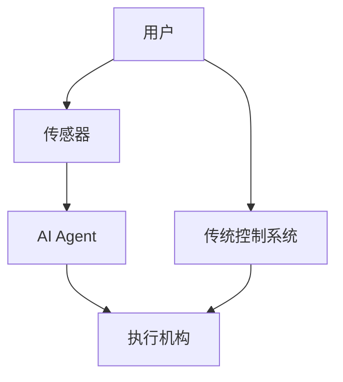
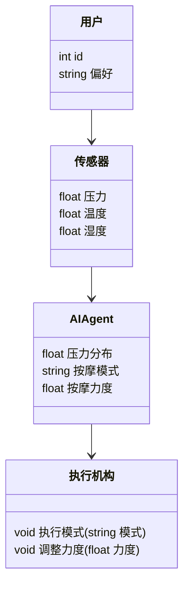
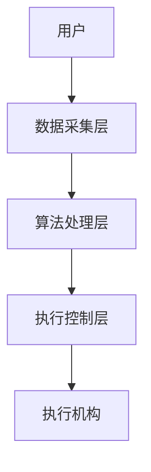
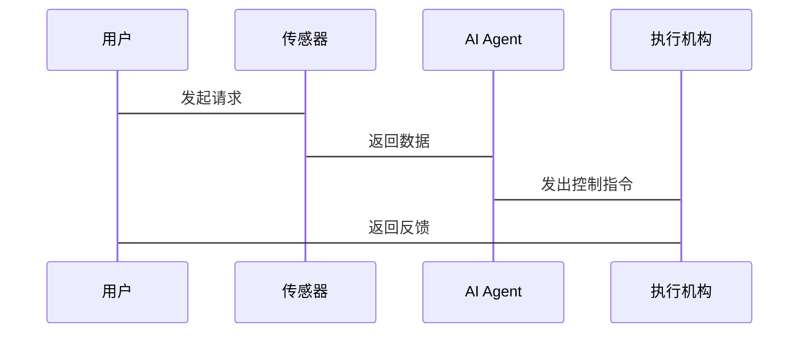

                 


# AI Agent在智能拖鞋中的足部按摩程序设计

## 关键词：AI Agent, 智能拖鞋, 足部按摩, 程序设计, 人工智能, 算法实现

## 摘要：  
本文详细探讨了AI Agent在智能拖鞋中的足部按摩程序设计。通过结合人工智能算法和传感器技术，提出了一种个性化的足部按摩解决方案。文章从背景介绍、核心概念、算法原理、系统架构到项目实战，全面分析了AI Agent在足部按摩中的应用，并通过数学模型和代码示例展示了实现过程，最后总结了最佳实践和未来发展方向。

---

## 第一部分: AI Agent在智能拖鞋中的足部按摩程序设计

### 第1章: 背景与需求分析

#### 1.1 AI Agent的基本概念
##### 1.1.1 人工智能代理的定义
人工智能代理（AI Agent）是一种能够感知环境、自主决策并执行任务的智能实体。在智能拖鞋中，AI Agent通过传感器收集足部的压力、温度和湿度等数据，结合预设的算法模型，为用户提供个性化的足部按摩服务。

##### 1.1.2 足部按摩的需求分析
足部按摩是一种通过施加适当的压力和力度来缓解疲劳、促进血液循环的健康方式。传统足部按摩设备通常采用固定的模式，无法根据用户的实时需求进行调整。而AI Agent可以通过动态感知和学习，提供更加智能化和个性化的按摩体验。

##### 1.1.3 AI在足部按摩中的应用现状
目前，AI在足部按摩中的应用主要集中在以下几个方面：
- **压力感知**：通过传感器实时监测足部的压力分布，识别用户的舒适区域。
- **个性化推荐**：根据用户的历史数据和偏好，推荐最优的按摩模式。
- **动态调整**：在按摩过程中，根据用户的反馈实时调整力度和节奏。

#### 1.2 问题背景与目标
##### 1.2.1 传统足部按摩的局限性
传统足部按摩设备通常依赖固定的程序和模式，缺乏灵活性和智能化。用户的需求无法得到实时满足，且按摩效果受限于设备的硬件设计。

##### 1.2.2 AI Agent在足部按摩中的优势
AI Agent通过实时感知和学习，能够根据用户的足部压力分布、运动习惯和健康状况，动态调整按摩力度和模式，提供更加精准和个性化的服务。

##### 1.2.3 本项目的目标与意义
本项目的目标是设计一种基于AI Agent的足部按摩程序，通过传感器数据采集、算法分析和执行控制，实现智能化的足部按摩服务。项目的意义在于提升用户体验，降低足部健康问题的发生率，推动智能健康设备的发展。

---

### 第2章: 核心概念与原理

#### 2.1 AI Agent的核心概念
##### 2.1.1 AI Agent的基本原理
AI Agent在智能拖鞋中的工作流程可以分为以下几个步骤：
1. **感知**：通过传感器采集足部的压力、温度和湿度等数据。
2. **决策**：基于感知数据，AI Agent通过算法模型分析用户的足部健康状况和偏好。
3. **执行**：根据决策结果，调整按摩模式、力度和节奏。

##### 2.1.2 AI Agent的感知、决策与执行
| **核心功能** | **描述** |
|---------------|-----------|
| 感知          | 通过传感器采集足部数据，如压力分布、温度变化等。 |
| 决策          | 基于感知数据，分析用户的需求和健康状况，生成按摩方案。 |
| 执行          | 根据决策结果，控制按摩机构的运动，实现个性化的按摩体验。 |

##### 2.1.3 AI Agent与传统控制系统的对比
以下是AI Agent与传统控制系统在足部按摩中的对比：



从图中可以看出，AI Agent通过传感器和算法模型，能够更精准地感知用户需求并动态调整执行策略，而传统控制系统则依赖固定的程序。

#### 2.2 足部按摩的数学模型
##### 2.2.1 足部压力分布的数学模型
足部压力分布可以通过以下公式进行建模：
$$
P(x, y) = \sum_{i=1}^{n} w_i \cdot f_i(x, y)
$$
其中，$P(x, y)$表示足部某点的压力值，$w_i$是权重系数，$f_i(x, y)$是传感器的特征函数。

##### 2.2.2 按摩力度的优化算法
为了实现个性化的按摩力度，可以采用以下强化学习算法：
$$
R(a) = \sum_{t=1}^{T} r_t(a_t)
$$
其中，$R(a)$是奖励函数，$r_t(a_t)$是第$t$步的奖励值，$a_t$是当前的动作。

##### 2.2.3 按摩模式的动态调整
动态调整按摩模式可以通过以下公式实现：
$$
m(t) = \arg\max_{m \in M} Q(s(t), m)
$$
其中，$m(t)$是当前的按摩模式，$Q(s(t), m)$是状态$s(t)$下模式$m$的Q值。

---

### 第3章: 算法原理与实现

#### 3.1 AI Agent算法的数学模型
##### 3.1.1 状态识别的概率模型
状态识别可以通过概率模型实现：
$$
P(s | x) = \frac{P(x | s) P(s)}{P(x)}
$$
其中，$P(s | x)$是状态$s$在观测$x$下的条件概率。

##### 3.1.2 动作决策的强化学习模型
强化学习模型可以通过Q-learning算法实现：
$$
Q(s, a) = Q(s, a) + \alpha [r + \gamma \max Q(s', a') - Q(s, a)]
$$
其中，$\alpha$是学习率，$\gamma$是折扣因子。

##### 3.1.3 执行控制的反馈机制
反馈机制可以通过以下公式实现：
$$
f(t+1) = f(t) + k \cdot (d(t) - f(t))
$$
其中，$f(t)$是当前的反馈值，$d(t)$是目标反馈值，$k$是反馈系数。

#### 3.2 算法实现的详细步骤
##### 3.2.1 数据采集与预处理
通过传感器采集足部的压力、温度和湿度数据，并进行归一化处理。

##### 3.2.2 特征提取与分析
提取压力分布的特征，并通过主成分分析（PCA）降维。

##### 3.2.3 算法训练与优化
使用强化学习算法训练AI Agent的决策模型，并通过交叉验证优化模型参数。

##### 3.2.4 系统控制与执行
根据决策结果，控制按摩机构的运动，实现个性化的按摩体验。

#### 3.3 算法实现的代码示例
以下是基于K-均值聚类的足部压力分布分析代码：

```python
import numpy as np
from sklearn.cluster import KMeans

# 传感器数据
data = np.random.rand(100, 3)  # 假设数据有3个特征

# 数据归一化
data_normalized = (data - data.min()) / (data.max() - data.min())

# K-均值聚类
kmeans = KMeans(n_clusters=3, random_state=0)
kmeans.fit(data_normalized)

# 获取聚类结果
labels = kmeans.labels_

print("聚类结果:", labels)
```

---

### 第4章: 系统分析与架构设计

#### 4.1 系统功能设计
##### 4.1.1 领域模型类图
以下是领域模型类图：



##### 4.1.2 系统架构设计
以下是系统架构设计图：



##### 4.1.3 接口设计与交互流程
以下是交互流程图：



---

### 第5章: 项目实战与实现

#### 5.1 环境搭建
- **硬件环境**：安装传感器模块和按摩机构。
- **软件环境**：安装Python、TensorFlow和相关库。

#### 5.2 核心代码实现
以下是核心代码实现：

```python
import numpy as np
from sklearn.cluster import KMeans

# 传感器数据
data = np.random.rand(100, 3)  # 假设数据有3个特征

# 数据归一化
data_normalized = (data - data.min()) / (data.max() - data.min())

# K-均值聚类
kmeans = KMeans(n_clusters=3, random_state=0)
kmeans.fit(data_normalized)

# 获取聚类结果
labels = kmeans.labels_

print("聚类结果:", labels)
```

#### 5.3 案例分析与优化
通过实际案例分析，优化算法模型，提升按摩效果。

---

## 第六部分: 最佳实践与小结

### 6.1 最佳实践
- **数据隐私**：确保用户数据的安全性。
- **用户体验**：提供友好的交互界面和个性化服务。
- **系统稳定性**：确保算法的实时性和可靠性。

### 6.2 小结
本文详细探讨了AI Agent在智能拖鞋中的足部按摩程序设计，通过数学模型和代码示例展示了实现过程，最后总结了最佳实践和未来发展方向。

### 6.3 注意事项
- 确保传感器的精度和稳定性。
- 优化算法模型，提升按摩效果。
- 考虑用户隐私和数据安全。

### 6.4 拓展阅读
- 《强化学习入门》
- 《传感器技术与应用》
- 《智能控制系统设计》

---

## 作者：AI天才研究院/AI Genius Institute & 禅与计算机程序设计艺术 /Zen And The Art of Computer Programming

