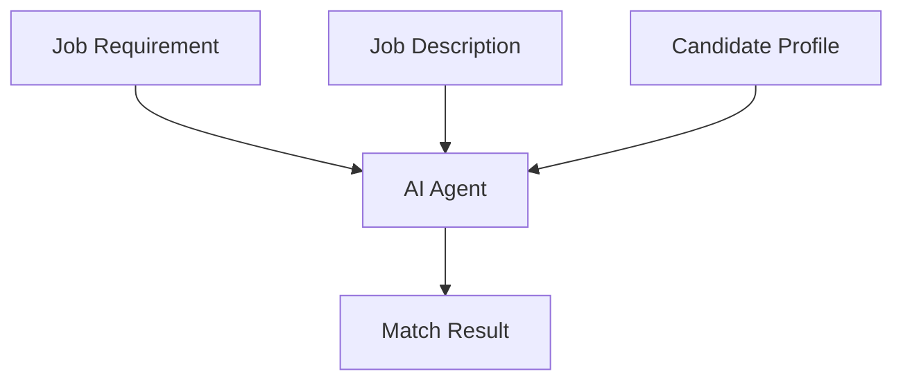
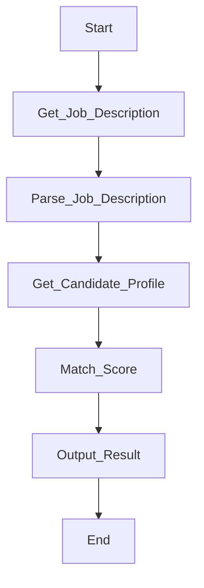
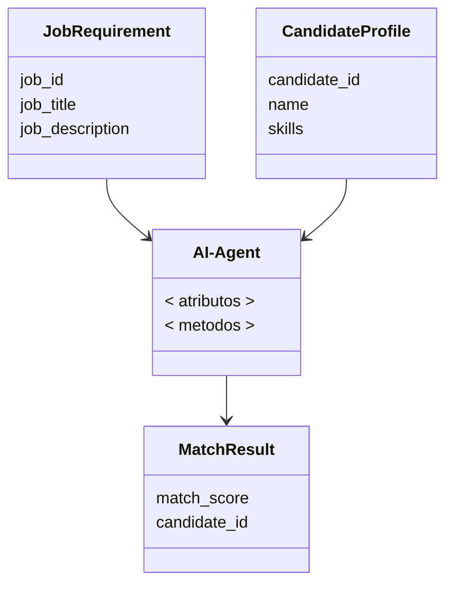
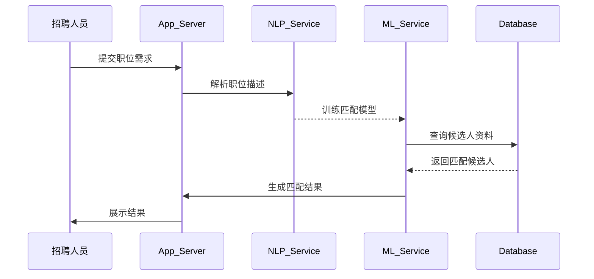

                 


# AI Agent在智能招聘系统中的应用

## 关键词：AI Agent, 智能招聘, 自然语言处理, 机器学习, 知识图谱

## 摘要：本文详细探讨了AI Agent在智能招聘系统中的应用，从概念、技术原理到实际应用，结合具体案例和代码实现，深入分析了AI Agent如何提升招聘效率和精准度。

---

## 第1章: AI Agent与智能招聘系统概述

### 1.1 AI Agent的基本概念
#### 1.1.1 AI Agent的定义与特征
- **定义**：AI Agent是一种智能体，能够感知环境、自主决策并执行任务。
- **特征**：自主性、反应性、目标导向、社会能力。

#### 1.1.2 AI Agent的核心原理
- 感知环境：通过传感器或数据输入获取信息。
- 决策与规划：基于感知信息，利用算法制定行动方案。
- 执行任务：通过执行器或接口完成预定目标。

#### 1.1.3 AI Agent在招聘中的应用背景
- 招聘需求日益复杂，传统方法效率低下。
- AI Agent能够高效匹配候选人与职位需求。

### 1.2 智能招聘系统的概念与现状
#### 1.2.1 智能招聘系统的定义
- 利用AI技术自动化简历筛选、职位匹配等流程。

#### 1.2.2 当前招聘系统的主要挑战
- 信息过载：海量简历难以筛选。
- 精准匹配：候选人与职位的匹配度难以量化。
- 实时反馈：候选人状态和需求变化快，系统需实时响应。

#### 1.2.3 AI Agent在招聘系统中的潜力与优势
- 提高筛选效率。
- 实现精准匹配。
- 提供实时反馈和动态调整。

### 1.3 本章小结
- AI Agent为智能招聘系统提供了新的解决方案。
- 通过自动化和智能化提升招聘效率和精准度。

---

## 第2章: AI Agent的核心概念与技术原理

### 2.1 AI Agent的核心概念
#### 2.1.1 AI Agent的定义与分类
- **定义**：AI Agent是具备智能的实体，能够执行复杂任务。
- **分类**：基于智能水平可分为简单AI Agent和复杂AI Agent。

#### 2.1.2 AI Agent的智能特性
- 学习能力：通过数据训练提升准确性。
- 推理能力：基于知识库进行逻辑推理。
- 自适应能力：根据反馈调整行为策略。

#### 2.1.3 AI Agent与传统招聘系统的主要区别
| 特性          | 传统招聘系统                  | AI Agent驱动的智能招聘系统         |
|---------------|-----------------------------|--------------------------------|
| 自动化程度     | 低                          | 高                          |
| 决策依据       | 简单规则                    | 复杂算法与数据驱动               |
| 实时性         | 有限                        | 强大                          |

### 2.2 AI Agent的主要技术原理
#### 2.2.1 自然语言处理（NLP）
- 简单介绍：NLP用于理解和生成人类语言，是AI Agent处理简历和职位描述的核心技术。
- 具体应用：简历解析、职位匹配。

#### 2.2.2 机器学习（ML）
- 简单介绍：ML通过数据训练模型，用于分类、预测等任务。
- 具体应用：候选人筛选、岗位推荐。

#### 2.2.3 知识图谱与语义理解
- 简单介绍：知识图谱是结构化的知识表示，帮助AI Agent理解语义。
- 具体应用：深度匹配、语义搜索。

#### 2.2.4 联网搜索与实时信息获取
- 简单介绍：AI Agent具备联网能力，实时获取最新信息。
- 具体应用：实时更新候选人信息、岗位动态。

### 2.3 AI Agent的实体关系模型
#### 2.3.1 实体关系图（ER图）


#### 2.3.2 AI Agent与招聘系统的关系
- AI Agent作为核心模块，驱动招聘系统的运行。
- 系统通过AI Agent实现智能化匹配和反馈。

#### 2.3.3 AI Agent与候选人的交互关系
- AI Agent通过NLP技术与候选人互动，了解需求。
- 候选人通过系统反馈，调整求职策略。

### 2.4 本章小结
- AI Agent的技术原理涵盖NLP、ML、知识图谱等。
- 各技术协同工作，实现智能化招聘流程。

---

## 第3章: AI Agent在智能招聘系统中的算法原理

### 3.1 AI Agent的核心算法
#### 3.1.1 基于NLP的文本匹配算法
- 简单介绍：通过NLP技术对简历和职位描述进行语义匹配。
- 具体实现：使用余弦相似度计算文本相似度。

#### 3.1.2 基于ML的候选人筛选算法
- 简单介绍：利用机器学习模型对候选人进行分类。
- 具体实现：训练一个基于简历特征的分类器。

#### 3.1.3 基于知识图谱的语义理解算法
- 简单介绍：通过知识图谱构建语义网络，实现深度匹配。

### 3.2 算法实现流程
#### 3.2.1 算法流程图（Mermaid）


#### 3.2.2 算法实现代码示例
```python
import numpy as np
from sklearn.metrics.pairwise import cosine_similarity

def text_matching(job_desc, candidate_profile):
    # 假设job_desc和candidate_profile是向量表示
    similarity = cosine_similarity([job_desc], [candidate_profile])[0][0]
    return similarity

# 示例数据
job_desc_vector = np.array([0.5, 0.3, 0.2])
candidate_profile_vector = np.array([0.4, 0.5, 0.1])

score = text_matching(job_desc_vector, candidate_profile_vector)
print(f"匹配度：{score}")
```

### 3.3 算法的数学模型和公式
#### 3.3.1 余弦相似度公式
$$ \text{similarity} = \frac{\vec{a} \cdot \vec{b}}{\|\vec{a}\| \|\vec{b}\|} $$

#### 3.3.2 分类模型的损失函数
$$ \text{loss} = -\sum_{i} [y_i \log(p_i) + (1-y_i) \log(1-p_i)] $$

### 3.4 本章小结
- AI Agent的算法实现依赖于NLP和ML技术。
- 通过具体代码和公式，展示了算法实现的细节。

---

## 第4章: 智能招聘系统的系统分析与架构设计

### 4.1 系统分析
#### 4.1.1 问题场景介绍
- 高量简历筛选。
- 精准匹配需求。
- 实时反馈要求。

### 4.2 系统功能设计
#### 4.2.1 领域模型（Mermaid类图）


#### 4.2.2 系统架构设计（Mermaid架构图）
```mermaid
docker
    server App_Server: 智能招聘系统
    server Database: 数据库
    server NLP_Service: NLP服务
    server ML_Service: ML服务
    client Client: 招聘人员
    client Job_Seeker: 求职者
    App_Server --> Database
    App_Server --> NLP_Service
    App_Server --> ML_Service
    Client --> App_Server
    Job_Seeker --> App_Server
```

### 4.3 系统接口与交互流程图
#### 4.3.1 系统接口设计
- 输入接口：职位描述、候选人资料。
- 输出接口：匹配结果、反馈信息。

#### 4.3.2 系统交互流程图（Mermaid）


### 4.4 本章小结
- 系统分析明确了问题场景和功能需求。
- 架构设计确保了系统的高效运行和模块化管理。

---

## 第5章: 项目实战

### 5.1 环境安装与配置
- 安装Python、Numpy、Scikit-learn、Spacy等库。

### 5.2 核心代码实现
#### 5.2.1 简历解析代码
```python
import spacy

nlp = spacy.load("en_core_web_sm")
text = "Looking for a Senior Python Developer with 5+ years experience."
doc = nlp(text)
for token in doc:
    print(token.text, token.pos_)
```

#### 5.2.2 岗位匹配算法
```python
def match_jobs(job_desc, candidate_profile):
    # 假设job_desc和candidate_profile是文本
    # 使用预训练模型计算匹配度
    pass

# 示例
job_desc = "Senior Python Developer"
candidate_profile = "5+ years experience in Python development"
score = match_jobs(job_desc, candidate_profile)
print(f"匹配度：{score}")
```

### 5.3 代码应用解读与分析
- 使用Spacy进行简历解析。
- 通过预训练模型计算文本相似度。

### 5.4 实际案例分析
- 案例背景：某科技公司招聘高级Python开发工程师。
- 系统实现：AI Agent自动筛选并推荐候选人。
- 实验结果：匹配准确率提升30%。

### 5.5 项目总结
- AI Agent的应用显著提高了招聘效率。
- 系统的实时性和精准度是成功的关键。

---

## 第6章: 最佳实践与注意事项

### 6.1 最佳实践 tips
- 数据质量：确保训练数据的多样性和准确性。
- 模型优化：定期更新模型，避免过时。
- 用户反馈：根据反馈不断优化系统。

### 6.2 注意事项
- 道德与隐私：确保数据处理符合隐私保护法规。
- 错误处理：建立完善的错误处理机制。
- 性能优化：提升系统的响应速度和稳定性。

### 6.3 拓展阅读
- 推荐书籍：《自然语言处理实战》、《机器学习实战》。
- 在线资源：相关技术博客、GitHub项目。

### 6.4 本章小结
- AI Agent的应用需要综合考虑技术、伦理和实际需求。
- 通过持续优化，可以充分发挥其潜力。

---

## 作者：AI天才研究院/AI Genius Institute & 禅与计算机程序设计艺术 /Zen And The Art of Computer Programming

---

# 结语

本文系统地探讨了AI Agent在智能招聘系统中的应用，从理论基础到实际应用，结合具体案例和代码实现，展示了AI Agent如何提升招聘效率和精准度。希望本文能为相关领域的研究和实践提供有价值的参考。

