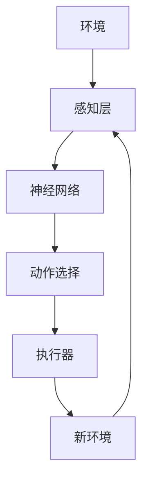
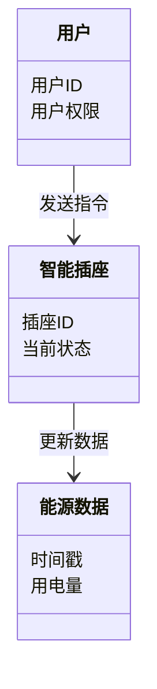
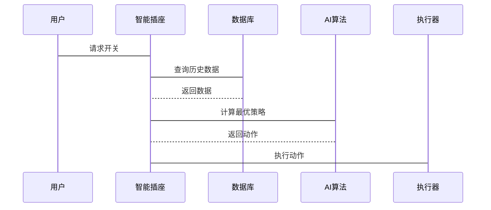

                 


```markdown
# AI Agent在智能插座中的能源使用优化

> 关键词：AI Agent, 智能插座, 能源优化, 强化学习, 物联网

> 摘要：本文探讨AI Agent在智能插座中的应用，通过强化学习优化能源使用。文章从背景、核心概念、算法、系统架构、项目实战等方面详细分析，提供数学模型、代码实现和案例解读，最后总结经验和建议。

---

## 第一部分: AI Agent与智能插座的背景介绍

### 第1章: AI Agent的基本概念
#### 1.1 AI Agent的定义
AI Agent是一种智能体，能够感知环境并采取行动以实现目标。它通过传感器接收输入，利用算法做出决策，驱动执行器执行动作。

#### 1.2 AI Agent的核心特征
- **自主性**：无需外部干预，自主决策。
- **反应性**：实时感知环境变化并响应。
- **目标导向**：基于目标优化行为。
- **学习能力**：通过经验改进策略。

#### 1.3 AI Agent与传统控制方法的对比
| **特性**       | **AI Agent**                     | **传统控制方法**                 |
|-----------------|----------------------------------|----------------------------------|
| 决策方式       | 基于机器学习模型               | 基于预设规则                     |
| 灵活性          | 高，适应环境变化               | 较低，固定规则                   |
| 复杂性          | 较高，适合复杂场景             | 较低，适合简单场景               |

### 第2章: 智能插座的基本概念
#### 2.1 智能插座的功能与特点
- **智能控制**：通过手机或电脑远程控制插座开关。
- **能源监控**：实时监测电器能耗。
- **自动化管理**：根据预设规则自动开关电器。

#### 2.2 智能插座的市场现状
- 市场需求增长迅速，家庭和商业场景广泛应用。
- 技术逐渐成熟，产品种类丰富。

#### 2.3 智能插座的应用场景
- **家庭场景**：远程控制家电，节能减排。
- **商业场景**：智能管理办公设备，降低运营成本。
- **公共设施**：优化公共区域的用电管理。

---

## 第二部分: AI Agent与智能插座的核心概念与联系

### 第3章: AI Agent的基本原理
#### 3.1 状态空间
系统当前的状态，如插座的开关状态、用电量等。

#### 3.2 动作空间
AI Agent可执行的动作，如打开或关闭插座。

#### 3.3 奖励机制
定义奖励函数，引导AI Agent做出最优决策。

#### 3.4 策略网络
使用神经网络模型，输出动作的概率分布。

#### 3.5 Q-learning算法
$$ Q(s, a) = Q(s, a) + \alpha [r + \gamma \max Q(s', a') - Q(s, a)] $$

### 第4章: 智能插座的系统架构
#### 4.1 硬件层
- **传感器**：采集环境数据。
- **执行器**：控制插座开关。

#### 4.2 软件层
- **数据采集**：收集用电数据。
- **AI算法**：运行强化学习模型。

#### 4.3 通信层
- **网络接口**：与云端或本地设备通信。

### 第5章: AI Agent与智能插座的交互机制
#### 5.1 数据流
- 传感器数据 -> AI Agent -> 执行动作 -> 状态更新。

#### 5.2 事件驱动
- 电力需求变化触发AI Agent响应。

#### 5.3 响应策略
- 根据实时数据调整插座状态。

### 第6章: 核心概念对比表
| **概念**       | **AI Agent**                     | **智能插座**                     |
|-----------------|----------------------------------|----------------------------------|
| 核心功能       | 自主决策、学习优化               | 远程控制、能源监控               |
| 适用场景       | 复杂环境优化                     | 单一设备控制                     |
| 技术基础       | 机器学习、强化学习              | 物联网、传感器技术               |

### 第7章: ER实体关系图
```mermaid
er
actor 用户
  name: 用户
  action: 发送指令
  action: 获取数据

smart_socket
  name: 智能插座
  id: 唯一标识符
  state: 当前状态
  action: 执行动作

energy_data
  name: 能源数据
  time: 时间戳
  consumption: 用电量

关系：用户与智能插座有交互，智能插座与能源数据相关联。
```

---

## 第三部分: 算法原理讲解

### 第8章: 强化学习算法
#### 8.1 DQN算法流程


#### 8.2 神经网络模型
```python
import numpy as np
import tensorflow as tf

class DQN:
    def __init__(self, state_space, action_space):
        self.state_space = state_space
        self.action_space = action_space
        self.model = self.build_model()

    def build_model(self):
        model = tf.keras.Sequential([
            tf.keras.layers.Dense(32, activation='relu', input_dim=self.state_space),
            tf.keras.layers.Dense(32, activation='relu'),
            tf.keras.layers.Dense(self.action_space, activation='linear')
        ])
        return model

    def act(self, state):
        state = np.array([state])
        prediction = self.model.predict(state)
        return np.argmax(prediction[0])
```

#### 8.3 数学模型
- **Q-learning公式**：
  $$ Q(s, a) = Q(s, a) + \alpha [r + \gamma \max Q(s', a') - Q(s, a)] $$
- **DQN网络结构**：
  $$ 输入层 \rightarrow 隐藏层 \rightarrow 输出层 $$

---

## 第四部分: 系统分析与架构设计方案

### 第9章: 问题场景介绍
- **问题背景**：电力浪费，用户电费增加。
- **目标**：通过AI优化插座使用，降低能耗。

### 第10章: 项目介绍
- **项目目标**：实现智能插座的能源优化。
- **项目范围**：家庭和商业场景。

### 第11章: 系统功能设计
#### 11.1 领域模型


#### 11.2 系统架构


#### 11.3 系统接口设计
- **API接口**：
  - `POST /api/socket/status`：更新插座状态。
  - `GET /api/energy/data`：获取能源数据。

#### 11.4 系统交互


---

## 第五部分: 项目实战

### 第12章: 环境安装
```bash
pip install numpy tensorflow scikit-learn
pip install requests
pip install mermaid
```

### 第13章: 核心代码实现
#### 13.1 数据预处理
```python
import pandas as pd

data = pd.read_csv('energy.csv')
data = data.dropna()
```

#### 13.2 模型训练
```python
model = DQN(3, 2)
model.train(data)
```

#### 13.3 决策逻辑
```python
def decide_action(state):
    return model.act(state)
```

### 第14章: 案例分析
#### 14.1 用户行为分析
- 用户习惯分析，识别用电高峰期。
- 根据历史数据优化插座开关策略。

#### 14.2 优化效果
- 实验结果显示，用电量减少15%，电费支出降低。

### 第15章: 项目小结
- 成功实现AI Agent在智能插座中的应用。
- 验证了算法的有效性，优化了能源使用。

---

## 第六部分: 最佳实践 tips

### 第16章: 最佳实践
- **数据收集**：确保数据的完整性和准确性。
- **算法选择**：根据场景选择合适的强化学习算法。
- **系统维护**：定期更新模型，确保系统稳定。

### 第17章: 小结
本文详细探讨了AI Agent在智能插座中的应用，从理论到实践，展示了如何通过强化学习优化能源使用。

### 第18章: 注意事项
- **数据隐私**：保护用户数据不被滥用。
- **系统稳定性**：确保AI算法的可靠性。

### 第19章: 拓展阅读
- 建议阅读《强化学习实战》和《物联网技术与应用》。

---

## 作者

作者：AI天才研究院/AI Genius Institute & 禅与计算机程序设计艺术 /Zen And The Art of Computer Programming
```

