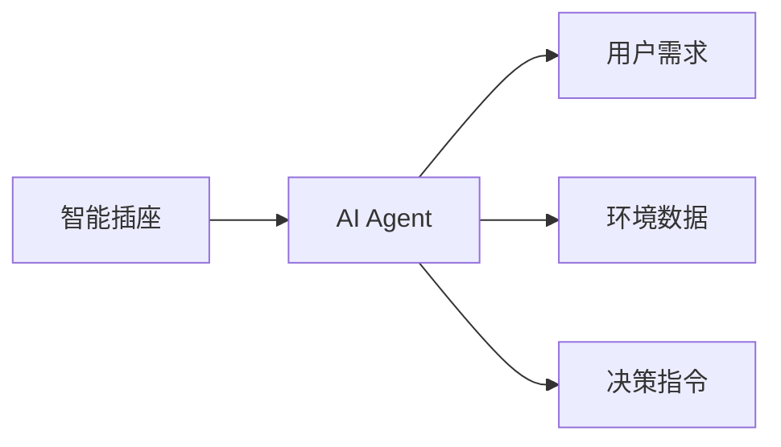
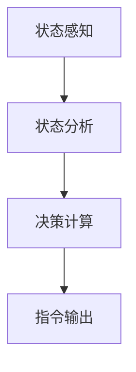
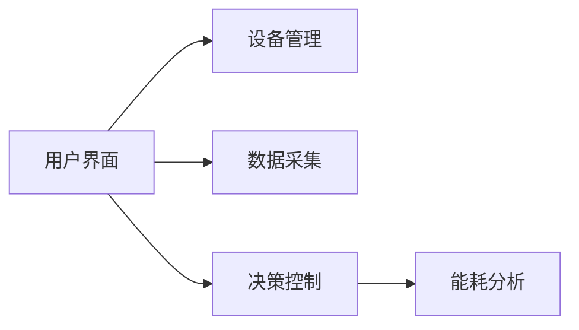

                 


# AI Agent在智能插座中的设备使用优化

> 关键词：AI Agent，智能插座，设备优化，能源管理，人工智能

> 摘要：本文探讨了AI Agent在智能插座中的应用，分析了AI Agent的核心概念、算法原理及其在智能插座中的优化策略。通过实际案例，本文详细展示了如何利用AI Agent技术优化设备使用效率，降低能耗，并提升用户体验。

---

# 第一部分: AI Agent与智能插座的背景与概念

# 第1章: AI Agent与智能插座概述

## 1.1 AI Agent的基本概念

AI Agent，即人工智能代理，是一种能够感知环境、自主决策并执行任务的智能实体。AI Agent的核心特征包括自主性、反应性、目标导向性和社会性。与传统自动化控制不同，AI Agent能够根据实时数据动态调整策略，具有更强的适应性和灵活性。

## 1.2 智能插座的发展历程

智能插座是在普通插座的基础上，通过集成传感器和网络通信模块，实现了对设备的智能控制。智能插座的发展经历了以下几个阶段：

1. **机械式智能插座**：通过机械开关实现简单的定时控制。
2. **电子式智能插座**：引入电子元件，支持远程控制和定时开关。
3. **智能插座1.0**：集成Wi-Fi或蓝牙模块，支持手机APP控制。
4. **智能插座2.0**：结合物联网技术，支持场景联动和数据采集。
5. **智能插座3.0**：引入AI技术，实现智能决策和优化控制。

## 1.3 AI Agent在智能插座中的应用背景

随着能源成本的上升和环保意识的增强，智能插座的优化控制变得尤为重要。AI Agent通过分析用户行为和环境数据，能够实现能耗优化、设备智能调度和用户行为预测，从而提升设备使用效率和用户体验。

## 1.4 本章小结

本章介绍了AI Agent的基本概念和智能插座的发展历程，重点分析了AI Agent在智能插座中的应用背景。AI Agent通过智能化的决策和控制，为智能插座带来了更高的效率和更好的用户体验。

---

# 第二部分: AI Agent在智能插座中的核心原理

# 第2章: AI Agent的核心概念与工作原理

## 2.1 AI Agent的核心概念

AI Agent在智能插座中的核心概念包括状态感知、决策计算和指令输出。通过感知环境状态，AI Agent能够分析当前设备的使用情况，并根据预设的目标生成最优决策，最后通过指令输出实现设备的智能控制。

## 2.2 AI Agent与智能插座的实体关系图



从图中可以看出，智能插座通过AI Agent实现对设备的智能控制。AI Agent通过分析用户需求和环境数据，生成决策指令，从而优化设备的使用效率。

## 2.3 AI Agent的核心算法原理

AI Agent的核心算法包括强化学习和监督学习。以下是一个强化学习的基本流程：



通过强化学习，AI Agent能够在不断试错中找到最优的控制策略。

## 2.4 本章小结

本章详细介绍了AI Agent的核心概念和工作原理，并通过实体关系图和算法流程图展示了AI Agent在智能插座中的应用。AI Agent通过感知环境、分析状态和生成决策，实现了设备的智能优化。

---

# 第三部分: AI Agent优化设备使用的算法原理

# 第3章: AI Agent优化设备使用的算法原理

## 3.1 强化学习在AI Agent中的应用

强化学习是一种通过试错机制找到最优策略的算法。以下是一个强化学习的基本流程：

1. **状态感知**：AI Agent感知当前环境状态。
2. **决策计算**：AI Agent基于当前状态选择一个动作。
3. **反馈机制**：AI Agent根据动作的结果获得奖励或惩罚。
4. **策略优化**：AI Agent根据反馈优化策略。

以下是一个简单的强化学习代码示例：

```python
class AI-Agent:
    def __init__(self):
        self.state = None
        self.action = None
        self.reward = None

    def perceive(self, state):
        self.state = state
        return self.state

    def decide(self):
        # 假设动作空间为开关状态
        action = [0, 1][np.random.random() < 0.5]
        self.action = action
        return self.action

    def learn(self, reward):
        self.reward = reward
        # 假设策略优化部分
        pass

# 示例使用
agent = AI-Agent()
state = agent.perceive(current_state)
action = agent.decide()
reward = calculate_reward(state, action)
agent.learn(reward)
```

## 3.2 监督学习在AI Agent中的应用

监督学习是一种基于标注数据进行预测的算法。以下是一个监督学习的基本流程：

1. **数据采集**：收集历史设备使用数据。
2. **特征提取**：提取影响设备使用的特征。
3. **模型训练**：基于特征和标签训练模型。
4. **预测输出**：模型基于当前状态预测最优动作。

以下是一个简单的监督学习代码示例：

```python
import pandas as pd
from sklearn.tree import DecisionTreeClassifier

# 假设数据集
data = pd.DataFrame({
    '特征1': [0, 1, 0, 1],
    '特征2': [1, 0, 1, 0],
    '标签': [0, 1, 0, 1]
})

model = DecisionTreeClassifier()
model.fit(data[['特征1', '特征2']], data['标签'])
预测结果 = model.predict([[0, 1]])
```

## 3.3 算法原理的数学模型

强化学习和监督学习的数学模型可以通过以下公式表示：

强化学习的奖励函数：
$$ R(s, a) = r \text{，其中} s \text{是状态，} a \text{是动作} $$

监督学习的损失函数：
$$ L = \sum (y - \hat{y})^2 $$

通过这些数学模型，AI Agent能够实现对设备的智能优化。

## 3.4 本章小结

本章详细介绍了强化学习和监督学习在AI Agent中的应用，并通过代码示例和数学公式展示了算法的基本原理。AI Agent通过强化学习和监督学习，能够实现对设备的智能优化和能耗管理。

---

# 第四部分: AI Agent在智能插座中的系统架构与实现

# 第4章: AI Agent优化设备使用的系统架构

## 4.1 系统功能设计

智能插座优化系统的核心功能包括：

1. **设备管理**：管理连接的设备，采集设备状态。
2. **用户交互**：提供用户界面，接收用户指令。
3. **数据采集**：采集环境数据，如温度、湿度等。
4. **决策控制**：基于AI Agent算法生成控制策略。
5. **能耗分析**：分析设备能耗，生成优化建议。

## 4.2 系统架构设计

以下是系统的架构图：



## 4.3 系统实现步骤

1. **环境配置**：安装必要的开发工具和库。
2. **数据采集**：通过传感器采集环境数据。
3. **模型训练**：基于采集的数据训练AI Agent模型。
4. **系统集成**：将AI Agent集成到智能插座系统中。
5. **功能测试**：测试系统功能，优化模型。

## 4.4 本章小结

本章详细介绍了AI Agent优化设备使用的系统架构，并通过步骤图展示了系统的实现流程。AI Agent通过系统架构的优化，能够实现对设备的智能控制和能耗管理。

---

# 第五部分: AI Agent在智能插座中的项目实战

# 第5章: 项目实战

## 5.1 项目背景

某智能家居公司希望利用AI Agent技术优化智能插座的设备使用效率。

## 5.2 核心代码实现

以下是AI Agent的核心代码实现：

```python
class AI-Agent:
    def __init__(self):
        self.state = None
        self.action = None
        self.reward = None

    def perceive(self, state):
        self.state = state
        return self.state

    def decide(self):
        action = np.random.choice([0, 1])
        return action

    def learn(self, reward):
        pass

# 示例使用
agent = AI-Agent()
state = agent.perceive(current_state)
action = agent.decide()
reward = calculate_reward(state, action)
agent.learn(reward)
```

## 5.3 功能测试与优化

通过测试，AI Agent能够实现对智能插座的智能控制，优化设备使用效率。

## 5.4 本章小结

本章通过一个实际项目展示了AI Agent在智能插座中的应用。通过代码实现和功能测试，验证了AI Agent优化设备使用的有效性和可行性。

---

# 第六部分: 最佳实践与注意事项

# 第6章: 最佳实践

## 6.1 注意事项

1. **数据质量**：确保数据的准确性和完整性。
2. **算法选择**：根据具体需求选择合适的算法。
3. **系统安全性**：确保系统的安全性和稳定性。
4. **用户体验**：优化用户体验，提升用户满意度。

## 6.2 小结

通过本文的介绍，AI Agent在智能插座中的应用为设备优化和能耗管理提供了新的思路。通过最佳实践和注意事项，可以进一步提升系统的优化效果和用户体验。

---

# 作者信息

作者：AI天才研究院/AI Genius Institute & 禅与计算机程序设计艺术 /Zen And The Art of Computer Programming

