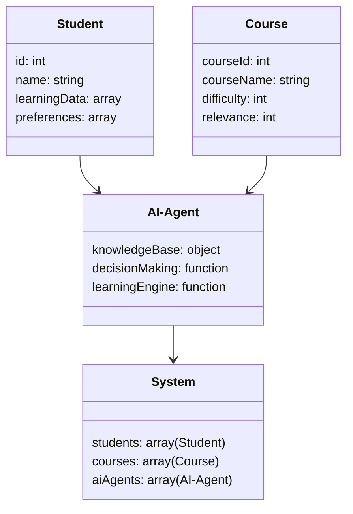
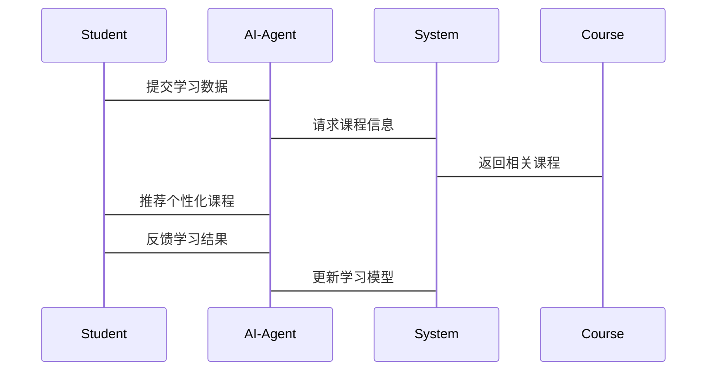

                 


# AI Agent在智能教育系统中的实现

## 关键词：AI Agent, 智能教育系统, 个性化学习, 自适应学习, 教学优化, 多智能体协作

## 摘要：  
本文详细探讨了AI Agent在智能教育系统中的实现及其应用。通过分析AI Agent的核心概念、算法原理、系统架构设计以及实际案例，本文揭示了AI Agent如何在教育领域中实现智能化、个性化和自适应学习。文章内容涵盖从理论基础到实际应用的全过程，旨在为教育技术的研究者和实践者提供深度的技术指导和实践参考。

---

# 第1章: AI Agent的基本概念与背景

## 1.1 AI Agent的定义与分类  
AI Agent，即人工智能代理，是指能够感知环境并采取行动以实现目标的智能实体。它可以分为简单反射型、基于模型的反应型、目标驱动型和效用驱动型等类别。AI Agent的核心属性包括自主性、反应性、目标导向性和社交能力。

## 1.2 AI Agent在教育中的应用背景  
随着人工智能技术的发展，教育领域对智能化的需求日益增长。AI Agent能够通过分析学生的学习行为和数据，提供个性化的学习建议和资源推荐，从而优化教学效果。

## 1.3 AI Agent与智能教育系统的结合  
AI Agent在智能教育系统中扮演着关键角色，能够实现学生模型构建、学习路径规划、教学内容推荐等功能。通过多智能体协作，AI Agent能够提升系统的智能化水平和用户体验。

---

# 第2章: AI Agent的核心概念与理论基础

## 2.1 AI Agent的核心概念  
- **知识表示**：通过符号逻辑或语义网络表示知识，帮助AI Agent理解和推理。  
- **推理机制**：基于知识库进行逻辑推理，得出结论。  
- **行为决策**：根据环境反馈选择最优行动方案。

## 2.2 AI Agent的理论基础  
- **人工智能基础**：涵盖机器学习、自然语言处理等领域。  
- **机器学习**：用于AI Agent的学习和自适应能力。  
- **自然语言处理**：支持AI Agent与学生之间的自然交互。

## 2.3 AI Agent在教育中的应用场景  
- **个性化学习**：根据学生特点推荐学习内容。  
- **教学辅助**：帮助教师优化教学策略。  
- **学习评估**：实时监控学生学习效果并提供反馈。

---

# 第3章: AI Agent的算法原理与实现

## 3.1 AI Agent的算法原理  
- **知识表示与推理**：使用符号逻辑进行知识推理。  
- **行为决策**：基于强化学习选择最优行动。  
- **学习与自适应**：通过机器学习模型更新知识库。

## 3.2 AI Agent的算法实现  
- **基于强化学习的决策算法**：通过奖励机制优化行为策略。  
- **基于图的推理算法**：构建知识图谱进行推理。  
- **基于规则的推理算法**：通过预定义规则进行决策。

## 3.3 算法的优化与改进  
- **算法优化**：通过参数调整和优化方法提升算法性能。  
- **多智能体协作**：通过分布式计算实现多AI Agent协作。  
- **模型压缩**：降低计算复杂度，提升运行效率。

---

# 第4章: 系统分析与架构设计

## 4.1 系统功能设计  
- **学生模型构建**：分析学生的学习行为和特点。  
- **课程推荐系统**：基于学生需求推荐个性化课程。  
- **学习路径规划**：制定适合学生的学习计划。  

## 4.2 系统架构设计  


## 4.3 系统接口设计  
- **API接口**：提供给前端和后端交互的接口。  
- **数据接口**：处理学生数据和课程数据的输入输出。  
- **用户接口**：供学生和教师使用的交互界面。

## 4.4 系统交互设计  


---

# 第5章: 项目实战——智能教育系统实现

## 5.1 项目环境安装  
- **Python 3.8+**  
- **TensorFlow 2.0+**  
- **Flask或Django框架**  

## 5.2 系统核心代码实现  
```python
# AI-Agent类实现
class AI-Agent:
    def __init__(self):
        self.knowledge_base = {}
    
    def infer(self, input_data):
        # 简单的推理逻辑示例
        return self.knowledge_base.get(input_data, None)
    
    def decide(self, options):
        # 基于强化学习的决策逻辑
        import random
        return options[random.randint(0, len(options)-1)]
```

## 5.3 代码解读与分析  
- **知识库构建**：通过爬虫或API获取教育相关数据。  
- **推理引擎**：基于规则或机器学习模型进行推理。  
- **决策模块**：根据推理结果选择最优行动。

## 5.4 案例分析  
- **案例1**：学生A的学习偏好分析与课程推荐。  
- **案例2**：学生B的学习效果评估与学习路径优化。

## 5.5 项目总结  
通过实际案例的实现，展示了AI Agent在智能教育系统中的强大功能和实际应用价值。

---

# 第6章: 总结与展望

## 6.1 总结  
本文详细探讨了AI Agent在智能教育系统中的实现，涵盖了核心概念、算法原理、系统设计和实际应用。AI Agent通过个性化学习、教学辅助和学习评估等功能，显著提升了教育系统的智能化水平。

## 6.2 未来展望  
随着AI技术的不断进步，AI Agent在教育中的应用将更加广泛和深入。未来的研究方向包括更复杂的多智能体协作、增强的学习算法以及更加智能化的交互界面。

---

# 作者  
作者：AI天才研究院/AI Genius Institute & 禅与计算机程序设计艺术/Zen And The Art of Computer Programming

---

# END

