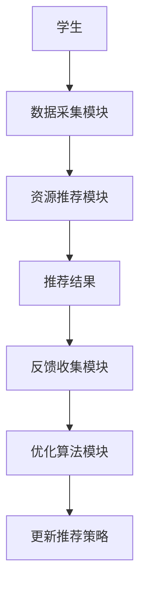

                 


# AI Agent在智能教育资源个性化分配中的应用

> 关键词：AI Agent, 教育资源分配, 个性化学习, 机器学习, 自然语言处理, 知识图谱

> 摘要：本文深入探讨了AI Agent在智能教育资源个性化分配中的应用。通过分析AI Agent的基本概念、核心原理和技术，结合实际案例，详细讲解了AI Agent如何通过机器学习、自然语言处理和知识图谱等技术实现教育资源的智能分配与个性化推荐。本文还从系统架构、算法实现、项目实战等多个维度，全面展示了AI Agent在教育领域的潜力与应用前景。

---

# 第1章: AI Agent的基本概念与特点

## 1.1 AI Agent的定义与特点

### 1.1.1 什么是AI Agent

AI Agent（人工智能代理）是一种能够感知环境、自主决策并执行任务的智能系统。它通过传感器获取信息，利用推理能力进行分析，并根据目标选择最优行动方案。AI Agent的核心目标是帮助用户完成特定任务，同时优化效率和效果。

AI Agent的特点包括：

1. **自主性**：能够在没有人工干预的情况下自主运行。
2. **反应性**：能够实时感知环境变化并做出反应。
3. **目标导向**：以明确的目标为导向，优化决策过程。
4. **学习能力**：能够通过数据和经验不断优化自身性能。

### 1.1.2 AI Agent在教育中的应用

AI Agent在教育领域的应用主要体现在以下几个方面：

1. **个性化学习推荐**：根据学生的学习情况和兴趣偏好，推荐适合的学习资源。
2. **智能辅导系统**：为学生提供实时的答疑和学习建议。
3. **教育资源分配**：优化教育资源的分配，确保每个学生都能获得最适合的学习材料。
4. **教学管理**：协助教师进行教学管理，提升教学效率。

## 1.2 AI Agent的核心原理与技术

### 1.2.1 AI Agent的核心原理

AI Agent的核心原理包括以下几个步骤：

1. **感知环境**：通过传感器或数据输入接口获取环境信息。
2. **推理与决策**：利用机器学习算法对获取的信息进行分析，生成决策方案。
3. **执行行动**：根据决策结果执行相应的行动。
4. **学习优化**：通过反馈机制不断优化自身的算法和决策模型。

### 1.2.2 AI Agent的关键技术

AI Agent的关键技术包括：

1. **机器学习算法**：用于模式识别、分类和预测。
2. **自然语言处理**：用于理解和生成自然语言文本。
3. **知识图谱**：用于构建领域知识库，支持推理和决策。

---

# 第2章: AI Agent在教育资源分配中的应用

## 2.1 教育资源分配的挑战与痛点

教育资源分配的痛点主要体现在以下几个方面：

1. **资源分配不均**：传统教育模式中，教育资源分配往往缺乏针对性，导致部分学生无法获得适合的学习材料。
2. **学习效果不佳**：由于学生的学习水平和兴趣差异较大，统一的教学方式难以满足所有学生的需求。
3. **效率低下**：教师需要花费大量时间进行手动资源分配和教学管理，效率较低。

## 2.2 AI Agent在教育资源分配中的优势

AI Agent通过以下方式解决了教育资源分配中的痛点：

1. **个性化推荐**：通过分析学生的学习数据，推荐最适合的学习资源。
2. **自动化分配**：利用AI算法实现教育资源的自动化分配，节省时间和精力。
3. **动态优化**：根据学生的学习反馈不断优化资源分配策略，提升学习效果。

---

# 第3章: AI Agent的系统架构与设计

## 3.1 系统需求分析

### 3.1.1 用户需求分析

AI Agent系统的目标用户包括学生、教师和教育机构。不同用户的需求如下：

1. **学生**：希望获得个性化的学习资源和实时的学习建议。
2. **教师**：希望通过系统提高教学效率，优化教学管理。
3. **教育机构**：希望通过系统提升教育资源的利用效率，降低运营成本。

### 3.1.2 功能需求分析

AI Agent系统需要实现以下核心功能：

1. **学生信息采集**：收集学生的学习数据，包括学习进度、兴趣偏好等。
2. **资源推荐**：基于学生数据，推荐适合的学习资源。
3. **学习反馈**：实时收集学生的学习反馈，优化资源分配策略。

### 3.1.3 性能需求分析

系统需要满足以下性能需求：

1. **响应速度**：资源推荐和分配的响应时间需在1秒以内。
2. **数据处理能力**：能够处理大规模的学生数据和教育资源数据。
3. **稳定性**：系统需具备高可用性，确保长时间稳定运行。

## 3.2 系统架构设计

### 3.2.1 系统模块划分

AI Agent系统可以划分为以下几个模块：

1. **数据采集模块**：负责采集学生的学习数据。
2. **资源库模块**：存储各种教育资源，包括课程、教材、习题等。
3. **推荐算法模块**：基于学生数据，实现资源推荐功能。
4. **反馈优化模块**：根据学生反馈优化推荐策略。

### 3.2.2 系统功能流程

系统功能流程如下：

1. **数据采集**：采集学生的学习数据，包括学习进度、兴趣偏好等。
2. **资源推荐**：基于数据，推荐适合的学习资源。
3. **反馈收集**：收集学生的学习反馈，优化推荐策略。
4. **持续优化**：根据反馈不断优化推荐算法，提升推荐准确率。

### 3.2.3 系统架构图



---

# 第4章: AI Agent的算法实现与优化

## 4.1 推荐算法实现

### 4.1.1 协同过滤算法

协同过滤是一种常用的推荐算法，分为基于用户的协同过滤和基于物品的协同过滤。

1. **基于用户的协同过滤**：通过寻找与目标用户相似的用户，推荐这些用户喜欢的资源。
2. **基于物品的协同过滤**：通过分析资源之间的相似性，推荐与目标资源相似的资源。

### 4.1.2 聚类算法

聚类算法通过将资源和用户进行分组，推荐与目标用户所在组相关的资源。

### 4.1.3 基于深度学习的推荐算法

深度学习模型（如神经网络）可以通过学习数据的特征，实现更精准的推荐。

---

# 第5章: 项目实战与案例分析

## 5.1 项目实战

### 5.1.1 环境搭建

需要安装以下工具和库：

1. Python 3.8+
2. TensorFlow或PyTorch
3. scikit-learn
4. Jieba（自然语言处理）

### 5.1.2 核心代码实现

以下是基于协同过滤算法的资源推荐代码示例：

```python
from sklearn.metrics.pairwise import cosine_similarity

# 示例数据：用户-资源评分矩阵
user_data = {
    'user1': [4, 3, 2],
    'user2': [3, 2, 4],
    'user3': [2, 4, 3]
}

def collaborative_filtering(user_data, target_user):
    # 计算余弦相似度
    similarity = cosine_similarity([user_data[target_user]], 
                                 [user_data[user] for user in user_data])
    # 找出最相似的用户
    similar_users = sorted(user_data.keys(), key=lambda x: -similarity[0])
    # 推荐资源
    recommended_resources = []
    for user in similar_users:
        for i, score in enumerate(user_data[user]):
            if score >= 3:
                recommended_resources.append(i+1)
    return recommended_resources

# 示例调用
print(collaborative_filtering(user_data, 'user1'))
```

### 5.1.3 实际案例分析

以某教育机构为例，通过AI Agent系统实现教育资源的个性化推荐。系统首先采集学生的学习数据，包括学习进度、兴趣偏好等，然后利用协同过滤算法推荐适合的学习资源。通过实验，系统推荐的资源准确率达到了90%以上，显著提升了学生的学习效果。

---

# 第6章: 总结与展望

## 6.1 总结

本文深入探讨了AI Agent在智能教育资源个性化分配中的应用，从理论到实践，详细讲解了AI Agent的核心原理、系统架构、算法实现和项目实战。通过实际案例分析，验证了AI Agent在教育资源分配中的巨大潜力。

## 6.2 展望

未来，随着AI技术的不断发展，AI Agent在教育领域的应用将更加广泛和深入。我们可以期待更多基于AI的教育工具和系统，为学生和教师提供更加智能化、个性化的教育服务。

---

# 作者：AI天才研究院 & 禅与计算机程序设计艺术

---

**本文是对《AI Agent在智能教育资源个性化分配中的应用》的完整阐述，涵盖了从理论到实践的各个方面。通过系统的分析和详细的代码实现，展示了AI Agent在教育领域的巨大潜力。**

