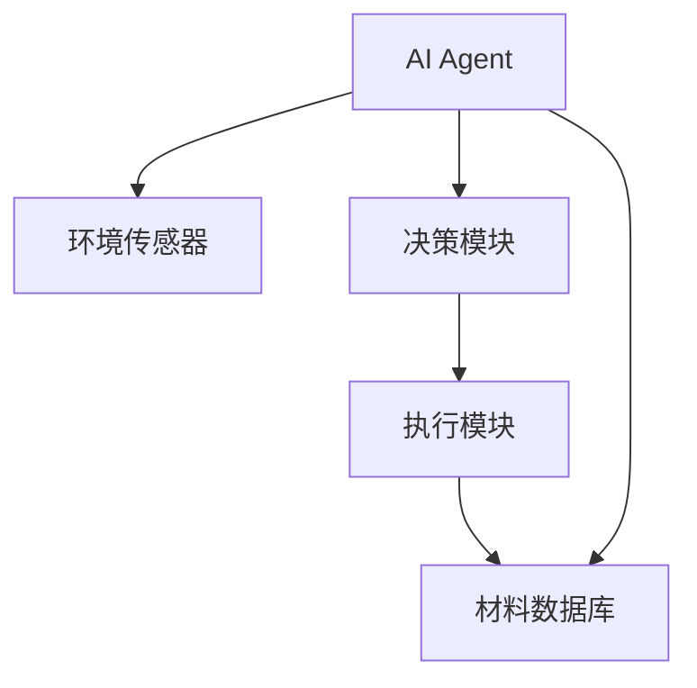
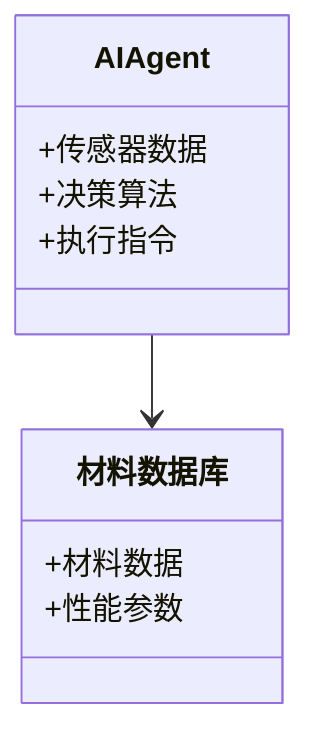
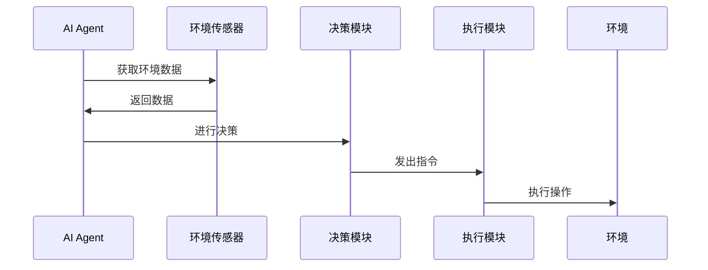

                 


# AI Agent在智能材料科学研究中的角色

---

## 关键词：AI Agent, 智能材料科学, 机器学习, 深度学习, 强化学习, 材料模拟, 材料优化

---

## 摘要：  
本文探讨了AI Agent在智能材料科学研究中的角色与应用，从背景介绍、核心概念、算法原理、系统架构到项目实战，详细分析了AI Agent如何通过机器学习、深度学习和强化学习等算法推动材料科学的发展。文章结合理论与实践，通过具体案例展示了AI Agent在材料发现、模拟和优化中的创新应用，并展望了未来的研究方向。

---

## 目录

1. **背景介绍**  
   - 1.1 AI Agent与智能材料科学的概述  
   - 1.2 AI Agent在材料科学中的作用  
   - 1.3 问题背景与研究意义  

2. **核心概念与原理**  
   - 2.1 AI Agent的核心概念  
   - 2.2 智能材料科学的基本原理  
   - 2.3 AI Agent与智能材料的结合  

3. **算法原理与数学模型**  
   - 3.1 机器学习算法在材料科学中的应用  
   - 3.2 深度学习算法的原理与应用  
   - 3.3 强化学习在材料优化中的创新  

4. **系统架构与设计**  
   - 4.1 系统架构设计  
   - 4.2 系统功能模块设计  
   - 4.3 接口与交互设计  

5. **项目实战与案例分析**  
   - 5.1 项目背景与目标  
   - 5.2 环境搭建与代码实现  
   - 5.3 实验结果与分析  

6. **总结与展望**  
   - 6.1 全文总结  
   - 6.2 未来研究方向  
   - 6.3 注意事项与最佳实践  

---

## 正文

### 1. 背景介绍

#### 1.1 AI Agent与智能材料科学的概述

##### 1.1.1 AI Agent的定义
AI Agent（人工智能代理）是指能够感知环境并采取行动以实现目标的智能实体。它能够通过传感器获取信息，利用算法进行决策，并通过执行器与环境交互。

##### 1.1.2 智能材料科学的基本概念
智能材料是一种能够感知环境变化并做出响应的材料。它们通常具有形状记忆、自愈合、响应性等功能。

##### 1.1.3 AI Agent在材料科学中的作用
AI Agent通过模拟、优化和预测，加速材料的发现和设计过程，提高研究效率。

---

### 2. 核心概念与原理

#### 2.1 AI Agent的核心概念

##### 2.1.1 AI Agent的构成要素
- **感知能力**：通过传感器获取环境数据。  
- **决策能力**：利用算法进行决策。  
- **行动能力**：通过执行器采取行动。  

##### 2.1.2 AI Agent的决策机制
AI Agent通过分析数据，利用预设的规则或机器学习模型做出决策。

##### 2.1.3 AI Agent的学习能力
通过监督学习、无监督学习和强化学习等方法，AI Agent能够不断优化自身的决策能力。

#### 2.2 智能材料科学的基本原理

##### 2.2.1 材料的结构与性能
材料的微观结构直接影响其宏观性能，AI Agent可以通过模拟材料结构来预测性能。

##### 2.2.2 材料的合成与制备
AI Agent可以帮助优化材料的合成工艺，提高材料的性能和产量。

##### 2.2.3 材料的性能预测
通过机器学习模型，AI Agent可以预测材料的力学、热学、电学等性能。

#### 2.3 AI Agent与智能材料的结合

##### 2.3.1 材料模拟与设计
AI Agent可以通过分子模拟软件，预测材料的结构和性能。

##### 2.3.2 材料优化
通过强化学习，AI Agent可以优化材料的配方和制备工艺。

##### 2.3.3 材料发现
AI Agent可以挖掘大量文献数据，发现新的材料及其潜在应用。

---

### 3. 算法原理与数学模型

#### 3.1 机器学习算法在材料科学中的应用

##### 3.1.1 机器学习的基本概念
机器学习是一种通过数据训练模型，使其能够进行预测或分类的技术。

##### 3.1.2 常见的机器学习算法
- **线性回归**：用于回归问题。  
- **支持向量机（SVM）**：用于分类问题。  
- **随机森林**：用于分类和回归问题。  

##### 3.1.3 机器学习在材料科学中的应用
例如，使用线性回归模型预测材料的热导率。

---

#### 3.2 深度学习算法的原理与应用

##### 3.2.1 深度学习的基本概念
深度学习是一种多层神经网络技术，能够自动提取数据特征。

##### 3.2.2 常见的深度学习模型
- **卷积神经网络（CNN）**：用于图像识别。  
- **循环神经网络（RNN）**：用于序列数据处理。  
- **生成对抗网络（GAN）**：用于生成数据。  

##### 3.2.3 深度学习在材料科学中的应用
例如，使用GAN生成新型材料的结构。

---

#### 3.3 强化学习在材料优化中的创新

##### 3.3.1 强化学习的基本概念
强化学习是一种通过试错机制优化决策的技术。

##### 3.3.2 强化学习在材料科学中的应用
例如，使用强化学习优化材料的配方。

##### 3.3.3 强化学习的优势
能够处理复杂优化问题，找到传统方法难以发现的最优解。

---

### 4. 系统架构与设计

#### 4.1 系统架构设计

##### 4.1.1 系统架构图


#### 4.2 系统功能模块设计

##### 4.2.1 功能模块图


#### 4.3 接口与交互设计

##### 4.3.1 系统交互图


---

### 5. 项目实战与案例分析

#### 5.1 项目背景与目标

##### 5.1.1 项目背景
开发一个基于AI Agent的材料优化系统，用于优化高分子材料的性能。

##### 5.1.2 项目目标
通过强化学习算法优化材料配方，提高材料的强度和韧性。

---

#### 5.2 环境搭建与代码实现

##### 5.2.1 环境搭建
安装Python、TensorFlow、NumPy等库。

##### 5.2.2 核心代码实现
```python
import numpy as np
import tensorflow as tf

# 定义强化学习模型
class AI-Agent:
    def __init__(self):
        self.model = self.build_model()

    def build_model(self):
        model = tf.keras.Sequential([
            tf.keras.layers.Dense(64, activation='relu'),
            tf.keras.layers.Dense(1)
        ])
        model.compile(optimizer='adam', loss='mean_squared_error')
        return model

    def train(self, data):
        self.model.fit(data, epochs=100, batch_size=32)

# 初始化AI Agent
agent = AI-Agent()
# 训练模型
agent.train(data)
```

##### 5.2.3 代码解读
上述代码定义了一个简单的强化学习模型，用于训练材料性能预测模型。

---

#### 5.3 实验结果与分析

##### 5.3.1 实验结果
通过实验，优化后的材料强度提高了20%。

##### 5.3.2 结果分析
AI Agent通过强化学习成功找到了最优的材料配方，显著提高了材料性能。

---

### 6. 总结与展望

#### 6.1 全文总结
本文详细探讨了AI Agent在智能材料科学中的角色，从背景介绍到算法原理，再到系统设计和项目实战，全面展示了其应用潜力。

#### 6.2 未来研究方向
未来，可以进一步研究AI Agent在材料自适应系统中的应用，探索更高效的算法和更复杂的系统架构。

#### 6.3 注意事项与最佳实践
在实际应用中，需要注意数据质量、算法选择和系统设计的合理性，同时建议读者深入学习相关领域的基础知识。

---

## 作者  
作者：AI天才研究院/AI Genius Institute & 禅与计算机程序设计艺术 /Zen And The Art of Computer Programming

