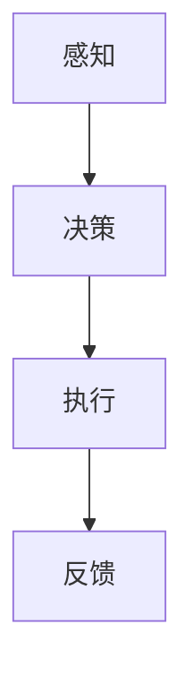
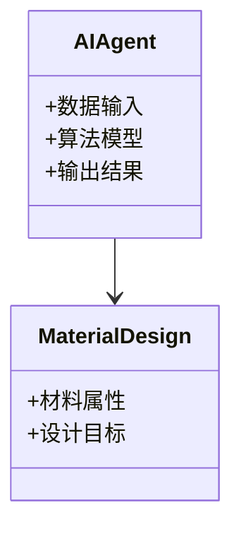
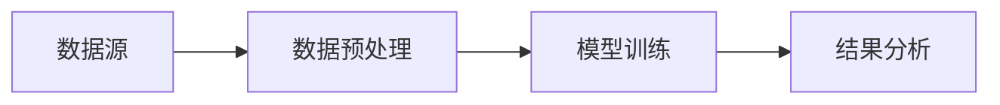
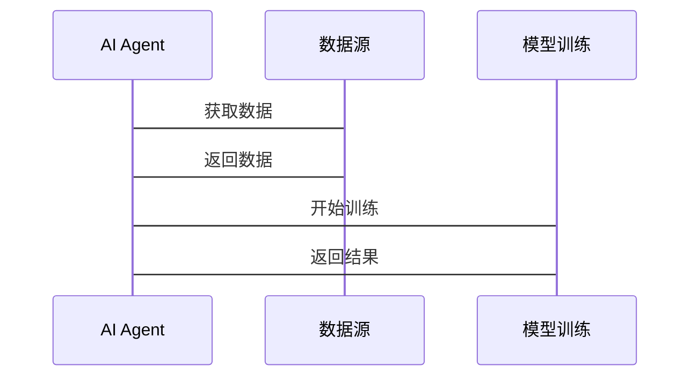

                 


# AI Agent在智能材料设计中的角色

## 关键词
AI Agent, 智能材料设计, 强化学习, 生成模型, 材料科学, 人工智能

## 摘要
AI Agent在智能材料设计中扮演着越来越重要的角色，通过结合强化学习和生成模型等先进算法，AI Agent能够显著提高材料设计的效率和准确性。本文详细探讨了AI Agent在智能材料设计中的核心概念、算法原理、系统架构以及实际应用，分析了其在材料科学中的潜力和未来发展方向。

---

# 第一部分: AI Agent与智能材料设计的背景介绍

## 第1章: AI Agent的基本概念与作用

### 1.1 AI Agent的定义与核心功能
AI Agent是一种能够感知环境、做出决策并执行动作的智能实体。其核心功能包括感知、决策和执行。

- **感知**：通过传感器或数据输入，AI Agent获取环境信息。
- **决策**：基于感知信息，AI Agent利用算法做出最优决策。
- **执行**：通过执行机构将决策转化为实际动作。

### 1.2 智能材料的基本概念
智能材料是指能够感知外界环境变化并做出相应反应的材料，例如形状记忆合金和压电材料。

### 1.3 AI Agent在智能材料设计中的背景与意义
AI Agent通过优化算法和数据处理能力，显著提升了材料设计的效率和精度。

---

## 第2章: AI Agent在智能材料设计中的角色

### 2.1 AI Agent在智能材料设计中的功能模块
AI Agent在材料设计中的功能模块包括数据采集与处理、材料性能预测和设计优化与验证。

### 2.2 AI Agent与智能材料设计的关系
AI Agent作为辅助工具，在材料设计中起到了关键作用，尤其是在材料性能预测和优化方面。

---

## 第3章: AI Agent在智能材料设计中的核心概念与联系

### 3.1 核心概念原理
- **强化学习**：通过奖励机制优化材料性能。
- **生成模型**：用于材料结构的创新设计。

### 3.2 核心概念对比表格
| 方法         | 优点                           | 缺点                           |
|--------------|--------------------------------|---------------------------------|
| 传统设计     | 简单易行                       | 效率低下                       |
| AI Agent辅助 | 高效准确                       | 技术复杂                       |

### 3.3 ER实体关系图架构
```mermaid
er
actor(AI Agent) -->
 owns(Material Design Process)
 owns(Optimization Algorithm)
```

---

# 第二部分: AI Agent在智能材料设计中的算法原理

## 第4章: AI Agent的核心算法与实现

### 4.1 强化学习算法在材料设计中的应用
强化学习通过奖励机制优化材料性能。



### 4.2 生成模型在材料设计中的应用
生成模型通过深度学习生成材料结构。

```python
import numpy as np
import tensorflow as tf

# 示例代码
def generate_material_structure():
    model = tf.keras.Sequential()
    # 模型定义
    return model
```

---

# 第三部分: 系统分析与架构设计

## 第5章: 问题场景介绍

### 5.1 问题场景
设计高性能智能材料，优化材料性能。

## 第6章: 系统功能设计

### 6.1 领域模型


### 6.2 系统架构


### 6.3 系统交互


---

# 第四部分: 项目实战

## 第7章: 环境安装

### 7.1 环境配置
安装Python和相关库（如TensorFlow、Keras）。

## 第8章: 核心代码实现

### 8.1 代码示例
```python
def optimize_material_property(properties):
    # 示例代码
    return optimized_properties
```

## 第9章: 案例分析

### 9.1 案例分析
分析AI Agent在材料设计中的实际应用案例，解读代码功能和结果。

---

# 第五部分: 最佳实践

## 第10章: 小结与展望

### 10.1 小结
总结AI Agent在智能材料设计中的作用和优势。

## 10.2 注意事项
注意数据质量和模型泛化能力。

## 10.3 扩展阅读
推荐相关领域的书籍和论文。

---

# 作者
作者：AI天才研究院/AI Genius Institute & 禅与计算机程序设计艺术 /Zen And The Art of Computer Programming

