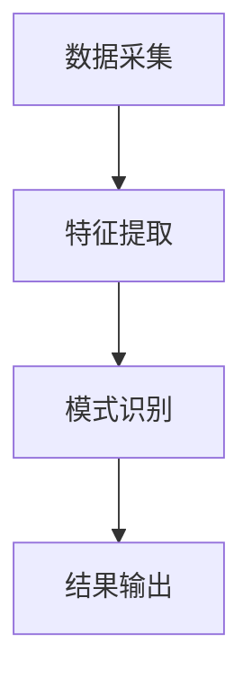
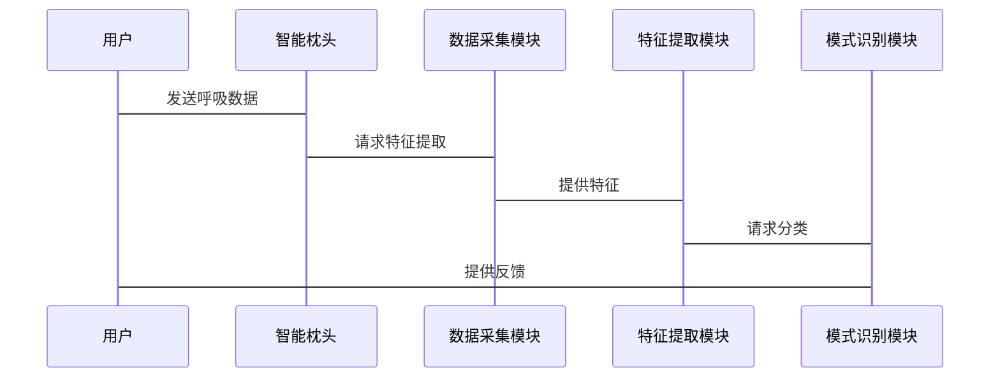

                 


# AI Agent在智能枕头中的呼吸模式分析

## 关键词：AI Agent, 智能枕头, 呼吸模式, 数据分析, 健康监测, 人工智能

## 摘要：  
本文探讨了AI Agent在智能枕头中的应用，特别是如何通过分析用户的呼吸模式来优化睡眠质量。文章从背景介绍、核心概念、算法原理、系统架构到项目实战，全面分析了AI Agent在呼吸模式分析中的作用，并通过实际案例展示了其在改善睡眠健康方面的潜力。

---

# 第1章 背景介绍与问题背景

## 1.1 AI Agent的基本概念

### 1.1.1 什么是AI Agent
AI Agent（人工智能代理）是一种能够感知环境、做出决策并执行任务的智能实体。它通过传感器获取数据，利用算法处理信息，并通过执行器与环境互动。AI Agent可以是软件程序，也可以是嵌入硬件的智能系统。

### 1.1.2 AI Agent的核心特点
- **自主性**：能够在没有外部干预的情况下独立运作。
- **反应性**：能够实时感知环境变化并做出响应。
- **目标导向**：具备明确的目标，通过行为选择实现目标。
- **学习能力**：能够通过数据和经验不断优化性能。

### 1.1.3 AI Agent的应用场景
AI Agent广泛应用于多个领域，包括智能家居、医疗健康、自动驾驶和金融分析等。本文聚焦于AI Agent在智能枕头中的应用，特别是在呼吸模式分析方面。

---

## 1.2 智能枕头与呼吸模式分析

### 1.2.1 智能枕头的定义与功能
智能枕头是一种集成多种传感器和智能算法的睡眠辅助设备。它通过监测用户的生理数据（如心率、呼吸频率和体动）来提供个性化的睡眠建议和健康报告。

### 1.2.2 呼吸模式分析的重要性
呼吸模式是评估睡眠质量的重要指标。异常的呼吸模式，如鼾症或呼吸暂停，可能导致睡眠中断，影响用户的健康和生活质量。

### 1.2.3 问题背景与问题描述
睡眠障碍问题在全球范围内普遍存在，特别是睡眠呼吸暂停综合征（Sleep Apnea Syndrome, SAS）严重影响了患者的健康。智能枕头通过实时监测和分析呼吸模式，能够及时发现异常情况，为用户提供健康预警和改善建议。

---

# 第2章 核心概念与联系

## 2.1 AI Agent的基本原理

### 2.1.1 感知机制
AI Agent通过传感器收集数据，如麦克风采集呼吸声或心率传感器监测心跳。这些数据经过预处理后，用于后续分析。

### 2.1.2 决策机制
AI Agent利用机器学习算法（如支持向量机或随机森林）对呼吸数据进行分类和预测。通过分析呼吸频率、深度和节奏，AI Agent能够识别异常呼吸模式。

### 2.1.3 执行机制
AI Agent根据分析结果，通过反馈系统（如调整枕头高度或震动提醒）干预用户的呼吸模式，帮助改善睡眠质量。

---

## 2.2 呼吸模式分析的核心要素

### 2.2.1 呼吸频率
呼吸频率是指每分钟的呼吸次数。正常的成年人呼吸频率为12-20次/分钟。异常的呼吸频率可能表明健康问题。

### 2.2.2 呼吸深度
呼吸深度反映了每次呼吸的力度。深度不一可能导致睡眠中断。

### 2.2.3 呼吸节奏
呼吸节奏是指呼吸的周期性模式。不规则的呼吸节奏可能与睡眠障碍有关。

---

# 第3章 算法原理讲解

## 3.1 数据采集与特征提取

### 3.1.1 数据采集方法
智能枕头通常使用压电传感器或麦克风采集呼吸声。数据采集后，通过滤波和标准化处理，提取有用的特征。

### 3.1.2 特征提取算法
常用的特征提取方法包括：
- **时间域特征**：均值、标准差、最大值。
- **频域特征**：功率谱密度、峰频。

---

## 3.2 算法流程图



---

## 3.3 Python源代码实现

```python
import numpy as np
from sklearn.svm import SVC

def extract_features(data):
    # 时间域特征
    mean = np.mean(data)
    std = np.std(data)
    max_val = np.max(data)
    # 频域特征
    fft = np.fft.fft(data)
    power = np.abs(fft)
    return [mean, std, max_val, np.mean(power)]
```

---

## 3.4 数学模型与公式

呼吸模式分类的数学模型可以表示为：

$$
y = f(x) = w_1x_1 + w_2x_2 + \dots + w_nx_n + b
$$

其中，$x_i$ 是输入特征，$w_i$ 是权重，$b$ 是截距。

---

# 第4章 系统分析与架构设计

## 4.1 系统功能设计

### 4.1.1 用户需求分析
- 实时监测呼吸模式
- 提供健康预警和改善建议

### 4.1.2 功能模块划分
- 数据采集模块
- 特征提取模块
- 模式识别模块
- 结果反馈模块

---

## 4.2 系统架构设计


---

## 4.3 接口设计与交互流程图



---

# 第5章 项目实战与案例分析

## 5.1 环境安装与配置

### 5.1.1 Python安装
安装Python 3.8及以上版本。

### 5.1.2 库的安装
安装numpy、scikit-learn和pyaudio库。

```bash
pip install numpy scikit-learn pyaudio
```

---

## 5.2 核心代码实现

### 5.2.1 数据采集代码

```python
import pyaudio

CHUNK = 1024
FORMAT = pyaudio.paInt16
RATE = 44100
CHANNELS = 1

p = pyaudio.PyAudio()
stream = p.open(format=FORMAT, channels=CHANNELS, rate=RATE, input=True, frames_per_buffer=CHUNK)
```

---

## 5.2.2 特征提取与分类

```python
from sklearn.model_selection import train_test_split
from sklearn.metrics import accuracy_score

X = extract_features(data)
y = labels
X_train, X_test, y_train, y_test = train_test_split(X, y, test_size=0.2)
model = SVC()
model.fit(X_train, y_train)
y_pred = model.predict(X_test)
print("准确率:", accuracy_score(y_test, y_pred))
```

---

## 5.3 案例分析

### 5.3.1 鼾症患者分析
通过分析鼾症患者的呼吸模式，AI Agent能够识别出呼吸暂停事件，帮助医生诊断SAS。

---

## 5.4 项目小结

智能枕头通过AI Agent分析呼吸模式，能够有效改善睡眠质量。本文通过理论分析和代码实现，展示了AI技术在健康监测中的潜力。

---

# 第6章 最佳实践与总结

## 6.1 小结
本文详细介绍了AI Agent在智能枕头中的应用，从背景、原理到实战，全面分析了呼吸模式的监测与改善方法。

## 6.2 注意事项
- 数据隐私保护
- 算法的实时性和准确性

## 6.3 拓展阅读
- 《机器学习实战》
- 《深度学习入门》

---

# 作者
作者：AI天才研究院 & 禅与计算机程序设计艺术

