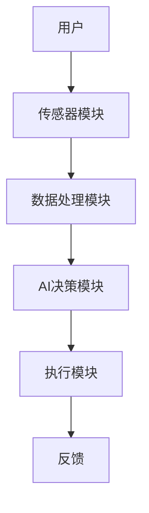
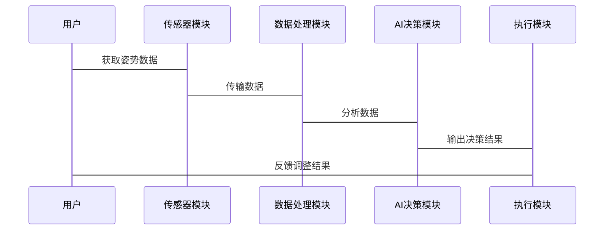

                 


# AI Agent在智能枕头中的颈椎保护

> 关键词：AI Agent, 智能枕头, 颈椎保护, 健康监测, 算法, 传感器

> 摘要：本文探讨了AI Agent在智能枕头中的应用，详细分析了其在颈椎保护中的作用。通过结合传感器、机器学习算法和智能调整机制，AI Agent能够实时监测用户的颈椎状态，并提供相应的保护措施。文章从算法原理、系统设计到实际应用进行了全面解析，展示了AI Agent在智能枕头中的潜力和实际效果。

---

# 第一部分: AI Agent在智能枕头中的颈椎保护概述

## 第1章: 背景介绍

### 1.1 问题背景

颈椎健康的重要性不言而喻。随着现代生活方式的改变，长时间低头看手机、电脑导致的颈椎问题日益严重。世界卫生组织的数据显示，全球超过10亿人受到颈椎病的影响。颈椎病不仅影响健康，还可能导致严重的神经损伤甚至瘫痪。因此，预防颈椎问题显得尤为重要。

AI Agent（人工智能代理）的介入为颈椎保护提供了新的思路。传统枕头仅能提供支撑，无法实时监测和调整。而智能枕头结合AI Agent，能够实时监测用户的颈椎状态，并根据数据做出调整，从而实现主动保护。

### 1.2 核心概念

#### 1.2.1 AI Agent的定义与特点

AI Agent是一种能够感知环境、做出决策并执行动作的智能实体。它能够通过传感器获取数据，利用算法进行分析，并根据结果采取相应的行动。AI Agent的特点包括：

1. **实时性**：能够快速响应用户的动作和环境变化。
2. **智能性**：通过算法学习和优化，不断提高保护效果。
3. **适应性**：能够根据用户的状态自动调整。

#### 1.2.2 智能枕头的功能与结构

智能枕头通过内置传感器采集用户的姿势数据，利用AI Agent进行分析，并通过反馈机制调整枕头的高度和硬度，从而提供最佳的颈椎保护。其结构通常包括：

1. **传感器模块**：用于采集用户的姿势数据。
2. **数据处理模块**：对传感器数据进行处理和分析。
3. **AI决策模块**：基于数据做出调整决策。
4. **执行模块**：根据决策调整枕头的支撑。

#### 1.2.3 颈椎保护与AI Agent的结合

AI Agent通过实时监测用户的颈椎状态，能够主动调整枕头的高度和硬度，从而预防颈椎问题的发生。例如，当用户长时间保持不良姿势时，AI Agent会通过反馈机制提醒用户调整姿势，并自动调整枕头的角度，以提供最佳的支撑。

---

## 第2章: 核心概念与联系

### 2.1 AI Agent的原理

AI Agent在智能枕头中的工作原理可以分为三个主要环节：感知、决策和执行。

#### 2.1.1 感知层

感知层通过传感器采集用户的姿势数据，包括：

- **角度传感器**：监测枕头的角度和用户的头部姿势。
- **压力传感器**：监测头部和肩部的压力分布。
- **加速度传感器**：监测用户的运动和姿势变化。

#### 2.1.2 决策层

决策层利用采集到的数据，通过算法进行分析和决策。常用的算法包括：

- **机器学习算法**：如支持向量机（SVM）、随机森林（Random Forest）等，用于分类和预测。
- **规则引擎**：基于预设的规则进行决策，如当头部姿势超过一定角度时触发调整。

#### 2.1.3 执行层

执行层根据决策结果调整枕头的高度和硬度。例如，通过电机调整枕头的角度，或通过气囊调节枕头的硬度。

### 2.2 智能枕头的实体关系图

以下是一个简单的ER实体关系图，展示了智能枕头中的实体及其关系：

```mermaid
er
    entity 用户 {
        id
        姓名
        年龄
    }
    entity 传感器数据 {
        id
        采集时间
        角度数据
        压力数据
    }
    entity AI决策结果 {
        id
        决策时间
        调整建议
    }
    entity 枕头 {
        id
        类型
        状态
    }
    用户 --> 传感器数据: 提供
    传感器数据 --> AI决策结果: 分析
    AI决策结果 --> 枕头: 调整
```

### 2.3 AI Agent与传统健康监测的对比

以下是一个对比表格，展示了AI Agent与传统健康监测设备的区别：

| 特性                | 传统传感器 | AI Agent |
|---------------------|------------|-----------|
| 数据采集            | 能         | 能         |
| 数据分析            | 不能       | 能         |
| 实时反馈            | 能         | 能         |
| 自主决策            | 不能       | 能         |
| 适应性              | 低         | 高         |

---

## 第3章: 算法原理讲解

### 3.1 数据采集与处理

#### 3.1.1 传感器数据采集

传感器数据采集是AI Agent工作的基础。以下是常见的传感器类型及其功能：

- **角度传感器**：监测枕头的角度和用户的头部姿势。
- **压力传感器**：监测头部和肩部的压力分布。
- **加速度传感器**：监测用户的运动和姿势变化。

#### 3.1.2 数据预处理

数据预处理是确保数据准确性的关键步骤。常见的预处理方法包括：

1. **去噪处理**：去除传感器数据中的噪声。
2. **归一化处理**：将数据标准化，以便后续分析。

### 3.2 AI Agent的决策算法

#### 3.2.1 基于机器学习的分类算法

机器学习算法是AI Agent的核心。以下是常用的分类算法及其原理：

- **支持向量机（SVM）**：通过构建超平面将数据分为两类。
- **随机森林（Random Forest）**：通过集成多个决策树进行分类。

#### 3.2.2 基于规则的决策树

基于规则的决策树是一种简单有效的决策方法。以下是决策树的构建步骤：

1. **数据收集**：收集用户的姿势数据。
2. **规则制定**：根据专家经验制定决策规则。
3. **规则执行**：根据规则做出决策。

#### 3.2.3 算法实现

以下是基于SVM的分类算法的Python实现示例：

```python
from sklearn import svm

# 数据预处理
X = ...  # 特征向量
y = ...  # 标签

# 训练模型
clf = svm.SVC()
clf.fit(X, y)

# 预测
预测结果 = clf.predict(X_test)
```

### 3.3 数学模型与公式

以下是颈椎健康评估模型的数学公式：

$$
健康指数 = \sum_{i=1}^{n} (权重_i \times 特征_i)
$$

其中，$权重_i$ 是特征 $i$ 的权重，$特征_i$ 是特征的值。

---

## 第4章: 数学模型与公式推导

### 4.1 颈椎健康评估模型

颈椎健康评估模型是AI Agent的核心之一。以下是模型的建立步骤：

1. **特征选择**：选择影响颈椎健康的关键特征。
2. **模型建立**：建立数学模型，如线性回归模型。
3. **模型训练**：通过数据训练模型。
4. **模型评估**：评估模型的准确性和可靠性。

以下是线性回归模型的公式：

$$
健康指数 = \beta_0 + \beta_1x_1 + \beta_2x_2 + \cdots + \beta_nx_n
$$

其中，$\beta_i$ 是回归系数，$x_i$ 是特征变量。

---

## 第5章: 系统分析与架构设计

### 5.1 系统功能设计

智能枕头的系统功能设计包括以下几个方面：

1. **数据采集**：通过传感器采集用户的姿势数据。
2. **数据分析**：利用AI Agent分析数据并做出决策。
3. **反馈机制**：根据决策调整枕头的高度和硬度。

### 5.2 系统架构设计

以下是智能枕头的系统架构图：



### 5.3 系统接口设计

系统接口设计是确保各模块协同工作的关键。以下是主要接口：

1. **传感器接口**：与传感器模块通信，获取数据。
2. **AI决策接口**：与AI决策模块通信，获取决策结果。
3. **执行接口**：与执行模块通信，调整枕头。

### 5.4 系统交互设计

以下是系统交互的序列图：



---

## 第6章: 项目实战

### 6.1 环境搭建

以下是项目实战的环境搭建步骤：

1. **安装必要的库**：如numpy、scikit-learn等。
2. **配置传感器**：连接传感器并测试数据采集。
3. **安装AI算法库**：如TensorFlow、Keras等。

### 6.2 核心代码实现

以下是核心代码实现示例：

```python
import numpy as np
from sklearn.svm import SVC

# 数据预处理
X = np.array([[角度, 压力, 加速度], ...])  # 特征向量
y = np.array([0, 1, 0, ...])  # 标签

# 训练模型
clf = SVC()
clf.fit(X, y)

# 预测
预测结果 = clf.predict(X_test)
```

### 6.3 实际案例分析

以下是实际案例分析：

1. **案例描述**：用户长时间低头，AI Agent检测到异常姿势。
2. **决策过程**：AI Agent通过传感器数据分析，决定调整枕头角度。
3. **结果反馈**：枕头角度自动调整，提供更好的支撑。

---

## 第7章: 总结与展望

### 7.1 总结

本文详细介绍了AI Agent在智能枕头中的应用，从算法原理到系统设计，再到实际应用，展示了AI Agent在颈椎保护中的巨大潜力。通过实时监测和主动调整，AI Agent能够有效预防颈椎问题的发生。

### 7.2 展望

未来，随着AI技术的不断发展，智能枕头将更加智能化和个性化。AI Agent将能够通过深度学习不断优化算法，提供更加精准的保护。同时，智能枕头还将与其他健康设备联动，形成完整的健康监测系统。

---

## 作者信息

作者：AI天才研究院/AI Genius Institute & 禅与计算机程序设计艺术/Zen And The Art of Computer Programming

