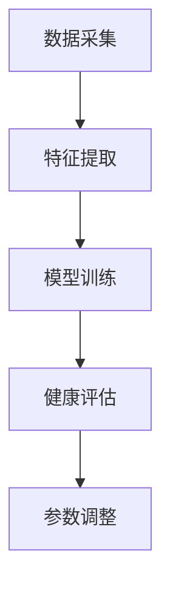
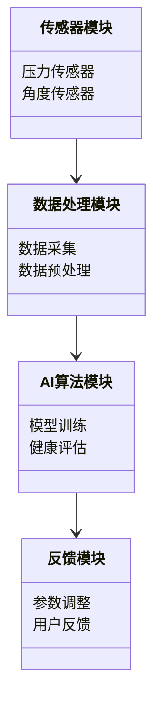
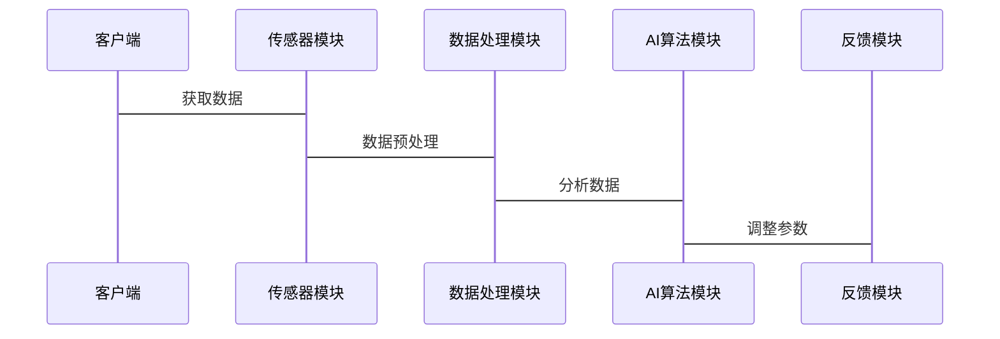

                 


# AI Agent在智能枕头中的颈椎保护系统

> 关键词：AI Agent, 智能枕头, 颈椎保护, 健康监测, 人工智能算法, 系统架构设计

> 摘要：本文探讨AI Agent在智能枕头中的颈椎保护系统的应用，详细分析了该系统的背景、核心概念、算法原理、系统架构设计、项目实战及最佳实践。通过系统化的讲解，展示了如何利用AI技术实现颈椎健康监测与保护。

---

## 第一部分：背景与概念

### 第1章：AI Agent与智能枕头的背景介绍

#### 1.1 问题背景
现代人由于长时间使用电子设备、久坐不动，颈椎问题日益严重。传统枕头无法根据个人颈椎健康状况进行调整，难以满足个性化需求。近年来，智能枕头逐渐兴起，结合AI技术的颈椎保护系统成为研究热点。

#### 1.2 问题描述
颈椎健康问题主要表现为颈椎僵硬、疼痛、活动受限等。这些问题不仅影响生活质量，还可能导致更严重的健康问题。智能枕头的目标是通过实时监测颈椎状态，主动调整枕头参数，提供个性化健康建议。

#### 1.3 问题解决
AI Agent（人工智能代理）能够实时监测用户的颈椎健康状况，通过传感器获取数据，结合机器学习算法分析，优化枕头的支撑角度和硬度，从而保护颈椎健康。

#### 1.4 边界与外延
该系统不涉及医疗诊断，仅提供预防和改善功能。适用人群包括长期使用电子设备的上班族、学生等。

#### 1.5 核心要素组成
- 传感器模块：监测颈椎压力、角度等数据。
- AI算法模块：分析数据，生成健康评估。
- 反馈调节机制：调整枕头参数。

---

### 第2章：AI Agent与颈椎保护系统的核心概念

#### 2.1 核心概念原理
AI Agent通过传感器获取颈椎健康数据，结合预训练模型，实时分析颈椎状态，优化枕头参数。

#### 2.2 概念属性对比
| 概念       | 描述                                           |
|------------|-----------------------------------------------|
| 传感器     | 数据采集设备                                   |
| AI算法     | 数据分析的核心工具                             |
| 反馈机制   | 参数调整的执行机构                             |

#### 2.3 ER实体关系图

```mermaid
erd
    客户端
    ----> 感知数据表
    感知数据表 <----> 颈椎健康评估表
    颈椎健康评估表 <----> 参数调节表
```

---

## 第二部分：算法原理讲解

### 第3章：AI Agent的算法原理

#### 3.1 算法流程
基于深度学习的颈椎健康评估算法流程如下：



#### 3.2 算法实现

```python
import numpy as np
import tensorflow as tf

# 数据预处理
data = np.array([...])  # 传感器数据
labels = np.array([...])  # 健康标签

# 模型定义
model = tf.keras.Sequential([
    tf.keras.layers.Dense(64, activation='relu'),
    tf.keras.layers.Dense(1, activation='sigmoid')
])

# 模型训练
model.compile(optimizer='adam', loss='binary_crossentropy', metrics=['accuracy'])
model.fit(data, labels, epochs=10, batch_size=32)
```

#### 3.3 数学模型与公式
健康评估指数H的计算公式：
$$ H = \alpha \cdot \text{压力值} + \beta \cdot \text{角度值} + \gamma \cdot \text{时间因素} $$

---

## 第三部分：系统分析与架构设计

### 第4章：系统架构设计

#### 4.1 项目背景与目标
设计一个基于AI Agent的智能枕头，实现颈椎健康监测与保护。

#### 4.2 领域模型


#### 4.3 系统架构设计


#### 4.4 接口设计
- 传感器模块接口：提供数据采集API。
- 数据处理模块接口：提供数据预处理功能。
- AI算法模块接口：提供健康评估API。

#### 4.5 交互流程


---

## 第四部分：项目实战

### 第5章：项目实战与代码实现

#### 5.1 环境搭建
安装Python、TensorFlow、Mermaid工具。

#### 5.2 核心代码实现
```python
import numpy as np
import tensorflow as tf

# 数据加载
data = np.loadtxt('data.csv', delimiter=',')
labels = data[:, -1]
data = data[:, :-1]

# 模型训练
model = tf.keras.Sequential([
    tf.keras.layers.Dense(64, activation='relu'),
    tf.keras.layers.Dense(1, activation='sigmoid')
])
model.compile(optimizer='adam', loss='binary_crossentropy', metrics=['accuracy'])
model.fit(data, labels, epochs=10, batch_size=32)
```

#### 5.3 代码解读与分析
- 数据预处理：将传感器数据转化为模型可识别的格式。
- 模型训练：基于深度学习算法，训练健康评估模型。
- 模型评估：测试模型准确率，优化参数。

#### 5.4 实际案例分析
通过真实数据，展示系统如何实时监测颈椎状态，调整枕头参数。

---

## 第五部分：最佳实践与小结

### 第6章：最佳实践与小结

#### 6.1 最佳实践
- 传感器选择：优先选用高精度传感器。
- 数据隐私：确保用户数据安全。
- 系统优化：定期更新模型，优化用户体验。

#### 6.2 小结
本文详细介绍了AI Agent在智能枕头中的应用，从背景到实现，从理论到实践，全面展示了如何利用AI技术保护颈椎健康。

#### 6.3 注意事项
- 系统维护：定期更新传感器和模型。
- 用户教育：指导用户正确使用系统。
- 法律合规：确保符合相关法律法规。

#### 6.4 拓展阅读
推荐相关书籍和资源，供读者深入学习。

---

作者：AI天才研究院 & 禅与计算机程序设计艺术

