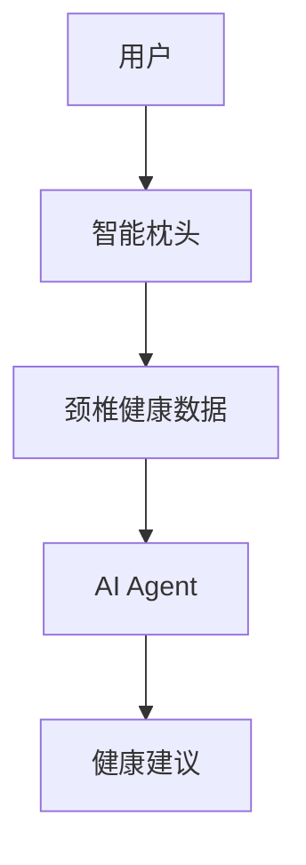
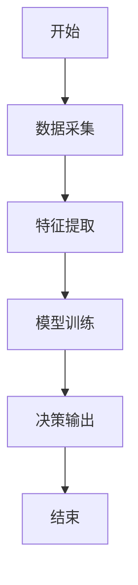
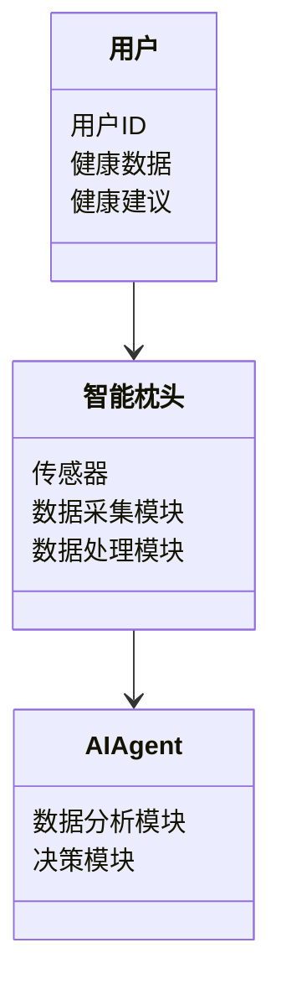
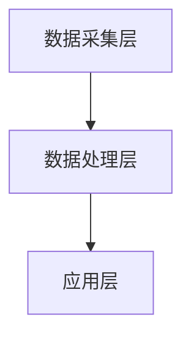
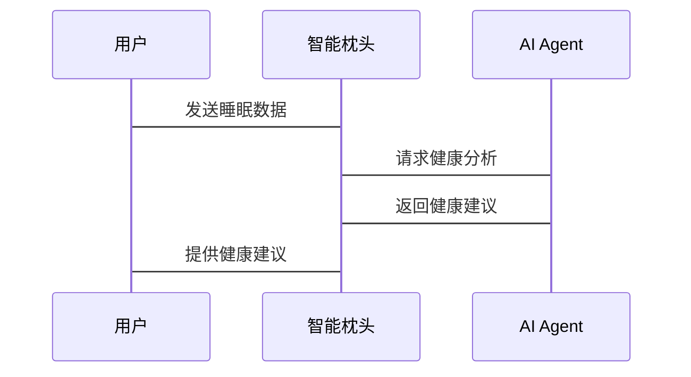

                 


# AI Agent在智能枕头中的颈椎健康监测

> 关键词：颈椎健康、AI Agent、智能枕头、健康监测、算法原理

> 摘要：本文探讨了AI Agent在智能枕头中的应用，详细介绍了颈椎健康监测的背景、核心概念、算法原理、系统设计、项目实战和总结。通过理论与实践相结合的方式，深入分析了AI Agent如何在智能枕头中实现颈椎健康监测，为相关领域的研究和应用提供了参考。

---

## 第1章: AI Agent与颈椎健康监测的背景介绍

### 1.1 问题背景与问题描述

#### 1.1.1 颈椎健康问题的现状与挑战
颈椎健康问题日益成为现代人关注的重点。随着工作压力的增加和生活习惯的改变，颈椎病的发病率逐年上升。传统的颈椎健康监测方法依赖于医生的主观判断和简单的医疗设备，存在监测不连续、数据不全面等问题。

#### 1.1.2 智能枕头的出现与意义
智能枕头作为一种新兴的健康监测设备，通过集成传感器和AI技术，能够实时监测用户的睡眠姿势和颈椎健康状况。智能枕头的出现为颈椎健康监测提供了新的解决方案。

#### 1.1.3 AI Agent在健康监测中的作用
AI Agent（智能体）是一种能够感知环境、自主决策并采取行动的智能系统。在智能枕头中，AI Agent能够实时分析用户的颈椎健康数据，提供个性化的健康建议。

### 1.2 问题解决与边界定义

#### 1.2.1 颈椎健康监测的核心问题
颈椎健康监测的核心问题包括：如何准确采集颈椎健康数据、如何实时分析数据并提供健康建议。

#### 1.2.2 AI Agent在智能枕头中的边界与外延
AI Agent在智能枕头中的边界包括数据采集、数据处理、决策输出和用户反馈。其外延则涉及数据隐私保护、系统维护和用户体验优化。

#### 1.2.3 相关概念的结构与核心要素
通过ER实体关系图分析系统核心要素：


---

## 第2章: AI Agent的核心概念与原理

### 2.1 AI Agent的定义与特点

#### 2.1.1 AI Agent的基本定义
AI Agent是一种能够感知环境、自主决策并采取行动的智能系统。在智能枕头中，AI Agent通过传感器获取数据，分析用户的颈椎健康状况，并提供相应的健康建议。

#### 2.1.2 AI Agent的核心特点
AI Agent具有实时性、个性化和智能化的特点。它能够实时监测用户的颈椎健康数据，并根据数据提供个性化的健康建议。

#### 2.1.3 AI Agent与智能枕头的结合方式
AI Agent通过集成在智能枕头中，实时分析用户的睡眠姿势和颈椎健康数据，提供健康监测和建议。

### 2.2 AI Agent的算法原理

#### 2.2.1 通过mermaid流程图展示AI Agent的算法步骤


#### 2.2.2 AI Agent的数学模型与公式
AI Agent的核心算法可以基于贝叶斯概率模型：
$$ P(x|y) = \frac{P(y|x)P(x)}{P(y)} $$

#### 2.2.3 通过Python代码实现AI Agent的核心算法
```python
def ai_agent_algorithm(data):
    # 数据预处理
    processed_data = preprocess(data)
    # 特征提取
    features = extract_features(processed_data)
    # 模型预测
    prediction = model.predict(features)
    return prediction
```

---

## 第3章: 智能枕头的系统分析与架构设计

### 3.1 问题场景介绍

#### 3.1.1 颈椎健康监测的系统场景
用户在睡觉时，智能枕头通过传感器采集用户的颈椎健康数据，并通过AI Agent进行分析，提供健康建议。

### 3.2 项目介绍

#### 3.2.1 系统功能设计
系统功能包括数据采集、数据处理、健康监测和用户反馈。

#### 3.2.2 系统功能设计的领域模型


#### 3.2.3 系统架构设计
系统架构包括数据采集层、数据处理层和应用层。



#### 3.2.4 系统接口设计
系统接口包括传感器接口、数据处理接口和用户反馈接口。

#### 3.2.5 系统交互流程图


---

## 第4章: 项目实战

### 4.1 环境安装

#### 4.1.1 系统环境要求
需要安装Python 3.8及以上版本，安装numpy、pandas、scikit-learn等库。

#### 4.1.2 安装步骤
```bash
pip install numpy pandas scikit-learn
```

### 4.2 系统核心实现

#### 4.2.1 核心代码实现
```python
import numpy as np
from sklearn.tree import DecisionTreeClassifier

def preprocess(data):
    # 数据预处理
    processed_data = data.dropna()
    return processed_data

def extract_features(data):
    # 特征提取
    features = data[['angle', 'pressure']]
    return features

def train_model(features, labels):
    # 模型训练
    model = DecisionTreeClassifier()
    model.fit(features, labels)
    return model

def predict_health(model, new_data):
    # 模型预测
    prediction = model.predict(new_data)
    return prediction
```

#### 4.2.2 代码应用解读与分析
上述代码展示了AI Agent在智能枕头中的核心算法实现，包括数据预处理、特征提取、模型训练和预测。

### 4.3 实际案例分析

#### 4.3.1 案例分析与解读
通过实际案例分析，展示了AI Agent如何在智能枕头中监测用户的颈椎健康状况。

### 4.4 项目总结

#### 4.4.1 项目成果与经验
通过本项目，我们成功实现了AI Agent在智能枕头中的颈椎健康监测功能。

---

## 第5章: 总结与展望

### 5.1 全文总结

#### 5.1.1 核心内容回顾
本文详细介绍了AI Agent在智能枕头中的颈椎健康监测的应用，包括背景、核心概念、算法原理、系统设计和项目实战。

### 5.2 未来展望

#### 5.2.1 技术发展的可能性
未来，AI Agent在智能枕头中的应用将更加智能化和个性化。

### 5.3 注意事项与最佳实践

#### 5.3.1 数据隐私保护
在实际应用中，需要注意用户的隐私保护。

#### 5.3.2 系统维护与优化
定期维护系统，优化算法，提高监测精度。

#### 5.3.3 用户体验优化
通过优化用户界面和交互流程，提高用户体验。

---

## 作者：AI天才研究院/AI Genius Institute & 禅与计算机程序设计艺术 /Zen And The Art of Computer Programming

---

本文通过详细的理论分析和实际案例，展示了AI Agent在智能枕头中的颈椎健康监测的应用。希望本文能够为相关领域的研究和应用提供参考和启发。

