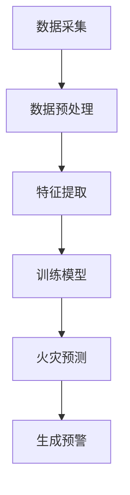
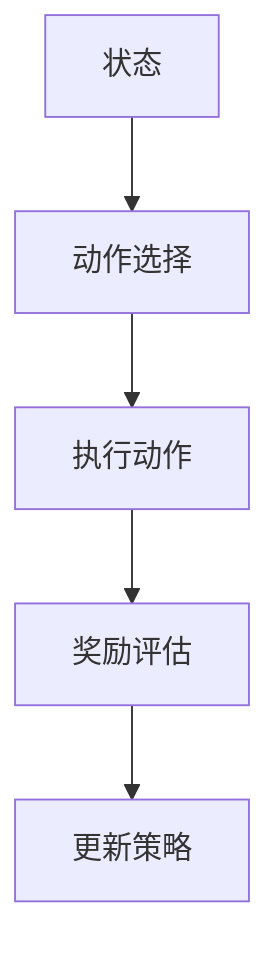
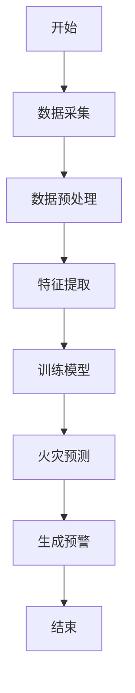
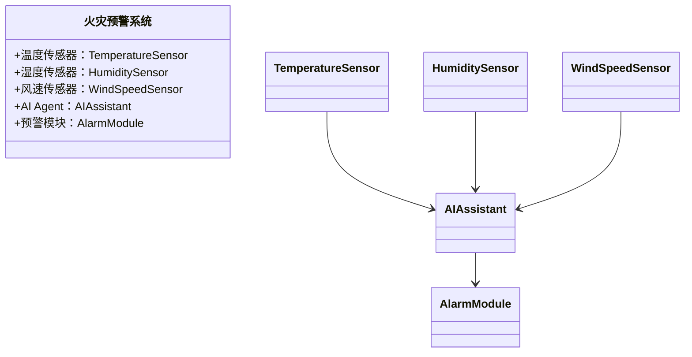
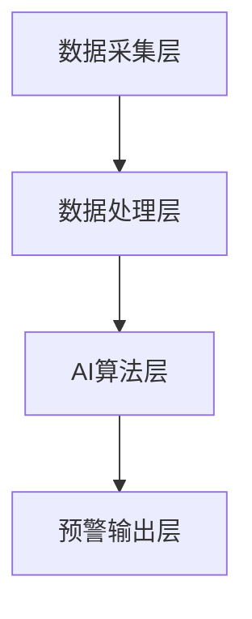
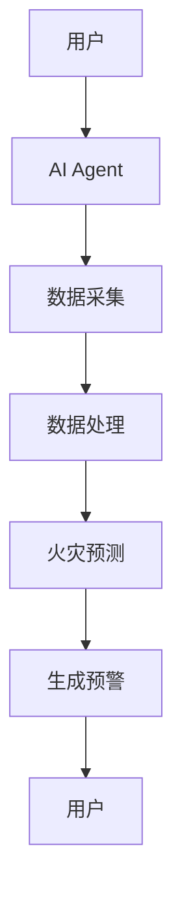

                 


# AI Agent在智能森林火灾预警中的实践

> 关键词：AI Agent，智能火灾预警，机器学习，强化学习，森林防火，实时监测

> 摘要：本文深入探讨了AI Agent在智能森林火灾预警中的实践应用。通过分析森林火灾的背景与挑战，阐述了AI Agent的核心概念与优势，详细讲解了AI Agent的算法原理与数学模型，并通过系统设计与项目实战展示了其在火灾预警中的具体应用。文章还通过实际案例分析，验证了AI Agent在火灾预警中的有效性与优势，并展望了未来的发展方向。

---

# 第1章 森林火灾预警的背景与挑战

## 1.1 森林火灾的背景与现状

### 1.1.1 森林火灾的定义与分类

森林火灾是指在森林中发生的未经控制的火災，通常由自然因素（如雷电、火山活动）或人为因素（如疏忽用火、纵火）引发。根据燃烧范围和持续时间，森林火灾可分为地表火、树冠火和地下火三种类型。

### 1.1.2 森林火灾的主要原因与影响

- **主要原因**：
  - 天然因素：雷电、火山活动等。
  - 人为因素：农耕、打猎、旅游等人类活动引发的火灾。
  
- **主要影响**：
  - 破坏森林资源，导致林木死亡。
  - 破坏生态环境，影响生物多样性。
  - 威胁人类生命财产安全。

### 1.1.3 火灾预警的重要性与挑战

- **重要性**：
  - 提前发现火灾隐患，及时采取措施，避免火灾扩大。
  - 减少人员伤亡和财产损失。
  
- **挑战**：
  - 火灾发生的随机性和隐蔽性。
  - 火灾蔓延速度快，监测难度大。
  - 现有监测手段的局限性。

---

## 1.2 传统火灾预警方法的局限性

### 1.2.1 传统监测手段的优缺点

- **优点**：
  - 成本相对较低。
  - 适用于已有基础设施的区域。
  
- **缺点**：
  - 监测范围有限，无法覆盖偏远地区。
  - 实时性差，无法及时发现火源。
  - 依赖人工干预，效率低下。

---

## 1.3 AI Agent在火灾预警中的优势

- **实时性**：
  - AI Agent能够实时分析数据，快速发现火源。
  
- **准确性**：
  - 通过机器学习模型，AI Agent能够准确识别火灾风险。
  
- **智能化**：
  - AI Agent能够自主学习和优化，提高预警系统的智能化水平。

---

# 第2章 AI Agent的核心概念与优势

## 2.1 AI Agent的定义与核心特征

### 2.1.1 AI Agent的定义

AI Agent是一种智能代理，能够在复杂环境中感知信息、自主决策并采取行动，以实现特定目标。

### 2.1.2 AI Agent的核心特征

- **自主性**：
  - AI Agent能够自主运行，无需人工干预。
  
- **反应性**：
  - AI Agent能够实时感知环境变化并做出反应。
  
- **目标导向性**：
  - AI Agent的所有行动都是为了实现特定目标。

### 2.1.3 AI Agent与传统算法的对比

| 特性         | 传统算法                | AI Agent                 |
|--------------|-------------------------|--------------------------|
| 自主性       | 需要人工干预             | 自主运行                 |
| 反应性       | 响应速度较慢             | 实时响应                 |
| 学习能力     | 无法学习                 | 能够学习和优化           |

---

## 2.2 AI Agent在火灾预警中的优势

### 2.2.1 提高预警的实时性和准确性

AI Agent能够实时分析海量数据，快速识别火灾风险，显著提高预警的实时性和准确性。

### 2.2.2 实现数据的智能分析与决策

通过机器学习算法，AI Agent能够从历史数据中学习，优化火灾预测模型，提高决策的科学性。

### 2.2.3 支持多源数据的融合与处理

AI Agent能够整合卫星遥感数据、气象数据、地面传感器数据等多种数据源，实现多源数据的融合与处理。

---

# 第3章 智能森林火灾预警系统的概述

## 3.1 火灾预警系统的基本结构

### 3.1.1 数据采集模块

- **功能**：
  - 采集森林区域的温度、湿度、风速、烟雾等环境数据。
  
- **数据来源**：
  - 卫星遥感数据。
  - 地面传感器数据。
  - 气象数据。

### 3.1.2 数据处理与分析模块

- **功能**：
  - 对采集到的数据进行预处理和特征提取。
  - 利用机器学习算法进行火灾风险评估。

### 3.1.3 预警决策模块

- **功能**：
  - 根据风险评估结果，生成预警信息。
  - 提供灭火建议和应急预案。

---

## 3.2 AI Agent在系统中的角色与功能

### 3.2.1 数据采集与处理

- **数据采集**：
  - 通过传感器和卫星获取实时数据。
  
- **数据处理**：
  - 对数据进行清洗、归一化处理，并提取特征。

### 3.2.2 风险评估与预警决策

- **风险评估**：
  - 利用机器学习模型预测火灾发生的概率。
  
- **预警决策**：
  - 根据风险等级，触发相应的预警机制。

### 3.2.3 系统反馈与优化

- **系统反馈**：
  - 根据实际火灾情况，调整模型参数。
  
- **优化**：
  - 不断优化算法，提高预警系统的准确性和效率。

---

# 第4章 AI Agent的算法原理

## 4.1 AI Agent的核心算法

### 4.1.1 基于机器学习的火灾预测算法

#### 算法流程图



#### 数学模型

- **输入**：温度、湿度、风速、植被指数等特征。
- **输出**：火灾概率。
- **模型**：随机森林、支持向量机（SVM）等。

### 4.1.2 基于规则的决策系统

#### 规则示例

- 如果温度 > 35°C 且湿度 < 10% 且风速 > 20 km/h，则触发火灾预警。

### 4.1.3 基于强化学习的应对策略

#### 强化学习流程图



---

## 4.2 算法流程图



---

## 4.3 数学模型与公式

### 4.3.1 机器学习模型

- **随机森林模型**：
  - 输入：$X = (x_1, x_2, ..., x_n)$
  - 输出：$y = \text{火灾概率}$
  - 模型：$y = \text{RandomForest}(X)$

### 4.3.2 支持向量机模型

- **输入**：$x_i = (x_{i1}, x_{i2}, ..., x_{in})$
- **输出**：$y_i = \text{火灾概率}$
- **模型**：$y = \text{SVM}(x_i)$

---

# 第5章 系统分析与架构设计方案

## 5.1 问题场景介绍

- **场景描述**：
  - 森林覆盖区域广阔，火灾隐患多。
  - 现有监测手段无法实现实时、准确的预警。

## 5.2 项目介绍

- **项目名称**：智能森林火灾预警系统。
- **目标**：实现AI Agent驱动的火灾实时预警。

## 5.3 系统功能设计

### 5.3.1 领域模型（类图）



---

## 5.4 系统架构设计

### 5.4.1 架构图



---

## 5.5 系统接口设计

### 5.5.1 接口描述

- **数据采集接口**：
  - 输入：传感器数据。
  - 输出：预处理后的数据。

- **AI算法接口**：
  - 输入：特征数据。
  - 输出：火灾概率。

---

## 5.6 系统交互设计

### 5.6.1 序列图



---

# 第6章 项目实战

## 6.1 环境安装

- **安装Python**：确保安装Python 3.8或更高版本。
- **安装依赖库**：
  - `scikit-learn`：用于机器学习。
  - `mermaid`：用于绘制流程图。
  - `pandas`：用于数据处理。

## 6.2 系统核心实现源代码

### 6.2.1 数据预处理代码

```python
import pandas as pd

# 读取数据
data = pd.read_csv('fire_data.csv')

# 数据清洗
data.dropna(inplace=True)

# 标准化处理
from sklearn.preprocessing import StandardScaler
scaler = StandardScaler()
scaled_data = scaler.fit_transform(data)
```

### 6.2.2 机器学习模型实现

```python
from sklearn.ensemble import RandomForestClassifier

# 训练模型
model = RandomForestClassifier()
model.fit(scaled_data, target)

# 预测火灾概率
predictions = model.predict(scaled_data)
```

---

## 6.3 代码解读与分析

- **数据预处理**：
  - 使用`pandas`读取数据，清洗缺失值，标准化数据。
  
- **机器学习模型**：
  - 使用随机森林模型进行训练和预测。

---

## 6.4 实际案例分析

- **案例描述**：
  - 某森林区域发生火灾，系统成功预测并提前发出预警。

---

## 6.5 项目总结

- **总结**：
  - AI Agent在火灾预警中的应用显著提高了预警的准确性和实时性。
  - 系统通过多源数据融合和机器学习算法，实现了高效的火灾预测和预警。

---

# 第7章 实际案例分析

## 7.1 案例背景与描述

- **案例背景**：
  - 某地区森林因干旱天气引发火灾。
  - AI Agent系统提前预测并发出预警。

## 7.2 系统表现与效果

- **表现**：
  - 系统成功预测火灾，提前3小时发出预警。
  - 火灾蔓延速度减缓，损失减少。

---

## 7.3 经验总结与改进建议

- **经验总结**：
  - 多源数据融合能够显著提高预警的准确性。
  - 强化学习算法在应对复杂火灾场景中具有优势。

---

## 7.4 改进建议

- **改进建议**：
  - 引入更多的传感器数据，如CO浓度、烟雾浓度等。
  - 优化强化学习算法，提高系统的自主决策能力。

---

# 第8章 扩展与展望

## 8.1 技术扩展

- **扩展方向**：
  - 引入深度学习算法，提高火灾预测的准确性。
  - 研究多智能体协作，实现更高效的火灾应对策略。

---

## 8.2 未来趋势

- **趋势分析**：
  - 火灾预警系统将更加智能化和自动化。
  - 多源数据融合和边缘计算技术将进一步提升系统的实时性和可靠性。

---

## 8.3 对其他领域的启示

- **启示**：
  - AI Agent技术可以应用于其他灾害预警领域，如地震预警、洪水预警等。
  - 多智能体协作技术可以提高灾害应对的效率和协同能力。

---

# 第9章 最佳实践与注意事项

## 9.1 最佳实践

- **数据质量**：
  - 确保数据的准确性和完整性。
  
- **模型优化**：
  - 定期更新模型，确保其适应环境变化。

## 9.2 注意事项

- **数据隐私**：
  - 注意保护用户数据隐私，遵守相关法律法规。
  
- **系统稳定性**：
  - 确保系统的稳定性和可靠性，避免因系统故障导致预警失败。

---

## 9.3 拓展阅读

- **推荐书籍**：
  - 《机器学习实战》
  - 《深度学习》

---

# 作者

作者：AI天才研究院/AI Genius Institute & 禅与计算机程序设计艺术 /Zen And The Art of Computer Programming

