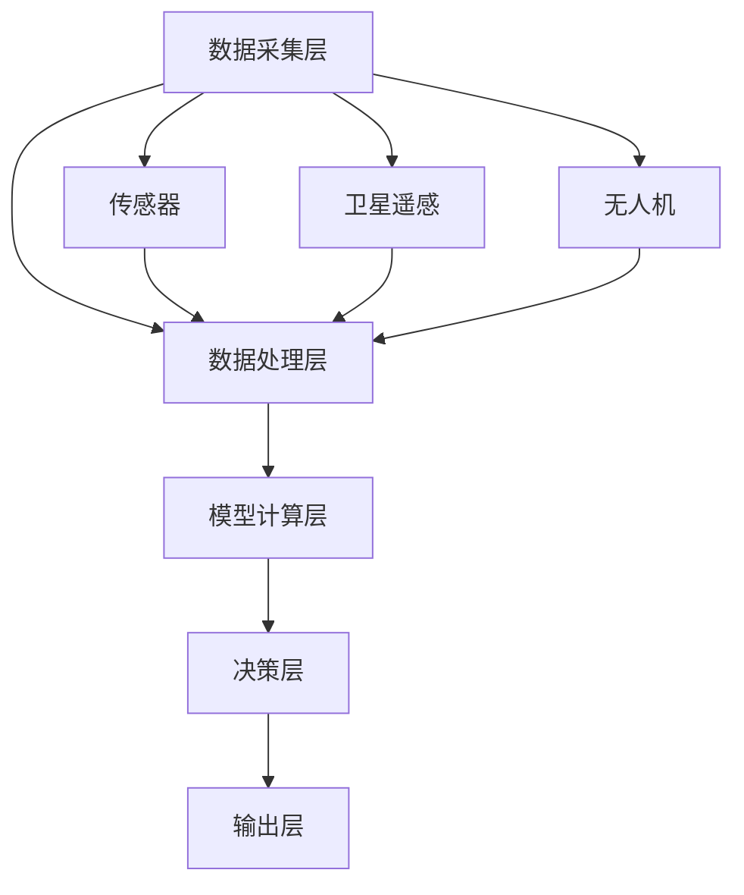
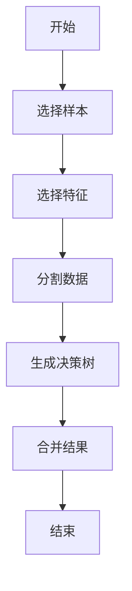
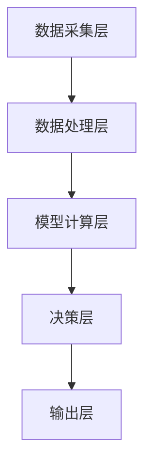

                 


## 第二章：AI Agent的核心概念与系统架构

### 2.1 AI Agent的核心概念

AI Agent（人工智能代理）是一种能够感知环境并采取行动以实现目标的智能实体。在森林火灾风险评估中，AI Agent能够实时收集和分析环境数据，评估火灾风险，并采取相应的措施来预防或减少火灾的影响。

#### 2.1.1 AI Agent的定义与分类

AI Agent可以分为多种类型，包括基于规则的代理、基于模型的代理、基于学习的代理和混合型代理。在森林火灾风险评估中，通常使用基于机器学习的代理，能够从历史数据中学习并预测火灾风险。

#### 2.1.2 AI Agent在智能系统中的角色与功能

AI Agent在森林火灾风险评估中的角色包括数据采集、风险分析、决策制定和反馈优化。它能够整合来自卫星、无人机和地面传感器的数据，利用这些数据来评估火灾风险，并根据风险等级提出相应的应对措施。

#### 2.1.3 AI Agent与传统自动化的区别

与传统自动化系统相比，AI Agent具有更强的自主性和适应性。它能够根据环境的变化动态调整其行为，而不仅仅执行预定义的程序。这种灵活性使得AI Agent在复杂的森林环境中能够更有效地评估和应对火灾风险。

### 2.2 森林火灾风险评估的系统架构

为了实现高效的火灾风险评估，需要一个集成的系统架构，其中包括多个层次和模块。

#### 2.2.1 数据采集层

数据采集层负责收集与森林环境相关的各种数据，包括温度、湿度、风速、植被状况和地形信息。这些数据可以通过卫星遥感、无人机和地面传感器等多种方式进行采集。

#### 2.2.2 数据处理层

数据处理层对收集到的原始数据进行预处理和特征提取。预处理步骤包括数据清洗、标准化和缺失值填充。特征提取则涉及选择对火灾风险评估最重要的特征，如植被指数、地形坡度和气象参数。

#### 2.2.3 模型计算层

模型计算层利用机器学习算法对处理后的数据进行建模和预测。常用的算法包括随机森林、支持向量机和深度学习模型。这些模型能够学习火灾风险的模式，并预测未来的风险等级。

#### 2.2.4 决策层

决策层基于模型的预测结果，制定相应的决策策略。例如，当预测到高火灾风险时，系统可以触发警报，建议进行灭火作业或调整森林管理策略。

### 2.3 系统架构图

以下是森林火灾风险评估系统的架构图：



## 第三章：AI Agent的算法原理与实现

### 3.1 数据预处理与特征提取

数据预处理是确保模型准确性的关键步骤。首先，需要对原始数据进行清洗，处理缺失值和异常值。然后，进行数据标准化或归一化，以消除不同特征之间的量纲差异。

#### 3.1.1 数据清洗

数据清洗包括识别和处理缺失值、重复值和异常值。例如，使用插值方法填补缺失值，或者使用箱线图识别并处理异常值。

#### 3.1.2 特征提取

特征提取是从原始数据中提取对火灾风险评估有重要意义的特征。例如，植被指数（如NDVI）、地形特征（如海拔高度）和气象参数（如温度、湿度）。

### 3.2 算法选择与实现

随机森林是一种常用的机器学习算法，适用于高维数据和非线性关系。以下是随机森林算法的工作流程：



随机森林算法的数学模型如下：

$$
y = \sum_{i=1}^{n} \theta_i x_i + \beta
$$

其中，$\theta_i$ 是特征 $x_i$ 的权重，$\beta$ 是截距项。

### 3.3 模型训练与优化

模型训练包括使用训练数据训练随机森林模型，并在验证集上进行调优。常用的调优方法包括网格搜索和交叉验证。

### 3.4 风险预测与评估

模型训练完成后，可以使用测试数据评估模型的性能。评估指标包括准确率、召回率、F1分数和AUC值。

## 第四章：系统架构设计与实现

### 4.1 系统功能设计

系统功能设计包括数据采集、数据处理、模型计算和决策制定四个模块。

#### 4.1.1 数据采集模块

数据采集模块负责从多种数据源采集数据，包括卫星遥感、无人机和地面传感器。

#### 4.1.2 数据处理模块

数据处理模块对采集到的数据进行预处理和特征提取，为模型计算提供高质量的数据输入。

#### 4.1.3 模型计算模块

模型计算模块使用随机森林算法训练模型，并进行火灾风险预测。

#### 4.1.4 决策制定模块

决策制定模块根据模型预测结果，制定相应的决策策略，并输出警报信息。

### 4.2 系统架构图

以下是系统的架构图：



## 第五章：项目实战与实现

### 5.1 项目环境安装

需要安装以下工具和库：

- Python 3.8+
- Jupyter Notebook
- Pandas
- Scikit-learn
- Matplotlib
- Seaborn

### 5.2 数据采集与处理

#### 5.2.1 数据预处理

```python
import pandas as pd
import numpy as np

# 读取数据
data = pd.read_csv('fire_risk.csv')

# 处理缺失值
data = data.dropna()

# 标准化处理
from sklearn.preprocessing import StandardScaler

scaler = StandardScaler()
scaled_data = scaler.fit_transform(data)
```

#### 5.2.2 特征提取

```python
from sklearn.feature_selection import SelectKBest, chi2

selector = SelectKBest(score_func=chi2, k=5)
selected_features = selector.fit_transform(scaled_data)
```

### 5.3 模型训练与预测

#### 5.3.1 训练模型

```python
from sklearn.ensemble import RandomForestClassifier

model = RandomForestClassifier(n_estimators=100, max_depth=10, random_state=42)
model.fit(selected_features, labels)
```

#### 5.3.2 模型评估

```python
from sklearn.metrics import accuracy_score, recall_score, f1_score, roc_auc_score

y_pred = model.predict(selected_features)
print(f"Accuracy: {accuracy_score(labels, y_pred)}")
print(f"Recall: {recall_score(labels, y_pred)}")
print(f"F1 Score: {f1_score(labels, y_pred)}")
print(f"AUC: {roc_auc_score(labels, y_pred)}")
```

### 5.4 系统实现与优化

#### 5.4.1 系统优化

调整模型超参数，如n_estimators和max_depth，以提高模型性能。

#### 5.4.2 系统部署

将模型部署到生产环境，实现实时火灾风险评估。

## 第六章：最佳实践与未来展望

### 6.1 最佳实践

- 数据质量：确保数据的完整性和准确性。
- 模型选择：根据具体问题选择合适的算法。
- 系统优化：定期更新模型，优化系统性能。

### 6.2 未来展望

- 引入更先进的AI技术，如深度学习和强化学习，进一步提高火灾风险评估的准确性。
- 实时监测与响应：开发实时监测系统，实现快速响应。
- 多源数据融合：整合更多的数据源，如气象、植被和地形信息，提高评估的全面性。

## 作者

作者：AI天才研究院/AI Genius Institute & 禅与计算机程序设计艺术 /Zen And The Art of Computer Programming

