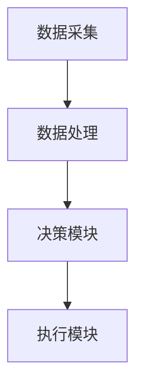

                 


# AI Agent在智能森林生态系统管理中的实践

## 关键词
AI Agent，智能森林生态系统，机器学习，计算机视觉，环境监测，生态平衡

## 摘要
本文探讨AI Agent在智能森林生态系统管理中的应用，涵盖技术背景、核心概念、算法原理、系统架构、项目实战和最佳实践。通过详细分析，展示AI Agent如何提升森林管理效率和准确性，推动生态可持续发展。

---

# 第一部分: AI Agent与智能森林生态系统管理概述

## 第1章: AI Agent与智能森林生态系统管理概述

### 1.1 AI Agent的基本概念

#### 1.1.1 AI Agent的定义
AI Agent，即人工智能代理，是一种能够感知环境、自主决策并执行任务的智能实体。它结合了机器学习、自然语言处理和计算机视觉等技术，具备学习、推理和自适应能力。

#### 1.1.2 AI Agent的核心特征
- **自主性**：无需外部干预，自主决策。
- **反应性**：实时感知环境变化并做出反应。
- **学习能力**：通过数据优化决策模型。
- **协作性**：与其他系统或AI Agent协同工作。

#### 1.1.3 AI Agent在森林管理中的应用潜力
AI Agent可应用于森林资源监测、病虫害防治、火灾预警等领域，提升管理效率和精准度。

### 1.2 智能森林生态系统管理的背景与挑战

#### 1.2.1 森林生态系统管理的重要性
森林是地球的肺部，对调节气候、保护生物多样性至关重要。传统管理依赖人工，效率低且覆盖面有限。

#### 1.2.2 传统森林管理的局限性
- **效率低下**：依赖人工巡检，范围有限。
- **数据不足**：缺乏实时、全面的数据支持。
- **决策延迟**：无法快速响应突发情况。

#### 1.2.3 智能化管理的需求与目标
智能化管理通过AI Agent实现实时监测、精准决策和高效执行，目标是提升资源利用效率，保护生态环境。

### 1.3 AI Agent在智能森林管理中的作用

#### 1.3.1 AI Agent如何赋能森林管理
AI Agent通过实时数据处理、智能决策和自主执行，优化资源分配和灾害防治。

#### 1.3.2 AI Agent在森林资源监测中的应用
- **森林覆盖变化监测**：通过卫星图像和无人机数据，AI Agent可以监测森林覆盖变化，评估资源状况。
- **生物多样性保护**：识别濒危物种，保护生态平衡。

#### 1.3.3 AI Agent在生态平衡维护中的价值
AI Agent帮助预测和预防生态失衡，如病虫害爆发和火灾风险，确保生态系统的稳定性。

---

## 第2章: AI Agent与智能森林生态系统的结合

### 2.1 AI Agent的核心技术

#### 2.1.1 机器学习算法
机器学习用于分析森林数据，预测趋势和异常。常用算法包括随机森林和神经网络。

#### 2.1.2 自然语言处理
用于处理与森林管理相关的文本数据，如文献分析和报告生成。

#### 2.1.3 计算机视觉
计算机视觉技术用于图像识别，如识别病虫害和火灾迹象。

### 2.2 智能森林生态系统的结构

#### 2.2.1 森林生态系统的层次结构
- **数据层**：包括卫星图像、传感器数据。
- **模型层**：包括机器学习模型和决策算法。
- **执行层**：负责实际操作，如无人机巡检。

#### 2.2.2 AI Agent在生态系统中的角色
AI Agent作为核心，连接感知、决策和执行层，实现智能化管理。

#### 2.2.3 AI Agent与其他系统的关系
AI Agent与无人机、传感器和数据库协同工作，构成完整的智能管理系统。

---

## 第3章: AI Agent在智能森林管理中的算法与实现

### 3.1 AI Agent的核心算法

#### 3.1.1 路径规划算法
用于无人机巡检路径优化，常用A*算法。

#### 3.1.2 环境感知算法
用于图像识别，如目标检测算法YOLO。

#### 3.1.3 决策优化算法
用于资源分配优化，如线性规划模型。

### 3.2 算法实现与数学模型

#### 3.2.1 A*路径规划算法
数学模型：
$$
cost = g(x,y) + h(x,y)
$$
其中，g是实际成本，h是启发函数。

#### 3.2.2 目标检测算法YOLO
YOLO模型通过卷积神经网络实现目标检测，公式：
$$
P(y|x) = \frac{P(x|y)P(y)}{P(x)}
$$

### 3.3 系统架构设计

#### 3.3.1 系统功能模块
- **数据采集模块**：收集环境数据。
- **决策模块**：处理数据，生成决策。
- **执行模块**：执行决策，如发送指令。

#### 3.3.2 系统架构图


#### 3.3.3 接口设计
- 数据接口：与传感器连接，接收数据。
- 操作接口：用户输入指令，系统执行。

### 3.4 项目实战

#### 3.4.1 环境安装
安装Python、TensorFlow和OpenCV库：
```bash
pip install python-tensorflow opencv-python
```

#### 3.4.2 核心功能实现
实现图像识别功能，如火灾监测：
```python
import cv2
def detect_fire(image):
    # 转换为灰度图像
    gray = cv2.cvtColor(image, cv2.COLOR_BGR2GRAY)
    # 使用阈值检测
    _, binary = cv2.threshold(gray, 200, 255, cv2.THRESH_BINARY)
    return binary
```

#### 3.4.3 案例分析
分析火灾监测案例，说明系统如何通过图像识别快速预警，减少损失。

---

## 第4章: 最佳实践与未来展望

### 4.1 最佳实践

#### 4.1.1 数据采集的重要性
高质量数据是AI Agent准确决策的基础。

#### 4.1.2 模型可解释性
确保模型可解释，便于诊断和优化。

#### 4.1.3 系统可扩展性
设计灵活架构，适应未来需求变化。

### 4.2 未来展望

#### 4.2.1 多智能体协作
多个AI Agent协同工作，提升管理效率。

#### 4.2.2 更高级的决策模型
引入强化学习，优化决策策略。

---

# 作者：AI天才研究院 & 禅与计算机程序设计艺术

---

通过以上内容，本文详细探讨了AI Agent在智能森林管理中的应用，从技术背景到实际案例，为读者提供了全面的视角。

