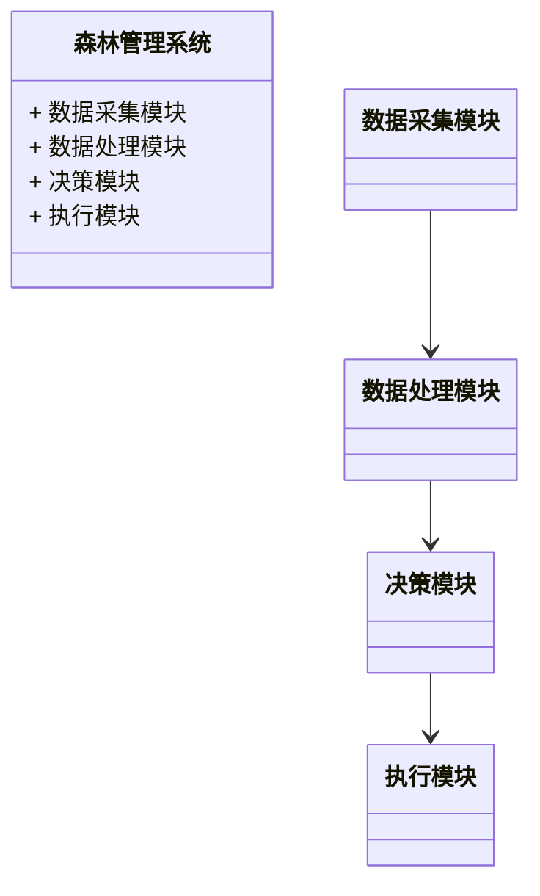
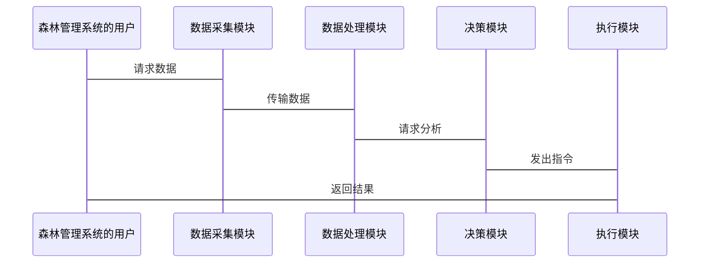

                 

<think>
好的，我将按照您的要求来撰写这篇关于《AI Agent在智能森林管理中的实践》的技术博客文章。为了确保内容的完整性和质量，我会一步一步地进行分析和推理，确保每个部分都详尽且有深度。

首先，我会先整理出文章的整体结构，然后逐步填充每个部分的内容，包括背景介绍、核心概念、算法原理、系统设计、项目实战以及最佳实践等内容。在撰写过程中，我会尽量使用简单易懂的专业技术语言，并确保逻辑清晰、结构紧凑。

让我们开始吧！

---

# AI Agent在智能森林管理中的实践

> **关键词**：AI Agent，智能森林管理，机器学习，算法实现，系统架构

> **摘要**：  
> AI Agent（人工智能代理）作为一种能够感知环境、自主决策并执行任务的智能体，在智能森林管理中发挥着越来越重要的作用。本文将从AI Agent的核心概念出发，分析其在森林资源监测、生态平衡维护以及林业优化管理中的实际应用。通过结合具体的算法实现和系统架构设计，探讨如何利用AI技术提升森林管理的效率与精准度。

---

## 第1章: AI Agent与智能森林管理概述

### 1.1 智能森林管理的背景与意义

#### 1.1.1 森林管理的传统模式与挑战
传统的森林管理依赖于人工巡检和经验判断，这种方式存在效率低、覆盖范围有限、数据采集不及时等问题。例如，森林防火、病虫害监测、资源清查等任务往往需要大量的人力物力，且难以在第一时间发现问题。

#### 1.1.2 智能化管理的必要性
随着人工智能技术的快速发展，智能化管理成为解决传统森林管理问题的重要手段。AI Agent能够通过传感器、无人机、卫星遥感等设备实时采集森林环境数据，并利用机器学习算法进行分析，从而实现智能化的监测与管理。

#### 1.1.3 AI Agent在森林管理中的应用前景
AI Agent在森林管理中的应用前景广阔。例如，AI Agent可以通过图像识别技术快速识别病虫害，通过预测模型提前预警火灾风险，并通过优化算法实现资源的高效配置。

---

### 1.2 AI Agent的核心概念与特点

#### 1.2.1 AI Agent的定义与分类
AI Agent是一种能够感知环境、自主决策并执行任务的智能体。根据功能和应用场景的不同，AI Agent可以分为以下几类：
- **反应式AI Agent**：基于当前感知做出即时反应，适用于实时任务。
- **认知式AI Agent**：具备推理和规划能力，能够解决复杂问题。
- **协作式AI Agent**：能够与其他Agent或人类进行协作。

#### 1.2.2 AI Agent的核心特点
AI Agent的核心特点包括：
- **自主性**：能够自主决策和行动。
- **反应性**：能够实时感知环境并做出反应。
- **学习能力**：能够通过数据学习和优化。
- **适应性**：能够适应环境的变化并调整策略。

#### 1.2.3 AI Agent与传统自动化系统的区别
与传统自动化系统相比，AI Agent具有更强的自主性和适应性。传统自动化系统通常基于固定的规则运行，而AI Agent能够根据环境反馈动态调整行为。

---

### 1.3 智能森林管理中的问题背景

#### 1.3.1 森林资源管理的复杂性
森林资源管理涉及多个方面，包括树木生长监测、病虫害防治、火灾预警等，这些任务需要综合考虑环境、资源和生态等多个因素。

#### 1.3.2 森林生态平衡的维护需求
森林生态平衡的维护需要实时监测和精准管理，传统的人工管理方式难以满足这一需求。

#### 1.3.3 智能化管理的技术挑战
智能化管理需要解决数据采集、算法优化、系统集成等多个技术难题，特别是在复杂自然环境中实现高精度的感知和决策。

---

## 第2章: AI Agent的核心原理

### 2.1 AI Agent的基本原理

#### 2.1.1 感知层：数据采集与环境理解
AI Agent通过多种传感器（如摄像头、温度传感器、湿度传感器等）采集环境数据，并利用图像识别、语音识别等技术理解环境信息。

#### 2.1.2 决策层：基于AI的决策算法
AI Agent通过机器学习算法（如强化学习、监督学习）对感知数据进行分析，生成决策策略。

#### 2.1.3 执行层：动作输出与反馈机制
AI Agent根据决策结果输出动作，并通过反馈机制不断优化决策策略。

---

### 2.2 AI Agent的核心技术

#### 2.2.1 机器学习算法
机器学习是AI Agent的核心技术之一。常用的算法包括：
- **监督学习**：用于分类和回归任务。
- **无监督学习**：用于聚类和异常检测。
- **强化学习**：用于序列决策任务。

#### 2.2.2 自然语言处理技术
自然语言处理技术用于AI Agent与人类的交互，例如通过语音识别和语义理解实现人机对话。

#### 2.2.3 计划与推理算法
计划与推理算法用于AI Agent的复杂决策任务，例如路径规划和任务分配。

---

### 2.3 AI Agent的系统架构

#### 2.3.1 分层架构
分层架构将系统划分为感知层、决策层和执行层，每一层负责不同的功能。

#### 2.3.2 微服务架构
微服务架构将系统功能分解为多个独立的服务，通过API进行通信，适用于大规模分布式系统。

#### 2.3.3 组件化设计
组件化设计将系统功能模块化，便于开发、测试和部署。

---

## 第3章: 森林资源监测与管理

### 3.1 森林资源监测的需求与挑战

#### 3.1.1 森林资源的多样性
森林资源包括树木、动物、土壤等多个方面，监测任务复杂多样。

#### 3.1.2 监测数据的实时性要求
森林资源监测需要实时数据支持，否则可能错过最佳处理时机。

#### 3.1.3 数据采集的准确性与成本
高精度的数据采集需要高昂的成本，如何在成本与精度之间找到平衡是关键。

---

### 3.2 AI Agent在资源监测中的应用

#### 3.2.1 基于视觉识别的树种识别
通过图像识别技术，AI Agent能够快速识别不同树种，辅助林业人员进行资源清查。

#### 3.2.2 基于传感器数据的环境监测
AI Agent可以通过传感器网络实时监测森林的温度、湿度、光照等环境数据，辅助判断森林健康状况。

#### 3.2.3 基于图像识别的病虫害检测
AI Agent能够通过无人机拍摄的图像，利用深度学习算法检测病虫害，提前采取防治措施。

---

### 3.3 系统设计与实现

#### 3.3.1 系统功能模块划分
- **数据采集模块**：负责采集环境数据。
- **数据处理模块**：对采集的数据进行清洗和预处理。
- **决策模块**：基于机器学习算法生成决策。
- **执行模块**：根据决策输出动作。

#### 3.3.2 数据采集与处理流程
1. 传感器采集环境数据。
2. 数据传输到处理模块。
3. 数据清洗和特征提取。
4. 数据存储到数据库。
5. 数据分析与决策生成。
6. 决策结果传输到执行模块。

#### 3.3.3 系统架构设计
- **前端**：用户界面，展示实时数据和决策结果。
- **后端**：数据处理和算法运行。
- **数据库**：存储环境数据和决策记录。
- **API接口**：与其他系统进行数据交互。

---

## 第4章: AI Agent的算法实现与数学模型

### 4.1 强化学习算法

#### 4.1.1 Q-learning算法
Q-learning是一种经典的强化学习算法，适用于离散动作空间的决策问题。

##### 算法步骤：
1. 初始化Q表。
2. 选择动作。
3. 执行动作并获取奖励。
4. 更新Q表。
5. 重复步骤2-4直到终止条件。

##### Q-learning算法伪代码：
```python
初始化Q表为0
while not 终止条件:
    选择动作a
    执行动作a，获取奖励r
    更新Q值：Q[s][a] = Q[s][a] + α*(r + γ*max(Q[s'][a']))
```

---

### 4.2 监督学习算法

#### 4.2.1 分类算法
分类算法用于将数据分类到不同的类别中，例如树种识别。

##### 算法步骤：
1. 数据预处理。
2. 选择分类模型。
3. 训练模型。
4. 模型预测。
5. 评估模型性能。

##### 分类算法示例：
```python
from sklearn.tree import DecisionTreeClassifier
model = DecisionTreeClassifier()
model.fit(X_train, y_train)
y_pred = model.predict(X_test)
```

---

### 4.3 算法的数学模型与公式

#### 4.3.1 强化学习的数学模型
强化学习的核心是通过优化Q值函数来最大化累积奖励。数学表达式如下：
$$ Q(s, a) = Q(s, a) + \alpha [r + \gamma \max Q(s', a') - Q(s, a)] $$

#### 4.3.2 监督学习的数学模型
监督学习的数学模型通常基于损失函数和优化算法。例如，线性回归的损失函数为：
$$ L = \frac{1}{2m} \sum_{i=1}^{m} (y_i - \hat{y}_i)^2 $$

---

## 第5章: 系统分析与架构设计方案

### 5.1 问题场景介绍
森林管理需要实时监测和精准管理，传统方法效率低下，难以应对复杂问题。

### 5.2 项目介绍
本项目旨在利用AI Agent技术，构建一个智能森林管理系统，实现森林资源的实时监测和优化管理。

### 5.3 系统功能设计

#### 5.3.1 领域模型类图


### 5.4 系统架构设计

#### 5.4.1 分层架构图


### 5.5 系统接口设计
- **输入接口**：传感器数据输入。
- **输出接口**：执行模块动作输出。
- **API接口**：与其他系统进行数据交互。

### 5.6 系统交互序列图


---

## 第6章: 项目实战

### 6.1 环境安装
为了运行本项目，需要安装以下环境：
- **Python**：3.8及以上版本。
- **库**：numpy, pandas, scikit-learn, tensorflow。

### 6.2 系统核心实现源代码

#### 6.2.1 数据采集模块
```python
import numpy as np

def collect_data():
    # 模拟传感器数据采集
    data = np.random.randn(100, 5)
    return data
```

#### 6.2.2 数据处理模块
```python
from sklearn.preprocessing import StandardScaler

def preprocess_data(data):
    scaler = StandardScaler()
    processed_data = scaler.fit_transform(data)
    return processed_data
```

#### 6.2.3 决策模块
```python
from sklearn.tree import DecisionTreeClassifier

def decision_model(data):
    model = DecisionTreeClassifier()
    model.fit(data[:, :-1], data[:, -1])
    return model
```

### 6.3 代码应用解读与分析
1. 数据采集模块通过随机数生成模拟传感器数据。
2. 数据处理模块对数据进行标准化处理。
3. 决策模块使用决策树算法进行分类。

---

## 第7章: 最佳实践与总结

### 7.1 小结
AI Agent在智能森林管理中的应用前景广阔，能够显著提高管理效率和精准度。

### 7.2 注意事项
- 数据质量和传感器精度直接影响系统性能。
- 系统的安全性和稳定性需要重点关注。

### 7.3 拓展阅读
建议深入学习强化学习和深度学习技术，探索更多AI Agent在智能管理中的应用。

---

## 作者信息

作者：AI天才研究院/AI Genius Institute & 禅与计算机程序设计艺术 /Zen And The Art of Computer Programming

---

以上是文章的完整目录和内容框架。希望这篇文章能够帮助您更好地理解AI Agent在智能森林管理中的实践与应用。如果需要进一步扩展或修改，请随时告知！

