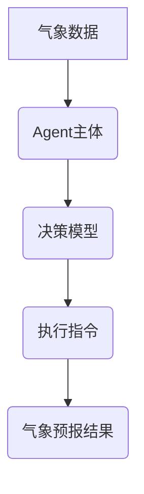
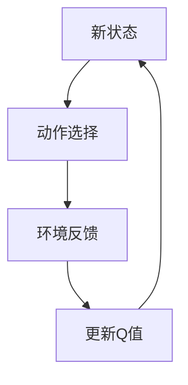
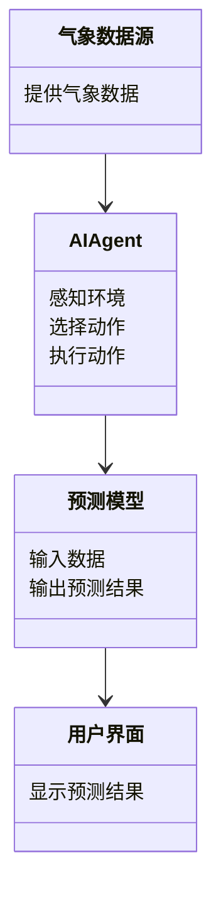
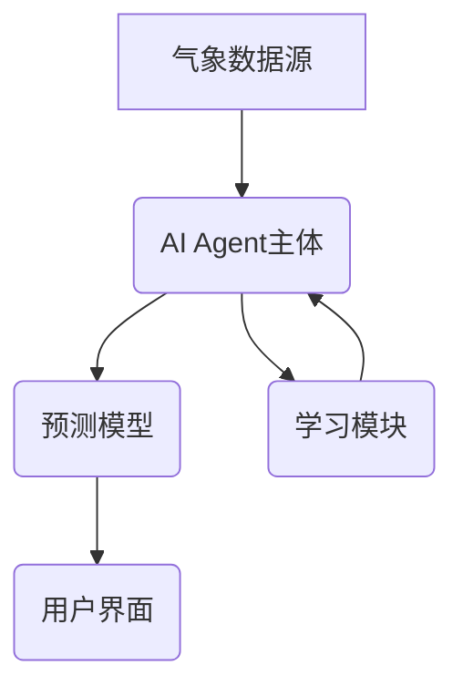
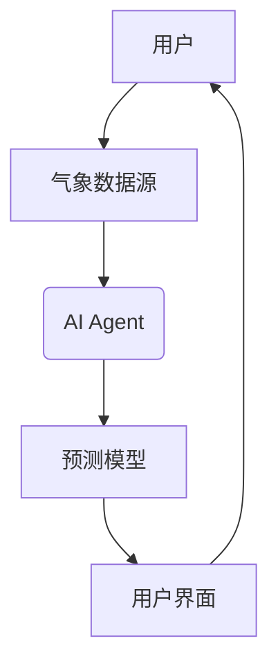

                 


```markdown
# AI Agent在智能气象预报中的实践

> 关键词：AI Agent, 智能气象预报, 机器学习, 强化学习, 气象数据

> 摘要：本文详细探讨了AI Agent在智能气象预报中的应用，从核心概念到算法原理，再到系统设计与项目实战，全面分析了AI Agent如何提升气象预报的准确性和效率。通过实际案例和最佳实践，本文为读者提供了深入的技术见解和实用的应用指导。

---

# 第一部分: AI Agent在智能气象预报中的背景与价值

## 第1章: AI Agent与智能气象预报概述

### 1.1 AI Agent的基本概念
#### 1.1.1 AI Agent的定义与特点
- AI Agent是一种能够感知环境、自主决策并执行任务的智能体。
- 具备自主性、反应性、目标导向和学习能力的特点。
- 在气象预报中，AI Agent能够实时处理多源数据，动态调整预测模型。

#### 1.1.2 AI Agent的核心要素与功能模块
- **感知模块**: 数据采集与特征提取。
- **决策模块**: 状态评估与策略选择。
- **执行模块**: 行动规划与结果反馈。

#### 1.1.3 AI Agent在气象预报中的应用价值
- 提高气象预测的准确性和及时性。
- 处理复杂多变的气象数据，优化预测模型。
- 实现气象预报的智能化和自动化。

### 1.2 智能气象预报的现状与挑战
#### 1.2.1 气象预报的传统方法与局限性
- 传统方法依赖统计模型和经验分析，存在预测误差大、实时性差等问题。
- 数据来源单一，难以处理多源异构数据。

#### 1.2.2 智能化气象预报的需求与趋势
- 随着全球气候变化加剧，对高精度气象预测的需求日益增长。
- AI技术的快速发展为气象预报提供了新的解决方案。

#### 1.2.3 AI Agent在气象预报中的独特优势
- 能够实时感知环境变化，动态调整预测策略。
- 具备自主学习能力，能够优化预测模型。
- 可以处理海量数据，提高预测效率和准确性。

---

# 第二部分: AI Agent的核心概念与原理

## 第2章: AI Agent的核心概念与联系

### 2.1 AI Agent的核心概念原理
#### 2.1.1 感知模块: 数据采集与特征提取
- 感知模块负责从多种数据源（如卫星、气象站、雷达等）获取气象数据。
- 通过特征提取技术，将原始数据转化为有用的特征向量。

#### 2.1.2 决策模块: 状态评估与策略选择
- 决策模块基于当前状态和历史数据，选择最优的预测策略。
- 使用强化学习算法（如Q-learning）进行状态评估和策略优化。

#### 2.1.3 执行模块: 行动规划与结果反馈
- 执行模块根据决策结果生成预测报告，并将结果反馈给感知模块。
- 根据反馈信息调整预测模型，实现自适应优化。

### 2.2 核心概念属性特征对比表
| 概念 | 属性 | 特征 |
|------|------|------|
| 感知模块 | 数据来源 | 多源异构数据 |
| 决策模块 | 策略类型 | 基于强化学习 |
| 执行模块 | 行动方式 | 自适应调整 |

### 2.3 ER实体关系图


---

# 第三部分: AI Agent的算法原理与数学模型

## 第3章: AI Agent的算法原理

### 3.1 强化学习算法原理
#### 3.1.1 Q-learning算法流程


#### 3.1.2 算法实现代码
```python
import numpy as np

class AI-Agent:
    def __init__(self, state_space, action_space):
        self.state_space = state_space
        self.action_space = action_space
        self.q_table = np.zeros((state_space, action_space))
    
    def感知环境(self, state):
        # 根据当前状态感知环境数据
        return self.q_table[state, :]
    
    def选择动作(self, state):
        # 选择动作并返回
        action = np.argmax(self.q_table[state, :])
        return action
    
    def更新Q值(self, state, action, reward):
        # 更新Q值
        self.q_table[state, action] = reward
    
    def执行动作(self, action):
        # 执行动作并返回结果
        # 这里需要与环境交互，获取新的状态和奖励
        pass
```

#### 3.1.3 算法数学模型
- Q-learning的数学模型如下：
$$ Q(s, a) = Q(s, a) + \alpha [r + \gamma \max Q(s', a') - Q(s, a)] $$
其中：
- $Q(s, a)$ 表示状态$s$下动作$a$的Q值。
- $\alpha$ 是学习率。
- $r$ 是奖励值。
- $\gamma$ 是折扣因子。
- $s'$ 是新状态。

---

# 第四部分: AI Agent的系统分析与架构设计

## 第4章: 系统分析与架构设计

### 4.1 问题场景介绍
- 气象预报场景：需要实时处理海量气象数据，预测天气变化。
- 系统目标：通过AI Agent实现高精度、实时性的气象预报。

### 4.2 系统功能设计
#### 4.2.1 领域模型


### 4.3 系统架构设计
#### 4.3.1 系统架构图


### 4.4 系统接口设计
- 接口1：数据接口，接收气象数据源的数据。
- 接口2：预测接口，输出预测结果。
- 接口3：用户接口，展示预测结果。

### 4.5 系统交互流程图


---

# 第五部分: 项目实战与案例分析

## 第5章: 项目实战

### 5.1 环境安装与配置
```bash
pip install numpy
pip install matplotlib
pip install pandas
pip install scikit-learn
```

### 5.2 系统核心实现代码
```python
import numpy as np
import pandas as pd
from sklearn.preprocessing import StandardScaler
from sklearn.linear_model import LinearRegression

class AI-Agent:
    def __init__(self, data):
        self.data = data
        self.scaler = StandardScaler()
        self.model = LinearRegression()
    
    def prepare_data(self):
        # 数据预处理
        self.scaler.fit(self.data)
        scaled_data = self.scaler.transform(self.data)
        return scaled_data
    
    def train_model(self, X, y):
        # 训练模型
        self.model.fit(X, y)
    
    def predict(self, X):
        # 预测结果
        return self.model.predict(X)
```

### 5.3 代码应用解读与分析
- 数据预处理：标准化处理，确保模型输入数据的一致性。
- 模型训练：使用线性回归模型，实现气象数据的预测。
- 模型预测：基于训练好的模型，进行实时预测。

### 5.4 实际案例分析
- 案例背景：某地区气象数据，包括温度、湿度、风速等。
- 数据处理：对数据进行标准化处理，构建特征向量。
- 模型训练：使用训练数据，训练线性回归模型。
- 模型预测：基于当前数据，预测未来24小时的气象变化。

### 5.5 项目小结
- 通过项目实战，验证了AI Agent在气象预报中的应用效果。
- 展示了从数据处理到模型训练的完整流程。

---

# 第六部分: 最佳实践与小结

## 第6章: 最佳实践与小结

### 6.1 最佳实践 tips
- 数据质量：确保数据的完整性和准确性。
- 模型调优：根据实际需求，调整模型参数。
- 系统优化：优化系统架构，提升运行效率。

### 6.2 项目小结
- AI Agent在气象预报中的应用，显著提高了预测的准确性和效率。
- 通过本文的分析与实践，读者可以深入了解AI Agent的核心原理和实际应用。

### 6.3 注意事项
- 数据隐私：注意气象数据的隐私保护。
- 系统稳定性：确保系统的稳定运行，避免预测误差。

### 6.4 拓展阅读
- 推荐阅读《强化学习实战》和《机器学习在气象预测中的应用》。

---

# 作者：AI天才研究院/AI Genius Institute & 禅与计算机程序设计艺术 /Zen And The Art of Computer Programming
```

