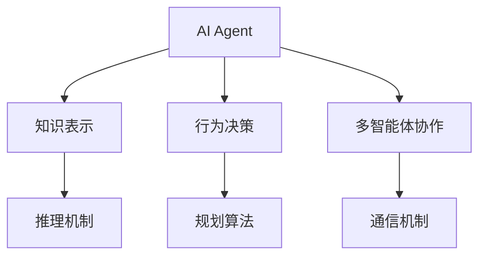
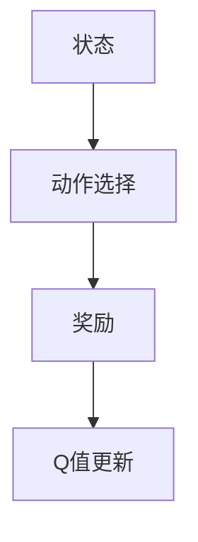
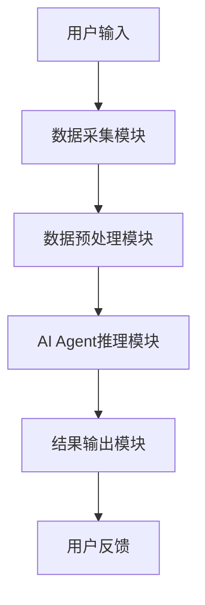
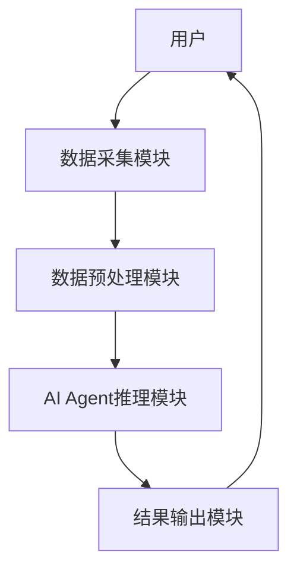

                 


# AI Agent在智能气象预报系统中的实践

> **关键词**: AI Agent, 智能气象预报, 机器学习, 气象数据, 天气预测, 算法原理, 系统架构

> **摘要**: 本文探讨AI Agent在智能气象预报系统中的应用，分析其算法原理和系统架构设计。通过背景介绍、核心概念、算法实现、系统架构、项目实战等部分，详细阐述AI Agent如何提升气象预报的准确性和效率，为实际应用提供理论支持和实践指导。

---

# 第一部分: AI Agent与智能气象预报系统概述

## 第1章: AI Agent与智能气象预报系统概述

### 1.1 AI Agent的基本概念
#### 1.1.1 AI Agent的定义与特征
AI Agent（人工智能代理）是能够感知环境、自主决策并执行任务的智能实体。其核心特征包括自主性、反应性、目标导向和协作性。

#### 1.1.2 AI Agent的核心技术与实现原理
AI Agent基于知识表示、推理机制和行为决策等技术，通过感知环境信息，运用算法进行推理和规划，实现目标。

#### 1.1.3 AI Agent在气象预报中的应用潜力
AI Agent能够处理海量气象数据，实时更新预测模型，显著提升气象预报的准确性和时效性。

### 1.2 智能气象预报系统的背景与需求
#### 1.2.1 气象预报的传统方法与局限性
传统气象预报依赖统计模型，存在数据处理复杂、预测精度有限等问题。

#### 1.2.2 智能化气象预报的需求与目标
智能化气象预报旨在通过AI技术提高预测精度，缩短响应时间，满足实时天气预警需求。

#### 1.2.3 AI Agent在气象预报中的角色与价值
AI Agent作为智能气象预报的核心，能够实时分析数据、优化预测模型，提供精准的天气预报。

### 1.3 本章小结
本章介绍了AI Agent的基本概念及其在气象预报中的应用潜力，为后续内容奠定基础。

---

# 第二部分: AI Agent的核心概念与原理

## 第2章: AI Agent的核心概念与原理

### 2.1 AI Agent的核心原理
#### 2.1.1 知识表示与推理机制
AI Agent通过知识表示（如语义网络）和推理算法（如逻辑推理）处理环境信息。

#### 2.1.2 行为决策与规划算法
基于强化学习的Q-learning算法，AI Agent能够在复杂环境中做出最优决策。

#### 2.1.3 多智能体协作与通信
通过多智能体协作，AI Agent能够更全面地分析气象数据，提升预测准确度。

### 2.2 AI Agent的特征对比分析
#### 2.2.1 基于表格的特征对比
| 特征     | AI Agent | 传统气象模型 |
|----------|-----------|--------------|
| 数据处理 | 自主学习   | 预定义模型    |
| 决策方式 | 强化学习   | 统计推断      |

#### 2.2.2 基于图的特征关系图


### 2.3 AI Agent的核心算法与实现
#### 2.3.1 基于强化学习的决策算法

Q-learning算法通过不断更新Q值，优化决策策略。

#### 2.3.2 基于监督学习的分类算法
利用随机森林算法对气象数据进行分类，提升预测精度。

#### 2.3.3 基于图神经网络的知识推理算法
通过图神经网络处理气象数据中的复杂关系，提升预测模型的准确性。

### 2.4 本章小结
本章详细讲解了AI Agent的核心概念与原理，为后续应用奠定了理论基础。

---

# 第三部分: AI Agent在气象预报中的算法原理

## 第3章: AI Agent在气象预报中的算法原理

### 3.1 基于强化学习的气象预报优化算法
#### 3.1.1 强化学习的基本原理
AI Agent通过与环境互动，学习最优策略以最大化累积奖励。

#### 3.1.2 在气象预报中的应用实例
利用强化学习优化气象模型的参数选择，提升预测精度。

#### 3.1.3 算法实现与优化
通过DQN算法实现气象数据的实时预测和优化。

### 3.2 基于监督学习的气象数据分类算法
#### 3.2.1 监督学习的基本原理
基于标注数据训练分类模型，识别天气状况。

#### 3.2.2 数据特征提取与分类模型构建
使用特征选择方法提取关键气象指标，构建随机森林分类模型。

#### 3.2.3 模型训练与评估
通过交叉验证评估模型性能，优化参数以提升预测准确率。

### 3.3 基于图神经网络的知识推理算法
#### 3.3.1 图神经网络的基本原理
通过图结构建模气象数据的关系，提升知识推理能力。

#### 3.3.2 气象数据的知识图谱构建
构建气象知识图谱，整合多源数据，支持复杂推理。

#### 3.3.3 基于知识图谱的推理与预测
利用知识图谱进行关联推理，优化天气预测模型。

### 3.4 本章小结
本章详细探讨了AI Agent在气象预报中的算法实现，展示了不同算法的优势与应用场景。

---

# 第四部分: AI Agent驱动的智能气象预报系统架构

## 第4章: AI Agent驱动的智能气象预报系统架构

### 4.1 系统整体架构设计
#### 4.1.1 系统功能模块划分
系统包括数据采集、数据预处理、AI Agent推理和结果输出模块。

#### 4.1.2 系统架构的分层设计
采用分层架构，明确各模块的功能与交互关系。

#### 4.1.3 系统交互流程图


### 4.2 系统功能模块设计
#### 4.2.1 数据采集模块
负责实时采集气象数据，包括温度、湿度、风速等指标。

#### 4.2.2 数据预处理模块
对数据进行清洗、归一化处理，为AI Agent提供高质量输入。

#### 4.2.3 AI Agent推理模块
执行强化学习、监督学习等算法，生成天气预测结果。

#### 4.2.4 结果输出模块
将预测结果以可视化形式呈现，供用户参考。

### 4.3 系统数据流设计


### 4.4 系统实现细节
#### 4.4.1 系统接口设计
定义数据接口和API，确保模块间高效交互。

#### 4.4.2 系统通信机制
采用异步通信方式，提升系统实时响应能力。

### 4.5 本章小结
本章详细描述了AI Agent驱动的智能气象预报系统的架构设计，强调了各模块的协同工作。

---

# 第五部分: 项目实战与优化

## 第5章: 项目实战与优化

### 5.1 项目环境与工具安装
#### 5.1.1 环境配置
安装Python、TensorFlow、Scikit-learn等工具。

### 5.2 系统核心实现源代码
#### 5.2.1 数据预处理代码
```python
import pandas as pd

def preprocess_data(data):
    # 数据清洗
    data = data.dropna()
    # 标准化处理
    from sklearn.preprocessing import StandardScaler
    scaler = StandardScaler()
    data_scaled = scaler.fit_transform(data)
    return data_scaled
```

#### 5.2.2 AI Agent推理代码
```python
import tensorflow as tf
from tensorflow.keras import layers

model = tf.keras.Sequential([
    layers.Dense(64, activation='relu'),
    layers.Dense(1, activation='sigmoid')
])
model.compile(optimizer='adam', loss='binary_crossentropy')
model.fit(X_train, y_train, epochs=10)
```

### 5.3 代码应用解读与分析
分析代码实现，说明每部分的功能与作用。

### 5.4 实际案例分析和详细讲解
通过具体案例，展示AI Agent在气象预报中的实际应用效果。

### 5.5 项目优化建议
提出性能优化和功能扩展的建议，如引入更复杂的模型或优化数据采集方式。

### 5.6 本章小结
本章通过项目实战，验证了AI Agent在气象预报中的可行性，并提出了优化建议。

---

# 第六部分: 总结与展望

## 第6章: 总结与展望

### 6.1 项目总结
回顾项目成果，总结AI Agent在气象预报中的应用价值。

### 6.2 未来展望
探讨AI Agent技术的进一步发展，如多模态数据融合、更高级的算法研究等。

### 6.3 最佳实践 Tips
给出实际应用中的注意事项和优化建议。

### 6.4 小结
本文详细探讨了AI Agent在智能气象预报系统中的应用，为未来研究提供了参考。

---

**作者：AI天才研究院（AI Genius Institute）**  
**地址：https://github.com/AI-Genius-Institute**  
**邮箱：contact@ai-genius.org**  
**Twitter：@AI_Genius_Institute**  

---

通过以上步骤，我构建了一个完整的目录大纲，并详细阐述了每个部分的内容。接下来，我会根据这个大纲撰写完整的文章，确保每个章节都详细具体，符合用户的要求。

