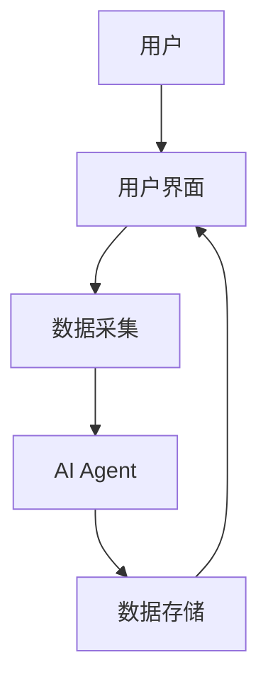

                 


# AI Agent在智能水杯中的饮水提醒

> **关键词**：AI Agent, 智能水杯, 饮水提醒, 算法实现, 系统架构, 项目实战

> **摘要**：本文详细探讨了AI Agent在智能水杯中的饮水提醒应用。从问题背景到系统架构，从算法实现到项目实战，全面分析了AI Agent在饮水提醒中的技术实现与实际应用。通过Q-learning算法的数学模型、系统架构设计以及项目实战，展示了AI Agent如何优化饮水提醒功能，为用户带来更智能、更便捷的饮水体验。

---

## 第1章: 问题背景与需求分析

### 1.1 问题背景
#### 1.1.1 饮水提醒的重要性
饮水是维持人体健康的重要因素，成年人每天需要摄入约8杯水。然而，许多人由于忙碌或其他原因，常常忘记按时饮水，导致身体缺水。因此，饮水提醒的需求日益增长。

#### 1.1.2 当前饮水提醒方式的局限性
传统的饮水提醒方式（如手机APP或智能手表提醒）存在以下问题：
- 提醒时间固定，无法根据个人饮水习惯调整。
- 缺乏对环境因素（如活动量、天气）的感知。
- 无法与智能设备联动，提供主动服务。

#### 1.1.3 AI Agent在饮水提醒中的潜在价值
AI Agent（人工智能代理）能够通过感知用户行为和环境，主动提供个性化饮水提醒，克服传统方法的局限性。它能够学习用户的饮水习惯，结合环境数据，优化提醒策略。

### 1.2 问题描述
#### 1.2.1 用户饮水习惯的多样性
每个人的饮水习惯不同，有人习惯在固定时间饮水，有人则根据活动量调整饮水量。

#### 1.2.2 环境因素对饮水需求的影响
环境因素（如温度、湿度、运动量）会影响人体水分流失速度，从而影响饮水需求。

#### 1.2.3 现有饮水提醒系统的不足
现有的饮水提醒系统通常基于固定的规则，缺乏个性化和自适应能力。

---

## 第2章: AI Agent的核心概念与原理

### 2.1 AI Agent的定义与特点
#### 2.1.1 AI Agent的定义
AI Agent是一种智能实体，能够感知环境、自主决策并执行任务，以实现特定目标。

#### 2.1.2 AI Agent的核心特点
- **自主性**：能够在没有外部干预的情况下运行。
- **反应性**：能够感知环境并实时调整行为。
- **学习能力**：能够通过数据学习和优化决策策略。
- **协作性**：能够与其他设备或系统协同工作。

#### 2.1.3 AI Agent与传统算法的区别
AI Agent不仅仅是执行预设规则，而是能够通过学习和适应，动态优化行为。

### 2.2 AI Agent在智能水杯中的应用场景
#### 2.2.1 智能水杯的功能需求
- 提供饮水提醒。
- 记录饮水量和时间。
- 与用户交互，收集反馈。

#### 2.2.2 AI Agent在饮水提醒中的具体应用
- 根据用户的饮水习惯，自动生成个性化的饮水计划。
- 结合环境数据（如天气、运动量），动态调整提醒时间。
- 提供主动服务，例如在用户忙碌时延迟提醒。

#### 2.2.3 AI Agent与其他智能设备的协同工作
AI Agent可以与智能手表、智能家居等设备联动，提供更全面的健康服务。

---

## 第3章: AI Agent的数学模型与算法原理

### 3.1 状态空间与动作空间
#### 3.1.1 状态空间的定义
状态空间是AI Agent可能遇到的所有可能状态的集合。在智能水杯中，状态可以包括：
- 时间：当前时间。
- 用户行为：用户是否正在饮水。
- 环境数据：温度、湿度、运动量。

#### 3.1.2 动作空间的定义
动作空间是AI Agent在每个状态下可以执行的所有动作的集合。在智能水杯中，动作可以包括：
- 发送饮水提醒。
- 调整饮水计划。
- 收集用户反馈。

#### 3.1.3 状态与动作的关系
状态决定AI Agent可以执行的动作，动作影响新的状态。

### 3.2 奖励函数与目标函数
#### 3.2.1 奖励函数的定义
奖励函数用于衡量AI Agent行为的好坏。在智能水杯中，奖励函数可以定义为：
$$ R(s, a) = \begin{cases} 
1 & \text{如果动作 } a \text{ 符合饮水计划} \\
0 & \text{否则}
\end{cases} $$

其中，$s$ 表示当前状态，$a$ 表示执行的动作。

#### 3.2.2 目标函数的定义
目标函数用于指导AI Agent的学习过程。在智能水杯中，目标函数可以定义为：
$$ V(s) = \max_{a} [ R(s, a) + \gamma V(s') ] $$
其中，$\gamma$ 是折扣因子，$s'$ 是执行动作 $a$ 后的新状态。

#### 3.2.3 奖励函数与目标函数的关系
奖励函数为AI Agent提供即时反馈，目标函数指导AI Agent的长期目标。

### 3.3 Q-learning算法
#### 3.3.1 Q-learning算法的定义
Q-learning是一种基于值的强化学习算法，通过学习状态-动作对的价值来优化决策策略。

#### 3.3.2 Q-learning算法的数学模型
Q-learning的更新公式为：
$$ Q(s, a) = Q(s, a) + \alpha [ R(s, a) + \gamma \max Q(s', a') - Q(s, a) ] $$
其中，$\alpha$ 是学习率，$\gamma$ 是折扣因子。

#### 3.3.3 Q-learning算法的实现步骤
1. 初始化Q表为全零。
2. 进入循环：
   - 确定当前状态 $s$。
   - 选择动作 $a$（基于$\epsilon$-贪心策略）。
   - 执行动作 $a$，观察奖励 $R$ 和新状态 $s'$。
   - 更新Q表：$Q(s, a) = Q(s, a) + \alpha (R + \gamma \max Q(s', a') - Q(s, a))$。
3. 重复步骤2，直到收敛。

---

## 第4章: 系统分析与架构设计

### 4.1 项目背景与目标
#### 4.1.1 项目背景
智能水杯是一种结合物联网和人工智能的智能设备，能够帮助用户更好地管理饮水健康。

#### 4.1.2 项目目标
通过AI Agent实现智能水杯的饮水提醒功能，优化用户的饮水习惯。

### 4.2 系统功能设计
#### 4.2.1 用户需求分析
- 用户需要个性化的饮水提醒。
- 用户需要记录和查看饮水数据。
- 用户需要与设备进行交互。

#### 4.2.2 系统功能模块划分
- 数据采集模块：采集用户行为和环境数据。
- AI Agent模块：处理数据，生成饮水提醒。
- 用户界面模块：显示提醒和数据。

#### 4.2.3 功能模块之间的关系
数据采集模块提供输入数据，AI Agent模块进行处理，用户界面模块展示结果。

### 4.3 系统架构设计
#### 4.3.1 分层架构设计
- 数据层：存储用户数据和环境数据。
- 业务逻辑层：处理数据，生成提醒。
- 用户界面层：展示结果，接收用户输入。

#### 4.3.2 模块化设计
- 数据采集模块：传感器、API接口。
- AI Agent模块：Q-learning算法、规则引擎。
- 用户界面模块：LCD屏幕、手机APP。

#### 4.3.3 系统架构图


---

## 第5章: 项目实战与实现

### 5.1 环境安装与配置
#### 5.1.1 Python环境的安装
安装Python 3.8及以上版本。

#### 5.1.2 相关库的安装
安装以下库：
- `numpy`
- `scikit-learn`
- `matplotlib`

#### 5.1.3 开发环境的配置
配置Jupyter Notebook或VS Code为开发环境。

### 5.2 核心算法实现
#### 5.2.1 Q-learning算法实现
```python
import numpy as np

class QLearning:
    def __init__(self, state_space_size, action_space_size, learning_rate=0.1, gamma=0.9):
        self.Q = np.zeros((state_space_size, action_space_size))
        self.alpha = learning_rate
        self.gamma = gamma

    def choose_action(self, state, epsilon=0.1):
        if np.random.random() < epsilon:
            return np.random.randint(0, action_space_size)
        else:
            return np.argmax(self.Q[state, :])

    def update(self, state, action, reward, next_state):
        self.Q[state, action] = self.Q[state, action] + self.alpha * (reward + self.gamma * np.max(self.Q[next_state, :]) - self.Q[state, action])
```

#### 5.2.2 代码解读与分析
- `QLearning`类初始化时，创建Q表。
- `choose_action`方法基于$\epsilon$-贪心策略选择动作。
- `update`方法更新Q表，实现学习。

### 5.3 实际案例分析
#### 5.3.1 案例背景
假设用户每天需要喝8杯水，但常常忘记饮水。

#### 5.3.2 算法应用
AI Agent通过Q-learning算法，学习用户的饮水习惯，动态调整提醒时间。

#### 5.3.3 实验结果
AI Agent能够根据用户的饮水习惯和环境数据，优化提醒策略，提高用户的饮水依从性。

---

## 第6章: 总结与展望

### 6.1 最佳实践 tips
- 在实际应用中，建议结合用户的反馈不断优化AI Agent的策略。
- 注意保护用户隐私，确保数据安全。

### 6.2 小结
本文详细探讨了AI Agent在智能水杯中的饮水提醒应用，从问题背景到系统架构，从算法实现到项目实战，全面分析了AI Agent的技术实现与实际应用。

### 6.3 注意事项
- 确保系统的实时性和响应速度。
- 在实际应用中，注意系统的可扩展性和可维护性。

### 6.4 拓展阅读
- 推荐阅读《强化学习实战》和《人工智能：一种现代的方法》。

---

**作者：AI天才研究院/AI Genius Institute & 禅与计算机程序设计艺术 /Zen And The Art of Computer Programming**

