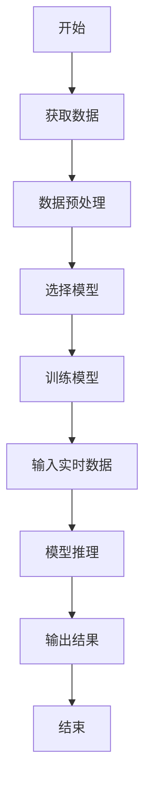
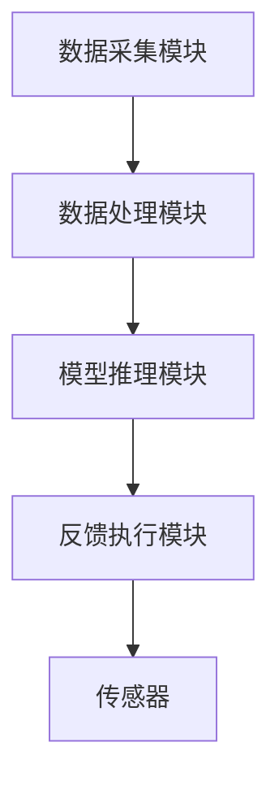

                 


# AI Agent在智能水质实时监测中的实践

> 关键词：AI Agent, 智能水质监测, 实时监测, 机器学习, 智慧环保, 物联网

> 摘要：本文深入探讨了AI Agent在智能水质实时监测中的应用，从理论基础到实际应用，详细阐述了AI Agent的核心原理、算法模型、系统架构以及项目实战。通过丰富的案例分析和详细的技术解析，展示了AI Agent如何提升水质监测的效率和准确性，为环保行业提供了新的解决方案。

---

## 目录

1. [AI Agent与智能水质实时监测概述](#ai-agent与智能水质实时监测概述)
2. [AI Agent的核心原理](#ai-agent的核心原理)
3. [水质监测的关键要素](#水质监测的关键要素)
4. [AI Agent的算法原理](#ai-agent的算法原理)
5. [水质监测的数学模型](#水质监测的数学模型)
6. [智能水质监测系统的架构设计](#智能水质监测系统的架构设计)
7. [AI Agent在水质监测中的项目实战](#ai-agent在水质监测中的项目实战)
8. [总结与展望](#总结与展望)

---

### 第一部分: AI Agent与智能水质实时监测概述

#### 第1章: AI Agent与智能水质监测的背景与概念

##### 1.1 AI Agent的基本概念
- 什么是AI Agent？
- AI Agent的核心特征：自主性、反应性、目标导向。
- AI Agent与传统自动化的区别：从被动执行到主动决策。

##### 1.2 智能水质实时监测的背景
- 水质监测的重要性：保障饮用水安全、监测环境污染。
- 传统水质监测的局限性：数据滞后、人工成本高、效率低。
- 智能水质监测的必要性：实时性、智能化、高效性。

##### 1.3 AI Agent在水质监测中的应用价值
- 提高监测效率：自动化数据采集与分析。
- 实现数据实时分析：快速响应环境变化。
- 优化决策支持：基于AI的预测和建议。

##### 1.4 本章小结

---

#### 第2章: AI Agent与水质监测的核心概念与联系

##### 2.1 AI Agent的核心原理
- 感知层：数据采集与处理。
- 决策层：模型推理与判断。
- 执行层：反馈与优化。

##### 2.2 水质监测的关键要素
- 水质参数：pH、温度、溶解氧等。
- 监测设备：传感器与数据采集器。
- 数据传输：物联网与云平台。

##### 2.3 AI Agent与水质监测的实体关系图

```mermaid
er
actor: 监测系统
agent: AI Agent
sensors: 传感器
database: 数据库
rules: 判断规则
action: 执行动作
actor --> agent: 发起监测请求
agent --> sensors: 获取实时数据
agent --> database: 查询历史数据
agent --> rules: 应用判断规则
agent --> action: 执行反馈动作
```

---

### 第二部分: AI Agent的核心原理

#### 第3章: AI Agent的核心原理

##### 3.1 感知层：数据采集与处理
- 传感器类型：pH传感器、温度传感器、溶解氧传感器。
- 数据采集：通过传感器获取水质参数。
- 数据预处理：去噪、标准化。

##### 3.2 决策层：模型推理与判断
- 机器学习模型：回归模型、分类模型。
- 模型训练：基于历史数据训练水质预测模型。
- 模型推理：实时数据输入，输出预测结果。

##### 3.3 执行层：反馈与优化
- 反馈机制：根据预测结果调整监测参数。
- 优化策略：动态调整模型参数，提高预测精度。

##### 3.4 本章小结

---

### 第三部分: 水质监测的关键要素

#### 第4章: 水质监测的关键要素

##### 4.1 水质参数分析
- pH值：反映水质酸碱度。
- 温度：影响溶解氧和生物活性。
- 溶解氧：反映水质健康状况。

##### 4.2 监测设备的技术特点
- 传感器的精度与稳定性。
- 数据采集器的实时性与可靠性。

##### 4.3 数据传输与云平台
- 物联网技术：传感器数据的无线传输。
- 云平台：数据存储、分析与共享。

##### 4.4 本章小结

---

### 第四部分: AI Agent的算法原理

#### 第5章: AI Agent的算法原理

##### 5.1 机器学习模型的选择与训练
- 回归模型：预测水质参数。
- 分类模型：判断水质状态（正常/异常）。

##### 5.2 算法流程图



##### 5.3 代码实现示例

```python
import numpy as np
from sklearn.linear_model import LinearRegression

# 示例数据
X = np.array([[1], [2], [3], [4], [5]])
y = np.array([2, 4, 5, 4, 6])

# 训练模型
model = LinearRegression()
model.fit(X, y)

# 预测
new_data = np.array([[6]])
print(model.predict(new_data))  # 输出结果
```

##### 5.5 本章小结

---

### 第五部分: 水质监测的数学模型

#### 第6章: 水质监测的数学模型

##### 6.1 回归模型的建立
- 线性回归：$$ y = \beta_0 + \beta_1 x + \epsilon $$
- 非线性回归：多项式回归、逻辑回归。

##### 6.2 时间序列预测模型
- ARIMA模型：自回归积分滑动平均模型。
- LSTM网络：长短期记忆网络。

##### 6.3 模型评估与优化
- 评估指标：均方误差（MSE）、R平方值（R²）。
- 超参数优化：网格搜索、随机搜索。

##### 6.4 本章小结

---

### 第六部分: 智能水质监测系统的架构设计

#### 第7章: 智能水质监测系统的架构设计

##### 7.1 系统功能模块
- 数据采集模块：传感器数据采集。
- 数据处理模块：预处理与存储。
- 模型推理模块：水质预测与判断。
- 反馈执行模块：调整监测参数。

##### 7.2 系统架构图



##### 7.3 接口设计
- 数据接口：传感器与采集器之间的通信接口。
- 模型接口：模型推理与系统交互的接口。

##### 7.4 本章小结

---

### 第七部分: AI Agent在水质监测中的项目实战

#### 第8章: AI Agent在水质监测中的项目实战

##### 8.1 项目背景与目标
- 项目背景：某城市饮用水监测系统。
- 项目目标：实现水质实时监测与预警。

##### 8.2 项目实施步骤
1. 数据采集：部署传感器。
2. 数据预处理：清洗与归一化。
3. 模型训练：训练水质预测模型。
4. 系统集成：搭建AI Agent系统。
5. 测试与优化：验证系统性能。

##### 8.3 实际案例分析
- 数据分析：某段时间内的水质变化。
- 模型表现：预测准确率、响应时间。

##### 8.4 本章小结

---

### 第八部分: 总结与展望

#### 第9章: 总结与展望

##### 9.1 全文总结
- AI Agent在水质监测中的核心作用。
- 系统架构与技术实现的总结。

##### 9.2 未来展望
- 技术优化：更高效的算法、更智能的模型。
- 应用扩展：与其他环境监测领域的结合。

##### 9.3 本章小结

---

作者：AI天才研究院/AI Genius Institute & 禅与计算机程序设计艺术 /Zen And The Art of Computer Programming

