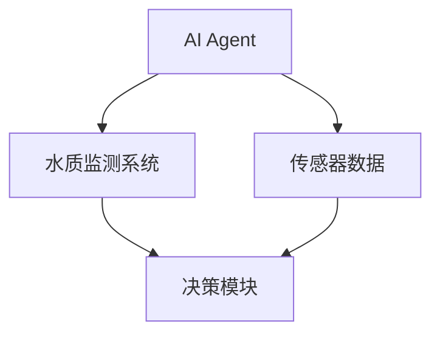
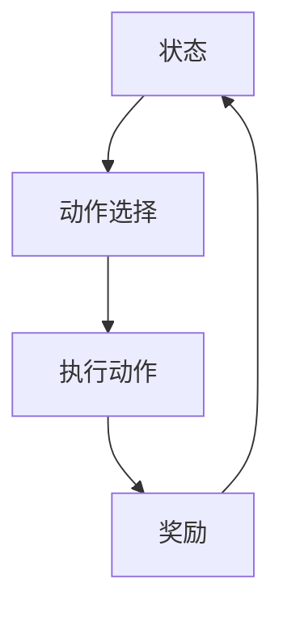
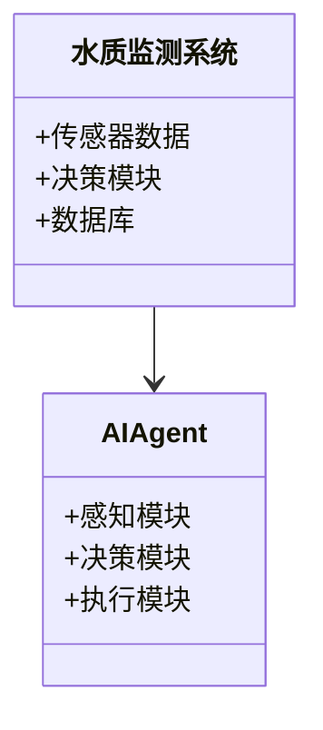
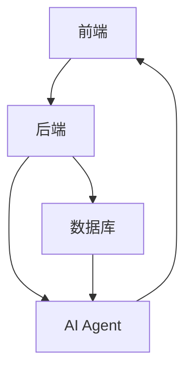
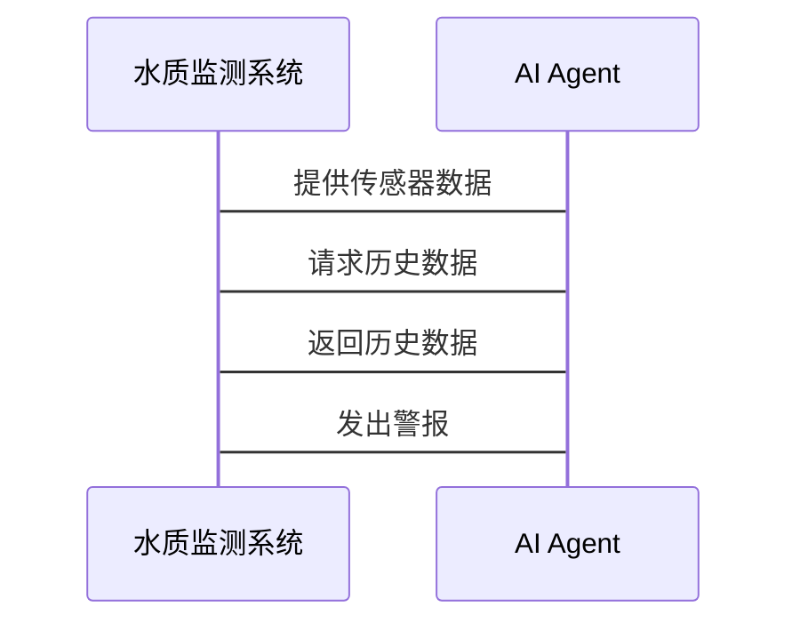

                 


# AI Agent在智能水质监测中的实践

> 关键词：AI Agent, 智能水质监测, 强化学习, 水质数据分析, 系统架构设计

> 摘要：本文详细探讨了AI Agent在智能水质监测中的应用实践，从背景介绍、核心概念、算法原理到系统设计和项目实战，全面解析了AI Agent如何助力水质监测系统的智能化升级。

---

# 第1章: AI Agent与智能水质监测的背景介绍

## 1.1 AI Agent的基本概念

### 1.1.1 什么是AI Agent

AI Agent（人工智能代理）是一种能够感知环境、自主决策并执行任务的智能实体。它通过传感器获取数据，利用算法进行分析，做出决策，并通过执行器与环境交互。AI Agent的核心目标是通过智能化的方式解决问题，提升效率。

### 1.1.2 AI Agent的核心特征

| 特性 | 描述 |
|------|------|
| 自主性 | 能够自主决策，无需外部干预 |
| 反应性 | 能够实时感知环境并做出反应 |
| 学习性 | 能够通过经验改进性能 |
| 社交能力 | 能够与其他系统或人类进行交互 |

### 1.1.3 AI Agent与传统自动化的区别

- **传统自动化**：基于固定的规则执行任务，缺乏灵活性和学习能力。
- **AI Agent**：具备自主学习和适应能力，能够根据环境变化动态调整行为。

---

## 1.2 智能水质监测的背景与现状

### 1.2.1 水质监测的重要性

水质监测是保障饮用水安全、环境保护和生态平衡的重要手段。随着工业化和城市化的快速发展，水质问题日益严重，传统的人工监测方式效率低下，难以满足需求。

### 1.2.2 智能水质监测的发展历程

- **阶段一**：人工采样分析（传统方式）。
- **阶段二**：基于传感器的自动化监测。
- **阶段三**：智能化监测，引入AI技术。

### 1.2.3 当前水质监测技术的挑战

- 数据量大，处理复杂。
- 数据实时性要求高。
- 环境动态变化，需要快速响应。

---

## 1.3 AI Agent在水质监测中的应用价值

### 1.3.1 提高监测效率

AI Agent能够实时分析数据，快速识别异常情况，减少人工干预。

### 1.3.2 实现数据智能分析

通过机器学习算法，AI Agent能够发现数据中的隐含规律，提供更精准的分析结果。

### 1.3.3 优化决策过程

AI Agent能够根据实时数据和历史数据，提供最优决策建议，降低误判风险。

---

## 1.4 本章小结

本章介绍了AI Agent的基本概念及其在水质监测中的应用价值，为后续章节奠定了基础。

---

# 第2章: AI Agent与水质监测的核心概念与联系

## 2.1 AI Agent的核心原理

### 2.1.1 AI Agent的感知与决策机制

AI Agent通过传感器获取数据，利用算法进行分析，做出决策，并通过执行器与环境交互。

### 2.1.2 基于强化学习的AI Agent算法

- **强化学习**：通过与环境的交互，不断优化行为策略。
- **Q-learning算法**：一种常用的强化学习算法。

### 2.1.3 AI Agent的自主性与适应性

AI Agent能够在动态环境中自主调整行为，适应环境变化。

---

## 2.2 智能水质监测系统的架构

### 2.2.1 数据采集层

- **传感器**：实时采集水质数据，如pH值、溶解氧、温度等。
- **数据预处理**：对传感器数据进行清洗和归一化处理。

### 2.2.2 数据处理层

- **数据存储**：将采集的数据存储到数据库中。
- **数据分析**：利用机器学习算法对数据进行分析，识别异常情况。

### 2.2.3 智能决策层

- **决策模块**：根据分析结果，做出决策，如发出警报或调整设备参数。

---

## 2.3 AI Agent与水质监测系统的实体关系



---

## 2.4 本章小结

本章详细讲解了AI Agent的核心原理及其与水质监测系统的联系，为后续章节的系统设计奠定了基础。

---

# 第3章: AI Agent在水质监测中的算法原理

## 3.1 基于强化学习的AI Agent算法

### 3.1.1 强化学习的基本概念

- **状态**：环境中的当前情况。
- **动作**：AI Agent采取的行为。
- **奖励**：环境对AI Agent行为的反馈。

### 3.1.2 Q-learning算法

Q-learning算法是一种无模型强化学习算法，适用于离线训练场景。

#### 算法流程图



### 3.1.3 算法实现的数学模型

Q-learning算法的更新公式如下：

$$ Q(s,a) = Q(s,a) + \alpha (r + \max_{a'} Q(s',a') - Q(s,a)) $$

其中：
- \( Q(s,a) \) 表示当前状态 \( s \) 下采取动作 \( a \) 的价值。
- \( \alpha \) 表示学习率。
- \( r \) 表示奖励。
- \( \max_{a'} Q(s',a') \) 表示下一状态 \( s' \) 下的最大价值动作。

---

## 3.2 算法实现的代码示例

```python
import numpy as np

class AI-Agent:
    def __init__(self, state_space, action_space):
        self.q_table = np.zeros((state_space, action_space))
        self.learning_rate = 0.1
        self.discount_factor = 0.9

    def choose_action(self, state):
        if np.random.rand() < 0.9:
            return np.argmax(self.q_table[state, :])
        else:
            return np.random.randint(0, action_space)

    def learn(self, state, action, reward, next_state):
        target = reward + self.discount_factor * np.max(self.q_table[next_state, :])
        self.q_table[state, action] = self.q_table[state, action] + self.learning_rate * (target - self.q_table[state, action])
```

---

## 3.3 本章小结

本章详细讲解了Q-learning算法在水质监测中的应用，为后续章节的系统设计提供了算法基础。

---

# 第4章: 系统分析与架构设计方案

## 4.1 问题场景介绍

水质监测系统需要实时监测水质参数，及时发现异常情况，确保水质安全。

## 4.2 系统功能设计

### 4.2.1 领域模型



### 4.2.2 系统架构设计



### 4.2.3 系统接口设计

- **输入接口**：传感器数据接口。
- **输出接口**：警报输出接口。
- **交互接口**：用户交互接口。

---

## 4.3 系统交互流程图



---

## 4.4 本章小结

本章详细设计了水质监测系统的架构，为后续章节的项目实现提供了指导。

---

# 第5章: 项目实战

## 5.1 环境安装

- **Python**：安装Python 3.8及以上版本。
- **库**：安装numpy、pandas、scikit-learn等库。

```bash
pip install numpy pandas scikit-learn
```

---

## 5.2 系统核心实现

### 5.2.1 数据采集与预处理

```python
import pandas as pd

data = pd.read_csv('water_quality.csv')
data = data.dropna()
```

### 5.2.2 模型训练与部署

```python
from sklearn.model_selection import train_test_split
from sklearn.ensemble import RandomForestClassifier

X = data.drop('label', axis=1)
y = data['label']

X_train, X_test, y_train, y_test = train_test_split(X, y, test_size=0.2)
model = RandomForestClassifier().fit(X_train, y_train)
```

### 5.2.3 系统集成

```python
class WaterQualitySystem:
    def __init__(self):
        self.agent = AI-Agent(...)
        self.database = Database()
    
    def monitor(self):
        while True:
            data = self.database.query()
            self.agent.learn(data)
```

---

## 5.3 代码应用解读与分析

- **数据采集**：通过传感器获取水质数据。
- **数据预处理**：清洗和归一化处理。
- **模型训练**：使用机器学习算法训练模型。
- **系统集成**：将AI Agent与水质监测系统集成。

---

## 5.4 实际案例分析

- **案例背景**：某地水质异常事件。
- **数据分析**：AI Agent识别出异常情况并发出警报。
- **结果验证**：及时采取措施，避免水质进一步恶化。

---

## 5.5 项目小结

本章通过实际项目展示了AI Agent在水质监测中的应用，详细讲解了系统实现的各个环节。

---

# 第6章: 总结与展望

## 6.1 本章总结

本文详细探讨了AI Agent在智能水质监测中的应用，从背景介绍、核心概念、算法原理到系统设计和项目实战，全面解析了AI Agent如何助力水质监测系统的智能化升级。

---

## 6.2 技术展望

未来，随着AI技术的不断发展，水质监测系统将更加智能化和高效化。AI Agent将在更多场景中得到应用，推动水质监测技术的进一步发展。

---

## 6.3 最佳实践 tips

- **数据质量**：确保数据的准确性和完整性。
- **模型优化**：定期更新模型，提升预测精度。
- **系统维护**：及时修复系统漏洞，确保稳定运行。

---

# 作者：AI天才研究院 & 禅与计算机程序设计艺术

---

**附录**：完整代码示例、更多案例分析、技术细节扩展等。

---

通过以上目录结构，我们可以看到《AI Agent在智能水质监测中的实践》这篇文章将从理论到实践，全面解析AI Agent在水质监测中的应用，帮助读者深入了解相关技术并掌握实际应用的方法。

