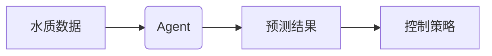
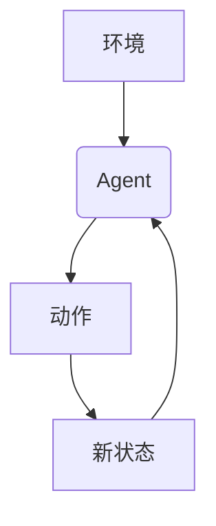
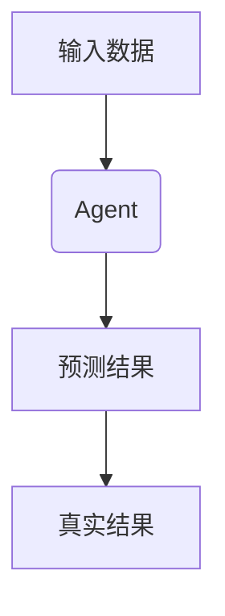
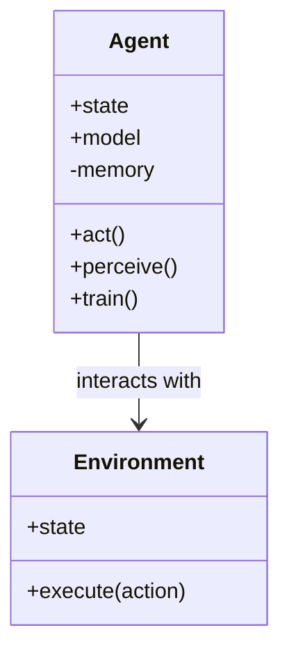
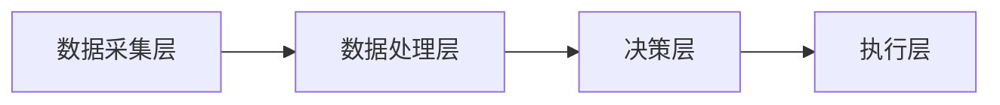
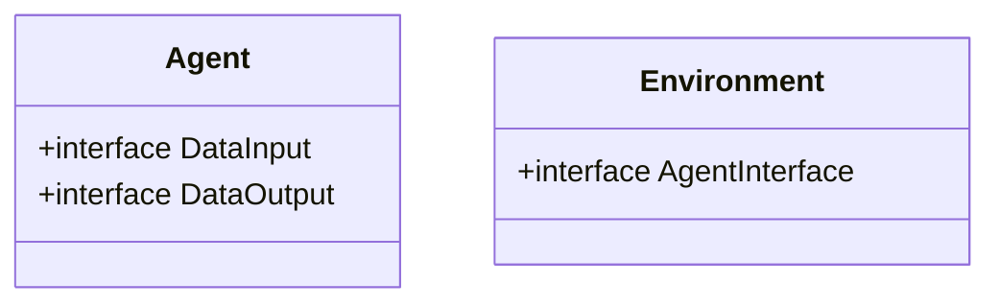
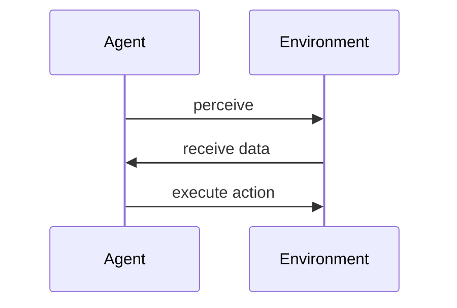

                 


# AI Agent在智能水质预测与控制中的角色

## 关键词：AI Agent, 智能水质预测, 水质控制, 机器学习, 强化学习, 系统架构

## 摘要：  
本文探讨了AI Agent在智能水质预测与控制中的角色和应用，分析了AI Agent的核心原理、算法实现、系统架构设计以及实际项目中的应用案例。通过详细的技术分析和实际案例，展示了AI Agent如何通过感知、决策和执行三个环节实现水质的智能化预测与控制，为水质管理提供了高效的解决方案。

---

# 第一部分: AI Agent在智能水质预测与控制中的背景介绍

## 第1章: AI Agent的基本概念与背景

### 1.1 AI Agent的定义与核心要素

#### 1.1.1 AI Agent的定义  
AI Agent（人工智能代理）是一种能够感知环境、自主决策并执行任务的智能实体。它通过传感器获取数据，利用算法进行分析和推理，并通过执行器与环境交互。AI Agent的核心目标是通过智能化手段实现特定任务的自动化。

#### 1.1.2 AI Agent的核心要素  
AI Agent主要由以下三个核心要素组成：  
1. **感知层**：通过传感器或数据接口获取环境信息。  
2. **决策层**：基于感知数据进行分析和推理，生成决策策略。  
3. **执行层**：根据决策结果执行具体操作，与环境进行交互。  

#### 1.1.3 AI Agent的分类与特点  
AI Agent可以根据功能、智能水平和应用场景进行分类：  
1. **基于规则的AI Agent**：通过预定义的规则进行决策，适用于简单任务。  
2. **基于模型的AI Agent**：利用数学模型进行推理和决策，适用于复杂任务。  
3. **强化学习型AI Agent**：通过与环境交互学习最优策略，适用于动态环境。  

---

### 1.2 水质预测与控制的背景

#### 1.2.1 水质监测的重要性  
水质是人类生存和环境健康的关键指标。随着工业化和城市化的快速发展，水污染问题日益严重，对水质的实时监测和预测变得尤为重要。  

#### 1.2.2 智能化水质预测与控制的需求  
传统水质监测依赖人工采样和实验室分析，存在效率低、成本高等问题。随着人工智能技术的发展，智能化水质预测与控制成为解决这些问题的重要手段。  

---

### 1.3 AI Agent在水质预测与控制中的作用

#### 1.3.1 AI Agent在水质预测中的角色  
AI Agent可以通过实时采集水质数据（如温度、pH值、溶解氧等），利用机器学习算法（如回归分析、随机森林）建立水质预测模型，实现对水质变化的精准预测。  

#### 1.3.2 AI Agent在水质控制中的应用  
AI Agent可以根据预测结果，结合实时数据，动态调整控制参数（如投药量、曝气量等），实现对水质的智能化控制。例如，在污水处理厂中，AI Agent可以优化处理工艺，降低能耗，提高处理效率。  

---

## 第2章: AI Agent的核心概念与联系

### 2.1 AI Agent的核心原理

#### 2.1.1 感知层  
AI Agent通过传感器或数据接口获取水质数据。例如，在水质监测系统中，AI Agent可以通过 IoT 设备实时采集水温、pH值、溶解氧等参数。  

#### 2.1.2 决策层  
AI Agent利用算法模型对感知数据进行分析，生成决策策略。例如，使用强化学习算法优化污水处理过程中的参数调整。  

#### 2.1.3 执行层  
AI Agent根据决策结果，通过执行器（如水泵、阀门等）与环境进行交互，实现对水质的控制。  

---

### 2.2 AI Agent与水质预测控制的关系

#### 2.2.1 实体关系图  
以下是一个简单的实体关系图，展示了AI Agent在水质预测与控制中的核心关系：  



---

### 2.3 AI Agent的核心属性对比

| 属性       | 描述                                         |
|------------|----------------------------------------------|
| 感知能力   | 数据采集与处理能力                           |
| 决策能力   | 算法模型的准确性                             |
| 执行能力   | 系统控制的实时性                             |

---

## 第3章: AI Agent在水质预测与控制中的算法原理

### 3.1 常见AI Agent算法

#### 3.1.1 强化学习算法  
强化学习是一种通过试错机制优化决策的算法。以下是一个强化学习算法的流程图：  



#### 3.1.2 监督学习算法  
监督学习算法通过标签数据进行训练，实现对水质的预测。以下是一个监督学习算法的流程图：  



---

### 3.2 算法实现

#### 3.2.1 强化学习实现  
以下是一个简单的强化学习算法代码示例：  

```python
class Agent:
    def __init__(self):
        self.model = self.build_model()
    
    def build_model(self):
        import numpy as np
        # 简单线性回归模型
        return np.random.rand(3,1)
    
    def act(self, state):
        # 根据当前状态选择动作
        return np.argmax(self.model.dot(state))
```

---

### 3.3 数学模型与公式

#### 3.3.1 回归分析模型  
水质预测可以通过回归分析模型实现。以下是一个简单的线性回归模型公式：  

$$ y = \beta_0 + \beta_1x_1 + \beta_2x_2 + \ldots + \beta_nx_n $$  

其中，$y$ 是预测目标（如水质指标），$x_i$ 是输入特征（如温度、pH值），$\beta_i$ 是回归系数。  

#### 3.3.2 强化学习模型  
强化学习模型可以通过Q-learning算法实现。以下是一个Q-learning算法的更新公式：  

$$ Q(s, a) = Q(s, a) + \alpha [r + \gamma \max Q(s', a')] $$  

其中，$Q(s, a)$ 是当前状态-动作对的Q值，$\alpha$ 是学习率，$r$ 是奖励，$\gamma$ 是折扣因子，$s'$ 是新状态。  

---

## 第4章: 系统分析与架构设计

### 4.1 问题场景介绍  
假设我们正在设计一个智能水质监测与控制系统，目标是实时监测水质指标并进行智能控制。  

### 4.2 系统功能设计  
以下是系统功能设计的类图：  



---

## 4.3 系统架构设计  

### 4.3.1 分层架构  
系统采用分层架构设计，包括数据采集层、数据处理层、决策层和执行层。  



---

## 4.4 接口设计与交互流程  

### 4.4.1 接口设计  
以下是系统接口设计的类图：  



### 4.4.2 交互流程  
以下是系统交互流程的序列图：  



---

## 第5章: 项目实战

### 5.1 环境安装  
首先，需要安装Python和相关库（如numpy、pandas、scikit-learn）。  

### 5.2 核心代码实现  

#### 5.2.1 数据预处理  
以下是一个水质数据预处理的代码示例：  

```python
import pandas as pd

data = pd.read_csv('water_quality.csv')
# 去除缺失值
data = data.dropna()
# 标准化处理
from sklearn.preprocessing import StandardScaler
scaler = StandardScaler()
data_scaled = scaler.fit_transform(data)
```

#### 5.2.2 模型训练  
以下是一个水质预测模型的训练代码：  

```python
from sklearn.linear_model import LinearRegression
model = LinearRegression()
model.fit(data_scaled[:, :-1], data_scaled[:, -1])
```

#### 5.2.3 模型预测  
以下是一个水质预测的代码示例：  

```python
import numpy as np
input_data = np.array([[25, 7.5, 20]])
prediction = model.predict(input_data)
print(prediction)
```

---

### 5.3 案例分析  
假设我们有一个水质数据集，包含温度、pH值和溶解氧三个特征，目标是预测水体中的溶解氧浓度。通过训练模型，我们可以实现对溶解氧浓度的精准预测，并根据预测结果动态调整控制参数。  

---

## 第6章: 最佳实践与小结

### 6.1 最佳实践 tips  
1. 数据预处理是模型训练的关键，建议对数据进行标准化或归一化处理。  
2. 在强化学习中，合理设计奖励机制可以提高模型的优化效果。  
3. 在实际应用中，建议采用分层架构设计，便于系统的扩展和维护。  

### 6.2 小结  
本文详细介绍了AI Agent在智能水质预测与控制中的角色和应用。通过感知、决策和执行三个环节，AI Agent能够实现对水质的智能化预测与控制，为水质管理提供了高效解决方案。  

### 6.3 未来展望  
随着人工智能技术的不断发展，AI Agent在水质预测与控制中的应用将更加广泛和深入。未来，可以通过与其他技术（如物联网、边缘计算）的结合，进一步提升系统的智能化水平和实时性。

---

# 作者：AI天才研究院/AI Genius Institute & 禅与计算机程序设计艺术 /Zen And The Art of Computer Programming

