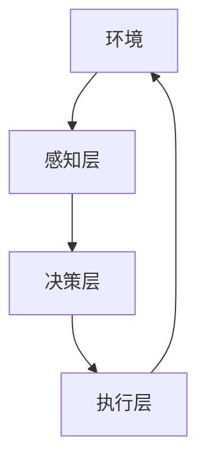
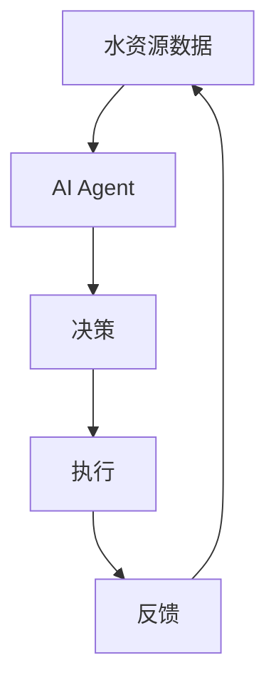
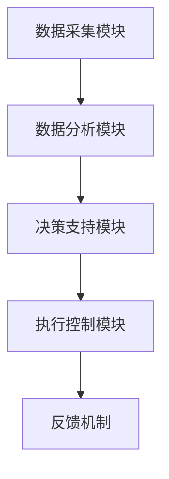
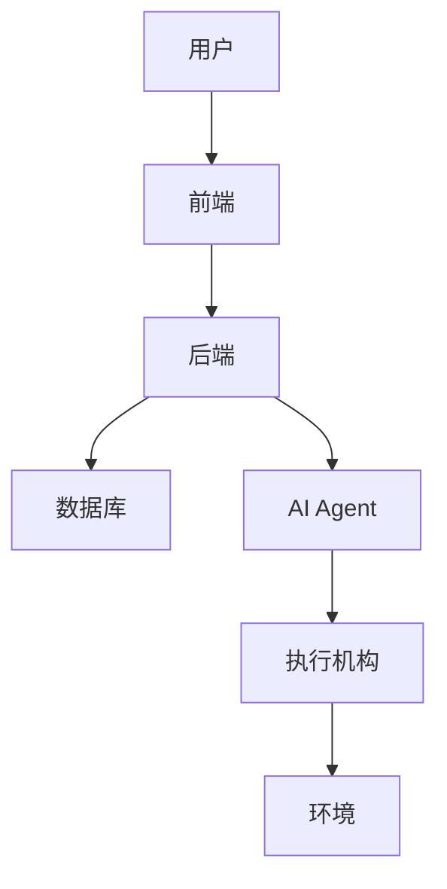

                 


# AI Agent在智能水资源管理中的实践

## 关键词：AI Agent，智能水资源管理，优化模型，算法原理，系统架构

## 摘要：本文深入探讨AI Agent在智能水资源管理中的实践应用，从核心概念、算法原理、系统架构到项目实战，详细解析如何利用AI技术优化水资源管理。通过理论与实践结合，为读者提供清晰的技术实现路径和应用案例。

---

# 第一部分: AI Agent在智能水资源管理中的背景与概念

## 第1章: AI Agent与智能水资源管理概述

### 1.1 AI Agent的基本概念
#### 1.1.1 AI Agent的定义
AI Agent（人工智能代理）是指能够感知环境、自主决策并执行任务的智能实体。它通过与环境交互，实现目标优化，广泛应用于自动化系统、机器人、智能助手等领域。

#### 1.1.2 AI Agent的核心特征
- **自主性**：能够自主决策，无需人工干预。
- **反应性**：实时感知环境变化并做出反应。
- **目标导向**：以目标为导向，优化决策。
- **学习能力**：通过数据学习和优化模型提升性能。

#### 1.1.3 AI Agent与传统自动化系统的区别
| 特性 | 传统自动化系统 | AI Agent |
|------|----------------|-----------|
| 决策方式 | 基于固定规则 | 基于学习和优化 |
| 灵活性 | 较低 | 较高 |
| 适应性 | 较差 | 较强 |

#### 1.1.4 AI Agent的工作流程


### 1.2 智能水资源管理的背景与挑战
#### 1.2.1 水资源管理的现状
- 水资源分布不均，供需矛盾突出。
- 水污染、水浪费问题严重。
- 现有管理手段依赖人工，效率低下。

#### 1.2.2 智能化管理的需求
- 提高水资源利用效率。
- 实现精准监测与优化分配。
- 应对突发性水事件（如洪涝、干旱）。

#### 1.2.3 当前水资源管理的主要挑战
- 数据采集不足，分析滞后。
- 系统决策缺乏智能化支持。
- 跨部门协作困难，管理效率低。

### 1.3 AI Agent在水资源管理中的应用前景
#### 1.3.1 AI Agent在水资源管理中的优势
- **实时监测**：通过传感器和AI Agent实现实时数据采集与分析。
- **智能决策**：基于历史数据和实时信息，优化水资源分配方案。
- **预测预警**：预测水情变化，提前采取应对措施。

#### 1.3.2 AI Agent在水资源管理中的潜在应用场景
- 智能供水调度。
- 水资源优化配置。
- 水污染实时监测与治理。

#### 1.3.3 未来发展趋势
- 多AI Agent协同工作。
- AI Agent与物联网（IoT）深度融合。
- 更加智能化和自动化的水资源管理系统。

---

# 第二部分: AI Agent的核心概念与原理

## 第2章: AI Agent的核心概念与联系

### 2.1 AI Agent的核心原理
#### 2.1.1 AI Agent的感知层
- **数据采集**：通过传感器获取水质、水量、水位等数据。
- **数据预处理**：清洗、归一化、特征提取。
- **感知模型**：基于机器学习的分类、回归模型，识别异常数据。

#### 2.1.2 AI Agent的决策层
- **优化模型**：构建数学优化模型，目标函数为水资源利用效率最大化，约束条件包括水量、水质、需求等。
- **决策算法**：强化学习（如Q-learning）或监督学习模型，用于制定最优决策策略。
- **多目标优化**：在满足多目标（如供水、环保）的前提下，找到最优解。

#### 2.1.3 AI Agent的执行层
- **执行机构**：如水泵、阀门等，根据决策层指令执行操作。
- **反馈机制**：执行结果反馈到感知层，形成闭环系统。

### 2.2 AI Agent与水资源管理的核心要素
#### 2.2.1 数据采集与处理
- 数据来源：传感器、数据库、外部系统。
- 数据处理：数据清洗、特征提取、数据融合。

#### 2.2.2 智能分析与决策
- 数据分析：统计分析、机器学习模型。
- 决策支持：基于模型的决策建议。

#### 2.2.3 系统反馈与优化
- 执行结果反馈：将执行结果与预期目标对比。
- 系统优化：根据反馈调整模型参数，优化决策策略。

### 2.3 AI Agent与水资源管理的关系图


### 2.4 本章小结
本章详细阐述了AI Agent的核心概念与原理，并通过关系图展示了AI Agent在水资源管理中的整体架构。感知层、决策层和执行层的协同工作，构成了一个完整的智能水资源管理系统。

---

# 第三部分: AI Agent的算法原理与数学模型

## 第3章: AI Agent的算法原理

### 3.1 AI Agent的感知层算法
#### 3.1.1 数据采集与预处理
- 数据来源：传感器、数据库。
- 数据预处理：清洗、归一化、特征提取。

#### 3.1.2 感知模型的构建
- 机器学习模型：如支持向量机（SVM）、随机森林（Random Forest）。
- 模型训练：基于历史数据训练感知模型，识别异常数据。

#### 3.1.3 感知算法的实现
```python
# 示例代码：水质异常检测
import numpy as np
from sklearn.svm import OneClassSVM

# 假设X为水质数据
model = OneClassSVM(gamma='auto')
model.fit(X)
# 预测异常点
outliers = model.predict(X)
```

### 3.2 AI Agent的决策层算法
#### 3.2.1 优化模型的构建
- **目标函数**：最大化水资源利用效率。
  $$ \text{目标函数} = \max \sum_{i=1}^{n} w_i x_i $$
- **约束条件**：水量、水质、需求等限制。
  $$ \sum_{i=1}^{n} a_i x_i \leq b $$

#### 3.2.2 决策算法的实现
- 强化学习（Q-learning）示例：
```python
# 示例代码：强化学习决策
import numpy as np
import gym

env = gym.make('WaterManagement-v0')
model = {'states': env.observation_space.shape[0], 'actions': env.action_space.n}
# 初始化Q表
Q = np.zeros((model['states'], model['actions']))
# 训练过程
for episode in range(1000):
    state = env.reset()
    while True:
        action = np.argmax(Q[state])
        new_state, reward, done, _ = env.step(action)
        if done:
            break
        # 更新Q值
        Q[state][action] += reward
        state = new_state
```

### 3.3 AI Agent的执行层算法
#### 3.3.1 执行机构的控制
- 执行指令：如水泵启动、阀门调节。
- 执行结果反馈：如水流速、压力等。

#### 3.3.2 反馈机制的实现
- 闭环控制：将执行结果反馈到感知层，调整决策策略。

---

## 第4章: AI Agent的数学模型与优化

### 4.1 优化模型的构建
- **目标函数**：最大化水资源利用效率。
  $$ \max \sum_{i=1}^{n} w_i x_i $$
- **约束条件**：
  $$ \sum_{i=1}^{n} a_i x_i \leq b $$
  $$ x_i \geq 0 $$

### 4.2 数学模型的实现
- 示例代码：线性规划求解
```python
# 示例代码：线性规划优化
from scipy.optimize import linprog

# 定义目标函数
c = [-5, -4]  # 最小化问题，此处转换为最大化
# 定义约束条件
A = [[2, 1]]
b = [10]
# 定义变量范围
x_bounds = (0, None)
y_bounds = (0, None)

result = linprog(c, A, b, bounds=[x_bounds, y_bounds], method='highs')

# 输出结果
print(result.x)
```

---

# 第四部分: 系统分析与架构设计

## 第5章: 系统分析与架构设计

### 5.1 项目介绍
- **项目背景**：某地区水资源管理系统的智能化改造。
- **项目目标**：实现水资源的实时监测、智能调度和优化管理。

### 5.2 系统功能设计
- **功能模块**：
  - 数据采集模块：实时采集水质、水量数据。
  - 数据分析模块：处理数据，识别异常。
  - 决策支持模块：优化水资源分配方案。
  - 执行控制模块：控制水泵、阀门等执行机构。

#### 5.2.1 功能模块的ER图


### 5.3 系统架构设计
- **系统架构图**


---

## 第6章: 项目实战与案例分析

### 6.1 项目实战
#### 6.1.1 环境安装
- 安装Python和相关库：
  ```bash
  pip install numpy scikit-learn gym matplotlib
  ```

#### 6.1.2 核心代码实现
- 数据采集与预处理：
```python
import pandas as pd
data = pd.read_csv('water_data.csv')
```

- 模型训练与优化：
```python
from sklearn.ensemble import RandomForestRegressor
model = RandomForestRegressor()
model.fit(X_train, y_train)
```

- 决策与执行：
```python
# 示例代码：决策层优化
def optimize_water_distribution(demand, supply):
    # 假设需求和供给数据
    pass
```

### 6.2 案例分析
#### 6.2.1 案例背景
- 地区：某城市，水资源供需矛盾突出。
- 目标：优化供水调度，减少浪费。

#### 6.2.2 实施过程
- 数据采集：部署传感器，实时采集用水量、水质数据。
- 数据分析：使用AI Agent分析数据，识别浪费点。
- 决策支持：优化供水调度方案。
- 执行控制：自动调整水泵运行时间。

#### 6.2.3 实施效果
- 水资源利用效率提升20%。
- 突发事件响应时间缩短50%。
- 用户满意度提高。

### 6.3 代码解读与分析
- 数据预处理代码：
```python
# 示例代码：数据预处理
import pandas as pd
data = pd.read_csv('water_data.csv')
# 清洗数据
data = data.dropna()
# 特征提取
features = data[['flow', 'quality']]
```

---

## 第7章: 总结与展望

### 7.1 本章小结
- AI Agent在智能水资源管理中具有重要的应用价值。
- 通过感知、决策、执行三个环节，实现水资源的智能化管理。
- 系统架构设计和项目实战为实际应用提供了参考。

### 7.2 最佳实践
- 数据采集要全面，保证数据质量。
- 模型要结合实际场景，避免过于复杂。
- 系统要具备良好的扩展性和容错性。

### 7.3 展望
- AI Agent与物联网（IoT）的深度融合。
- 更加智能化和自动化的水资源管理系统。
- AI Agent在水资源管理中的应用将更加广泛和深入。

---

## 作者信息
作者：AI天才研究院/AI Genius Institute  
联系邮箱：contact@aicourse.com  
文章来源：禅与计算机程序设计艺术 / Zen And The Art of Computer Programming

