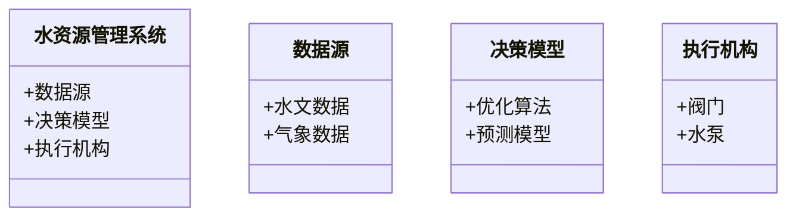
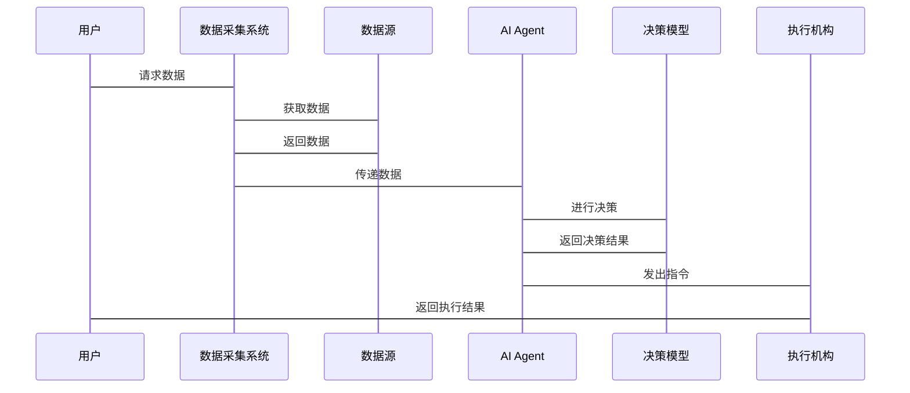

                 


# AI Agent在智能水资源管理决策中的角色

## 关键词
AI Agent, 智能水资源管理, 决策支持系统, 多智能体系统, 强化学习, 水资源优化配置

## 摘要
随着全球水资源短缺问题的加剧，智能水资源管理的重要性日益凸显。AI Agent（人工智能代理）作为一种能够自主感知环境、优化决策的智能体，正在成为智能水资源管理中的核心工具。本文将从AI Agent的基本概念出发，深入分析其在水资源管理中的应用场景，探讨其算法原理、系统架构设计以及实际项目实现。通过本文的阐述，读者将能够全面理解AI Agent在智能水资源管理中的角色与价值。

---

## 第一部分: AI Agent在智能水资源管理中的背景与概念

### 第1章: AI Agent的基本概念与水资源管理背景

#### 1.1 AI Agent的定义与核心特征
##### 1.1.1 AI Agent的定义
AI Agent（人工智能代理）是指能够感知环境、自主决策并采取行动以实现目标的智能系统。它通常具备感知、推理、规划和执行能力。

##### 1.1.2 AI Agent的核心特征
- **自主性**：AI Agent能够在没有外部干预的情况下自主运行。
- **反应性**：能够实时感知环境变化并做出反应。
- **目标导向**：所有行动都是为了实现特定目标。
- **学习能力**：能够通过数据和经验不断优化自身行为。

##### 1.1.3 AI Agent与传统决策系统的区别
| 特性 | AI Agent | 传统决策系统 |
|------|----------|---------------|
| 决策方式 | 基于实时数据和学习 | 基于预设规则和数据 |
| 灵活性 | 高 | 低 |
| 学习能力 | 强 | 无或弱 |

#### 1.2 水资源管理的现状与挑战
##### 1.2.1 水资源管理的基本概念
水资源管理是指对水资源的开发、利用、配置和保护进行规划和调控的过程，旨在实现水资源的可持续利用。

##### 1.2.2 当前水资源管理的主要挑战
- **水资源短缺**：全球范围内水资源分布不均，部分地区面临严重短缺。
- **污染问题**：工业废水、农业面源污染等对水资源造成严重威胁。
- **管理复杂性**：涉及多部门协作、跨区域协调和复杂的决策过程。

##### 1.2.3 AI Agent在水资源管理中的应用潜力
AI Agent可以通过实时数据感知、智能决策和自动化行动，帮助优化水资源配置、预测水文变化、监测水质等。

#### 1.3 AI Agent在水资源管理中的问题背景
##### 1.3.1 水资源管理中的决策问题
- **多目标优化**：水资源管理需要在用水需求、环境保护和经济效益之间找到平衡。
- **不确定性**：气候变化、人类活动等不确定性因素对水资源管理提出挑战。

##### 1.3.2 AI Agent在决策中的角色定位
AI Agent作为智能决策支持系统的核心，能够通过实时数据处理、模型模拟和优化算法，为水资源管理提供科学决策支持。

##### 1.3.3 问题解决的边界与外延
AI Agent的应用边界在于其数据获取能力和计算能力，外延则涉及与其他系统的协同工作。

#### 1.4 AI Agent与水资源管理的核心要素
##### 1.4.1 核心概念的结构分析
水资源管理涉及水文数据、决策模型、执行机构等核心要素。

##### 1.4.2 核心要素的对比表格
| 核心要素 | 描述 | 作用 |
|----------|------|------|
| 水文数据 | 包括降雨、蒸发、径流等数据 | 提供决策依据 |
| 决策模型 | 用于模拟和优化水资源分配 | 支持决策制定 |
| 执行机构 | 包括阀门、水泵等设备 | 执行决策指令 |

##### 1.4.3 ER实体关系图的Mermaid流程图
```mermaid
er
actor: 用户
goal: 决策目标
model: 决策模型
data: 数据源
action: 执行行动
```

---

## 第二部分: AI Agent的核心概念与原理

### 第2章: AI Agent的核心原理与算法

#### 2.1 AI Agent的基本原理
##### 2.1.1 AI Agent的感知与决策机制
AI Agent通过传感器或数据源获取环境信息，利用算法进行推理和规划，最终做出决策并执行行动。

##### 2.1.2 多智能体系统的基本原理
多智能体系统由多个协作或竞争的智能体组成，共同完成复杂任务。

##### 2.1.3 强化学习在AI Agent中的应用
强化学习是一种通过试错机制优化决策的算法，广泛应用于AI Agent的训练。

#### 2.2 AI Agent的算法实现
##### 2.2.1 多智能体协作算法的Mermaid流程图
```mermaid
graph TD
A[智能体1] --> B[智能体2]
B --> C[目标]
D[结果] <-- A
D <-- B
```

##### 2.2.2 基于强化学习的AI Agent算法实现
```python
class AI_Agent:
    def __init__(self, state_space, action_space):
        self.state_space = state_space
        self.action_space = action_space
        self.model = self.build_model()
    
    def build_model(self):
        # 网络结构定义
        pass
    
    def perceive(self, state):
        # 解释状态并返回目标
        pass
    
    def decide(self, state):
        # 基于状态做出决策
        pass
    
    def act(self, action):
        # 执行动作
        pass
```

#### 2.3 AI Agent的数学模型与公式
##### 2.3.1 状态空间与动作空间
- 状态空间：$S = \{s_1, s_2, ..., s_n\}$
- 动作空间：$A = \{a_1, a_2, ..., a_m\}$

##### 2.3.2 奖励函数与价值函数
- 奖励函数：$r(s, a) = \text{奖励值}$
- 价值函数：$V(s) = \max_a Q(s, a)$

---

### 第3章: AI Agent的系统架构与设计

#### 3.1 水资源管理系统的功能设计
##### 3.1.1 领域模型的Mermaid类图


#### 3.2 系统架构设计的Mermaid架构图


#### 3.3 系统接口设计与交互流程
##### 3.3.1 系统接口设计
- 输入接口：实时数据接收
- 输出接口：决策指令输出

##### 3.3.2 系统交互的Mermaid序列图


---

## 第三部分: 项目实战与最佳实践

### 第4章: 项目实战
#### 4.1 环境安装与配置
- 安装Python、TensorFlow、Keras等依赖库

#### 4.2 系统核心实现
```python
import numpy as np
import tensorflow as tf

class WaterResourceAgent(AI_Agent):
    def __init__(self, state_space, action_space):
        super().__init__(state_space, action_space)
    
    def perceive(self, state):
        # 解释状态并返回目标
        return super().perceive(state)
    
    def decide(self, state):
        # 基于强化学习的决策
        with tf.GradientTape() as tape:
            # 定义损失函数并计算梯度
            pass
```

#### 4.3 代码解读与分析
- 代码实现了强化学习算法，用于优化水资源分配决策。

#### 4.4 实际案例分析
通过一个小型水库管理案例，展示AI Agent在水资源优化配置中的应用。

#### 4.5 项目小结
项目实现了AI Agent在水资源管理中的应用，验证了其有效性和优越性。

### 第5章: 最佳实践
#### 5.1 小结
AI Agent在水资源管理中的应用前景广阔，但需要克服数据获取和计算能力的限制。

#### 5.2 注意事项
- 数据质量直接影响决策准确性
- 系统安全性和稳定性至关重要

#### 5.3 拓展阅读
推荐相关领域的书籍和论文，供读者深入学习。

---

## 作者
作者：AI天才研究院 & 禅与计算机程序设计艺术

---

通过本文的详细阐述，读者可以全面理解AI Agent在智能水资源管理中的角色与应用，掌握其核心原理和实际实现方法。

