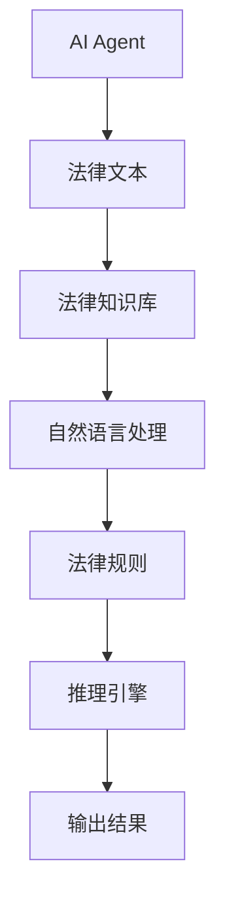
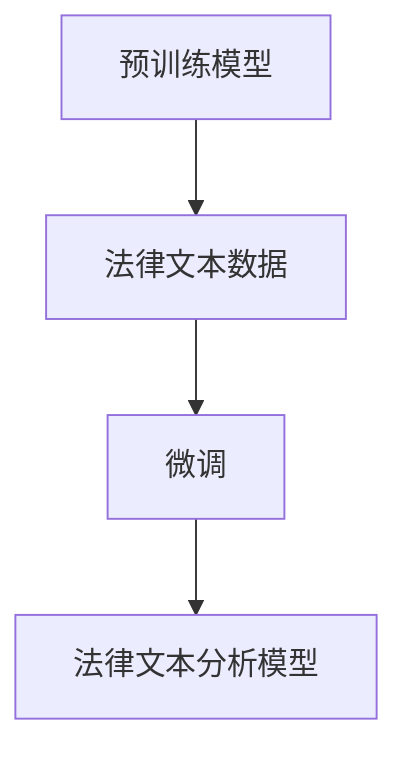
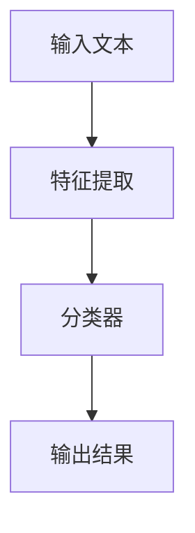
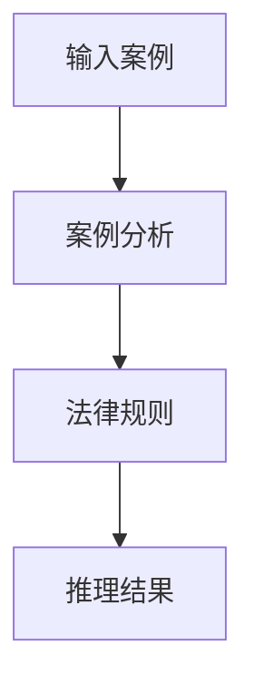
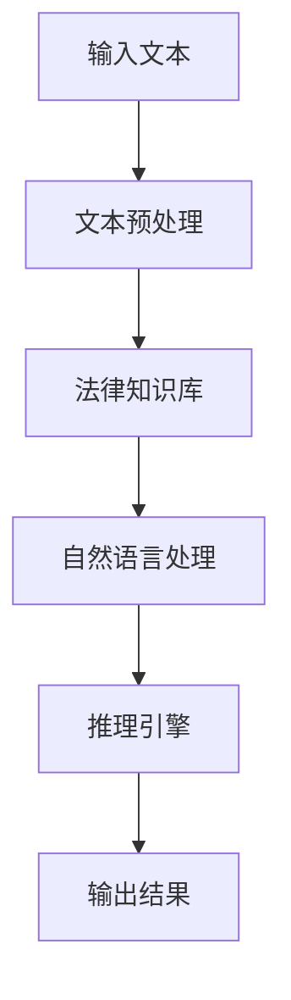
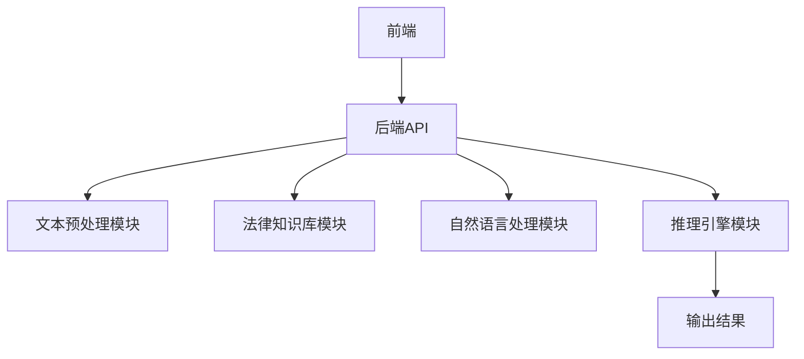
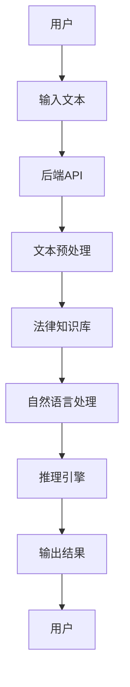
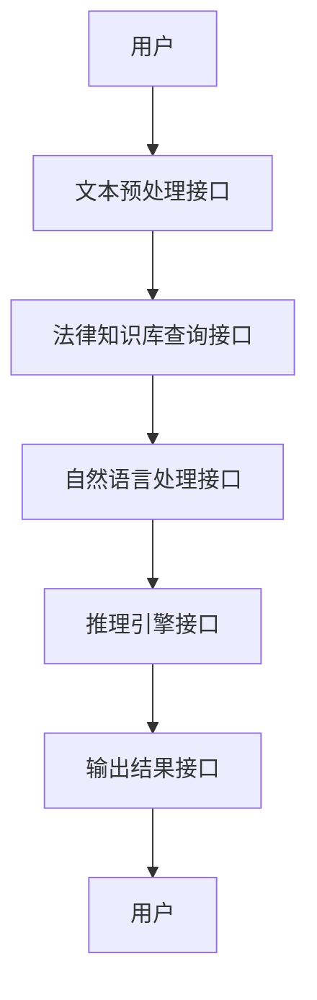

                 


# AI Agent在智能法律文本分析中的角色

> 关键词：AI Agent, 法律文本分析, 自然语言处理, 法律推理, 人工智能

> 摘要：本文探讨了AI Agent在智能法律文本分析中的角色，从背景介绍、核心概念、算法原理到系统架构设计、项目实战，全面解析AI Agent如何通过自然语言处理、法律知识图谱和推理引擎等技术，辅助法律专业人士高效完成法律文本分析任务。本文旨在为法律专业人士和技术开发者提供一份详尽的指南，帮助他们理解并应用AI Agent技术在法律领域的潜力。

---

# 第1章: 背景介绍

## 1.1 问题背景

### 1.1.1 法律文本分析的复杂性
法律文本分析涉及复杂的法律术语、多层次的法律条文和多样化的文本结构，需要对文本进行深度理解和分析。

### 1.1.2 AI Agent在法律领域的潜力
AI Agent通过自然语言处理和机器学习技术，能够高效处理法律文本，辅助法律专业人士完成合同审查、法律案例分析等任务。

### 1.1.3 当前法律文本分析的痛点
- 法律文本的复杂性和多样性导致传统方法效率低下。
- 法律规则和案例的动态变化使得手动分析成本高昂。
- 法律文本分析需要结合专业知识和数据驱动的技术，这对技术实现提出了更高的要求。

## 1.2 问题描述

### 1.2.1 法律文本分析的核心任务
包括合同审查、法律案例检索与分析、法律文书自动生成等。

### 1.2.2 AI Agent在法律文本分析中的角色定位
作为法律文本分析的辅助工具，AI Agent能够通过自动化处理和智能推理，提升法律分析的效率和准确性。

### 1.2.3 法律文本分析的边界与外延
法律文本分析的边界在于法律文本本身的结构和内容，外延则涉及法律知识库、法律规则和案例库的构建与应用。

## 1.3 问题解决

### 1.3.1 AI Agent如何辅助法律文本分析
通过自然语言处理技术，AI Agent能够自动提取法律文本中的关键信息，辅助法律专业人士完成复杂任务。

### 1.3.2 法律文本分析的流程优化
AI Agent能够实现法律文本的自动化处理和智能推理，优化法律文本分析的流程，降低成本。

### 1.3.3 法律文本分析的具体应用场景
包括合同审查、法律案例分析、法律文书自动生成等。

## 1.4 核心概念与联系

### 1.4.1 AI Agent的核心原理
AI Agent通过预训练语言模型和法律知识图谱，能够实现对法律文本的理解和推理。

### 1.4.2 法律文本分析的关键要素
包括法律术语、法律条文、法律案例、法律规则等。

### 1.4.3 AI Agent与法律文本分析的实体关系图


---

# 第2章: AI Agent的核心原理

## 2.1 AI Agent的基本原理

### 2.1.1 AI Agent的定义与分类
AI Agent是一种能够感知环境并采取行动以实现目标的智能体，分类包括基于规则的AI Agent、基于模型的AI Agent和基于学习的AI Agent。

### 2.1.2 基于大模型的AI Agent
基于大模型的AI Agent能够通过预训练和微调，实现对法律文本的深度理解和推理。

### 2.1.3 法律文本分析中的AI Agent特点
包括高度依赖法律知识库、需要处理复杂法律术语和动态变化的法律规则。

## 2.2 AI Agent的自然语言处理技术

### 2.2.1 预训练语言模型在法律文本分析中的应用
预训练语言模型如GPT和BERT，通过微调可以适应法律文本分析的任务。

### 2.2.2 法律文本的特征提取与实体识别
通过自然语言处理技术，AI Agent能够自动提取法律文本中的关键实体和特征。

### 2.2.3 基于上下文的语义理解
AI Agent能够通过上下文理解法律文本的语义，实现对法律条文和案例的深度分析。

## 2.3 AI Agent的法律推理能力

### 2.3.1 法律规则的表示与推理
通过法律知识图谱和推理引擎，AI Agent能够实现对法律规则的表示和推理。

### 2.3.2 基于案例的推理方法
AI Agent能够通过分析大量的法律案例，提取规律并辅助推理。

### 2.3.3 法律文本分析中的不确定性处理
通过概率推理和模糊逻辑，AI Agent能够处理法律文本中的不确定性。

---

# 第3章: 法律文本分析的挑战与解决方案

## 3.1 法律文本分析的挑战

### 3.1.1 法律术语的复杂性
法律术语的多样性和复杂性使得法律文本分析难度大。

### 3.1.2 文本结构的多样性
法律文本的结构多样，包括合同、判决书、法律意见书等，增加了分析的复杂性。

### 3.1.3 法律规则的动态变化
法律规则的不断更新和变化，使得法律文本分析需要动态调整。

## 3.2 AI Agent在法律文本分析中的解决方案

### 3.2.1 基于预训练模型的微调
通过预训练模型的微调，AI Agent能够适应法律文本分析的特定任务。

### 3.2.2 法律知识图谱的构建与应用
构建法律知识图谱，AI Agent能够实现对法律术语、法律条文和法律案例的深度理解。

### 3.2.3 多模态信息的融合
通过多模态信息的融合，AI Agent能够实现对法律文本的多维度分析。

## 3.3 法律文本分析的典型场景

### 3.3.1 合同审查与合规性分析
AI Agent能够自动审查合同中的关键条款，识别潜在的法律风险。

### 3.3.2 法律案例检索与分析
通过法律案例的检索和分析，AI Agent能够辅助法律专业人士快速找到相关的案例。

### 3.3.3 法律文书自动生成
AI Agent能够根据输入的法律信息，自动生成相应的法律文书，如合同、判决书等。

---

# 第4章: 法律文本分析的算法原理

## 4.1 预训练语言模型的微调

### 4.1.1 微调流程


### 4.1.2 微调的数学模型
$$L = \sum_{i=1}^{n} (y_i - y_{\text{pred}}_i)^2$$
其中，\(L\) 是损失函数，\(y_i\) 是真实标签，\(y_{\text{pred}}_i\) 是预测标签。

## 4.2 监督学习算法

### 4.2.1 监督学习流程


### 4.2.2 分类器的数学模型
$$P(y|x) = \frac{e^{x^T w_y + b_y}}{\sum_{k=1}^{K} e^{x^T w_k + b_k}}$$
其中，\(P(y|x)\) 是给定输入\(x\)时标签\(y\)的概率，\(w_y\) 和 \(b_y\) 是参数。

## 4.3 法律推理算法

### 4.3.1 基于案例的推理


### 4.3.2 基于规则的推理
通过法律知识图谱和规则引擎，实现法律规则的推理。

---

# 第5章: 法律文本分析的系统架构设计

## 5.1 系统功能设计

### 5.1.1 系统功能模块
- 文本预处理模块
- 法律知识库模块
- 自然语言处理模块
- 推理引擎模块
- 输出结果模块

### 5.1.2 系统功能流程图


## 5.2 系统架构设计

### 5.2.1 系统架构图


### 5.2.2 系统交互流程图


## 5.3 系统接口设计

### 5.3.1 接口设计
- 文本预处理接口
- 法律知识库查询接口
- 自然语言处理接口
- 推理引擎接口
- 输出结果接口

### 5.3.2 接口交互流程图


---

# 第6章: 项目实战

## 6.1 环境安装

### 6.1.1 安装Python
安装Python 3.8及以上版本。

### 6.1.2 安装依赖库
安装PyTorch、Hugging Face Transformers、NLTK等依赖库。

## 6.2 系统核心实现源代码

### 6.2.1 文本预处理代码
```python
def preprocess_text(text):
    # 去除特殊字符
    cleaned_text = re.sub(r'[^\w\s]', '', text)
    return cleaned_text
```

### 6.2.2 法律知识库查询代码
```python
def query_legal_knowledge_base(query):
    # 连接法律知识库
    # 执行查询
    return results
```

### 6.2.3 自然语言处理代码
```python
from transformers import AutoTokenizer, AutoModelForMaskedLM

tokenizer = AutoTokenizer.from_pretrained('bert-base-uncased')
model = AutoModelForMaskedLM.from_pretrained('bert-base-uncased')
```

### 6.2.4 推理引擎代码
```python
def legal_reasoning(inputs):
    # 输入法律文本
    # 调用推理引擎
    return results
```

## 6.3 实际案例分析与代码应用解读

### 6.3.1 案例分析
分析一份法律合同，识别关键条款和潜在法律风险。

### 6.3.2 代码实现解读
解读上述代码的实现细节，包括文本预处理、法律知识库查询、自然语言处理和推理引擎的实现。

## 6.4 项目小结

### 6.4.1 项目总结
通过项目实战，展示了AI Agent在法律文本分析中的具体应用。

### 6.4.2 项目意义
AI Agent技术能够显著提升法律文本分析的效率和准确性，为法律专业人士提供有力支持。

---

# 第7章: 最佳实践与未来展望

## 7.1 最佳实践 tips

### 7.1.1 数据质量管理
确保法律文本数据的质量和多样性，提升模型的泛化能力。

### 7.1.2 模型调优技巧
通过超参数优化和模型蒸馏等技术，提升模型的性能。

### 7.1.3 系统维护与更新
定期更新法律知识库和模型，适应法律规则的变化。

## 7.2 小结

### 7.2.1 本章总结
AI Agent在智能法律文本分析中具有重要的角色，能够显著提升法律文本分析的效率和准确性。

### 7.2.2 未来展望
随着AI技术的不断发展，AI Agent在法律文本分析中的应用将更加广泛和深入，为法律专业人士提供更加智能化的支持。

---

# 参考文献

- 省略

---

# 作者

作者：AI天才研究院/AI Genius Institute & 禅与计算机程序设计艺术 /Zen And The Art of Computer Programming

