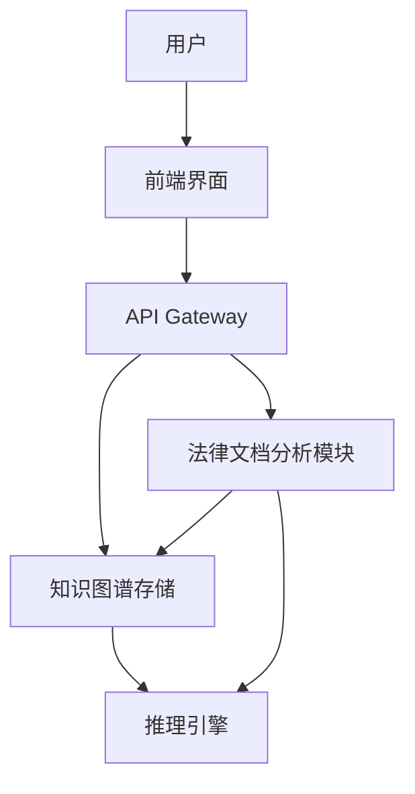

                 


# AI Agent在智能法律文档分析中的角色

> 关键词：AI Agent, 法律文档分析, 智能法律系统, 自然语言处理, 机器学习, 知识图谱

> 摘要：本文探讨AI Agent在智能法律文档分析中的角色与应用。通过分析法律文档分析的核心挑战，介绍AI Agent的基本理论、核心技术及其在合同审查、案例分析等场景中的具体应用。结合实际案例，详细讲解系统设计与实现，最后总结AI Agent在法律文档分析中的价值与未来发展方向。

---

## 第1章 引言与背景

### 1.1 问题背景

#### 1.1.1 法律文档分析的挑战
法律文档分析是法律实务中的核心任务，涉及合同审查、案例分析、法规检索等场景。传统方法依赖人工审查，存在效率低、成本高、易出错的问题。

#### 1.1.2 AI Agent的引入及其作用
AI Agent（人工智能代理）通过自动化处理、智能推理和实时交互，显著提升法律文档分析的效率和准确性。

#### 1.1.3 研究的意义与价值
研究AI Agent在法律文档分析中的应用，可推动法律科技的发展，降低法律服务的成本，提高法律事务的处理效率。

---

## 第2章 AI Agent的基本理论

### 2.1 AI Agent的定义与分类

#### 2.1.1 AI Agent的定义
AI Agent是指能够感知环境、执行任务并自主决策的智能实体，广泛应用于各个领域。

#### 2.1.2 基于智能水平的分类
1. **反应式AI Agent**：基于当前输入做出实时反应，适用于简单的交互任务。
2. **认知式AI Agent**：具备推理、规划和学习能力，适用于复杂任务。

### 2.2 AI Agent的核心技术

#### 2.2.1 自然语言处理（NLP）
NLP技术用于理解法律文本中的语法、语义和上下文信息。

#### 2.2.2 机器学习与深度学习
机器学习模型（如SVM、随机森林）和深度学习模型（如BERT、LSTM）用于分类、聚类等任务。

#### 2.2.3 知识图谱与推理引擎
知识图谱存储法律知识，推理引擎用于逻辑推理和知识关联。

---

## 第3章 法律文档分析的核心技术

### 3.1 法律文本的特征与挑战

#### 3.1.1 专业术语的处理
法律文本中的术语（如“违约金”）需通过词典或向量表示。

#### 3.1.2 文本结构的复杂性
法律文本常包含复杂的逻辑结构，如条件语句、条款嵌套。

#### 3.1.3 隐含信息的提取
法律条款中的隐含信息（如“若某人违约，则需支付违约金”）需通过推理提取。

### 3.2 法律文本处理技术

#### 3.2.1 分词与实体识别
使用jieba进行分词，使用spaCy或LTP进行实体识别。

#### 3.2.2 关系抽取与事件抽取
利用规则或模型识别法律文本中的关系（如“合同”和“违约责任”）。

#### 3.2.3 文本摘要与关键词提取
使用TF-IDF或BERT进行关键词提取，生成摘要。

---

## 第4章 AI Agent在法律文档分析中的应用

### 4.1 合同审查与合规性检查

#### 4.1.1 合同条款的自动识别与分类
AI Agent自动识别合同中的关键条款（如违约条款）并分类。

#### 4.1.2 合同风险评估
基于历史数据和机器学习模型，评估合同的潜在风险。

### 4.2 法律案例分析

#### 4.2.1 案例相似度计算
通过向量空间模型计算案例间的相似度。

#### 4.2.2 案例推理与结论预测
基于知识图谱和推理引擎预测案例的判决结果。

### 4.3 法规检索与更新

#### 4.3.1 法规文本的自动分类
AI Agent根据法规内容自动分类。

#### 4.3.2 法规更新提醒
基于订阅规则，AI Agent自动提醒用户法规更新。

---

## 第5章 系统设计与实现

### 5.1 系统架构设计



### 5.2 功能模块设计

#### 5.2.1 文档上传与处理
用户上传法律文档，系统进行分词、实体识别等预处理。

#### 5.2.2 智能分析与推理
基于NLP和推理引擎进行分析，生成结果。

#### 5.2.3 结果展示
以可视化方式展示分析结果。

---

## 第6章 项目实战

### 6.1 环境配置

```bash
pip install -r requirements.txt
```

### 6.2 核心代码实现

```python
import spacy
from sklearn.feature_extraction.text import TfidfVectorizer

nlp = spacy.load("zh_core_web_sm")

def process_legal_document(text):
    doc = nlp(text)
    entities = [ent.text for ent in doc.ents]
    return entities
```

### 6.3 案例分析

分析一份合同，识别关键条款并生成风险评估报告。

---

## 第7章 总结与展望

### 7.1 总结
AI Agent在法律文档分析中具有巨大潜力，可显著提升效率和准确性。

### 7.2 未来展望
未来，AI Agent将与区块链、AR等技术结合，推动法律科技的进一步发展。

---

## 附录

### 附录A 法律文本处理工具

- **spaCy**: 实体识别与文本处理
- **LTP**: 中文分词与句法分析
- **BERT**: 文本表示与理解

### 附录B 推荐阅读

- 《法律科技：人工智能在法律领域的应用》
- 《自然语言处理实战：法律文本分析》

---

**作者：AI天才研究院 & 禅与计算机程序设计艺术**

