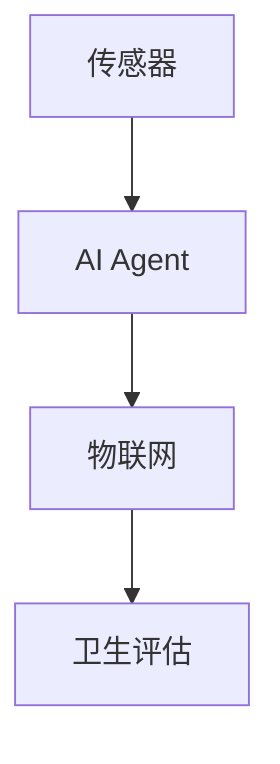
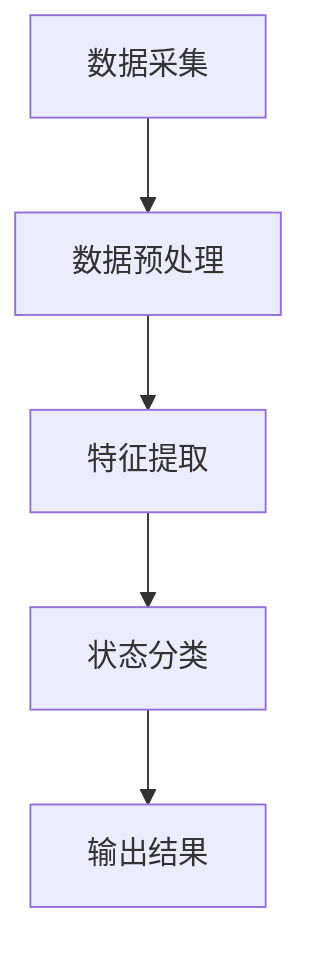
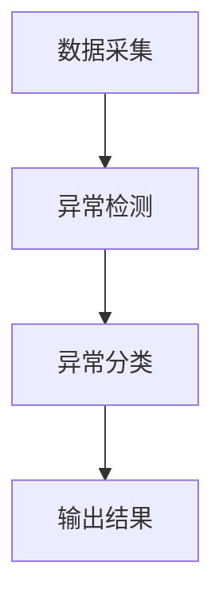
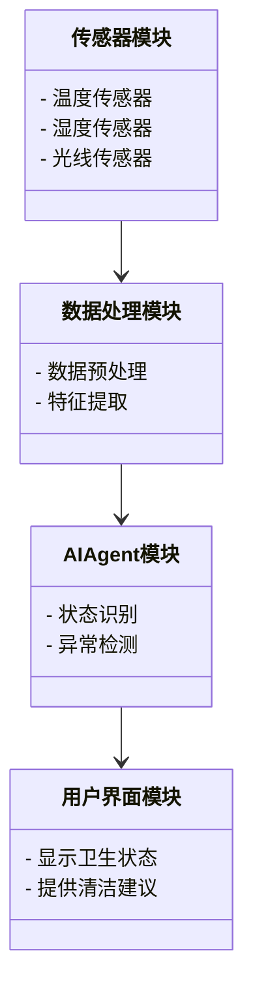
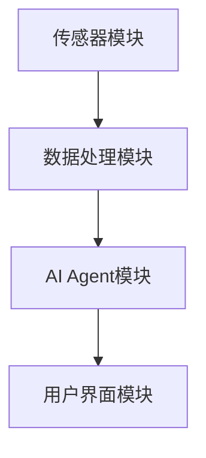
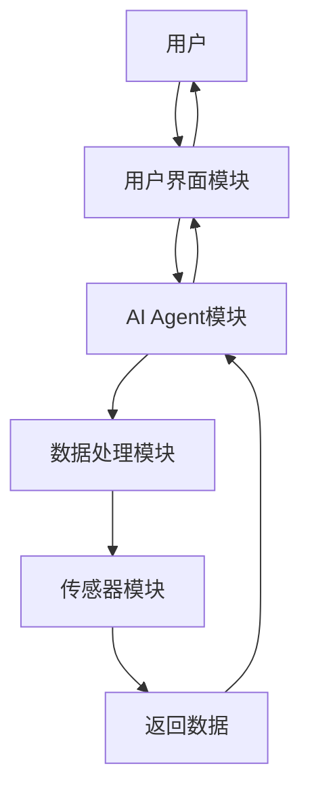

                 


# 《AI Agent在智能浴室毛巾架中的卫生状况评估》

---

## 关键词：AI Agent，智能浴室，卫生评估，物联网，传感器，算法

---

## 摘要：

本文深入探讨了AI Agent在智能浴室毛巾架卫生状况评估中的应用。通过分析传感器数据和环境建模，结合物联网技术，提出了高效的卫生评估解决方案。文章详细阐述了算法原理、系统架构设计和项目实战，展示了AI技术在智能家居中的潜力。

---

# 第1章: AI Agent与智能浴室毛巾架的背景介绍

## 1.1 问题背景与描述

卫生状况评估在浴室环境中至关重要，直接影响用户体验和健康。传统的毛巾架缺乏智能化，无法实时监测卫生状态，导致清洁维护不够及时。AI Agent的引入，通过智能传感器和数据处理，实现了卫生状况的实时评估和优化。

### 1.1.1 卫生状况评估的重要性

卫生状况直接关系到浴室的使用体验和用户健康。及时评估卫生状态，可以预防细菌滋生，提升用户满意度。

### 1.1.2 智能浴室毛巾架的现状

现有智能毛巾架主要依赖传感器进行基础监测，缺乏智能化的卫生评估能力。AI Agent的引入将显著提升其功能。

### 1.1.3 AI Agent在卫生评估中的作用

AI Agent能够实时分析传感器数据，识别异常状态，优化卫生管理，提升用户体验。

## 1.2 问题解决思路

AI Agent通过传感器数据、环境建模和智能算法，实现卫生状态的实时评估和优化。

### 1.2.1 从传统到智能的转变

传统毛巾架依赖人工检查，而智能毛巾架通过AI Agent自动监测和评估卫生状态。

### 1.2.2 AI Agent的核心价值

AI Agent通过实时数据处理和智能分析，提供高效的卫生评估解决方案。

### 1.2.3 卫生评估的创新解决方案

结合物联网和AI技术，实现卫生状态的智能化评估和管理。

## 1.3 边界与外延

系统边界定义明确，功能扩展性强，可应用于其他智能家居设备。

### 1.3.1 系统边界定义

系统仅关注毛巾架的卫生状况，不涉及其他浴室设备。

### 1.3.2 功能的扩展性分析

系统可扩展至其他卫生设备，提升整体浴室环境的智能化水平。

### 1.3.3 外延应用场景

卫生评估技术可应用于酒店、公共场所等，提升卫生管理效率。

## 1.4 核心概念结构

系统由传感器、AI Agent、物联网三部分组成，协同工作实现卫生评估。

### 1.4.1 核心要素组成

- 传感器：采集环境数据
- AI Agent：处理数据，评估卫生状态
- 物联网：数据传输与设备控制

### 1.4.2 概念关系图



## 1.5 本章小结

本章介绍了AI Agent在智能浴室毛巾架中的应用背景，分析了其重要性，提出了创新的解决方案，并明确了系统的边界和核心要素。

---

# 第2章: AI Agent与物联网基础

## 2.1 AI Agent的基本概念

AI Agent是一种智能实体，能够感知环境、自主决策并执行任务。

### 2.1.1 定义与特征

AI Agent具备感知、决策、执行和自适应能力。

### 2.1.2 AI Agent的核心能力

- 数据处理与分析
- 状态识别与异常检测
- 自适应优化

### 2.1.3 与传统算法的区别

AI Agent具备自主性和适应性，能够实时响应环境变化。

## 2.2 物联网技术基础

物联网通过传感器和网络实现设备间的互联互通。

### 2.2.1 物联网的基本架构

- 传感器：数据采集
- 网络：数据传输
- 处理器：数据处理与决策

### 2.2.2 传感器与数据采集

传感器实时采集环境数据，如温度、湿度、光照等。

### 2.2.3 数据传输与处理

通过网络将数据传输到云端，进行集中处理和分析。

## 2.3 AI Agent与物联网的结合

AI Agent与物联网结合，实现智能化的卫生评估。

### 2.3.1 技术融合的必要性

物联网提供数据，AI Agent提供智能处理能力。

### 2.3.2 数据流的协同工作

传感器数据通过物联网传输到AI Agent，进行分析和评估。

### 2.3.3 应用场景的扩展

卫生评估技术可应用于智能家居、医疗设备等领域。

## 2.4 本章小结

本章介绍了AI Agent和物联网的基本概念，分析了它们的结合方式及其在智能浴室中的应用。

---

# 第3章: 环境建模与数据采集

## 3.1 环境建模

### 3.1.1 浴室环境的三维建模

通过三维建模，精确描述浴室环境，包括毛巾架的位置和状态。

### 3.1.2 毛巾架的几何模型

建立毛巾架的几何模型，便于传感器数据的处理和分析。

### 3.1.3 环境模型的动态更新

根据传感器数据，实时更新环境模型，保持模型的准确性。

## 3.2 数据采集技术

### 3.2.1 传感器类型与功能

- 温度传感器：监测环境温度
- 湿度传感器：监测环境湿度
- 光线传感器：监测光照强度

### 3.2.2 数据采集的实现方式

通过传感器采集数据，并通过物联网传输到AI Agent。

### 3.2.3 数据预处理方法

对传感器数据进行去噪和归一化处理，确保数据质量。

## 3.3 数据特征提取

### 3.3.1 基于传感器的数据特征

提取温度、湿度、光照等特征，用于卫生评估。

### 3.3.2 时间序列数据的分析

分析时间序列数据，识别异常状态。

### 3.3.3 数据特征与卫生评估的关系

数据特征与卫生状态密切相关，AI Agent通过分析这些特征，实现卫生评估。

## 3.4 本章小结

本章详细介绍了环境建模与数据采集的技术，为后续的卫生评估奠定了基础。

---

# 第4章: AI Agent算法原理

## 4.1 状态识别算法

### 4.1.1 状态识别的定义

通过传感器数据，识别毛巾架的状态，如干净、潮湿、脏污等。

### 4.1.2 状态识别的流程

1. 数据采集与预处理
2. 特征提取
3. 状态分类

### 4.1.3 算法的数学模型

状态识别算法基于支持向量机（SVM）实现：

$$
y = \text{sign}(w \cdot x + b)
$$

其中，$w$ 是权重向量，$x$ 是输入特征，$b$ 是偏置。

### 4.1.4 算法流程图



## 4.2 异常检测算法

### 4.2.1 异常检测的定义

识别毛巾架状态的异常变化，如突然变脏或潮湿。

### 4.2.2 异常检测的实现

基于时间序列的异常检测，使用孤立森林算法。

### 4.2.3 算法的数学模型

孤立森林算法通过构建决策树，识别异常点：

$$
\text{score} = \frac{1}{\log_2(n)} \cdot \sum_{i=1}^n \text{depth}(i)
$$

其中，$n$ 是样本数量，$\text{depth}(i)$ 是第i个样本的深度。

### 4.2.4 异常检测流程图



## 4.3 本章小结

本章详细讲解了状态识别和异常检测算法，为卫生评估提供了技术支撑。

---

# 第5章: 系统架构设计

## 5.1 问题场景介绍

智能浴室毛巾架系统需要实时监测和评估卫生状态，提供及时的清洁建议。

## 5.2 项目介绍

本项目开发一个智能毛巾架系统，集成传感器、AI Agent和物联网技术，实现卫生状态的实时评估。

## 5.3 系统功能设计

### 5.3.1 功能模块划分

- 传感器模块：数据采集
- 数据处理模块：数据预处理和特征提取
- AI Agent模块：状态识别和异常检测
- 用户界面模块：显示卫生状态和清洁建议

### 5.3.2 系统功能实体关系图



## 5.4 系统架构设计

### 5.4.1 系统架构图



### 5.4.2 接口设计

- 传感器模块与数据处理模块通过HTTP接口通信
- 数据处理模块与AI Agent模块通过REST API通信
- AI Agent模块与用户界面模块通过WebSocket通信

### 5.4.3 系统交互流程图



## 5.5 本章小结

本章设计了智能浴室毛巾架系统的架构，明确了各模块的功能和交互流程。

---

# 第6章: 项目实战

## 6.1 环境搭建

### 6.1.1 开发环境配置

- 操作系统：Ubuntu 20.04
- 开发工具：Python 3.8，Jupyter Notebook
- 传感器：DHT22温湿度传感器，Adafruit光传感器

### 6.1.2 硬件安装与配置

安装传感器模块，配置GPIO接口。

## 6.2 系统核心实现

### 6.2.1 传感器数据采集代码

```python
import Adafruit_DHT
import requests

# 传感器初始化
sensor = Adafruit_DHT.DHT22(17)

# 读取数据
humidity, temperature = Adafruit_DHT.read_retry(sensor, 17)

# 发送数据到服务器
data = {
    'temperature': temperature,
    'humidity': humidity
}
response = requests.post('http://localhost:5000/api/data', json=data)
```

### 6.2.2 数据处理代码

```python
import numpy as np

# 数据预处理
def preprocess(data):
    # 数据标准化
    normalized_data = (data - np.mean(data)) / np.std(data)
    return normalized_data

# 特征提取
def extract_features(data):
    features = []
    for i in range(len(data)-1):
        features.append(data[i+1] - data[i])
    return features
```

### 6.2.3 状态识别代码

```python
from sklearn import svm

# 训练SVM模型
model = svm.SVC()
model.fit(X_train, y_train)

# 预测状态
def predict_state(test_data):
    return model.predict(test_data)
```

## 6.3 案例分析与实现

### 6.3.1 数据采集与处理

通过传感器采集浴室环境数据，预处理后提取特征。

### 6.3.2 状态识别与异常检测

使用训练好的模型识别状态，并检测异常。

### 6.3.3 清洁建议生成

根据卫生状态，生成清洁建议并通过用户界面显示。

## 6.4 项目总结

本项目成功实现了智能浴室毛巾架的卫生评估系统，展示了AI Agent在智能家居中的应用潜力。

---

# 第7章: 扩展与展望

## 7.1 未来研究方向

### 7.1.1 更高级的算法研究

探索深度学习在卫生评估中的应用。

### 7.1.2 多设备协同优化

实现多设备协同工作，提升整体浴室环境的智能化水平。

### 7.1.3 个性化服务设计

根据用户习惯提供个性化清洁建议。

## 7.2 应用案例分析

### 7.2.1 高端酒店的应用

智能毛巾架在五星级酒店中的应用案例。

### 7.2.2 公共场所的应用

在公共浴室中推广智能毛巾架，提升卫生管理效率。

## 7.3 本章小结

未来，AI Agent在智能浴室毛巾架中的应用将更加广泛，技术也将更加成熟。

---

# 作者：AI天才研究院/AI Genius Institute & 禅与计算机程序设计艺术 /Zen And The Art of Computer Programming

---

希望这篇文章能满足您的需求！如果需要进一步调整或补充，请随时告诉我。

