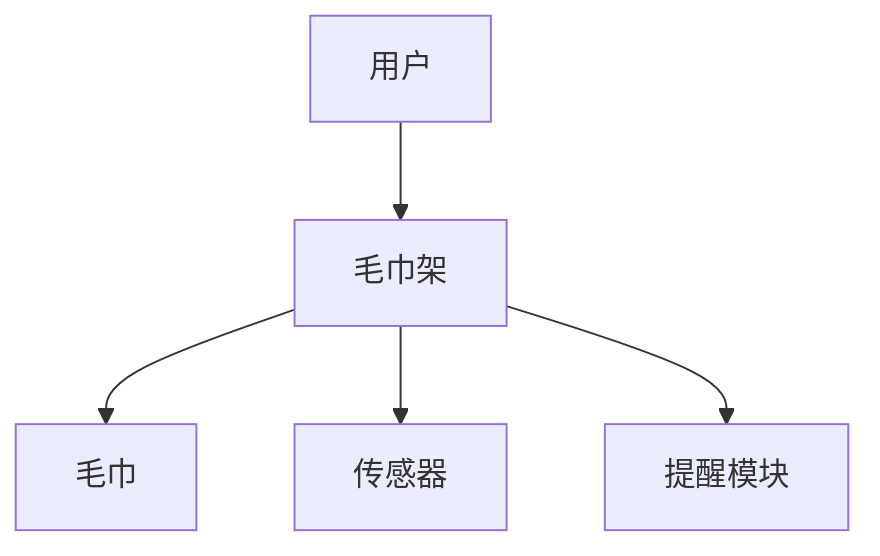
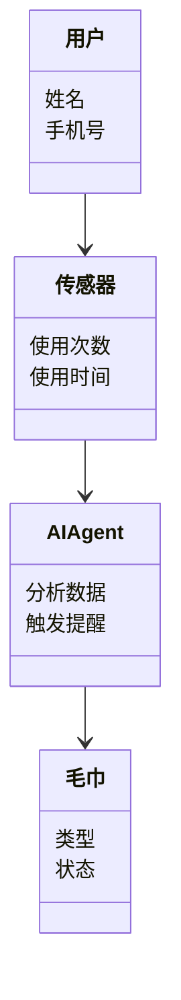
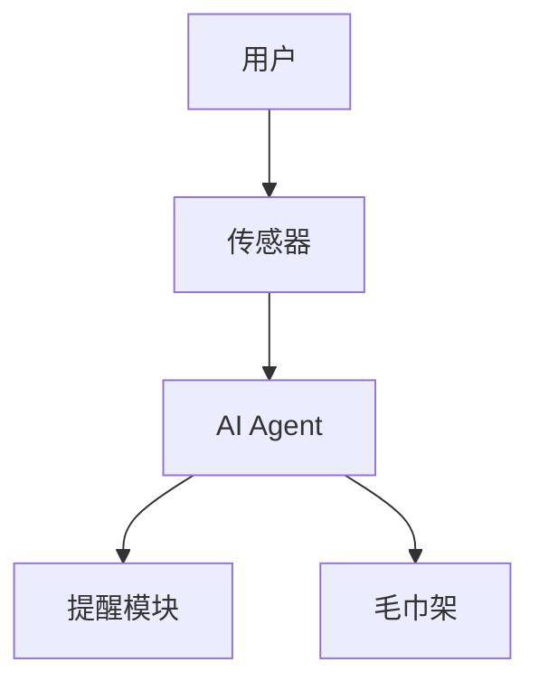
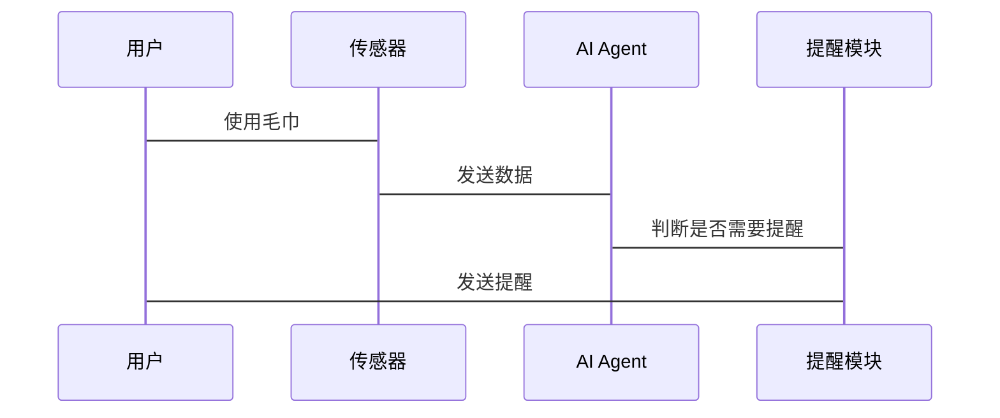

                 


# AI Agent在智能浴室毛巾架中的毛巾更换提醒

> 关键词：AI Agent, 智能浴室, 毛巾架, 智能提醒, 物联网

> 摘要：本文详细探讨了AI Agent在智能浴室毛巾架中的应用，重点分析了毛巾更换提醒的功能实现。通过系统分析、算法设计和实际案例，展示了如何利用AI技术提升浴室用品管理的智能化水平。

---

# 第1章: 背景介绍

## 1.1 问题背景
### 1.1.1 传统浴室毛巾管理的痛点
传统浴室毛巾架管理存在以下问题：
- 手动更换毛巾费时费力，容易遗忘。
- 家庭成员使用习惯不同，难以统一管理。
- 缺乏智能化手段，无法实时监测毛巾使用情况。

### 1.1.2 智能化管理的需求
随着智能家居的普及，用户对浴室用品的智能化管理需求日益增长。智能毛巾架可以通过传感器和AI算法实现自动监测和提醒功能。

### 1.1.3 AI Agent在智能浴室中的应用潜力
AI Agent（智能代理）具备自主决策和执行的能力，能够在智能浴室中实现多种功能，如实时监测、智能提醒和自动调整。

## 1.2 问题描述
### 1.2.1 毛巾更换提醒的必要性
毛巾使用时间过长会影响卫生，定期更换是保障健康的重要环节。智能提醒功能能够帮助用户及时更换毛巾。

### 1.2.2 用户需求分析
- 用户希望毛巾架能够自动监测毛巾使用情况。
- 用户需要实时提醒功能，避免忘记更换毛巾。
- 用户期望系统能够支持多种提醒方式，如手机APP通知、语音提醒等。

### 1.2.3 系统边界与外延
智能毛巾架系统包括硬件设备（毛巾架、传感器）和软件系统（AI Agent、提醒模块）。系统边界在于与外部网络和用户交互的接口。

## 1.3 问题解决
### 1.3.1 AI Agent的核心作用
AI Agent负责接收传感器数据，分析毛巾使用情况，并触发提醒功能。它是整个系统的核心驱动力。

### 1.3.2 智能浴室毛巾架的实现方案
- 通过传感器监测毛巾的使用频率和时间。
- AI Agent根据预设规则判断是否需要更换毛巾。
- 当达到预设条件时，系统向用户发送提醒。

### 1.3.3 系统功能的实现路径
1. 传感器采集数据。
2. AI Agent分析数据。
3. 根据分析结果触发提醒或执行其他操作。

## 1.4 概念结构与核心要素
### 1.4.1 系统核心要素组成
- 用户：使用毛巾架的用户。
- 毛巾：被监测和管理的对象。
- 传感器：采集毛巾使用数据。
- AI Agent：处理数据并触发提醒。
- 提醒模块：向用户发送提醒信息。

### 1.4.2 系统功能模块划分
- 数据采集模块：传感器收集毛巾使用数据。
- 数据处理模块：AI Agent分析数据。
- 提醒模块：根据分析结果发送提醒。
- 用户交互模块：用户与系统进行交互。

### 1.4.3 系统边界与交互流程
系统边界包括传感器、AI Agent和提醒模块。交互流程如下：
1. 传感器采集数据并发送给AI Agent。
2. AI Agent分析数据，判断是否需要更换毛巾。
3. 如果需要更换，AI Agent触发提醒模块发送提醒。

## 1.5 本章小结
本章介绍了AI Agent在智能浴室毛巾架中的应用背景，分析了问题背景、用户需求和系统架构，为后续章节的详细讲解奠定了基础。

---

# 第2章: 核心概念与联系

## 2.1 AI Agent的核心原理
### 2.1.1 AI Agent的基本定义
AI Agent是一种能够感知环境、自主决策并执行任务的智能实体。

### 2.1.2 AI Agent的核心功能
- 感知环境：通过传感器获取数据。
- 分析数据：利用算法处理数据并做出决策。
- 执行任务：根据决策结果执行操作，如发送提醒。

### 2.1.3 AI Agent的分类与特点
- 分类：基于智能水平分为简单反应式AI Agent和复杂规划式AI Agent。
- 特点：自主性、反应性、主动性。

## 2.2 智能浴室毛巾架的系统架构
### 2.2.1 系统整体架构
智能浴室毛巾架系统由硬件和软件两部分组成：
- 硬件部分：传感器、毛巾架、提醒模块。
- 软件部分：AI Agent、数据处理模块。

### 2.2.2 系统功能模块
- 传感器模块：监测毛巾使用情况。
- 数据处理模块：AI Agent分析数据。
- 提醒模块：向用户发送提醒信息。

### 2.2.3 系统核心组件
- 传感器：监测毛巾的使用时间、次数等数据。
- AI Agent：分析数据并做出决策。
- 提醒模块：通过手机APP、语音等方式提醒用户。

## 2.3 核心概念属性特征对比
| 比较项 | AI Agent | 智能浴室毛巾架 |
|--------|-----------|----------------|
| 功能   | 自主决策   | 数据采集与提醒 |
| 输入   | 传感器数据 | 用户操作       |
| 输出   | 提醒指令   | 数据反馈       |

## 2.4 ER实体关系图


## 2.5 本章小结
本章详细介绍了AI Agent的核心原理和智能浴室毛巾架的系统架构，通过对比分析和ER图展示了系统各部分的关系。

---

# 第3章: 算法原理讲解

## 3.1 AI Agent的算法流程
### 3.1.1 算法流程概述
1. 传感器采集数据。
2. AI Agent接收数据并进行分析。
3. 根据预设规则判断是否需要更换毛巾。
4. 如果需要更换，触发提醒模块。

### 3.1.2 算法输入与输出
- 输入：传感器数据（如使用次数、时间）。
- 输出：提醒指令或无操作。

### 3.1.3 算法实现步骤
1. 数据预处理：清洗和归一化数据。
2. 数据分析：使用机器学习模型进行预测。
3. 决策判断：根据模型结果触发提醒。

## 3.2 算法实现的Python源代码
```python
def ai_agent_algorithm(sensor_data):
    # 数据预处理
    processed_data = preprocess(sensor_data)
    
    # 数据分析
    prediction = model.predict(processed_data)
    
    # 决策判断
    if prediction[0] > 0.5:
        return "send Reminder"
    else:
        return "no action"
```

## 3.3 算法的数学模型和公式
AI Agent使用机器学习模型进行预测，常用模型包括随机森林和神经网络。以下是一个简单的概率模型示例：
$$ P(\text{更换}) = \frac{\text{使用次数} + \text{使用时间}}{N} $$
其中，$N$ 是预设的阈值。

## 3.4 通俗易懂的例子
假设用户每天使用毛巾10次，每次使用时间约为2分钟。当累计使用次数达到50次或累计使用时间超过100分钟时，AI Agent会触发提醒功能。

## 3.5 本章小结
本章通过算法流程、Python代码和数学公式详细讲解了AI Agent的核心算法，帮助读者理解系统的实现原理。

---

# 第4章: 系统分析与架构设计

## 4.1 问题场景介绍
智能浴室毛巾架系统用于监测毛巾使用情况并提醒用户更换。系统需要具备以下功能：
- 实时监测毛巾使用数据。
- 自动分析数据并做出决策。
- 提供多种提醒方式。

## 4.2 系统功能设计
### 4.2.1 领域模型类图


### 4.2.2 系统架构图


### 4.2.3 系统接口设计
- 用户接口：手机APP、语音助手。
- 系统接口：传感器数据接口、提醒模块接口。

## 4.3 系统交互流程
### 4.3.1 交互流程图


## 4.4 本章小结
本章通过系统分析和架构设计，展示了智能浴室毛巾架的整体结构和交互流程，为后续的实现提供了指导。

---

# 第5章: 项目实战

## 5.1 环境安装
- 安装Python和相关库（如numpy、scikit-learn）。
- 安装传感器和提醒模块的硬件设备。

## 5.2 系统核心实现源代码
```python
import numpy as np
from sklearn.model import model

class AI_Agent:
    def __init__(self, model):
        self.model = model
    
    def analyze_data(self, sensor_data):
        # 数据预处理
        processed_data = self.preprocess(sensor_data)
        # 预测
        prediction = self.model.predict(processed_data)
        return prediction
    
    def trigger_reminder(self, prediction):
        if prediction[0] > 0.5:
            send_reminder()
        else:
            pass

def send_reminder():
    print("请更换毛巾！")
```

## 5.3 代码应用解读与分析
- 数据预处理：将传感器数据转化为模型可识别的格式。
- 模型预测：使用机器学习模型进行预测。
- 提醒触发：根据预测结果决定是否发送提醒。

## 5.4 实际案例分析
假设传感器数据为：
- 使用次数：50次
- 使用时间：100分钟
AI Agent预测结果为更换毛巾，触发提醒模块发送提醒。

## 5.5 项目小结
本章通过实际项目实战，展示了如何安装环境、实现系统核心功能，并通过案例分析验证了系统的可行性。

---

# 第6章: 总结与展望

## 6.1 总结
AI Agent在智能浴室毛巾架中的应用实现了毛巾更换提醒功能，提升了浴室管理的智能化水平。通过传感器、AI算法和提醒模块的结合，系统能够自主监测和提醒用户更换毛巾。

## 6.2 最佳实践 Tips
- 定期校准传感器，确保数据准确性。
- 根据用户需求调整AI算法的阈值。
- 提供多种提醒方式，满足不同用户的需求。

## 6.3 注意事项
- 确保系统的安全性，防止数据泄露。
- 定期更新AI算法，提升系统的准确性。

## 6.4 拓展阅读
建议读者进一步学习AI Agent在其他智能家居设备中的应用，探索更广泛的可能性。

## 6.5 本章小结
本章总结了全文的主要内容，并提出了未来的改进方向和注意事项。

---

# 作者：AI天才研究院 & 禅与计算机程序设计艺术

---

以上是《AI Agent在智能浴室毛巾架中的毛巾更换提醒》的技术博客文章大纲，涵盖了从背景介绍到项目实战的各个方面，确保读者能够全面理解AI Agent在智能浴室中的应用。

