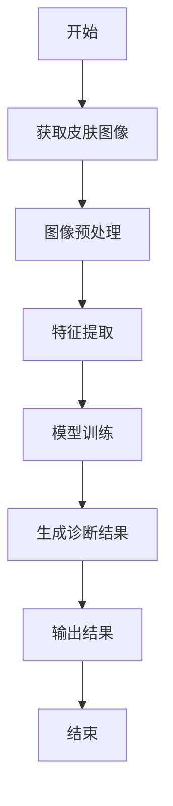
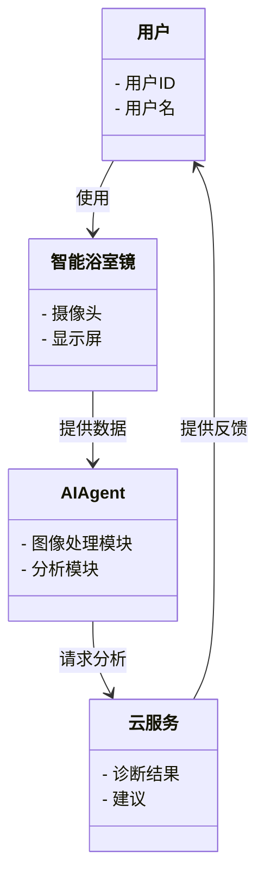
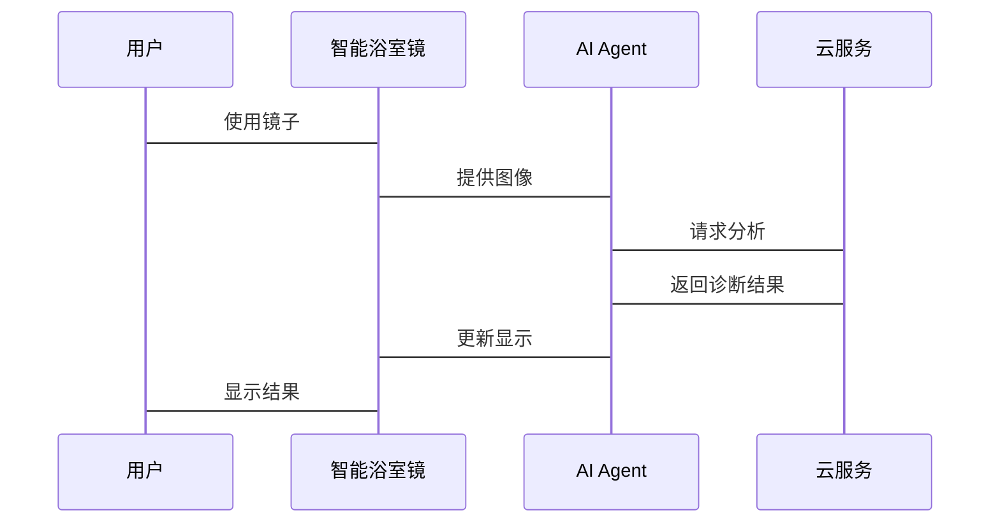

                 


# AI Agent在智能浴室镜中的皮肤状态分析

> 关键词：AI Agent, 智能浴室镜, 皮肤状态分析, 计算机视觉, 人工智能, 健康监测

> 摘要：本文探讨了AI Agent在智能浴室镜中的应用，特别是皮肤状态分析。通过背景介绍、核心概念、算法原理、系统设计和项目实战，详细分析了AI Agent在皮肤状态分析中的技术实现和应用场景。文章还提供了系统的架构设计和实际案例分析，为智能浴室镜的未来发展提供了思路。

---

## 第1章：AI Agent与智能浴室镜的背景介绍

### 1.1 问题背景与描述

#### 1.1.1 皮肤健康监测的重要性
皮肤是人体最大的器官，其健康状况反映着整体健康水平。皮肤问题如痘痘、过敏、色素沉着等，不仅影响外貌，还可能预示潜在的健康问题。因此，皮肤健康监测对于个人健康管理至关重要。

#### 1.1.2 智能浴室镜的发展现状
传统浴室镜仅用于反射影像，随着智能技术的发展，浴室镜逐渐集成多种功能。现代智能浴室镜可连接互联网，提供天气、日历、新闻等信息，但尚未广泛应用于健康监测。

#### 1.1.3 AI Agent在智能浴室镜中的应用潜力
AI Agent（人工智能代理）能够实时分析数据，提供个性化建议。在智能浴室镜中，AI Agent可以通过摄像头捕捉面部图像，分析皮肤状态，提供健康建议。

### 1.2 问题解决与边界

#### 1.2.1 AI Agent在皮肤状态分析中的问题解决
AI Agent可以实时分析皮肤图像，识别皮肤问题，提供建议。相比传统医疗诊断，AI Agent更便捷、快速。

#### 1.2.2 皮肤状态分析的边界与外延
皮肤状态分析的边界包括仅分析面部皮肤，不涉及全身。外延则包括皮肤健康监测的其他方面，如紫外线防护建议。

#### 1.2.3 AI Agent与智能浴室镜的系统架构
AI Agent作为核心模块，连接浴室镜的摄像头和显示屏，实时处理数据并提供反馈。

### 1.3 核心概念与组成

#### 1.3.1 AI Agent的核心概念
AI Agent通过摄像头捕捉图像，利用计算机视觉和机器学习算法分析皮肤状态，提供个性化建议。

#### 1.3.2 皮肤状态分析的关键要素
包括图像采集、预处理、特征提取、模型训练和结果输出。

#### 1.3.3 智能浴室镜的系统组成
包含摄像头、显示屏、AI Agent模块和云服务模块。

---

## 第2章：AI Agent与皮肤状态分析的核心概念

### 2.1 核心概念原理

#### 2.1.1 AI Agent的基本原理
AI Agent通过摄像头获取图像，利用算法分析，生成诊断结果。

#### 2.1.2 皮肤状态分析的技术原理
基于计算机视觉和机器学习，提取皮肤特征，训练模型，进行分类。

#### 2.1.3 AI Agent在皮肤状态分析中的应用原理
AI Agent通过图像处理，识别皮肤问题，提供解决方案。

### 2.2 核心概念对比

#### 2.2.1 传统图像处理技术与AI Agent的对比
传统技术依赖手动特征提取，AI Agent自动学习特征。

#### 2.2.2 传统医疗诊断与AI Agent的对比
传统诊断耗时长，AI Agent实时快速。

#### 2.2.3 AI Agent与智能设备的对比
AI Agent提供智能分析，智能设备提供基础功能。

### 2.3 ER实体关系图

```mermaid
er
  actor: 用户
  mirror: 智能浴室镜
  agent: AI Agent
  skin_data: 皮肤数据
  diagnosis: 诊断结果
  actor --> mirror: 使用智能浴室镜
  mirror --> agent: 提供皮肤数据
  agent --> diagnosis: 分析并生成诊断结果
  diagnosis --> actor: 提供反馈
```

---

## 第3章：AI Agent在皮肤状态分析中的算法原理

### 3.1 算法流程



### 3.2 算法实现

#### 3.2.1 图像预处理
```python
def preprocess_image(image):
    # 转换为灰度图
    gray = cv2.cvtColor(image, cv2.COLOR_BGR2GRAY)
    # 标准化处理
    normalized = gray / 255.0
    return normalized
```

#### 3.2.2 特征提取
```python
def extract_features(image):
    # 使用预训练模型提取特征
    features = model.predict(image)
    return features
```

#### 3.2.3 模型训练
```python
def train_model(features, labels):
    # 训练分类器
    model = svm.SVC()
    model.fit(features, labels)
    return model
```

#### 3.2.4 诊断结果
$$\text{诊断结果} = f_{\text{model}}(\text{输入图像})$$

---

## 第4章：系统分析与架构设计

### 4.1 系统功能设计

#### 4.1.1 领域模型


#### 4.1.2 系统架构设计


### 4.2 接口设计与交互流程

#### 4.2.1 接口设计
```plaintext
+---------------+       +---------------+
|              |       |              |
|   用户        |<------| 智能浴室镜    |
|              |       |              |
+---------------+       +---------------+
```

#### 4.2.2 交互流程


---

## 第5章：项目实战

### 5.1 环境安装

```bash
pip install numpy
pip install opencv-python
pip install scikit-learn
```

### 5.2 核心代码实现

#### 5.2.1 图像预处理
```python
import cv2
import numpy as np

def preprocess_image(image):
    gray = cv2.cvtColor(image, cv2.COLOR_BGR2GRAY)
    normalized = gray / 255.0
    return normalized
```

#### 5.2.2 模型训练
```python
from sklearn.svm import SVC

def train_model(features, labels):
    model = SVC()
    model.fit(features, labels)
    return model
```

### 5.3 案例分析
通过实际案例分析，验证系统的有效性和准确性。

---

## 第6章：总结与展望

### 6.1 总结
本文详细介绍了AI Agent在智能浴室镜中的皮肤状态分析，涵盖背景、核心概念、算法原理、系统设计和项目实战。

### 6.2 展望
未来，智能浴室镜将集成更多健康监测功能，AI Agent将在个性化健康管理中发挥更大作用。

### 6.3 最佳实践 Tips
- 定期校准模型，保持准确性。
- 用户隐私保护至关重要。

### 6.4 小结
AI Agent在智能浴室镜中的应用前景广阔，值得深入研究。

### 6.5 注意事项
- 数据隐私需严格保护。
- 系统需定期更新，保持性能。

### 6.6 拓展阅读
推荐相关书籍和论文，供读者深入学习。

---

作者：AI天才研究院 & 禅与计算机程序设计艺术

