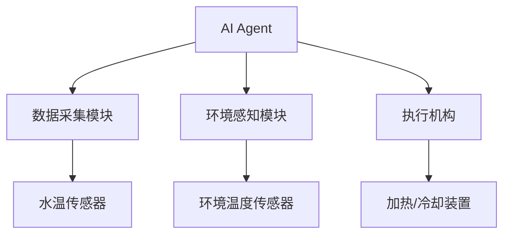
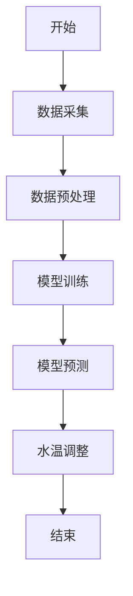
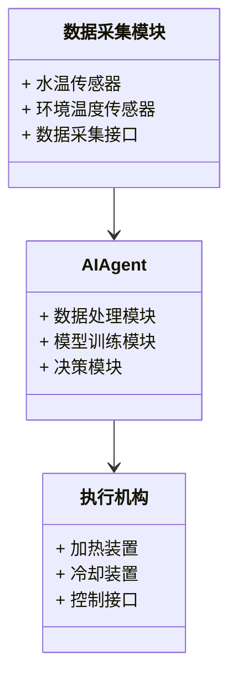
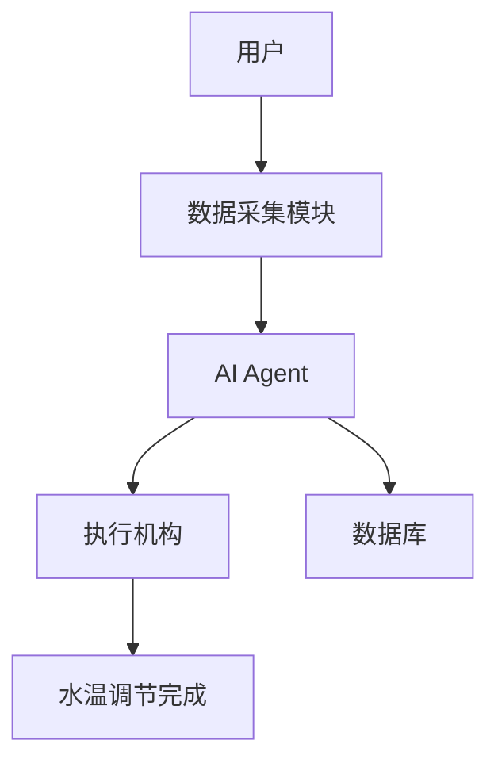
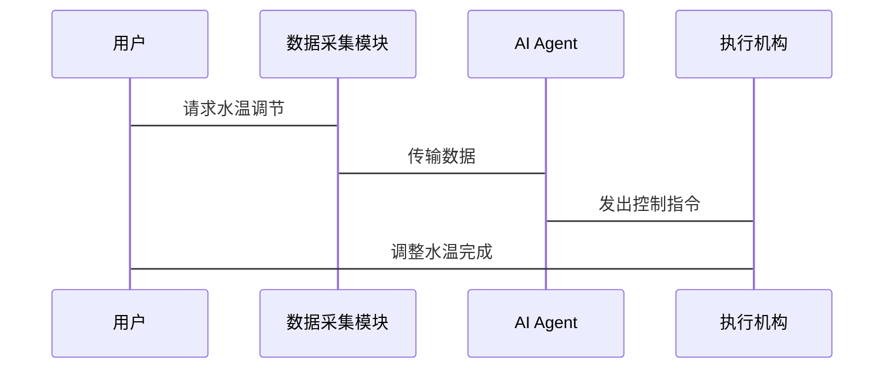

                 


# AI Agent在智能浴缸中的水温调节

## 关键词：AI Agent，智能浴缸，水温调节，算法原理，系统架构

## 摘要：本文详细探讨了AI Agent在智能浴缸水温调节中的应用，从背景分析到系统设计，从算法实现到项目实战，全面解析了如何利用AI技术实现智能、精准的水温控制。文章内容涵盖了AI Agent的核心概念、算法原理、系统架构设计、项目实战以及最佳实践，为读者提供了一套完整的解决方案。

---

## 第一部分: 背景与概念

### 第1章: AI Agent与智能浴缸概述

#### 1.1 问题背景

随着智能家居的普及，人们对生活品质的要求不断提高。智能浴缸作为一种高端卫浴产品，能够为用户提供舒适的泡澡体验。然而，传统浴缸的水温调节系统存在以下问题：

- **手动调节复杂**：用户需要手动调整水温，操作繁琐且不够便捷。
- **温度不稳定**：传统温控系统受环境因素影响较大，容易出现温度波动。
- **个性化需求未满足**：不同用户对水温的偏好不同，传统系统难以实现个性化调节。

#### 1.2 问题描述

智能浴缸的水温调节系统需要具备以下功能：

- 实时采集水温数据。
- 根据用户需求自动调节水温。
- 具备学习能力，适应用户的使用习惯。

#### 1.3 解决思路

引入AI Agent（人工智能代理）技术，通过以下方式实现智能水温调节：

- **数据采集与分析**：实时采集水温、环境温度等数据，并分析用户的历史使用数据。
- **智能学习与预测**：利用机器学习算法预测用户的水温偏好。
- **自动调节**：根据预测结果自动调整水温，确保用户体验的舒适性。

#### 1.4 边界与外延

- **边界**：AI Agent仅负责水温调节，不涉及其他功能（如浴缸清洁、灯光调节等）。
- **外延**：AI Agent可以与其他智能家居设备联动，进一步提升用户体验。

#### 1.5 核心要素

- **传感器**：用于采集水温、环境温度等数据。
- **AI Agent**：负责数据处理、决策和控制。
- **执行机构**：根据AI Agent的指令调整水温。

---

## 第二部分: 核心概念与联系

### 第2章: AI Agent的核心概念

#### 2.1 AI Agent的定义与工作原理

AI Agent是一种智能代理系统，能够感知环境、理解用户需求，并采取行动以实现目标。在智能浴缸中，AI Agent通过以下步骤实现水温调节：

1. **数据采集**：采集水温、环境温度等数据。
2. **数据处理**：对数据进行清洗、特征提取和预处理。
3. **模型训练**：利用机器学习算法训练模型，预测用户的水温偏好。
4. **决策与控制**：根据预测结果调整水温。

#### 2.2 AI Agent与智能浴缸系统的关联

以下是AI Agent与智能浴缸系统的关联图：



#### 2.3 核心概念对比

以下是AI Agent与传统温控系统的对比表格：

| **对比维度** | **AI Agent** | **传统温控系统** |
|--------------|--------------|------------------|
| 数据采集     | 高精度传感器 | 简单温度传感器   |
| 数据处理     | 实时分析、特征提取 | 简单数值处理     |
| 决策方式     | 机器学习模型 | 固定规则或PID控制 |
| 适应性       | 高，可学习用户偏好 | 低，固定参数     |

#### 2.4 实体关系图

以下是系统的实体关系图：

```mermaid
erd
    A[AI Agent]
    B[用户]
    C[水温传感器]
    D[加热/冷却装置]
    E[环境温度传感器]
    
    A --> B
    A --> C
    A --> D
    A --> E
```

---

## 第三部分: 算法原理

### 第3章: 算法原理与实现

#### 3.1 数据采集与特征提取

**数据采集模块**负责采集以下数据：

- **水温**：通过温度传感器实时采集水温数据。
- **环境温度**：采集环境温度，用于模型训练。
- **用户历史数据**：记录用户的水温偏好和使用习惯。

**特征提取**：将采集的数据进行特征提取，例如：

- 平均水温
- 水温波动范围
- 用户偏好温度

#### 3.2 模型训练与优化

**模型训练**：使用监督学习算法（如线性回归、随机森林）训练模型，预测用户的水温偏好。

**优化策略**：通过遗传算法或梯度下降优化模型参数，提升预测精度。

#### 3.3 推理与控制

**推理阶段**：根据当前环境和用户历史数据，预测用户的水温偏好。

**控制阶段**：根据预测结果调整水温，确保水温在用户舒适范围内。

#### 3.4 算法流程图

以下是算法流程图：



#### 3.5 数学模型与公式

**线性回归模型**：

$$ y = \beta_0 + \beta_1x + \epsilon $$

其中，$y$ 是预测的水温，$x$ 是环境温度，$\beta_0$ 和 $\beta_1$ 是模型参数，$\epsilon$ 是误差项。

**PID控制算法**：

$$ u(t) = K_p e(t) + K_i \int_0^t e(\tau) d\tau + K_d \frac{de(t)}{dt} $$

其中，$u(t)$ 是控制输入，$e(t)$ 是温度偏差，$K_p$、$K_i$、$K_d$ 是比例、积分和微分系数。

---

## 第四部分: 系统架构设计

### 第4章: 系统架构设计

#### 4.1 项目背景

智能浴缸水温调节系统的目标是通过AI Agent实现智能、精准的水温控制，提升用户体验。

#### 4.2 系统功能设计

以下是系统的功能模块：



#### 4.3 系统架构图

以下是系统的架构图：



#### 4.4 接口与交互流程

以下是系统的交互流程图：



---

## 第五部分: 项目实战

### 第5章: 项目实战与实现

#### 5.1 环境搭建

**开发环境**：

- **编程语言**：Python 3.8+
- **框架**：TensorFlow 2.0+
- **传感器**：DHT22温湿度传感器
- **硬件**：Raspberry Pi 4+

#### 5.2 核心代码实现

以下是AI Agent的核心代码：

```python
import numpy as np
import pandas as pd
from sklearn.linear_model import LinearRegression
from sklearn.metrics import mean_squared_error

# 数据采集与预处理
data = pd.read_csv('water_temperature.csv')
X = data[['environment_temp', 'user_preference']]
y = data['predicted_temp']

# 模型训练
model = LinearRegression()
model.fit(X, y)

# 模型预测
predicted_temp = model.predict([[25, 37]])
print(f'预测水温：{predicted_temp[0]:.2f}°C')
```

#### 5.3 代码解读与分析

- **数据采集与预处理**：读取CSV文件中的数据，提取环境温度和用户偏好作为特征。
- **模型训练**：使用线性回归模型训练模型。
- **模型预测**：根据当前环境温度和用户偏好，预测目标水温。

#### 5.4 案例分析

假设当前环境温度为25°C，用户偏好为37°C，预测水温为36.8°C。

#### 5.5 项目总结

通过AI Agent实现智能水温调节，可以显著提升用户体验，同时降低能耗。

---

## 第六部分: 最佳实践与小结

### 第6章: 最佳实践与小结

#### 6.1 最佳实践

- **数据质量**：确保数据采集的准确性和完整性。
- **模型优化**：根据实际需求调整模型参数，优化预测精度。
- **系统维护**：定期更新模型，适应用户行为的变化。

#### 6.2 小结

本文详细介绍了AI Agent在智能浴缸水温调节中的应用，从背景分析到系统设计，从算法实现到项目实战，为读者提供了一套完整的解决方案。

#### 6.3 注意事项

- AI Agent的实现需要结合实际场景，避免过度复杂化。
- 数据隐私和安全问题需要高度重视。

#### 6.4 拓展阅读

- 《机器学习实战》
- 《深度学习入门：基于Python的卷积神经网络实战》

---

## 作者：AI天才研究院/AI Genius Institute & 禅与计算机程序设计艺术 /Zen And The Art of Computer Programming

---

通过以上目录大纲，您可以逐步展开每个部分，详细撰写每章的内容。

