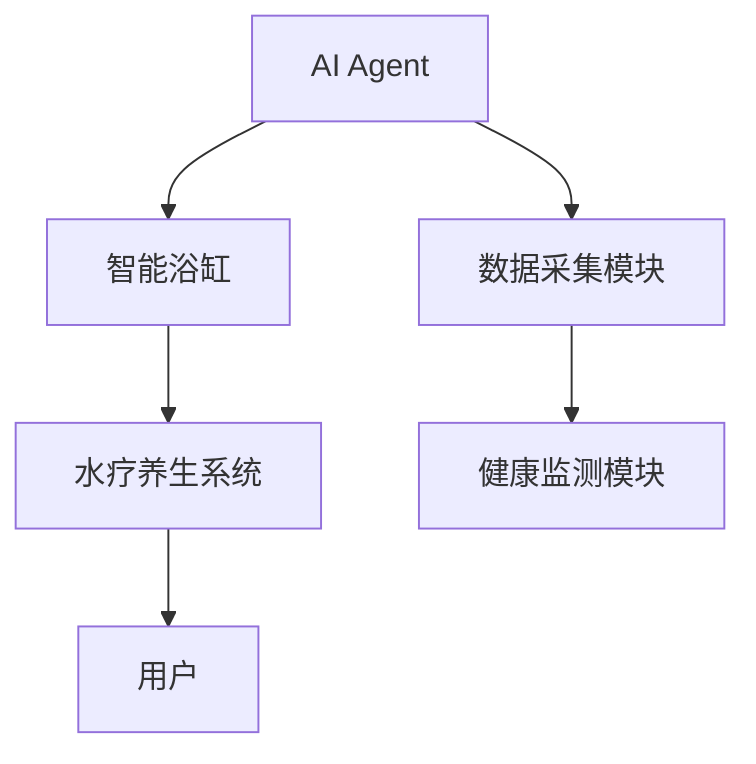
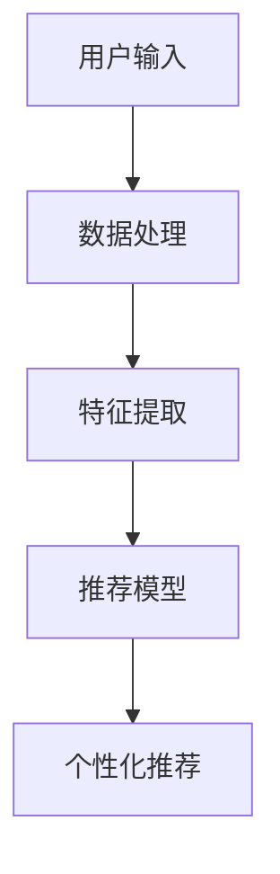
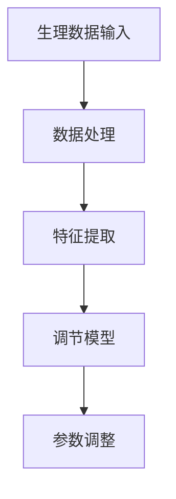
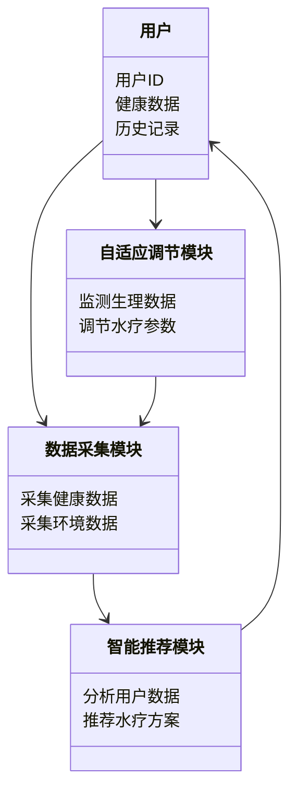
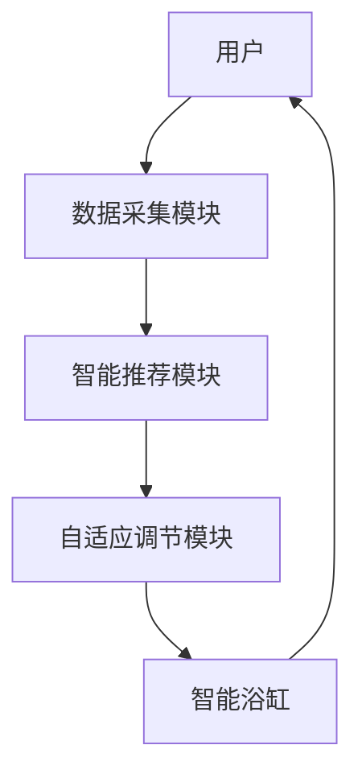
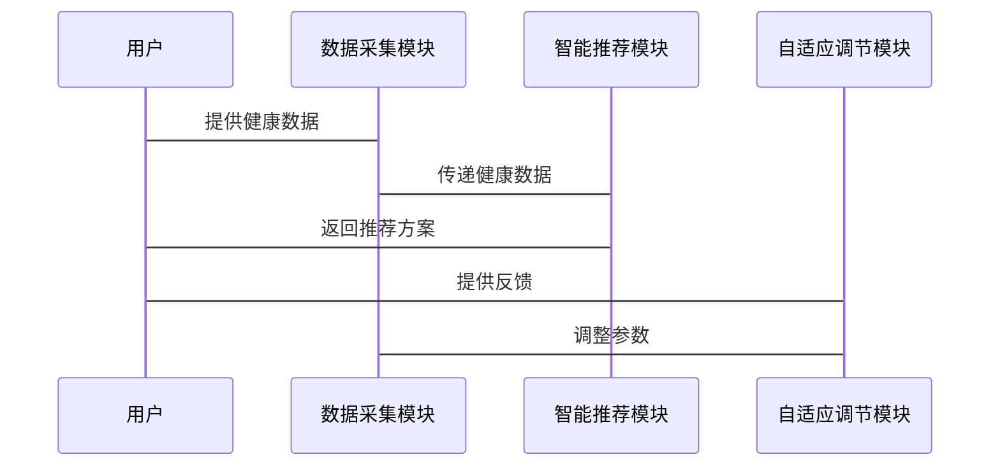

                 


# AI Agent在智能浴缸中的水疗养生定制系统

> 关键词：AI Agent, 智能浴缸, 水疗养生, 定制系统, 算法, 系统架构, 项目实战

> 摘要：本文深入探讨了AI Agent在智能浴缸中的应用，特别是其在水疗养生定制系统中的核心作用。通过分析系统的背景、核心概念、算法原理、系统架构以及项目实战，本文为读者提供了全面的技术解读。我们从问题背景出发，逐步揭示AI Agent如何通过智能推荐和自适应调节算法实现水疗养生的个性化服务，并通过系统架构设计和项目实战，展示如何将这些技术应用于实际场景中。最后，我们总结了系统的优缺点，并展望了未来的发展方向。

---

## 第一部分: AI Agent在智能浴缸中的水疗养生定制系统概述

### 第1章: 背景介绍

#### 1.1 问题背景
- **智能浴缸的发展现状**  
  智能浴缸作为一种高端健康产品，近年来在市场上的需求快速增长。传统浴缸的功能相对单一，无法满足用户的个性化需求。随着人工智能技术的快速发展，智能浴缸逐渐融入AI技术，以提供更智能、更个性化的水疗体验。

- **水疗养生的市场需求**  
  随着人们对健康关注度的提高，水疗养生逐渐成为一种受欢迎的健康方式。然而，现有的水疗系统通常缺乏智能化和个性化，无法根据用户的健康状况和需求进行动态调整。

- **AI技术在健康领域的应用趋势**  
  AI技术在医疗健康领域的应用越来越广泛，从疾病诊断到健康监测，AI技术正在改变人们的生活方式。智能浴缸作为AI技术的一个新兴应用场景，具有巨大的潜力。

#### 1.2 问题描述
- **智能浴缸水疗养生的痛点分析**  
  目前的智能浴缸系统通常仅具备基础的温控和按摩功能，无法根据用户的健康状况提供个性化的水疗方案。此外，用户需求的多样性与系统功能的单一性之间的矛盾日益凸显。

- **用户需求的多样性与个性化**  
  用户对水疗养生的需求多种多样，包括温度调节、水流强度、按摩模式等。不同用户的需求可能因健康状况、年龄、性别等因素而有所不同。

- **当前系统存在的不足**  
  当前的智能浴缸系统缺乏智能化的个性化推荐功能，无法根据用户的实时数据动态调整水疗方案。此外，系统之间的数据孤岛问题也限制了用户体验的提升。

#### 1.3 问题解决
- **AI Agent的核心作用**  
  AI Agent（智能代理）可以通过实时采集用户的健康数据，结合用户的历史行为和偏好，动态调整水疗方案，提供个性化的服务。

- **智能浴缸水疗养生定制系统的解决方案**  
  通过引入AI Agent，系统可以实现智能化的水疗方案推荐和自适应调节，满足用户的个性化需求。同时，系统可以通过数据采集和分析，优化用户体验。

- **边界与外延**  
  本系统主要关注智能浴缸的水疗养生功能，不涉及浴缸的其他功能（如清洁、加热水等）。系统的数据来源包括用户的健康数据和行为数据。

#### 1.4 系统核心要素
- **AI Agent的组成与功能**  
  AI Agent由数据采集模块、算法处理模块和执行模块组成。其功能包括数据采集、分析、决策和执行。

- **水疗养生系统的功能模块**  
  水疗养生系统主要包括数据采集模块、智能推荐模块、自适应调节模块和用户交互模块。

- **系统的整体架构**  
  系统采用模块化设计，各模块之间通过标准接口进行通信，确保系统的可扩展性和可维护性。

---

## 第2章: 核心概念与联系

### 2.1 AI Agent的原理
- **AI Agent的基本概念**  
  AI Agent是一种能够感知环境并采取行动以实现目标的智能实体。它可以基于用户的输入和环境数据，动态调整系统的行为。

- **AI Agent的核心算法**  
  AI Agent的核心算法包括智能推荐算法和自适应调节算法。这些算法基于用户数据和系统反馈，优化水疗方案。

- **AI Agent与智能浴缸的结合**  
  AI Agent通过采集用户的健康数据（如心率、体温、压力水平等），结合用户的偏好和历史行为，动态调整水疗参数（如水温、水流强度、按摩模式等）。

### 2.2 水疗养生系统的原理
- **水疗养生的基本原理**  
  水疗养生是通过调节水温、水流和压力来促进血液循环、缓解肌肉紧张和改善心理健康的一种健康方式。

- **系统的功能模块**  
  水疗养生系统主要包括数据采集模块、智能推荐模块、自适应调节模块和用户交互模块。

- **系统的用户交互流程**  
  用户通过浴缸的触摸屏输入基本信息（如年龄、性别、健康状况等），系统根据用户数据推荐个性化的水疗方案，并实时调整方案以优化用户体验。

### 2.3 核心概念对比表
| **核心概念** | **AI Agent** | **传统浴缸控制系统** |
|--------------|--------------|-----------------------|
| **功能**     | 智能推荐、自适应调节 | 基础温控、固定模式   |
| **数据来源** | 用户健康数据、行为数据 | 固定参数设置        |
| **目标**     | 提供个性化服务 | 提供基础功能          |

### 2.4 系统实体关系图


---

## 第3章: 算法原理讲解

### 3.1 智能推荐算法
- **算法概述**  
  智能推荐算法通过分析用户的历史行为和健康数据，推荐最适合用户的水疗方案。

- **算法流程图**  


- **数学模型**  
  推荐模型基于协同过滤算法，公式如下：
  $$ score(u, i) = \frac{\sum_{u' \in N(u)} sim(u, u') \cdot rating(u', i)}{\sum_{u' \in N(u)} sim(u, u')} $$
  其中，$u$表示用户，$i$表示水疗方案，$N(u)$表示用户$u$的邻居。

### 3.2 自适应调节算法
- **算法原理**  
  自适应调节算法通过实时监测用户的生理数据（如心率、体温、压力水平等），动态调整水疗参数。

- **算法流程图**  


- **数学模型**  
  调节模型基于反馈控制算法，公式如下：
  $$ control = K_p \cdot e + K_i \cdot \int e \, dt + K_d \cdot \frac{de}{dt} $$
  其中，$e$表示误差，$K_p$、$K_i$、$K_d$表示比例、积分和微分系数。

---

## 第4章: 系统分析与架构设计

### 4.1 问题场景介绍
- **系统目标**  
  设计一个基于AI Agent的智能浴缸水疗养生系统，实现个性化水疗方案推荐和动态调节。

### 4.2 项目介绍
- **项目名称**  
  基于AI Agent的智能浴缸水疗养生定制系统。

### 4.3 系统功能设计
- **领域模型图**  


### 4.4 系统架构设计
- **系统架构图**  


### 4.5 系统接口设计
- **接口定义**  
  - 数据采集模块提供REST API接口，用于采集用户的健康数据。
  - 智能推荐模块提供基于HTTP的API接口，返回推荐的水疗方案。
  - 自适应调节模块提供WebSocket接口，实时接收用户的生理数据并调整水疗参数。

### 4.6 系统交互流程
- **交互流程图**  


---

## 第5章: 项目实战

### 5.1 环境安装
- **安装Python环境**  
  使用Anaconda或虚拟环境安装Python 3.8及以上版本。
- **安装依赖库**  
  安装必要的库，如`numpy`、`pandas`、`scikit-learn`、`flask`等。

### 5.2 系统核心实现
- **智能推荐模块实现**  
  ```python
  import numpy as np
  from sklearn.metrics.pairwise import cosine_similarity

  def推荐方案(用户数据, 用户历史):
      用户特征 = 特征提取(用户数据)
      相似用户 = 找到相似用户(用户特征, 用户历史)
      推荐方案 = 推荐算法(相似用户)
      return 推荐方案
  ```

- **自适应调节模块实现**  
  ```python
  import numpy as np

  def调节参数(当前参数, 目标参数):
      调节幅度 = np.clip(当前参数 - 目标参数, -1, 1)
      新参数 = 当前参数 + 调节幅度
      return 新参数
  ```

### 5.3 实际案例分析
- **案例分析**  
  用户A，30岁，平时工作压力较大，偏好温水和轻柔按摩。系统通过采集用户的心率和压力水平，推荐适合的水温（38℃）和按摩模式（轻柔模式），并在用户使用过程中实时调整水流强度，以优化用户体验。

### 5.4 项目小结
- **实现总结**  
  通过项目实战，我们验证了AI Agent在智能浴缸水疗养生系统中的有效性。系统能够根据用户的健康数据和行为数据，推荐个性化的水疗方案，并实时调整参数以优化用户体验。

---

## 第6章: 总结与展望

### 6.1 系统优缺点
- **优点**  
  - 提供个性化的水疗方案。
  - 实时调整参数，优化用户体验。
  - 数据驱动的决策，提高系统智能性。

- **缺点**  
  - 系统依赖用户的健康数据，可能存在隐私问题。
  - 系统的实时性要求较高，对硬件和网络条件有一定要求。

### 6.2 未来展望
- **未来发展方向**  
  - 引入更多的健康数据（如血压、血糖等），提高系统的全面性。
  - 结合物联网技术，实现多设备联动的健康管理系统。
  - 探索更先进的AI算法，如深度学习和强化学习，进一步提升系统的智能化水平。

### 6.3 最佳实践Tips
- **数据隐私保护**  
  系统应严格遵守数据隐私保护法规，确保用户数据的安全。
- **系统稳定性**  
  系统应具备良好的容错机制，确保在极端情况下仍能正常运行。
- **用户教育**  
  系统应提供足够的用户教育，帮助用户理解系统的功能和使用方法。

---

## 作者

作者：AI天才研究院/AI Genius Institute & 禅与计算机程序设计艺术 /Zen And The Art of Computer Programming

