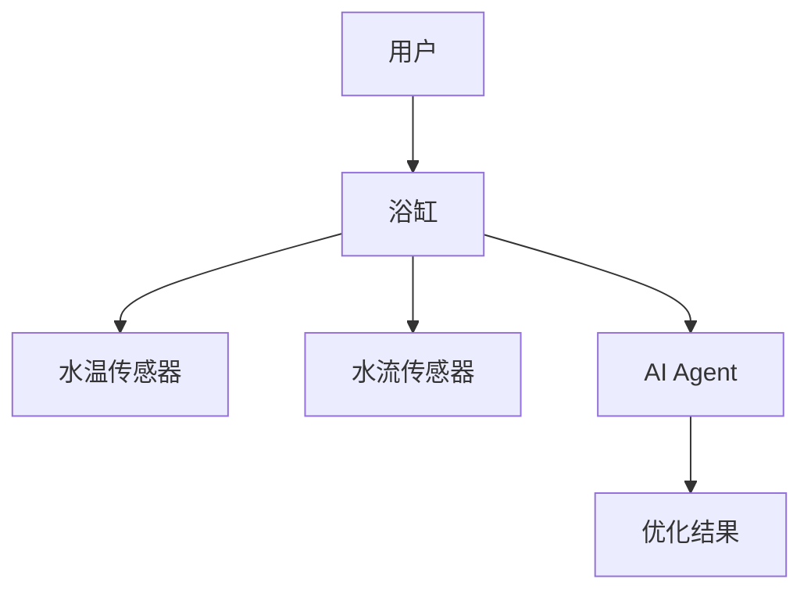
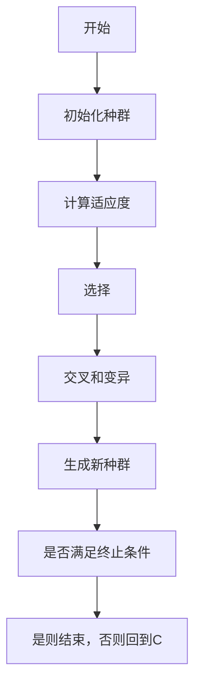

                 


# AI Agent在智能浴缸中的水疗效果优化

> 关键词：AI Agent, 智能浴缸, 水疗优化, 遗传算法, 模拟退火算法, 系统架构

> 摘要：本文深入探讨了AI Agent在智能浴缸中的应用，特别是如何通过优化算法提升水疗效果。文章从AI Agent的基本原理出发，分析了其在水疗优化中的数学模型，并通过具体案例展示了AI Agent在智能浴缸中的实际应用。最后，本文总结了AI Agent在水疗优化中的最佳实践和未来发展方向。

---

## 第一部分: AI Agent与智能浴缸的背景与概念

### 第1章: AI Agent与智能浴缸的背景介绍

#### 1.1 AI Agent的基本概念

- **1.1.1 AI Agent的定义**
  AI Agent（智能代理）是指能够感知环境、自主决策并执行任务的智能实体。它可以是一个软件程序或物理设备，通过传感器获取信息，并通过执行器与环境交互。

- **1.1.2 AI Agent的核心属性**
  - 感知能力：通过传感器获取环境信息。
  - 决策能力：基于感知信息做出决策。
  - 执行能力：通过执行器将决策转化为行动。

- **1.1.3 AI Agent与传统自动化的区别**
  AI Agent不仅仅是被动执行指令，它能够主动学习、适应环境并优化任务执行。

#### 1.2 智能浴缸的发展历程

- **1.2.1 浴缸的演变史**
  从传统的泡澡盆到现代的智能浴缸，浴缸的功能逐渐从单纯的物理放松扩展到健康水疗。

- **1.2.2 智能化浴缸的出现**
  随着物联网和人工智能技术的发展，智能浴缸开始出现，能够根据用户需求调整水温、水流等参数。

- **1.2.3 智能浴缸的现状与趋势**
  当前，智能浴缸主要通过传感器和简单的自动化控制实现基础功能，未来的趋势是通过AI Agent实现更复杂的水疗优化。

#### 1.3 水疗效果优化的必要性

- **1.3.1 水疗的基本原理**
  水疗是通过水的物理特性（如温度、压力、流动）来促进身体放松和健康恢复。

- **1.3.2 水疗效果的影响因素**
  包括水温、水流速度、水压、水深、浸泡时间等。

- **1.3.3 AI技术在水疗优化中的作用**
  AI Agent可以通过实时感知用户的身体状况和环境参数，动态调整水疗参数以优化效果。

---

## 第二部分: AI Agent在水疗优化中的核心概念与联系

### 第2章: AI Agent的核心原理

#### 2.1 AI Agent的基本原理

- **2.1.1 感知层**
  AI Agent通过传感器获取环境信息，如水温、水流速度、用户的心率等。

- **2.1.2 决策层**
  基于感知信息，AI Agent通过优化算法计算出最优的水疗参数。

- **2.1.3 执行层**
  AI Agent通过执行器（如水泵、加热器）调整水疗参数。

#### 2.2 AI Agent的优化算法

- **2.2.1 遗传算法**
  - 初始化种群：随机生成一组水疗参数。
  - 计算适应度：评估每组参数的水疗效果。
  - 选择、交叉和变异：根据适应度值选择优秀个体，进行交叉和变异生成新种群。

- **2.2.2 模拟退火算法**
  - 初始解生成：随机生成初始水疗参数。
  - 计算能量：评估当前参数的水疗效果。
  - 降温策略：逐步降低能量，寻找全局最优解。

- **2.2.3 其他优化算法**
  包括粒子群优化（PSO）等。

#### 2.3 AI Agent与水疗优化的结合

- **2.3.1 水疗效果优化的目标**
  提高水疗的舒适度和健康效果，减少对身体的负面影响。

- **2.3.2 AI Agent在水疗优化中的应用**
  AI Agent可以根据用户的实时反馈动态调整水疗参数，如水温、水流速度等。

- **2.3.3 水疗优化的数学模型**
  通过数学模型将水疗效果与参数进行量化，建立优化目标函数。

#### 2.4 优化算法特征对比表

| 算法名称 | 参数调整 | 搜索空间 | 适应度函数 |
|----------|----------|----------|------------|
| 遗传算法 | 需要     | 全局     | 需要       |
| 模拟退火 | 不需要    | 全局     | 需要       |

#### 2.5 ER实体关系图



---

## 第三部分: 水疗优化的数学模型与算法原理

### 第3章: 水疗优化的数学模型与算法原理

#### 3.1 水疗优化的数学模型

- **3.1.1 模型的构建**
  建立水疗参数与效果之间的数学关系。

- **3.1.2 模型的参数化**
  确定影响水疗效果的关键参数，如水温、水流速度等。

- **3.1.3 模型的验证**
  通过实验或模拟验证模型的有效性。

#### 3.2 遗传算法的实现

- **3.2.1 初始化种群**
  随机生成一组水疗参数。

- **3.2.2 适应度函数**
  计算每组参数的水疗效果。

- **3.2.3 选择、交叉和变异**
  根据适应度值选择优秀个体，进行交叉和变异生成新种群。

#### 3.3 模拟退火算法的实现

- **3.3.1 初始解生成**
  随机生成初始水疗参数。

- **3.3.2 能量计算**
  计算当前参数的水疗效果。

- **3.3.3 降温策略**
  逐步降低能量，寻找全局最优解。

#### 3.4 算法流程图



---

## 第四部分: 项目实战与系统设计

### 第4章: 项目实战

#### 4.1 环境安装

- 需要安装Python、遗传算法库（如DEAP）和模拟退火库（如scipy）。

#### 4.2 核心代码实现

```python
import random
from deap import base, tools

# 定义适应度函数
def evaluate(individual):
    # individual是一个元组，包含水温、水流速度等参数
    water_temp = individual[0]
    flow_speed = individual[1]
    # 计算水疗效果
    comfort = water_temp * 0.5 + flow_speed * 0.3
    return comfort,

# 初始化种群
toolbox = base.Toolbox()
toolbox.register("evaluate", evaluate)
toolbox.register("mate", tools.mate, toolbox, 0.5)
toolbox.register("mutate", tools.mutate, toolbox, 0.1)

# 运行遗传算法
population = toolbox.population(n=100)
pop, logbook = algorithms.ea(population, toolbox, cxpb=0.5, mutpb=0.2, ngen=20, verbose=True)
```

#### 4.3 案例分析

- 通过实验验证算法的有效性，调整水温、水流速度等参数，观察水疗效果的变化。

#### 4.4 项目小结

- 总结项目的实现过程，分析优化效果，提出改进建议。

---

## 第五部分: 最佳实践与未来展望

### 第5章: 最佳实践

#### 5.1 总结与经验分享

- AI Agent在智能浴缸中的应用前景广阔，可以通过进一步优化算法和增加传感器数量提升水疗效果。

#### 5.2 注意事项

- 确保系统的安全性和可靠性，避免因系统故障导致意外。

#### 5.3 拓展阅读

- 推荐阅读相关领域的书籍和论文，深入学习优化算法和AI Agent的应用。

---

## 作者：AI天才研究院/AI Genius Institute & 禅与计算机程序设计艺术 /Zen And The Art of Computer Programming

