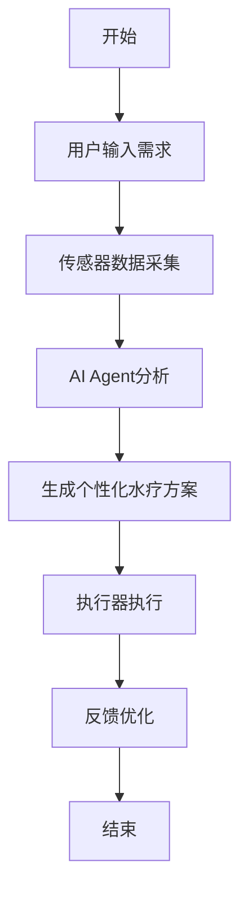
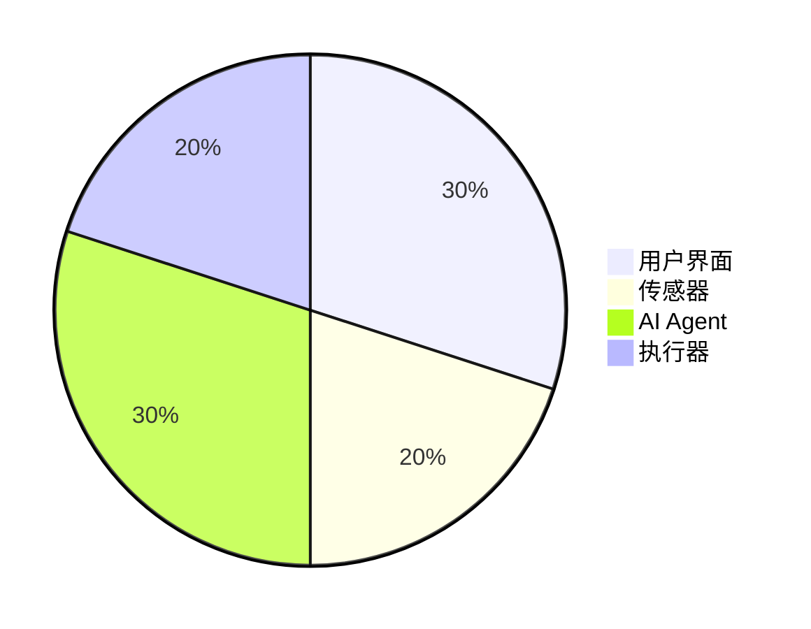
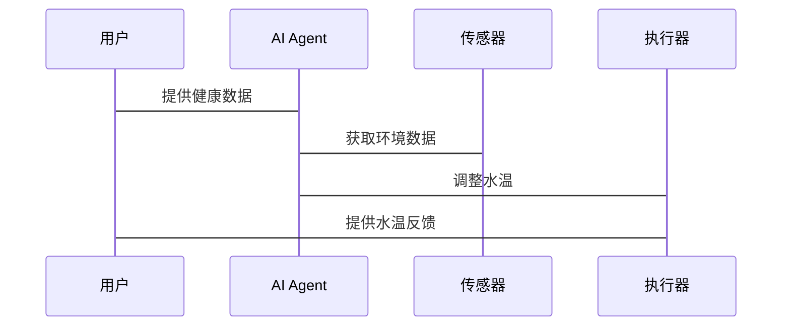

                 


# AI Agent在智能浴缸中的水疗模式个性化

> 关键词：AI Agent，智能浴缸，水疗模式，个性化，智能控制系统，健康监测

> 摘要：本文详细探讨了AI Agent在智能浴缸水疗模式个性化中的应用，分析了其算法原理、系统架构设计、项目实战及最佳实践，为智能浴缸的智能化发展提供了理论和实践指导。

---

# 第一部分: 背景介绍

## 第1章: 问题背景

### 1.1 智能浴缸的发展历程
智能浴缸从最初的机械控制发展到现代的智能自动化控制，经历了多个阶段。最初的浴缸仅提供简单的温控功能，随后加入了水流按摩、蒸汽等功能，逐步向智能化方向发展。近年来，随着人工智能技术的成熟，智能浴缸开始引入AI Agent，实现了更加个性化的水疗体验。

### 1.2 当前水疗模式的痛点
传统的水疗模式存在以下问题：
- 缺乏个性化：无法根据用户的健康状况、身体需求等提供定制化服务。
- 自动化程度低：水疗设备的控制主要依赖手动操作，用户体验较差。
- 数据孤岛：各个设备之间缺乏联动，无法形成完整的水疗生态系统。

### 1.3 AI Agent的应用前景
AI Agent作为一种智能代理，能够实时分析用户需求和环境数据，优化水疗模式。通过AI Agent，智能浴缸可以实现个性化的水温调节、水流按摩模式选择、健康数据监测等功能，显著提升用户体验。

## 第2章: 问题描述

### 2.1 水疗模式的个性化需求
用户在使用智能浴缸时，可能有不同的健康状况、身体需求和偏好。例如，有些用户可能需要深层组织按摩，而有些用户可能更注重放松。因此，水疗模式需要根据用户的实时反馈进行动态调整。

### 2.2 用户行为分析与模式识别
AI Agent需要分析用户的使用习惯、健康数据和反馈信息，识别用户的偏好和潜在需求。例如，通过分析用户的历史使用数据，AI Agent可以预测用户下次使用的水温偏好。

### 2.3 AI Agent在个性化水疗中的作用
AI Agent通过实时数据采集、分析和决策，为用户提供个性化的水疗方案。例如，当检测到用户有肌肉酸痛时，AI Agent可以自动调整水流强度和温度，帮助用户缓解不适。

## 第3章: 问题解决

### 3.1 AI Agent的核心功能
AI Agent在智能浴缸中的核心功能包括：
- 数据采集：采集用户的健康数据、环境数据等。
- 数据分析：通过机器学习算法分析数据，识别用户需求。
- 模式推荐：根据分析结果推荐个性化的水疗模式。
- 自动控制：根据推荐结果自动调整水温、水流等参数。

### 3.2 个性化水疗模式的设计思路
个性化水疗模式的设计需要考虑以下因素：
- 用户的健康状况：如血压、心率等。
- 用户的偏好：如水温、水流强度等。
- 环境数据：如室温、湿度等。

### 3.3 技术实现路径
技术实现路径包括：
1. 数据采集：通过传感器采集用户的健康数据和环境数据。
2. 数据分析：使用机器学习算法分析数据，识别用户需求。
3. 模式推荐：根据分析结果推荐个性化的水疗模式。
4. 自动控制：根据推荐结果调整水温、水流等参数。

## 第4章: 边界与外延

### 4.1 系统边界
智能浴缸系统包括以下部分：
- 用户界面：供用户输入需求和查看信息。
- 传感器：采集环境数据和用户数据。
- AI Agent：分析数据并推荐水疗模式。
- 执行器：根据推荐结果调整水温、水流等参数。

### 4.2 功能边界
AI Agent的功能包括数据采集、分析、推荐和控制。不包括与外部系统的交互，如与家庭其他设备的联动。

### 4.3 系统架构特点
系统架构采用模块化设计，各模块之间通过标准接口进行通信。系统具有良好的扩展性，可以根据需求增加新的功能模块。

---

# 第二部分: 核心概念与联系

## 第2章: 核心概念与联系

### 2.1 AI Agent的基本原理
AI Agent是一种智能代理，能够感知环境、分析信息并做出决策。AI Agent在智能浴缸中的作用是分析用户需求和环境数据，优化水疗模式。

### 2.2 核心概念对比

| 技术 | 定义 | 优势 | 劣势 |
|------|------|------|------|
| AI Agent | 能够感知环境、分析信息并做出决策的智能代理 | 高度个性化、动态调整 | 复杂性高、实现难度大 |
| 传统自动化控制 | 基于预设规则的自动化控制 | 实现简单、成本低 | 缺乏灵活性、难以个性化 |
| 机器学习模型 | 基于数据训练的预测模型 | 高准确性 | 需要大量数据、难以实时调整 |

### 2.3 ER实体关系图
```mermaid
er
  actor: 用户
  agent: AI Agent
  water_treatment: 水疗模式
  sensor: 传感器数据
  actuator: 执行器
  relation: 用户 -> 选择水疗模式
  relation: 水疗模式 -> 驱动执行器
  relation: 传感器 -> 提供反馈
```

---

# 第三部分: 算法原理讲解

## 第3章: 算法流程

### 3.1 算法流程图


### 3.2 算法实现

```python
class AI-Agent:
    def __init__(self):
        self.sensors = []  # 传感器数据
        self.user_prefs = {}  # 用户偏好
        self.health_data = {}  # 健康数据

    def analyze_data(self):
        # 分析数据，识别用户需求
        pass

    def recommend_mode(self):
        # 推荐水疗模式
        pass

    def control_actuator(self):
        # 控制执行器
        pass
```

### 3.3 数学模型
个性化水疗模式推荐的数学模型可以基于协同过滤算法。例如，基于用户的相似性进行推荐：

$$ \text{推荐度} = \sum_{i=1}^{n} w_{ij} \times r_{ik} $$

其中，\( w_{ij} \) 是用户 \( j \) 和用户 \( k \) 的相似度，\( r_{ik} \) 是用户 \( k \) 对模式 \( i \) 的评分。

---

# 第四部分: 系统分析与架构设计

## 第4章: 系统分析与架构设计

### 4.1 系统场景介绍
智能浴缸系统需要实现个性化的水疗模式推荐和控制。系统包括用户界面、传感器、AI Agent和执行器。

### 4.2 系统功能设计
- 用户界面：显示水温、水流强度等参数，供用户输入需求。
- 传感器：采集用户健康数据和环境数据。
- AI Agent：分析数据，推荐水疗模式。
- 执行器：根据推荐结果调整水温、水流强度等参数。

### 4.3 系统架构图


### 4.4 系统接口设计
- 用户界面与AI Agent之间的接口：传递用户需求和反馈。
- 传感器与AI Agent之间的接口：传递环境数据。
- AI Agent与执行器之间的接口：传递控制指令。

### 4.5 系统交互流程图


---

# 第五部分: 项目实战

## 第5章: 项目实战

### 5.1 环境安装
- 安装Python和相关库（如NumPy、Scikit-learn）。
- 安装智能浴缸硬件，包括传感器、执行器和用户界面。

### 5.2 核心代码实现
```python
import numpy as np
from sklearn.neighbors import NearestNeighbors

class AI-Agent:
    def __init__(self):
        self.data = []  # 用户数据
        self.models = []  # 模型

    def train_model(self, data):
        # 训练机器学习模型
        pass

    def predict(self, input):
        # 预测推荐模式
        pass
```

### 5.3 案例分析
案例：用户A偏好高温和强水流。AI Agent根据用户的历史数据和当前反馈，推荐高温和中等水流的水疗模式。

### 5.4 项目总结
通过该项目，我们验证了AI Agent在智能浴缸中的应用价值，实现了个性化的水疗模式推荐和控制。

---

# 第六部分: 最佳实践

## 第6章: 最佳实践

### 6.1 小结
AI Agent在智能浴缸中的应用显著提升了用户体验，实现了个性化的水疗模式推荐和控制。

### 6.2 注意事项
- 数据隐私：确保用户数据的安全性。
- 系统稳定性：保证系统的可靠运行。
- 用户反馈：及时收集用户反馈，优化系统。

### 6.3 拓展阅读
推荐阅读《机器学习实战》和《智能系统设计》等书籍，深入理解AI Agent和智能系统设计的相关知识。

---

# 作者：AI天才研究院/AI Genius Institute & 禅与计算机程序设计艺术 /Zen And The Art of Computer Programming

