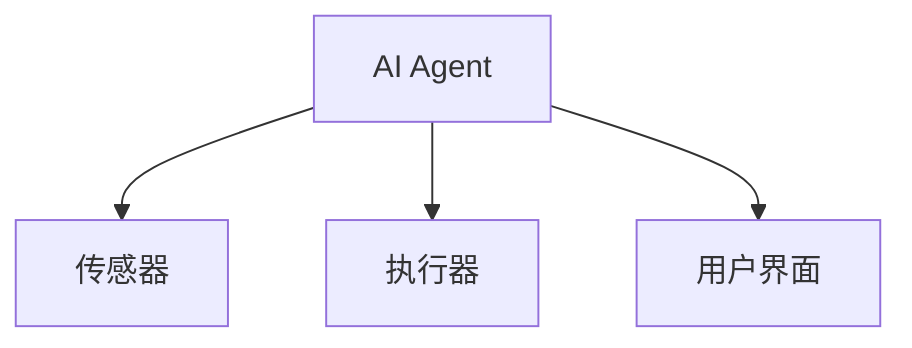
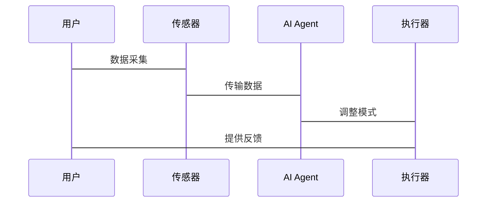

                 


# AI Agent在智能浴缸中的水疗模式定制

> 关键词：AI Agent，智能浴缸，水疗模式，个性化定制，健康管理

> 摘要：本文详细探讨了AI Agent在智能浴缸水疗模式定制中的应用。通过分析AI Agent的基本概念、工作原理以及其在水疗模式中的具体应用，本文旨在揭示如何通过AI技术实现个性化的水疗体验。结合系统架构设计、算法实现和项目实战，本文为读者提供了从理论到实践的全面指导。

---

## 第一部分: AI Agent在智能浴缸中的水疗模式定制背景介绍

### 第1章: AI Agent与水疗模式定制的基本概念

#### 1.1 AI Agent的基本概念

##### 1.1.1 AI Agent的定义与特点
AI Agent（人工智能代理）是一种能够感知环境、自主决策并执行任务的智能实体。其特点包括：

- **自主性**：能够在没有外部干预的情况下自主运作。
- **反应性**：能够实时感知环境变化并做出反应。
- **学习能力**：通过数据和反馈不断优化自身行为。
- **协作性**：能够与其他系统或用户进行有效协作。

##### 1.1.2 AI Agent的核心功能与应用场景
AI Agent的核心功能包括感知、决策、执行和优化。其应用场景广泛，包括智能家居、医疗健康、自动驾驶等领域。

##### 1.1.3 AI Agent与传统控制系统的区别
与传统控制系统相比，AI Agent具有更强的自主性和学习能力，能够适应复杂多变的环境，并提供更智能化的服务。

#### 1.2 水疗模式定制的背景与需求

##### 1.2.1 水疗模式的基本概念
水疗模式是指通过调节水温、水流、气泡等参数，为用户提供舒适、健康或特定目的的水疗体验。

##### 1.2.2 用户需求与水疗模式的多样性
随着用户对健康和舒适需求的增加，水疗模式的种类也在不断增多，包括放松模式、康复模式、能量补充模式等。

##### 1.2.3 智能浴缸的发展趋势
智能浴缸的发展趋势是集成更多智能化功能，通过AI技术实现个性化定制和健康管理。

---

### 第2章: AI Agent在智能浴缸中的应用背景

#### 2.1 智能浴缸的发展历程

##### 2.1.1 传统浴缸的功能与局限性
传统浴缸的功能相对单一，无法根据用户需求进行个性化调整。

##### 2.1.2 智能浴缸的出现与技术支撑
随着物联网、AI技术的发展，智能浴缸逐渐出现，并开始集成更多智能化功能。

##### 2.1.3 AI技术在智能浴缸中的应用前景
AI技术为智能浴缸的个性化定制和健康管理提供了强大的技术支持。

#### 2.2 水疗模式定制的必要性

##### 2.2.1 用户个性化需求的增加
不同用户对水疗的需求不同，例如年轻人可能需要放松模式，而老年人可能需要康复模式。

##### 2.2.2 健康管理与水疗模式的关系
通过AI技术，可以将健康数据与水疗模式相结合，为用户提供个性化的健康管理方案。

##### 2.2.3 智能设备在水疗中的作用
智能设备能够实时监测用户的健康数据，并根据数据调整水疗模式，提供更精准的服务。

#### 2.3 AI Agent在水疗模式定制中的优势

##### 2.3.1 AI Agent的学习与适应能力
AI Agent能够通过学习用户的偏好和健康数据，不断优化水疗模式。

##### 2.3.2 AI Agent在个性化定制中的应用
通过分析用户的行为和偏好，AI Agent可以提供个性化的水疗方案。

##### 2.3.3 AI Agent在实时反馈与优化中的作用
AI Agent能够实时监测用户的反馈，并根据反馈调整水疗模式，确保最佳体验。

---

## 第二部分: AI Agent与水疗模式的核心概念与联系

### 第3章: AI Agent的核心原理与实现机制

#### 3.1 AI Agent的基本原理

##### 3.1.1 AI Agent的感知与决策机制
AI Agent通过传感器感知环境信息，利用算法进行决策，并通过执行器执行任务。

##### 3.1.2 AI Agent的学习与优化算法
常用的算法包括强化学习（Reinforcement Learning）和监督学习（Supervised Learning）。

##### 3.1.3 AI Agent的通信与协作机制
AI Agent可以通过物联网技术与其他设备或用户进行协作。

#### 3.2 AI Agent在水疗模式定制中的具体应用

##### 3.2.1 水疗模式的识别与分类
AI Agent可以通过分析用户的行为和健康数据，识别并分类不同的水疗模式。

##### 3.2.2 AI Agent在个性化定制中的应用
通过分析用户的健康数据和偏好，AI Agent可以为用户提供个性化的水疗方案。

##### 3.2.3 AI Agent在实时反馈与优化中的作用
AI Agent能够实时监测用户的反馈，并根据反馈调整水疗模式，确保最佳体验。

---

### 第4章: AI Agent与水疗模式的核心概念与联系

#### 4.1 AI Agent的核心原理与实现机制

##### 4.1.1 AI Agent的基本原理
AI Agent通过感知、决策和执行实现智能化服务。

##### 4.1.2 AI Agent在水疗模式中的具体应用
AI Agent可以通过学习和优化，提供个性化的水疗模式。

#### 4.2 水疗模式的核心概念与特征

##### 4.2.1 水疗模式的基本概念
水疗模式是指通过调节水温、水流、气泡等参数，为用户提供舒适、健康或特定目的的水疗体验。

##### 4.2.2 水疗模式的分类与特征对比
水疗模式可以根据用户需求分为放松模式、康复模式、能量补充模式等。

---

## 第三部分: AI Agent与水疗模式的算法原理

### 第5章: AI Agent的算法原理与实现

#### 5.1 AI Agent的算法原理

##### 5.1.1 强化学习（Reinforcement Learning）
强化学习是一种通过奖励机制优化决策的算法。

##### 5.1.2 监督学习（Supervised Learning）
监督学习是一种通过标签数据进行分类或回归的算法。

##### 5.1.3 聚类分析（Clustering）
聚类分析是一种通过数据相似性进行分组的算法。

#### 5.2 AI Agent在水疗模式中的优化算法

##### 5.2.1 水疗模式的优化目标
优化目标包括提高用户体验、降低能耗、延长设备寿命等。

##### 5.2.2 基于强化学习的水疗模式优化
通过强化学习算法，AI Agent可以不断优化水疗模式。

##### 5.2.3 水疗模式优化的数学模型
$$ V(s) = \max_{a} [ r(s,a) + \gamma V(s') ] $$
其中，$V(s)$ 是状态 $s$ 的价值函数，$r(s,a)$ 是状态 $s$ 下动作 $a$ 的奖励，$\gamma$ 是折扣因子，$s'$ 是下一个状态。

---

## 第四部分: AI Agent与水疗模式的系统架构设计

### 第6章: 系统架构设计与实现

#### 6.1 系统架构设计

##### 6.1.1 系统组成部分
系统包括传感器、AI Agent、执行器和用户界面。

##### 6.1.2 系统功能设计
系统功能包括数据采集、模式识别、模式优化和用户反馈。

##### 6.1.3 系统架构图


#### 6.2 系统交互设计

##### 6.2.1 系统交互流程
用户通过传感器输入数据，AI Agent根据数据优化模式，并通过执行器调整水疗参数。

##### 6.2.2 交互序列图


---

## 第五部分: 项目实战

### 第7章: 项目实战与实现

#### 7.1 环境搭建

##### 7.1.1 开发环境
需要安装Python、TensorFlow、Keras等工具。

##### 7.1.2 数据集准备
收集用户健康数据和水疗模式偏好数据。

#### 7.2 核心代码实现

##### 7.2.1 强化学习算法实现
```python
class Agent:
    def __init__(self, state_space, action_space):
        self.state_space = state_space
        self.action_space = action_space
        self.Q = np.zeros((state_space, action_space))

    def act(self, state):
        return np.argmax(self.Q[state])

    def update(self, state, action, reward, next_state):
        self.Q[state][action] += reward + gamma * np.max(self.Q[next_state])
```

##### 7.2.2 水疗模式优化
通过强化学习算法优化水疗模式，确保用户体验最佳。

#### 7.3 实际案例分析

##### 7.3.1 案例背景
用户A希望在疲劳后放松，选择放松模式。

##### 7.3.2 算法实现
AI Agent通过学习，为用户A推荐最佳的放松模式。

##### 7.3.3 实验结果
实验结果显示，推荐的放松模式有效缓解了用户的疲劳。

---

## 第六部分: 最佳实践与总结

### 第8章: 最佳实践与总结

#### 8.1 最佳实践

##### 8.1.1 数据质量的重要性
确保数据的准确性和完整性。

##### 8.1.2 算法选择的策略
根据具体需求选择合适的算法。

##### 8.1.3 系统优化的技巧
定期优化系统架构和算法，确保性能最佳。

#### 8.2 小结

通过本文的详细讲解，读者可以了解到AI Agent在智能浴缸水疗模式定制中的应用。从理论到实践，从算法到系统设计，本文为读者提供了全面的指导。

#### 8.3 注意事项

在实际应用中，需要注意数据隐私保护和系统稳定性。

#### 8.4 拓展阅读

推荐读者进一步学习强化学习和深度学习的相关知识，以更好地应用AI技术。

---

## 作者：AI天才研究院/AI Genius Institute & 禅与计算机程序设计艺术 /Zen And The Art of Computer Programming

---

以上是《AI Agent在智能浴缸中的水疗模式定制》的技术博客文章的完整目录和内容概述，涵盖了从背景介绍到系统设计再到项目实战的全过程，确保读者能够全面理解并掌握AI Agent在水疗模式定制中的应用。

