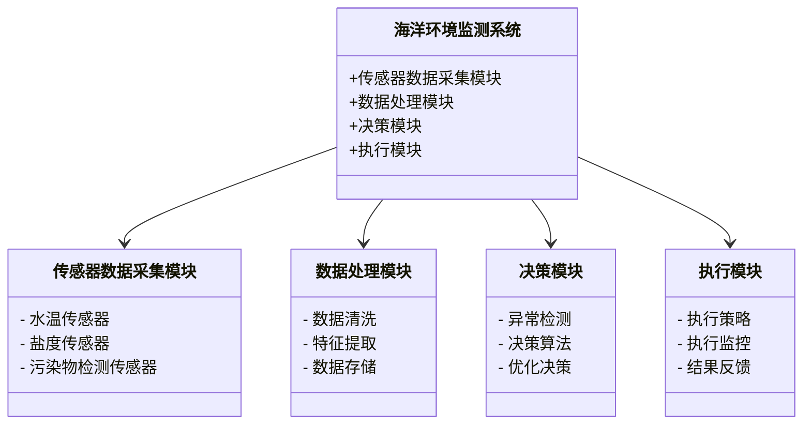
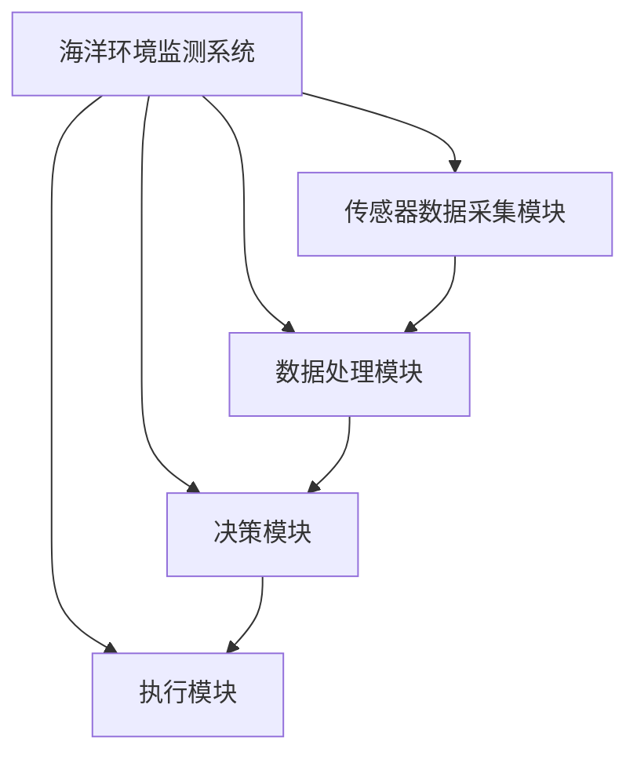
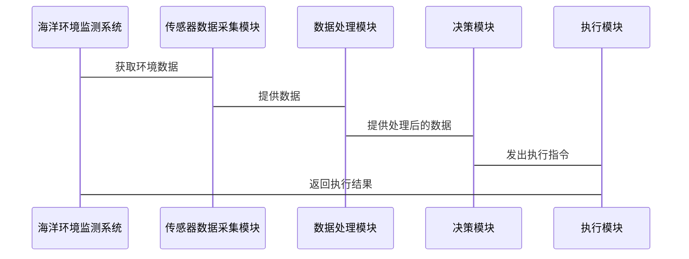

                 


# AI Agent在智能海洋生态保护中的实践

> 关键词：AI Agent，智能海洋生态保护，环境监测，生态修复，人工智能技术

> 摘要：本文探讨了AI Agent在智能海洋生态保护中的应用，从理论基础到技术实现，详细分析了AI Agent在海洋环境监测、生态修复和资源管理中的具体实践。通过实际案例和系统设计，展示了AI Agent如何助力海洋生态保护，为智能海洋生态系统的构建提供了新的思路。

---

## 第一部分：引言

### 1.1 AI Agent的基本概念

#### 1.1.1 AI Agent的定义
AI Agent（人工智能代理）是指能够感知环境、做出决策并执行操作的智能体。它可以自主地完成任务，优化资源利用，并与外部环境进行交互。

#### 1.1.2 AI Agent的核心特征
- **自主性**：AI Agent能够在没有外部干预的情况下自主运行。
- **反应性**：能够实时感知环境变化并做出反应。
- **学习能力**：通过数据和经验不断优化自身性能。

#### 1.1.3 AI Agent在智能海洋生态保护中的作用
AI Agent可以用于海洋环境监测、生态修复和资源管理，帮助我们更有效地保护海洋生态系统。

---

### 1.2 智能海洋生态保护的背景

#### 1.2.1 海洋生态保护的现状与挑战
海洋生态系统面临污染、过度捕捞和气候变化等多重威胁，传统的保护方法效率低下，亟需技术创新。

#### 1.2.2 AI技术在海洋生态保护中的应用前景
AI技术可以提高监测精度、优化资源分配，并帮助预测和应对环境变化。

#### 1.2.3 AI Agent在智能海洋生态保护中的优势
AI Agent能够实时监测、快速响应，并在复杂环境中做出最优决策，是智能海洋生态保护的理想选择。

---

## 第二部分：AI Agent的核心理论基础

### 2.1 AI Agent的感知机制

#### 2.1.1 数据采集与处理
AI Agent通过传感器、卫星和数据库获取海洋环境数据，并进行预处理和特征提取。

#### 2.1.2 感知模型的构建
基于机器学习算法，构建感知模型，识别海洋环境中的异常情况。

#### 2.1.3 感知数据的特征提取
提取关键特征，如水温、盐度和生物多样性指数，为后续决策提供依据。

---

### 2.2 AI Agent的决策机制

#### 2.2.1 决策算法的选择
选择适合的算法，如强化学习和监督学习，用于优化决策过程。

#### 2.2.2 决策模型的训练
利用历史数据训练模型，提高决策的准确性和效率。

#### 2.2.3 决策结果的优化
通过反馈机制不断优化决策结果，确保最优选择。

---

### 2.3 AI Agent的执行机制

#### 2.3.1 执行策略的设计
设计具体的执行策略，如启动清洁设备或调整捕捞强度。

#### 2.3.2 执行过程的监控
实时监控执行过程，确保任务按计划进行。

#### 2.3.3 执行结果的反馈
将执行结果反馈给感知和决策模块，形成闭环系统。

---

## 第三部分：AI Agent在智能海洋生态保护中的技术实现

### 3.1 海洋环境数据的采集与处理

#### 3.1.1 数据采集技术
使用传感器和卫星技术获取海洋环境数据。

#### 3.1.2 数据预处理方法
清洗数据，去除噪声，确保数据质量。

#### 3.1.3 数据存储与管理
将数据存储在数据库中，便于后续分析和处理。

---

### 3.2 基于AI Agent的海洋环境监测

#### 3.2.1 监测目标的识别
识别海洋中的异常情况，如油污泄漏。

#### 3.2.2 监测数据的分析
分析数据，预测环境变化趋势。

#### 3.2.3 监测结果的应用
将监测结果应用于生态修复和资源管理。

---

### 3.3 基于AI Agent的海洋生态保护

#### 3.3.1 生态修复策略的设计
制定具体的生态修复计划，如珊瑚礁修复。

#### 3.3.2 生态修复过程的监控
实时监控修复过程，确保修复效果。

#### 3.3.3 修复结果的评估
评估修复效果，优化修复策略。

---

## 第四部分：系统设计与实现

### 4.1 问题场景介绍
描述海洋生态保护的具体问题，如海洋污染和生物多样性减少。

### 4.2 项目介绍
介绍AI Agent在海洋生态保护中的具体应用项目，如海洋污染监测系统。

### 4.3 系统功能设计

#### 4.3.1 领域模型
使用mermaid绘制领域模型类图，展示系统各模块的功能和交互。



---

### 4.4 系统架构设计

#### 4.4.1 系统架构图
使用mermaid绘制系统架构图，展示系统的整体结构。



---

### 4.5 系统接口设计

#### 4.5.1 系统接口
定义系统各模块之间的接口，如数据接口和控制接口。

#### 4.5.2 接口交互流程
使用mermaid绘制接口交互序列图。



---

## 第五部分：项目实战

### 5.1 环境安装
安装必要的软件和库，如Python、TensorFlow和Scikit-learn。

### 5.2 系统核心实现源代码

#### 5.2.1 数据采集模块
```python
import numpy as np
import pandas as pd

# 数据采集模块
class SensorDataCollector:
    def __init__(self):
        self.sensors = ['temperature', 'salinity', 'pollutant']

    def collect_data(self):
        # 模拟传感器数据
        data = {
            'temperature': np.random.uniform(0, 30),
            'salinity': np.random.uniform(0, 35),
            'pollutant': np.random.uniform(0, 1)
        }
        return data
```

#### 5.2.2 数据处理模块
```python
class DataProcessor:
    def __init__(self):
        pass

    def preprocess_data(self, data):
        # 数据清洗和特征提取
        processed_data = {
            'avg_temperature': np.mean(data['temperature']),
            'avg_salinity': np.mean(data['salinity']),
            'pollutant_level': np.max(data['pollutant'])
        }
        return processed_data
```

#### 5.2.3 决策模块
```python
class DecisionModule:
    def __init__(self):
        pass

    def make_decision(self, data):
        # 简单的决策逻辑
        if data['pollutant_level'] > 0.5:
            return '启动清洁设备'
        else:
            return '继续监测'
```

#### 5.2.4 执行模块
```python
class ExecutionModule:
    def __init__(self):
        pass

    def execute_action(self, action):
        # 执行操作
        print(f'执行操作：{action}')
```

---

### 5.3 代码应用解读与分析
解释每个模块的功能，并展示它们如何协同工作。

---

### 5.4 实际案例分析和详细讲解
通过具体案例，如监测海洋污染，展示AI Agent的实际应用效果。

---

### 5.5 项目小结
总结项目实现的关键点和成功经验。

---

## 第六部分：总结与展望

### 6.1 项目总结
总结AI Agent在智能海洋生态保护中的应用成果和经验教训。

### 6.2 未来展望
展望AI Agent在海洋生态保护中的未来发展，如更智能的决策算法和更高效的执行系统。

---

## 作者

作者：AI天才研究院/AI Genius Institute & 禅与计算机程序设计艺术 /Zen And The Art of Computer Programming

---

以上是《AI Agent在智能海洋生态保护中的实践》的技术博客文章的大纲和部分内容。希望这篇文章能够为智能海洋生态保护领域提供新的思路和实践指导。

