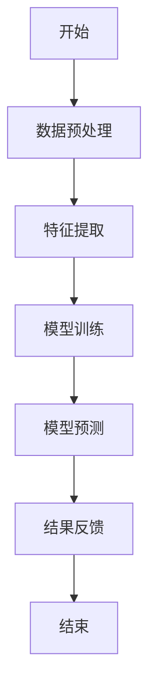
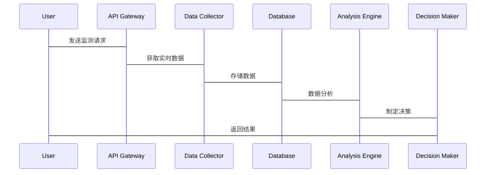

                 


# AI Agent在智能海洋生态监测中的实践

## 关键词：
AI Agent, 海洋生态监测, 智能决策, 算法实现, 系统架构, 项目实战

## 摘要：
本文探讨AI Agent在智能海洋生态监测中的实践应用，涵盖背景介绍、核心概念、算法原理、系统设计及项目案例。通过详细分析，展示了AI Agent如何提升海洋生态监测的效率与准确性。

---

## 第一部分：背景介绍

### 第1章：AI Agent与智能海洋生态监测概述

#### 1.1 AI Agent的基本概念
- **1.1.1 AI Agent的定义与特点**
  - AI Agent是一个智能体，能够感知环境、自主决策并执行任务。
  - 具有主动性、反应性、社会性、学习性等特征。

- **1.1.2 AI Agent的核心要素**
  - **感知层**：通过传感器或其他数据源获取信息。
  - **决策层**：利用算法处理数据，制定决策。
  - **执行层**：通过执行机构完成任务。

- **1.1.3 AI Agent与传统自动化的区别**
  - 传统自动化基于预设规则，AI Agent具备学习与自适应能力。

#### 1.2 智能海洋生态监测的背景
- **1.2.1 海洋生态监测的重要性**
  - 监测海洋环境变化，保护生态系统，评估人类活动影响。

- **1.2.2 智能化监测的需求与挑战**
  - 需要实时、准确的数据采集与分析；覆盖范围广，数据量大；环境复杂，传感器易受干扰。

- **1.2.3 AI Agent在海洋生态监测中的作用**
  - 提供实时数据处理，优化监测策略，提高决策效率。

#### 1.3 问题背景与描述
- **1.3.1 海洋生态监测的主要问题**
  - 数据量大且复杂，传统方法效率低；监测设备维护困难；环境变化预测不准确。

- **1.3.2 AI Agent如何解决这些问题**
  - 提供高效的数据处理能力，优化监测策略，提高预测准确性。

- **1.3.3 问题的边界与外延**
  - 限定在海洋环境监测，延伸至气候变化研究等领域。

---

## 第二部分：核心概念与联系

### 第2章：AI Agent与海洋生态监测的核心概念

#### 2.1 AI Agent的原理与实现
- **2.1.1 感知层：数据采集与处理**
  - 使用多种传感器采集数据，如温度、盐度、溶解氧等。
  - 数据预处理：去噪、归一化处理。

- **2.1.2 决策层：智能算法与策略**
  - 应用机器学习算法进行数据分类和预测。
  - 制定监测策略，如动态调整监测频率。

- **2.1.3 执行层：行动与反馈**
  - 执行监测任务，如启动采样设备。
  - 反馈监测结果，优化后续决策。

#### 2.2 海洋生态监测系统的构成
- **2.2.1 数据采集模块**
  - 传感器网络部署，实时采集环境数据。

- **2.2.2 数据分析模块**
  - 数据清洗、特征提取，建立环境模型。

- **2.2.3 监测决策模块**
  - 基于AI算法，生成监测报告，发出警报。

#### 2.3 AI Agent与海洋生态监测的关系
- **2.3.1 AI Agent在监测中的角色**
  - 作为智能决策核心，处理实时数据，优化监测策略。

- **2.3.2 海洋生态监测对AI Agent的需求**
  - 处理复杂数据，快速响应环境变化。

- **2.3.3 两者结合的优势与挑战**
  - 优势：提升监测效率，提高准确性。
  - 挑战：数据隐私问题，系统可靠性要求高。

#### 2.4 核心概念对比分析
- **2.4.1 AI Agent与传统监测系统的对比**
  | 特性 | AI Agent | 传统监测系统 |
  |------|-----------|--------------|
  | 决策方式 | 自主学习与优化 | 预设规则执行 |
  | 处理能力 | 处理复杂数据 | 处理单一数据 |

- **2.4.2 不同AI技术在海洋监测中的应用对比**
  | 技术 | 应用场景 | 优缺点 |
  |------|-----------|----------|
  | 机器学习 | 数据分类与预测 | 训练数据需求大 |
  | 深度学习 | 图像识别 | 计算资源消耗大 |

#### 2.5 ER实体关系图
```mermaid
erDiagram
    DEPT(海洋监测数据) {
        <属性>
        id : int
        timestamp : datetime
        temperature : float
        salinity : float
        oxygen : float
    }
    SENSOR(传感器) {
        <属性>
        sensor_id : int
        location : string
        type : string
    }
    RELATIONSHIP(数据关联) {
        <关系>
        DEPT --> SENSOR : 来自
    }
```

---

## 第三部分：算法原理与实现

### 第3章：AI Agent的核心算法

#### 3.1 状态空间与动作空间
- **3.1.1 状态表示方法**
  - 状态由海洋环境参数构成，如温度、盐度等。

- **3.1.2 动作选择策略**
  - 使用强化学习选择最优动作，如启动采样设备。

#### 3.2 智能决策算法
- **3.2.1 决策树算法**
  - 用于分类问题，如判断海洋区域的健康状况。

- **3.2.2 遗传算法**
  - 优化监测策略，如选择最优监测点。

#### 3.3 算法实现步骤


#### 3.4 核心代码实现
```python
import numpy as np
from sklearn.tree import DecisionTreeClassifier

# 数据预处理
data = np.array([[20, 35], [22, 30], [18, 38]])
labels = np.array([0, 1, 0])

# 训练决策树模型
clf = DecisionTreeClassifier()
clf.fit(data, labels)

# 预测新数据
new_data = np.array([[21, 32]])
prediction = clf.predict(new_data)
print("预测结果:", prediction)
```

#### 3.5 数学模型与公式
- **决策树模型的损失函数**
  $$ L = -\sum_{i=1}^{n} [y_i \log p(y|x_i) + (1-y_i)\log(1-p(y|x_i))] $$
- **遗传算法适应度函数**
  $$ fitness = \sum_{i=1}^{m} (f(x_i))^2 $$
  其中，\( f(x_i) \) 是目标函数。

---

## 第四部分：系统分析与架构设计

### 第4章：AI Agent海洋生态监测系统的架构设计

#### 4.1 问题场景介绍
- 系统用于实时监测海洋环境，优化监测策略，提升预测准确性。

#### 4.2 系统功能设计
- **数据采集模块**：实时采集海洋参数。
- **数据分析模块**：处理数据，生成报告。
- **决策模块**：优化监测策略。

#### 4.3 系统架构图
```mermaid
graph TD
    UI --> API Gateway
    API Gateway --> Data Collector
    Data Collector --> Database
    Database --> Analysis Engine
    Analysis Engine --> Decision Maker
    Decision Maker --> UI
```

#### 4.4 接口设计
- **API接口**：提供数据采集和分析接口。
- **交互序列图**


---

## 第五部分：项目实战

### 第5章：AI Agent海洋生态监测系统实战

#### 5.1 环境安装
- 安装Python、numpy、scikit-learn等库。

#### 5.2 核心代码实现
```python
import pandas as pd
from sklearn.ensemble import RandomForestClassifier

# 数据加载
data = pd.read_csv('ocean_data.csv')

# 特征选择
features = data[['temperature', 'salinity']]
labels = data['category']

# 模型训练
model = RandomForestClassifier()
model.fit(features, labels)

# 预测新数据
new_data = pd.DataFrame([[21, 32]], columns=['temperature', 'salinity'])
prediction = model.predict(new_data)
print("预测结果:", prediction)
```

#### 5.3 项目案例分析
- **案例背景**：监测某海域的水质状况。
- **数据采集**：部署传感器，采集温度、盐度等数据。
- **数据分析**：使用随机森林模型进行分类。
- **结果展示**：生成可视化报告，优化监测策略。

#### 5.4 项目总结
- 成功实现了AI Agent在海洋监测中的应用，提高了监测效率与准确性。

---

## 第六部分：总结与展望

### 第6章：总结与未来研究方向

#### 6.1 本章总结
- AI Agent在海洋生态监测中具有重要作用，提升了监测效率与准确性。

#### 6.2 未来研究方向
- **算法优化**：探索更高效的AI算法，如深度学习模型。
- **系统集成**：整合多源数据，提升监测系统的智能化水平。

#### 6.3 注意事项
- 确保数据安全与隐私保护，提高系统的鲁棒性。

---

## 作者：AI天才研究院（AI Genius Institute）  
**禅与计算机程序设计艺术（Zen And The Art of Computer Programming）**

